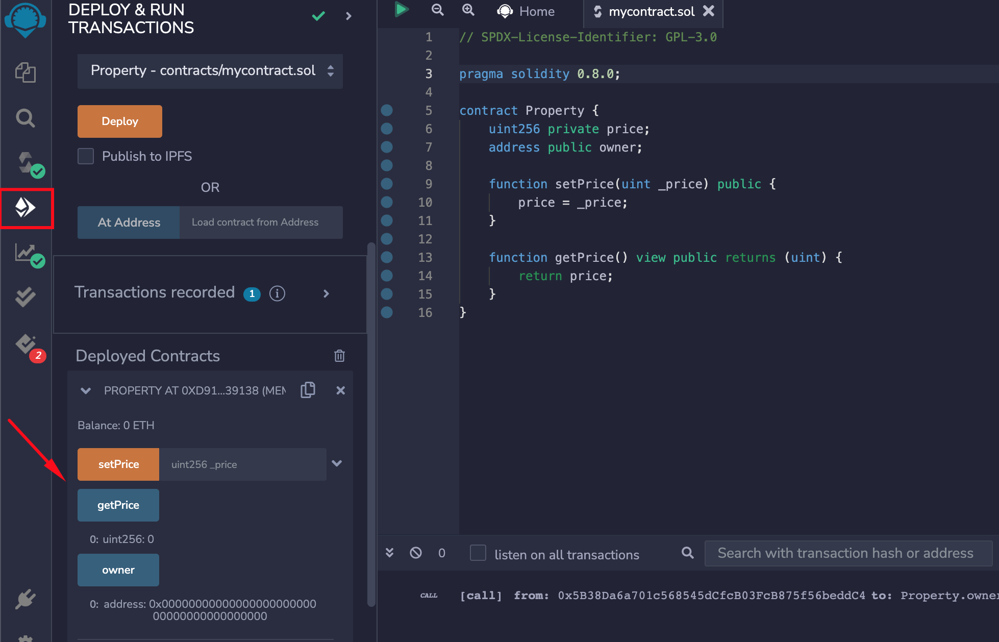
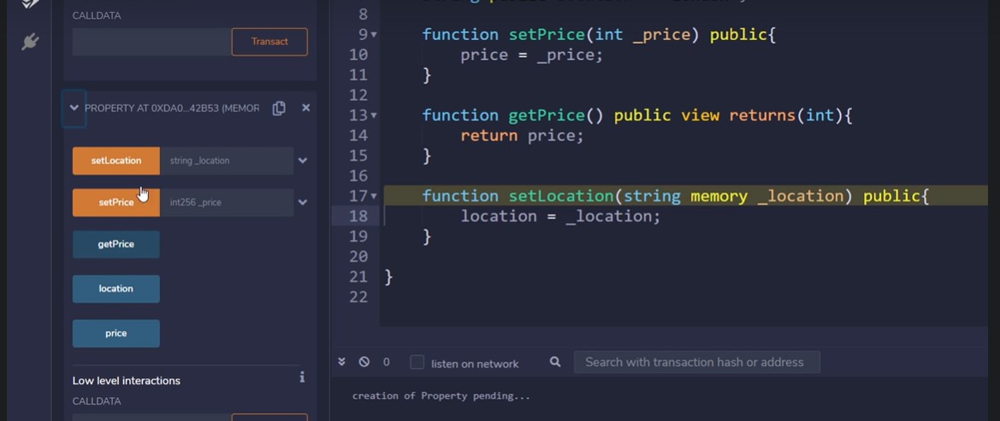
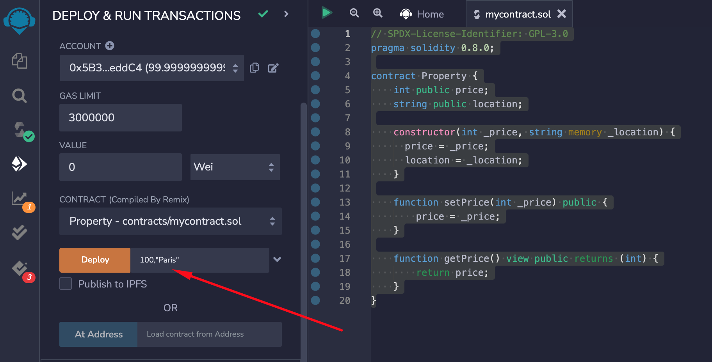
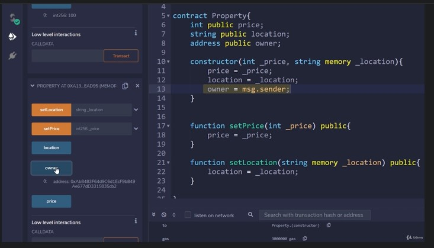
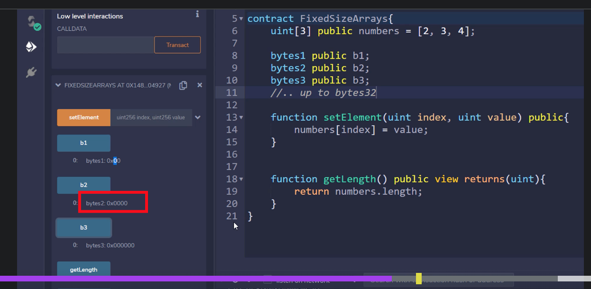
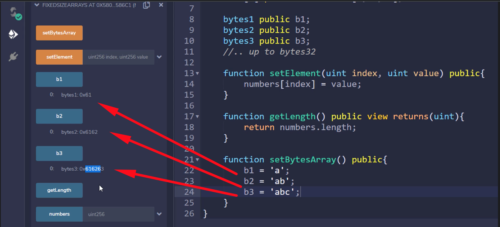
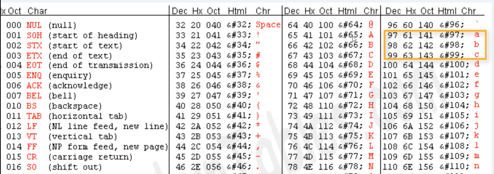
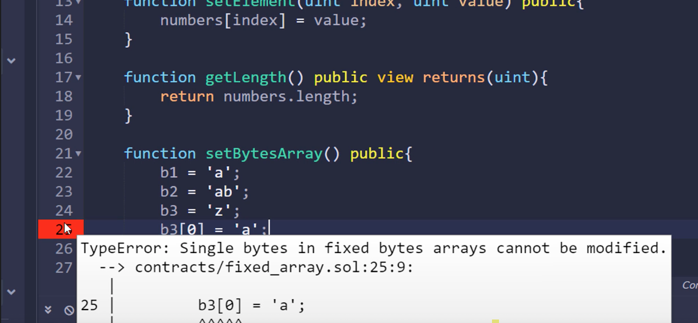

<h1>Solidity</h1>

- [Sources](#sources)
- [Part 1](#part-1)
  - [Örnek Remix Projesi](#örnek-remix-projesi)
  - [Smart Contract Derlenmesi (Compilation)](#smart-contract-derlenmesi-compilation)
  - [ABI](#abi)
- [Master the Solidity Programming Language](#master-the-solidity-programming-language)
  - [Standards that Solidity use](#standards-that-solidity-use)
  - [Structure of a Smart Contract](#structure-of-a-smart-contract)
  - [Solidity Basic Syntax](#solidity-basic-syntax)
  - [Solidity Variables - State and Local](#solidity-variables---state-and-local)
    - [1 State variables (fields)](#1-state-variables-fields)
    - [2 Local variables](#2-local-variables)
  - [Where does EVM save data?](#where-does-evm-save-data)
  - [25 Functions, Getter and Setter](#25-functions-getter-and-setter)
  - [26 Constructor](#26-constructor)
  - [28 Variable Types : Booleans and Integers (ok)](#28-variable-types--booleans-and-integers-ok)
  - [29 SafeMath, Overflows and Underflows](#29-safemath-overflows-and-underflows)
  - [30 Fixed-Size Arrays](#30-fixed-size-arrays)
  - [Dynamically-sized arrays (draft)](#dynamically-sized-arrays-draft)
  - [Bytes and String Types](#bytes-and-string-types)
  - [Structs and Enums](#structs-and-enums)
  - [Enums](#enums)
  - [Mappings](#mappings)

# Sources

I recommend to buy this course

- Udemy Course , Master ethereum and solidity programming with real world apps , https://www.udemy.com/course/master-ethereum-and-solidity-programming-with-real-world-apps 
  


# Part 1

## Örnek Remix Projesi

remix-project.org 'dan online ide'yi kullanarak veya desktop app kurulumu yaparak uygulayabiliriz.

- Her kaynak kodu lisans belirten bir yorum ile başlaması gerekir.

```js
// SPDX-License-Identifier: GPL-3.0
```

> A license identifier is a short code that identifies a specific open source license.

- pragma ile hangi solidity compiler versiyonu kullanacağını belirtiriz.

```js
pragma solidity ^0.8.2; // 
```

yukarıdaki satıra göre olan bir contract, 0.9.x ve 0.7.x compiler'da çalışmaz.

- İki versiyon arası şeklinde de belirtilebilir.

```js
pragma solidity >0.5.0 <0.9.0;
```

- Örnek Contract Sınıfımız

```js

contract Property {
  int public value;

  function setValue(int _value) public {
    value = _value;
  }
}

```

contract keywordünü diger dillerdeki class'a benzetebiliriz.

## Smart Contract Derlenmesi (Compilation)

- Remix ide'de sol taraftan solidity tabını seçeriz. 
- versiyonu seçeriz 
- compile mycontract.sol (contract dosyasının ismi) buttonu tıklarız.

Hata varsa kırmızı ile işaretleyip gösterir.

The Solidity *source code* is passed to the solidity compiler and the compile returns the *EVM bytecode* that is deployed and the contract ABI (Abstract Binary Interface).

* Many Solidity compilers
  
There are many solidity compilers available: Remix built-in compiler, solc, solcjs.

* Contract bytecode have to be public

Contract *bytecode is public*. It is saved on the blockchain and can’t be encrypted because it must be run by every Ethereum node; Opcodes are the human readable instructions of the program. They can be easily obtained from bytecode; 

* Contract source is public or isnt it ?

Contract source code doesn’t have to be public. Most contracts are public to build trust.

## ABI

Anyone that wants to interact with the contract must have access to the contract ABI. ABI is basically how you call functions in a contract and get data back. ABI is list of contract’s function and arguments and it’s in JSON format. ABI is known at compile time.

* Can we generate the contract ABI from the bytecode ?

ABI is generated from source code through compilation. If we don’t have the source code we can’t generate the contract ABI (or only from the bytecode using reverse engineering);

(tor: ABI is like an Api Doc)

Opcodes : EVM operational codes.

- Decompile ederken byte code başına 0x koyarız.

*full example contract*

```js

pragma solidity >= 0.5.0 <0.9.0;

contract DynamicArrays {
  uint [] public numbers;

  function getLength() public view returns (uint) {
    return numbers.length;
  }

  function addElement(uint item) public  {
    numbers.push(item);
  }
}

```

# Master the Solidity Programming Language

## Standards that Solidity use

Solidity compiler encourages the use of machine readable SPDX license identifiers. it is the short for *software package data exchange* is an *open standard* used to document information on the software licenses under which a given piece of computer software is distributed.

## Structure of a Smart Contract

💡 Does name of the contract save on the bc?

The name of the contract will not be saved on the blockchain. At deployment each contractor receives a unique address that will uniquely identify the contract.

Contracts in solidity are similar to classes in object oriented languages, so each contract can contain declarations of state variables that will be saved on the blockchain, functions, function modifiers, events, structs, and enum types.

There are also special kinds of contracts called libraries and interfaces. 

*Example*

```js
// SPDX-License-Identifier: GPL-3.0
pragma solidity >=0.5.0 <0.9.0;

contract Property {
    uint256 private price;
    address public owner;

    constructor() {
        price = 0;
        owner = msg.sender;
    }

    // Function modifier
    modifier onlyOwner() {
        require(msg.sender == owner);
        _;
    }

    function changeOwner(address _owner) public onlyOwner {
        owner = _owner;
    }

    function setPrice(uint _price) public {
        price = _price;
    }

    function getPrice() view public returns (uint) {
        return price;
    }

    // Event
    event ownerChanged(address owner);
}
```

There are two *state* variables declared: *price and owner*. 

Price field is of type uint or unsigned integer and private. The owner field is of type address and public. Their values are permanently stored in contract storage.

Then, we see some functions defined.

The first function is a special one called *constructor* that is used to initialize the state variables of the contract; it is declared with the constructor keyword and when a contract is created, its constructor is executed *once*. 

changeOwner() and setPrice() are called *setter functions* because they change the value of state variables and *getPrice()* is a getter function because it creates a call that returns the value of the state variable.

There is also a *function modifier* called onlyOwner that *changes the behavior of the function* to which it is applied. In this case, it’s applied to changeOwner(), the one that changes the value of the owner state variable. (rvw)

And at the end of the contract, we see an *event*. *Events* are features that enable *logging functionality*.

## Solidity Basic Syntax

💡 Is a smart contract executed on all nodes of a BLC ?

As smart contract code is executed on the EVM, it means that eventually this code is executed on all nodes around the network, so on both mining and non-mining nodes.

That is why Solidity is a more low-level language than commonly used JavaScript or C++.

It is a high-level, statically typed programming language for implementing smart contracts.

It is influenced by C++ and JavaScript and is designed for this virtual machine.

However, it was stripped down as it doesn't include any unnecessary features.

- Case sensitive
  
- Every statement must end with a semicolon

- // (double forward slashes) are used for commenting.

💡 What is NatSpec

it's a third type of comment in Solidity, called the *NatSpec* that is developed and promoted by Ethereum itself. This is a special form of comments in Solidity contracts used by developers when documenting contracts, functions, libraries, return values and more. You may use /// for a single line NatSpec, or /** ending with */ for a multi-line NatSpec comment. (beginning with two stars)

- So an example `/// @notice Returns the price of the Property`. @notice is a predefined NatSpec tag that explains to the users what this tag does. There are more such tags defined.

- Most of the classical control structures and loops are available in Solidity too. However, pay special attention to loops!

Loops do not have a fixed number of iterations and for example, loops that depend on storage values have to be used carefully. They could hit the gas limit, causing the transaction to fail. For this reason, while and do-while loops are rarely used.

## Solidity Variables - State and Local

Solidity is a statically typed language like C++, Golang or Java, which means that the type of each variable needs to be specified when declaring the variable.

There are two types of variables: *state and local*.

### 1 State variables (fields)

- Declared at contract level (as fields)
- Permanently stored in *contract storage* (so on the blockchain)
- Can be set as *contants*
- Expensive to use, they cost gas
- Initialized at declaration, using a constructor or after contract deployment by calling setters;

Saving state variables on the blockchain is not free and you have to pay gas. According to the Ethereum protocol, saving two 256 bits costs 20k units of gas.

```js
contract Property {
  int public price;
  string constant public location = "London";
}
```

For example, price and location are state variables (fields of the contract). 

I declared another state variable called *location* of type string that is constant. We suppose that the location of the property cannot change. 

✔ Assigning value is mandatory

It's *mandatory* to specify the value of the constant when declaring it !!! If you omit the value, you'll get a *compiler error*. This is an error: *uninitialized constant variable*.

✔ Undefined or null values do not exist

In Solidity, the concept of *undefined or null* values does not exist !!! When you declare new variables, they always have a *default value* depending on their type. For example, the default value of an int variable is zero.

✏ Note: If you try to change the value of a variable *after you declare it*, you'll get an error, for example, writing `price=100` it's not permitted in Solidity. There is a compilation error.

```js
contract Property {
  int public price;
  string constant public location = "London";

  // price = 100; // this is not permitted in Solidity
}
```

Also, be aware that storage is not dynamically allocated. What I mean here is that the number of the state variables is fixed at compile time.

This instance of the contract cannot have other state variables besides those already declared. So if I say I want to have another variable called owner in this instance, that won't be possible.

I have to change the contract for declaring that new variable and then deploy a new instance.

All variables must be declared before deploying the contract.

### 2 Local variables

- Declared inside functions
- If using the memory keyword and are arrays or struct, they are allocated at runtime. Memory keyword can’t be used at contract level

Let's move on to local variables; these are variables that are declared and used inside functions and are kept on the stack, not on the storage, so they don't save their values between different function calls.

They don't cost gas they are free.

Let's declare a dummy function with a local variable. 

```js
contract Property {
  int public price;
  string constant public location = "London";

  // price = 100; // this is not permitted in Solidity

  function f1 public pure returns(int) { 
    int x = 5; 
    x = x * 2; 
    return x; 
  } 
}
```

✔ Pure -> does not touch blockchain

I have declared the function pure because it *doesn't touch* the blockchain. It neither modifies the blockchain nor it reads from the blocks.

x is a local variable that is free and is saved on the stack. Note that there are some types that reference the storage by default, even if they are declared inside the function. they are strings, areas, structs and mappings.

So if you want to create a local variable of type string, you have to use the memory key word to limit its lifetime to the function call and not be saved in the storage.

Writing `string s1=abc` results in an error because string is a special type that by default is saved in storage.

```js
  function f1 public pure returns(int) { 
    int x = 5; 
    x = x * 2; 

    string s1="abc"; // results an error

    return x; 
  } 

```

This is an error! I'm adding the memory key word to save it in memory and now everything is fine.

```js
  function f1 public pure returns(int) { 
    int x = 5; 
    x = x * 2; 

    string memory s1="abc";

    return x; 
  } 
}
```

## Where does EVM save data?

So there are free zones where data can be stored: storage stack and memory. Let's come to a conclusion!

1. Storage
- Holds state variables;
- Persistent and expensive (it costs gas);
- Like a computer HDD;

State variables are saved in the contract's storage, so on the Ethereum blockchain, and they cost gas. For example, saving 1 byte costs 5 units of gas. 

2. Stack

Functions and local variables are saved on the stack. if they are not reference types, and don’t cost gas. 

- Holds local variables defined inside functions if they are not reference types (ex: int);

- Free to be used (it doesn’t cost gas);

3. Memory

Functions, arguments and variables, declared inside functions that are reference types but are declared using the *memory* keyword, are saved in the memory and don't cost gas.

- Holds local variables defined inside functions if they are reference types but declared with the memory keyword;

- Holds function arguments;

- Like a computer RAM;

- Free to be used (it doesn’t cost gas);

Reference Types are string, array, struct and mapping

## 25 Functions, Getter and Setter

A function is an executable unit of code within a contract. Functions create the contract’s interface.

Take a look at the functions defined in this contract.

```js
// SPDX-License-Identifier: GPL-3.0
pragma solidity >=0.5.0 <0.9.0;

contract Property {
    uint256 private price;
    address public owner;

    function setPrice(uint _price) public {
        price = _price;
    }

    function getPrice() view public returns (uint) {
        return price;
    }
}
```

There’s a function called setPrice() which is a setter function because it sets or changes the value of a state variable and a function called getPrice() named getter because it gets or returns the value of a state variable.

By the way, the name of the *parameter* is _price to differentiate it from the state variable (the field). So price is the state variable stored in the storage and _price is the function parameter stored in memory.

Each function must have a *visibility specifier* that it is given after the parameter list. In this example, both functions are *public*, which means they are part of the contract interface and can be called internally from the same contract or externally from other contracts or applications.

Other visibility specifiers are *private, internal, and external*. We will have a dedicated lecture on visibility specifiers later in this section.

If the function is a *read-only* one that doesn't alter the storage in any way, it should be declared view or pure.

Note that calling a *setter function* creates a transaction that needs to be mined and costs gas because it changes the blockchain. 

And calling a getter function creates a call that happens instantly and doesn't cost gas because it doesn't alter the blockchain's state. And if the function returns a value that should be indicated using the returns key and the types of the return values between parentheses with a comma between them; in this example, getPrice will return to a single value of type uint.

There are no compilation errors, so I'm deploying the contract. I've used the JavaScript virtual machine environment. 



In the deployed contract section if we open up the contract, we'll see a button for each function. The buttons were created by the remix environment; *getter functions* are *blue* and *setter functions* are  *orange*. If I click a button, it will call the corresponding function, so I'm clicking getPrice, a call was created and the default value for the price, which is zero was returned.

Now I'm changing the price value, so I'm typing one hundred and clicking setPrice. A transaction was created and sent and the value of the state variable was changed. Now the price is 100.

In fact, it wasn't really necessary to declare the price get function because the price state variable is public. When you declare a public variable, a getter function is *automatically created*.

✔ the default visibility : private

Let's change the contract and visibility of the variable location to public. By the way, *the default visibility* for a variable is *private*. I'm deploying the new contract.

```js
// SPDX-License-Identifier: GPL-3.0

pragma solidity 0.8.0;

contract Property {
    int public price;
    string public location = "London";

    function setPrice(uint _price) public {
        price = _price;
    }

    function getPrice() view public returns (uint) {
        return price;
    }
}

```

Now, we see a new button called *location* that is in fact the getter function that was automatically created for the public state variable.

Let's create a setter function for location, as well.

```js
function setLocation (string memory _location ) public {
  location = _location;
}
```

_location is a local variable. The memory keyword is required because explicit data location for all variables of type *array, string, struct, or mapping* is now *mandatory*. It indicates that the variables will be stored in memory and not in storage.

Now I'm deploying the contract. 

This is the new instance and we see five buttons in the contract section: 3 are getters and the other 2 are setters. a getter was automatically created for price.



Now, the value of both state variables and get their values can be changed as well.

## 26 Constructor

✔ executed only once and only one constructor

The constructor is a special function that is executed only once when the contract is created. The function is created with the constructor keyword, there's *only one* and it is optional (adding constructor function).

The constructor is used to initialize state variables when the contract is deployed by an externally owned account or by another contract.

Let's create the constructor of the contract to initialize state variables.

```js
// SPDX-License-Identifier: GPL-3.0
pragma solidity 0.8.0;

contract Property {
    int public price;
    string public location;

    constructor(int _price, string memory _location) {
      price = _price;
      location = _location;
    }

    function setPrice(int _price) public {
        price = _price;
    }

    function getPrice() view public returns (int) {
        return price;
    }
}

```

that's all: the state variable price will be initialized with the value of the _price parameter of the function; and the same location. It's not mandatory for the constructor to have arguments, but it's logical to initialize the state variables so it has two arguments. And the visibility of the constructor, which is normally public, should be ignored, starting with Solidity "0.7".

When I deployed the contract, I'll specify two values for the constructors arguments, price and location,



So the price will be 100 and the location Paris.

The constructor has initialized the state variables (fields of the contract) with the supplied values, so if I click price and location, I'll get those values : Paris and 100.

It's common for a constructor to register the address of the account that creates the contract in a state variable (owner account).

This is the admin of the contract or the owner, and in most cases, he has full access over the contract.

So I'm declaring a new state variable at the contract level called *owner* of type *address*, which is a data type in Solidity and holds an account address.

```js
// SPDX-License-Identifier: GPL-3.0
pragma solidity 0.8.0;

contract Property {
    int public price;
    string public location;
    address public owner;

    constructor(int _price, string memory _location) {
      price = _price;
      location = _location;
      owner = msg.sender;
    }

    function setPrice(int _price) public {
        price = _price;
    }

    function getPrice() view public returns (int) {
        return price;
    }
}

```

Let's look for this line: `owner = msg.sender` in the constructor.

It initializes the *owner* field to the value of *msg.sender*. "msg.sender" is a global built-in variable. This variable always stores the address of the account that creates and sends the transaction.

In this case, it's the address of the account that deploys the contract, because that's the only time when the constructor is called.

I'm deploying the contract again and choosing another account. The address of the account will be stored in "msg.sender" and it becomes the owner of the contract.



If I click the owner button, I'll get the address of that account; it was saved on the blockchain

and I can further implement administrative functions of the contract, like selling the property (???) functions that will be initialized only from the owner account.

Note that the constructor cannot change the owner to a new address because the constructor is called only once when the contract is deployed.

If you want to change the owner, you need another function that changes owner which is a state variable.

And probably that function should be called only by the current owner.

Note that almost any contract like, for example erc20 token contracts or contracts for decentralized finance, use this approach to register the owner that has special privileges.

✔ Immutable constant state variables

At the end let’s talk about initializing constant or immutable state variables. State variables can be declared as constant or immutable and in both cases, the variables cannot be modified after the contract has been deployed. For constant variables, the value has to be fixed at compile time so we need to set their values at declaration time, while for immutable, it can still be assigned at construction time.

So if I declare a constant state variable, I also have to initialize it with a value. For example, 


```js
contract Property {
    int public price;
    string public location;
    address public owner;
    int constant area = 100; 
    /* ... */
```

if I don't initialize the constant with a value like  the below code, I'll get an error.

```js
contract Property {
    int public price;
    string public location;
    address public owner;
    int constant area; 
    /* ... */
```

This is an error: uninitialized "constant" variable. 

If I declare the variable as being immutable, using the immutable keyword, the variable can be initialized the same as a constant at the declaration or in the constructor, but not after the contract was created.

```js
contract Property {
    int public price;
    string public location;
    address immutable public owner;
    int immutable area; 
    /* ... */
```

So I'm changing constant to immutable. There is no error!

Another example would be if I wish no one to be able to change the owner, I can declare the variable immutable and initialize it in the constructor. So the owner is immutable and it is initialized in the constructor. After the contract's deployment, no one will be able to change the variable, so the owner.

Compared to regular state variables, the gas costs of constant and immutable variables are much lower. So this allows for local optimization.

*Full Contract Example*

```js
//SPDX-License-Identifier: GPL-3.0
 
pragma solidity >=0.5.0 <0.9.0;
 
contract Property{
    // declaring state variables saved in contract's storage
    uint price; // by default is private
    string public location;
    
    // can be initialized at declaration or in the constructor only
    address immutable public owner; 
    
    // declaring a constant
    int constant area = 100;
    
    // declaring the constructor
    // is executed only once at contract's deployment
    constructor(uint _price, string memory _location){
        price = _price;
        location = _location;
        owner = msg.sender;  // initializing owner to the account's address that deploys the contract
    }
    
    
    // getter function, returns a state variable
    // a function declared `view` does not alter the blockchain 
    function getPrice() public view returns(uint){
        return price;
    }
    
    // setter function, sets a state variable
    function setPrice(uint _price) public{
        int a; // local variable saved on stack
        a = 10;
        price = _price;
    }
    
    function setLocation(string memory _location) public{ //string types must be declared memory or storage
        location = _location;
    }
    
}
```

--*LINK - tbc

## 28 Variable Types : Booleans and Integers (ok)

Solidity is a statically-typed language (variables type should be specified at declaration).

*Value types*

Integers and booleans are also called *value types* because variables of these types will always be passed to functions *by value*. This means that they are always copied when they are used as function arguments.

*Boolean*

- Boolean variables: true and false

- Initialized by default with false. 

Example 

```js
contract Property {
  // 1. Boolean Type
  bool public sold; // is left uninitialized , but its value is false)
}

```

*Integers*

- Signed and Unsigned Integers of various sizes.
  - int8 to int256, uint8 to uint256 in steps of 8.
  - int8 is between -128 and +127, int16 is between -32768 and +32767 and so on.
  - int is alias to int256 and uint is an alias to uint256.
  - By default an int is *initialized with zero*.

There are signed and unsigned integers of various sizes. To declare an unsigned integer that has only positive values, use keywords uint8 to uint256 in steps of 8.

So uint8 means an unsigned integer of 8 bits. And to declare a signed integer use keywords int8 to int256 in steps of 8.

```js
contract Property {
  // Integer type
  uint8 public x = 255;
  int8 public y = -10;
}

```

This is the maximum value that can be stored in an uint8 variable. (2^8bits)-1=255

```js
contract Property {
  // 2. Integere type
  uint8 public x = 256; // this is overlow.
}
```

--- Note that uint is an alias to uint256 and int is an alias to int256.

- There is no full support for float/double (fixed point numbers) in Solidity.

Note that floating point numbers, such as float and double in other languages, are not yet supported in Solidity. If you want to perform calculations for a currency like ether and want to use floating point numbers, and then you should use a smaller denomination of ETH that will be represented as an integer.


## 29 SafeMath, Overflows and Underflows

Ethereum is used in many financial applications and an overflow or an underflow would have disastrous results. In April 2018 two types of vulnerabilities, called batchOverflow and proxyOverflow ,were. discovered in some ERC20 tokens that were built on Ethereum The result was that tokens valued at the billions of U.S. dollars were created from thin air.

These are the details of such a transaction.

Just take a look at the number of tokens that were transferred.

In a response to that attack, many crypto exchanges suspended trading on all ERC20 tokens, causing a great deal of fear, uncertainty, and doubt in the crypto community.

Let's take a closer look at how an overflow or underflow vulnerability works.

So I have declared a state variable called x of type uint8, and I've initialized it with the maximum
possible value for that type 255.

```js
contract Property {
  // 2. Integere type
  uint8 public x = 255;

  function f1() public {
    x+=1;
  }
}

```

Great, there is no error! The contract was compiled successfully and I'm deploying it. (solidity ver 5)

Now I'm calling f1 that will increment x. The transaction was executed successfully, transaction minted and execution succeed. Now, if I click x, I'll get 0, which, of course, is not correct.

So what happens when you have a limit of 255 and 

255+1? 

The number rolls over and so 255+1=0 . We call this an integer overflow.

Just imagine this behavior in a financial application, you have 255$ on your account, someone sands you one dollar and then you'll have zero.

For those who want to dive deeper into this, I'll attach to this letter of full technical breakdown of the batchOverlow Exploit.

Let's go ahead and see how we can protect against such events. In Solidity the standard practice to avoid overflows was to use a library known as SafeMath. Safemath wraps each calculation in a series of checks to make sure that, for example, when a + b = c, c is greater than a and b. This was best practice for every smart contract that was coded professionally.

For example, in the source code of BNB token in Etherium Network you can see how they use the SafeMath library for Math operations with safety checks.

Starting with Solidity 0.8, the compiler includes checked arithmetic operations by default, and this makes unnecessary the use of SafeMath or similar libraries. Starting with Solidity 0.8 arithmetic operations revert on underflow and overflow. 

Let's compile the same contract with a compiler version newer than 0.8 . So I’m changing the pragma to ^0.8.0 and of course, I'm selecting the corresponding compiler.

The contract was compiled successfully and I'm deploying it. This is the new instance! I’m clicking x to get it’s value (which is 255) and then I am clicking f1 to increment x.

And instead of creating a successful transaction that causes an overflow, the transaction has been reverted to the initial state.

Look at this error. The transaction has been reverted to the initial state. So it didn't alter the variable, which is still 255. This is a big improvement.

So now, by default, arithmetic operations are always checked; you can switch to *unchecked mode* using the unchecked keyword to obtain the previous behavior and you probably want to do that for old code and backward compatibility, like this: 


```js
contract Property {
  // 2. Integere type
  uint8 public x = 255;

  function f1() public {
    unchecked { x+=1 }; // this code will have the same behavior as in the previous compiler versus.
  }
}

```

## 30 Fixed-Size Arrays

Let's start talking about another data type called array. In programming, an array is a data type that stores an ordered sequence of elements. In Solidity there are two types of array: 

- fixed-size 
- dynamically-sized arrays

A fixed-size array has a fixed number of elements that are specified at declaration and this type of array can not grow or shrink.

On the other hand, a dynamically-sized array does not have a fixed no. of elements and it can shrink or grow dynamically at run-time.

Let’s get started with fixed-size arrays. Array elements can be of any type, including int address mapping or struct. The only restriction is that all elements of array must be the same type. Let's declare an array that stores int values and has a size of 3.

```js
contract Property {
  // 2. Integere type
  uint[3] public numbers;
}

```

3 the number of elements in the array public. The array is public so a getter function was automatically created. Like in any other programming language in Solidity array indexing starts from 0 as well. So, the first element of the array is at index 0. This is the first element of the array and its default value is 0.

If you try to access an element of an array at an index that is negative, greater than or equal to the length of the array, you'll get an out of bounds error; for example give me the element at index 5 and I've got an error.

To initialize an array with some specific values you can specify the values at the declaration or create a setter function that changes the elements of the array. 

So to initialize the array at declaration write: the name of the array equals and the elements between square brackets with a comma between them. For example [2, 3, 4]; by the way, this is an array literal.

```js
contract Property {
  // 2. Integere type
  uint[3] public numbers = [2,3,4];
}

```

I'm checking the values of the array, the element at index 0 is 2, the second element at index 1 is 3, and the last element at index 2 is, of course, 4. 

Now, I create a setter function to change the elements of the array. So function setElement, the function takes two parameters the index and the value and is a public one. And the function will change the element at the index with the value.

```js
contract Property {
  // 2. Integere type
  uint[3] public numbers = [2,3,4];

  function setElement ( uint index, uint value) public {
    numbers[index] = value;
  }

  function getLength() public view returns(uint) {
    return number.length;
  }

}

```

An array has also a member called Length that stores the number of elements in the array. So I added a new function that will return the length of the array function getLength(). The function is public, it doesn't modify the blockchain so view and returns the length of the array, so a unit; and in the function's body, I'm writing return numbers, the name of the array.length the member.

OK, of course, here is returns, not return.

I'm deploying the new contract.

This is the instance, and I want to see the number of elements in the array, so the length and the length is three.

Now I'm changing the element at index 0. So index 0 and the element will be 100. I'm setting the element and now I'm getting the element at index 0 and it has returned 100.

Great.

As I said earlier, the elements of an array can be of any type, not just int Let's see a special type of array, that holds a sequence of bytes from 1 to up to 32. 

```js
contract Property {
  // 2. Integere type
  uint[3] public numbers = [2,3,4];

  bytes1 public b1; 
  bytes2 public b2; 
  bytes3 public b3;
  // .. upto bytes32

  function setElement (uint index, uint value) public {
    numbers[index] = value;
  }

  function getLength() public view returns(uint) {
    return number.length;
  }

}

```

And we have up to bytes3. bytes1, bytes2, bytes3 and so on, are solidity types. Let's deployed the contract and see what are the default values of the arrays of type bytes.

I'm deploying it and I'm opening up the last contract's instance.



This is b1, b2 and to b3. we see that the default value is zero, but it is shown in hexadecimal as 0x prefix indicates. A byte consists of 8 bits and a hex digit occupies 4 bits,so a byte can be represented with 2 hexadecimal characters, 2 bytes with 4 hexadecimal, and so on.

Now I'll create a new function that will change the elements of the array of type bytes.

```js
  function setBytesArray() public {
    b1= 'a';
    b2= 'ab';
    b3= 'abc';

}
```

Great, I'm deploying the contract to test the new function. So I'm calling the setBytesArrays function.

The transaction was successfully mined and I want to see the values of b1, b2 and b3.



So b1 is 0x61, b2 is 0x6162 and b3 is 0x 616263.

The characters were encoded in UTF-8, which is a superset of ASCII, and are shown as hexadecimal values.

We see here the ASCII code of a, b and c.



the hex ASCII codes for a, b and c are 61, 62, and 63 like it’s shown when calling the function in Remix.

Now, if an array is initialized with a value that does not occupy the entire space, padding is aided by default to the end. So I'm changing b3='z'. By the way, the ASCII code for z is 7A in hexadecimal.

Keep in mind, 7A; and I am deploying the new contract.

I'm clicking setBytesArrays to change the values, and I want to see the value of b3.

And we 0x7a0000 the ASCII code for Z and then lots of zeros, this is the padding.

Also note that using indexing you cannot modify single bytes in fixed bytes arrayes. 

So b3[0] This is the first byte or the byte at Index 0 cannot be modified.



This is a compilation error.

This is not permitted in Solidity; single bytes in fixed bytes arrays cannot be modified.

If you see some older code, you should be aware that prior to version 0.8.0, byte used to be an alias for bytes1

So byte is an alias for bytes1 in older code.

```js
//SPDX-License-Identifier: GPL-3.0
 
pragma solidity >=0.5.0 <0.9.0;
 
contract FixedSizeArrays{
// declaring a fixed-size array of type uint with 3 elements
uint[3] public numbers = [2, 3, 4];
 
// declaring fixed-size arrays of type bytes
bytes1 public b1;
bytes2 public b2;
bytes3 public b3;
//.. up to bytes32
 
// changing an element of the array at a specific index
function setElement(uint index, uint value) public{
  numbers[index] = value;
}
 
// returning the number of elements in the array
function getLength() public view returns(uint){
return numbers.length;
}
 
// setting bytes arrays
function setBytesArray() public{
b1 = 'a'; // => 0x61 (ASCII code of `a` in hex)
b2 = 'ab'; // => 0x6162
b3 = 'z'; // => 0x7A
// b3[0] = 'a'; // ERROR => can not change individual bytes
 
// byte is an alias for bytes1 on older code
}
}

```

*Summary*

**Fixed-Size Arrays**

- Has a compile-time fixed size.
- Can store any type (int, uint, address, struct etc).
- bytes1, bytes2, …, bytes32 store a sequence of bytes.
- Has member called length.

## Dynamically-sized arrays (draft)

Welcome back!

In this lecture, we'll discuss dynamically-sized arrays. Dynamic arrays refer to arrays that do not have a predetermined size at the time of declaration. Their size is determined at runtime.

Let’s create a dynamic array that holds elements of type uint. Note that a dynamic array can hold elements of any type.

So the type uint a pair of square brackets, the visibility specified and the name of the array numbers.

A dynamic array has 3 members: length, push, and pop.

Let’s take them one by one! Length contains the number of elements in the array.

Let's create a function that returns the number of elements in the array.


So So function getLength() public view returns (uint){ and the function,s body is r return numbers

.length its member

Another member function of a dynamic array is push() and it appends an element to the end of the array.

I'm creating such a function: function addElement

(uint item) this is the element that will be appended in public{

numbers.push(item);

It's pushing the item to the end of the number's array.

The contract was compiled successfully and I am deploying it.

If a variable is public, like our dynamic, a getter function is automatically created.

So let's see the length of the array.

And there are no elements in the array, so its length is zero.

Now I'm adding a few elements.

10

The second element, 20 and the third element, 30.

Let's see its length and its length is three.

Now let's fetch the elements of the array, the element at index 0, the element at index 1, end

2. Great! If a variable is public, like our dynamical array, a getter function was

automatically created.

I've already used that getter when I've fetched the elements of the array, but we could optimize it by

adding some tests; for example, at the moment, if I access some element using an index greater than

or equal to the length of the array

I'll get them out of bounds error.

For example, I say give me the element at index 10 and I've got an error.

The call failed.

So I'm creating a new function, and an optimized one, called getElement: function getElement

the parameters of the function is the index uint i

so it will be talking to the element at index I public view returns(uint){ it returns an element of

type uint. And inside the function, I'm writing if (i < numbers.length){

So if there is a valid index or the index is less the the array's length then I'll return the element

return

numbers [i]; so the element at index i. There is an warning because I have to add an explicit return for

all branches, or for all cold paths.

So here, if i is equal to or greater than numbers.length I'll return 0,

I have to return something.

Let's test the new function. I'm deploying the new contract.

I'm adding two elements and I'm trying to fetch an element from a nonexisting index ,or from an index greater

than the array's size.

So I'm saying give me the element at index 10.

And there is no error.

It returned 0.

Another member of a dynamic array, except strings, which are a special type of dynamic array, is pop.

Pop is a function that removes an element from the end of the array.

I'm creating such a function, so function popElement

public

And inside the function numbers.pop

I'm deploying the contract and testing the new function.

This is the last instance.

I'm adding a few elements 3,4,5,6

and 7. There are five elements in the array and I want to pop or to remove the last element.

The transaction was executed successfully and now there are four elements in the array, the last element,

7 was removed.

So the last element at index 3 is 6.

Note that increasing the length of a storage array by calling push() has constant gas costs because storage is

zero-initialized, while decreasing the length by calling pop() has a cost that depends on the “size” of the

element being removed.

Note that since Solidity 0.6 it’s not possible to resize storage arrays and array.length

is read-only.

The reason behind this is to prevent storage collisions of very large storage arrays.

Besides the storage arrays we’ve just seen, there’s another kind of array called memory arrays. The keyword

new creates a dynamic memory array;

Let's create a function that uses a memory array.

OK.

So function f() public { and I'm declaring a memory uint

a pair of square brackets [] memory y = new uint

[](3);

By the way, I can set the function mutability to pure because it doesn't use the blockchain. As opposed

to storage arrays

iIt is not possible to resize memory arrays

so the push and pop member functions are not available.

You either have to calculate the required size in advance or create a new memory array and copy every

element.

So I'm initializing the three elements of the array with some random values.

So y[0] = 10; y[1] = 20; y[2] = 30;

And I’m assigning the memory array to the storage array.

All right, so numbers = y;

Of course, if I do that, I have to remove the pure key word because the function modifies the blocking, modifies

the state variable, so I'm removing it.

We are taking a short break

and in the next lecture, we'll discuss bytes and strings, which are special dynamic arrays.


Summary

- byte[ ]
- byte[ ] is an alias to bytes
- string (UTF-8 encoding)
- uint[ ], int[ ]
- members: length and push

There are 3 methods

- length

- push

- pop


## Bytes and String Types

We’ll go ahead with dynamic arrays and talk about bytes and string arrays. Variables of type bytes and string are special dynamic arrays.

String is equal to bytes but does not allow length or index access. A string is UTF-8 encoded in solidity.

I’m defining 2 dynamic arrays, one of type bytes and the other of type string.

```js
contract BytesAndStrings {
  bytes public b1 = 'abc';
  string public s1 = 'abc';
}
```

As a rule of thumb, use bytes for arbitrary-length raw byte data and string for arbitrary-length string UTF-8 encoded data. And I’m deploying the contract and checking the values of the arrays.

b1 is 0x616263 and s1 is abc.

And we notice that the values of the bytes array are displayed in hexadecimal, 61, 62, and 63 being the hex ASCII codes for a, b and c. And the string is displayed normally as a UTF-8 encoded string.

One difference between bytes and string is that we can not add elements to a string variable, as we can to a variable of type bytes.

```js
contract BytesAndStrings {
  bytes public b1 = 'abc';
  string public s1 = 'abc';

  function addElement() public { 
    b1.push('x'); 
  }
}
```

I've added an element to the end of the byte's array, but if I try to do the same for the string array, I'll get an error.

if I write s1.push('x'), then i get an error : Member push not found or not visible after argument dependent look up in string storage;

I'm deploying the contract and checking the b1 array.

It was initialized with a, b, and c in hexadecimal, and I'm adding an element, the element ('x'); 

Now, the value of ('x'), which is 78 in hexadecimal, was added. (0x61626378)

- Another particularity of byte's arrays is that it's possible to access the elements of the array using indexing.

```js
contract BytesAndStrings {
  bytes public b1 = 'abc';
  string public s1 = 'abc';

  function addElement() public { 
    b1.push('x'); 
  }

  getEelement (uint i) public view returns (bytes1){
    return b1[i];
  }

}
```

So getElement function will return an element of the array, which is a byte. However if I try return s1[i]; I'll get an error : Index access for string is not possible.

- Finally, we can get the length of a bytes array using the length member, but we can not get the the length of a string.

```js
contract BytesAndStrings {
  bytes public b1 = 'abc';
  string public s1 = 'abc';

  function addElement() public { 
    b1.push('x'); 
  }

  getEelement (uint i) public view returns (bytes1){
    return b1[i];
  }

  function getLength() public view returns (uint){
    return b1.length;
  }

}
```

This is possible, but I cannot return the length of a string, so return s1.length; will trigger an error: Member ‘length’ not found or not visible for strings.

- Note that the bytes and strings are reference types, not of value types, and also pay attention that fixed size arrays use less gas than dynamic arrays.

So they are better for the situations when the length of the array is known in advance.

## Structs and Enums

Structs provide a way to define new data types. It introduces a new complex data type that is composed of other elementary data types.

Structs are used to represent a singular thing that has properties such as a car, a person, a request, an auction or a campaign. A struct can be declared outside or inside of a contract; declaring a struct outside of a contract allows it to be *shared by multiple contacts*.

Let's declare such a struct: 

```js
struct Instructor {
  uint age;
  string name;
  address addr;
}
```

This is the new type and I'm creating two contracts in the same Solidity file: academy and school.

```js
contract Academy {
  Instructor public academyInstructor;

  constructor (uint _age, string memory _name) {
    academyInstructor.age = _age;
    academyInstructor.name = _name;
    academyInstructor.addr = msg.sender;
  }

  function changeInstructor(uint _age, string memory _name, address _addr) public {
    Instructor memory myInstructor = Instructor ( {
      age : _age,
      name : _name,
      addr : _addr
    });

    academyInstructor = myInstructor;
  }
}

contract School {
    Instructor public schoolInstructor;
}
```

I can declare a variable of type instructor, my newly created type in each contract. Now I'm initializing the struct variable using the constructor.

By default struct references storage. I'm creating a new temporary memory struct initializing it with the given values and copying it to the storage struct, the state variable of the contract. So I'm declaring a new memory variable of type struct Instructor memory let's say, myInstructor,

this is how you initialize a struct variable. And I'm copying the memory struct variable to the storage one.

Note : You can write to the address between double quotes like a string.

*Summary*

● A struct is a collection of key->value pairs;

● A struct introduces a new complex data type, that is composed of elementary data types;

● Structs are used to represent a singular thing that has properties such as a Car, a Person,
a Request and so on and we use mappings to represent a collection of things like a
collection of Cars, Requests etc;

● A struct is saved in storage and if declared inside a function it references storage by default;

Example:

```js
struct Car{
  string brand;
  uint price;
}
```
 
## Enums

Enums are one way of creating a user-defined type in Solidity. They are explicitly convertible to and from all integer types but implicit conversion is not allowed. By the way, the word enum stands for enumerate.

Enums are especially useful when we need to specify the current state or flow of a smart contract. For instance, if a smart contract needs to be turned on in order to be ready to accept deposits from users.

So let's create a new user defined type; the syntax is the same as in C language. I'll declare it in the contract, but enums can also be declared at the file level outside of a contract.

```js
contract Academy {
  Instructor public academyInstructor;

  enum State { Open,Closed,Unknown}

  constructor (uint _age, string memory _name) {
    academyInstructor.age = _age;
    academyInstructor.name = _name;
    academyInstructor.addr = msg.sender;
  }

}

```

Think of enums as user-defined types that contain human-readable names for a set of constants, called members.

And I’m declaring a new public state variable of type state: let's say State the type public academyState

```js
contract Academy {
  Instructor public academyInstructor;

  enum State { Open,Closed,Unknown}

  constructor (uint _age, string memory _name) {
    academyInstructor.age = _age;
    academyInstructor.name = _name;
    academyInstructor.addr = msg.sender;
  }

}

```

and I'm initializing the variable this way

```js
contract Academy {
  /* ... */
  State public academyState = State.Open;
}

```

And in the changeInstructor function, I'll test the academyState variable before modifying the instructor's data.
So I'm changing the instructor's data only if the academy is open.


```js
contract Academy {
  /* ... */

  function changeInstructor(uint _age, string memory _name, address _addr) public {
   
    if (academyState = State.Open) {
      Instructor memory myInstructor = Instructor ( {
        age : _age,
        name : _name,
        addr : _addr
      });

      academyInstructor = myInstructor;
    }

  }
}

```

**Summary**

● Enums are used to create user-defined types;

● Enums are explicitly convertible to and from integer;

● Enums are user defined types that contain human readable names for a set of constants,
called members.

Example:

```js
enum State {Open, Closed, Active, Unknown}
State public academyState = State.Active;

```

*Full Example*

```js
//SPDX-License-Identifier: GPL-3.0
 
pragma solidity >=0.5.0 <0.9.0;
 
// declaring a struct type outsite of a contract
// can be used in any contract declard in this file
struct Instructor{
    uint age;
    string name;
    address addr;
}
 
contract Academy{
    // declaring a state variabla of type Instructor
    Instructor public academyInstructor;
    
    // declaring a new enum type
    enum State {Open, Closed, Unknown}
    
    // declaring and initializing a new state variable of type State
    State public academyState = State.Open;
    
    // initializing the struct in the constructor
    constructor(uint _age, string memory _name){
        academyInstructor.age = _age;
        academyInstructor.name = _name;
        academyInstructor.addr = msg.sender;
    }
    
    // changing a struct state variable
    function changeInstructor(uint _age, string memory _name, address _addr) public{
        if (academyState == State.Open){
            Instructor memory myInstructor = Instructor({
                age: _age,
                name: _name,
                addr: _addr
            }
                );
            academyInstructor = myInstructor;
        }
    }
}
 
 
// the struct can be used in any contract declared in this file
contract School{
    Instructor public schoolInstructor;
}  
```

## Mappings

If you are coming from other programming languages a solidity mapping is similar to a Python dictionary, a Go map, or Java HashMap.

It’s a data structure that holds key->value pairs. All keys must have the same type and all values must have the same type as well.

The keys can not be of types mapping, dynamic array, enum or struct, but the values can be of any type including mapping.

A mapping is always saved in storage because it's a state variable. Even though you declare mappings inside functions they will be saved in storage, as well.

The mappings advantage is that lookup time is constant no matter of size. This is in contrast to arrays that have linear search time.

Also, note that a mapping is not iterable, we can’t iterate through a mapping using a for loop; Keys are not saved into the mapping. it's a hash table data structure.

To get the value from the mapping, we provide the key. The key gets passed through a hashing function that outputs a predetermined index that returns the corresponding value of the mapping.

And if we want the value of an unexisting key we get the default value for that type.

I'm creating a new smart contract for an auction. In fact, this will be one of the hands on projects of this course. So contract auction; Ultimately, the users will bid an ETH value for a product or service and the highest bidder will win.

```js
//SPDX-License-Identifier: GPL-3.0
 
pragma solidity >=0.5.0 <0.9.0;
contract Auction{
    
    // declaring a variable of type mapping
    // keys are of type address and values of type uint
    mapping(address => uint) public bids;
    
    // initializing the mapping variable
    // the key is the address of the account that calles the function
    // and the value the value of wei sent when calling the function
    function bid() payable public{
        bids[msg.sender] = msg.value;
    }
}
```

Our mapping will have the keys of typed address and the values of type uint. The values will be the amount of *wei* sent by each address to the contract.

There are multiple ways for a smart contract to receive Ether and have one Ether balance. We will dive deeper into this later.

But for the moment, just remember that one way is to define a function with the *payable* function modifier. If there is a payable function, a user *consent* Ether to the contract by calling that function and the Ether sent will be added to the contract's balance.

So we declared a function called bid(). That function is *payable* and *public*. Public is a function *modifier*, a keyword of the language. One more time remember that *payable* provides a mechanism for the contract to *receive funds* in Ether and inside the functions body, I'm adding `bids[msg.sender]= msg.value;` the mapping of images that send the address of the account that calls the function 

Let me explain to you this line of code: msg.sender is the address that calls the function in a transaction and msg.value is the value in wei sent when calling the function. both msg.sender and msg.value are global predefined variables in Solidity.

So in fact, I'm adding the key pair address value to the mapping. Or, the address that calls the function and the value sent are added to the mapping.

Let's deploy the contract.

At the beginning of the lecture, I've said that if you request the value of a nonexisting key, the mapping will not give an error, saying “key not found”, but will return the default value for the value type.

So, If I take any ethereum address and paste it in the getter function that was automatically created here it will return 0, which is the default value of the uint type.

And I’m pasting an ether address in Remix, in the bids getter function. And I am clicking bids! And it returned zero.

Now, using the first account, I'm calling the bid function and sending 1000 wei. I'm entering 1000 in the value field and clicking bid. And the transaction was successful.

Now, I want to check the value of the key, that is the address that has sent the transaction in the mapping. I'm copying the address and pasting it in the bids field and clicking bids and the value of the address is 1000.

If I select another account and send another value, I'll get a similar result.

I'm taking this one, I'm copying it to clipboard, sending 44 and bid, and I'm pasting the address in the bids field. And the value is 44, the value wei sent to the contract by calling the function.

Mappings are so efficient in storing and looking up for a value of a key that almost every smart contract uses them.

*Summary - Mappings*

● It’s a data structure that holds key->value pairs. Its similar to Python Dictionaries, JS objects or Java HashMaps;

● All keys must have the same type and all values must have the same type;

● The keys can not be of types mapping, dynamic array, enum or struct. The values can be of any type including mapping;

● Mapping is always saved in storage, its’ a state variable. Mappings declared inside functions are also saved in storage;

● The mappings advantage is that lookup time is constant no matter mapping’s size.

● A mapping is not iterable, we can’t iterate through a mapping using a for loop;

● Keys are not saved into the mapping (its a hash table data structure). To get a value from the mapping we provide a key, the key gets passed through a hashing function, that outputs a predetermined index that returns the corresponding value from the mapping;

● If we want the value of an unexisting key we get a default value;

