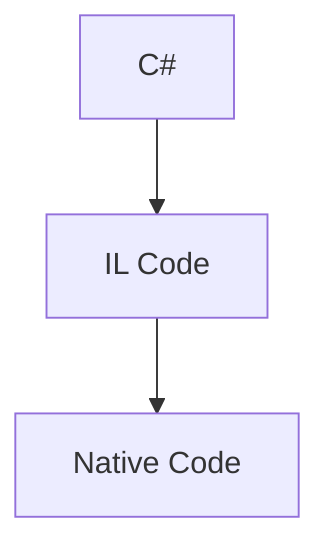

[TOC]

[[TOC]]

## Section

### 7 Csharp vs .Net

---

C# is a programming language
Dot Net is a framework for building applications on windows

---

Ok now what exactly is Dot Net Framework 

Dot Net framework consists of two components.

One is called CLR or Common Language Runtime and the other is a class library for building applications

### 8 What is CLR

IL Code (intermediate language)

---

So when you compile your C-Sharp code the result is what we call il or intermediate language 
code is independent of the computer on which it's running.

Now we need something that would translate that code into the native code or the machine that is running

the application.

And that is the job of C-L our Common Language Runtime So solar is essentially an application that is
sitting in the memory whose job is to translate the code into the machine code.
And this process is called just in time compiler action or JIT.

---

### 9. Architecture of .NET Applications

---

Now what is a class A class is a container that has some data which is also called attributes and functions
which is also called methods functions or methods have behavior.
They execute code.
They do things for us data represents the state of the application.

---

Now as the number of classes in an application grows we need a way to organize these classes.
Thats where we use a namespace.
So a namespace is a container for related classes.
For example in dotnet framework we have name spaces each containing tens of related classes.
We have name spaces for working with data like databases.
We also have name spaces for working with graphics and images.
We have name spaces for working with security now in real world application as these name spaces grow
.
We need a different way of partitioning an application and thats where we use an assembly and assembly  (DLL or EXE)
is a container for related name spaces.
Physically its a file on the disk which can either be an executable or a DL L which stands for dynamically
linked library.
So when you compile an application the compiler builds one or more assemblies depending on how you partition
your code in the next picture.

---

### 10 Getting Visual Studio

### 11 Our first c# App

### 12 What is ReSharper

