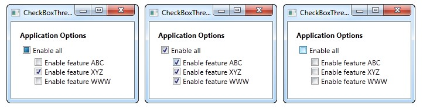

Source : https://wpf-tutorial.com/basic-controls/the-textblock-control/

[Back](../readme.md)

---

- [5 Basic controls](#5-basic-controls)
  - [The TextBlock control](#the-textblock-control)
  - [The TextBlock control - Inline formatting](#the-textblock-control---inline-formatting)
  - [The Label control](#the-label-control)
  - [The TextBox control](#the-textbox-control)
    - [Single-line TextBox](#single-line-textbox)
    - [Multi-line TextBox](#multi-line-textbox)
    - [Working with TextBox selections](#working-with-textbox-selections)
  - [The Button control](#the-button-control)
  - [The CheckBox control](#the-checkbox-control)
    - [The IsThreeState property](#the-isthreestate-property)
  - [The RadioButton control](#the-radiobutton-control)
  - [The PasswordBox control](#the-passwordbox-control)
  - [The Image control](#the-image-control)
    - [Loading images dynamically (Code-behind)](#loading-images-dynamically-code-behind)
    - [The Stretch property](#the-stretch-property)

# 5 Basic controls

## The TextBlock control


## The TextBlock control - Inline formatting

## The Label control

## The TextBox control

The TextBox control is the most basic text-input control found in WPF, allowing the end-user to write plain text, either on a single line, for dialog input, or in multiple lines, like an editor.

### Single-line TextBox

The TextBox control is such a commonly used thing that you actually don't have to use any properties on it, to have a full-blown editable text field. Here's a barebone example:

```xml
<Window x:Class="WpfTutorialSamples.Basic_controls.TextBoxSample"
        xmlns="http://schemas.microsoft.com/winfx/2006/xaml/presentation"
        xmlns:x="http://schemas.microsoft.com/winfx/2006/xaml"
        Title="TextBoxSample" Height="80" Width="250">
    <StackPanel Margin="10">
		<TextBox />
	</StackPanel>
</Window>

```


To pre-fill the textbox, use the Text property:

```xml
<TextBox Text="Hello, world!" />

```

--*TBC - 20250401 - 0323 

Try right-clicking in the TextBox. You will get a menu of options, allowing you to use the TextBox with the Windows Clipboard. The default keyboard shortcuts for undoing and redoing (Ctrl+Z and Ctrl+Y) should also work, and all of this functionality you get for free!

### Multi-line TextBox

If you run the above example, you will notice that the TextBox control by default is a single-line control. Nothing happens when you press Enter and if you add more text than what can fit on a single line, the control just scrolls. However, making the TextBox control into a multi-line editor is very simple:

```xml
<Window x:Class="WpfTutorialSamples.Basic_controls.TextBoxSample"
        xmlns="http://schemas.microsoft.com/winfx/2006/xaml/presentation"
        xmlns:x="http://schemas.microsoft.com/winfx/2006/xaml"
        Title="TextBoxSample" Height="160" Width="280">
    <Grid Margin="10">
		<TextBox AcceptsReturn="True" TextWrapping="Wrap" />
	</Grid>
</Window>

```


I have added two properties: The `AcceptsReturn` makes the TextBox into a `multi-line control` by allowing the use of the Enter/Return key to go to the next line, and the TextWrapping property, which will make the text wrap automatically when the end of a line is reached.

--*TBC - 20250401 - 0325 

🔔 Spellcheck with TextBox

As an added bonus, the TextBox control actually comes with automatic spell checking for English and a couple of other languages (as of writing, English, French, German, and Spanish languages are supported).

It works much like in Microsoft Word, where spelling errors are underlined and you can right-click it for suggested alternatives. Enabling spell checking is very easy:

```xml
<Window x:Class="WpfTutorialSamples.Basic_controls.TextBoxSample"
        xmlns="http://schemas.microsoft.com/winfx/2006/xaml/presentation"
        xmlns:x="http://schemas.microsoft.com/winfx/2006/xaml"
        Title="TextBoxSample" Height="160" Width="280">
    <Grid Margin="10">
		<TextBox AcceptsReturn="True" TextWrapping="Wrap" SpellCheck.IsEnabled="True" Language="en-US" />
	</Grid>
</Window>

```


We have used the previous, multi-line textbox example as the basis and then I have added two new properties: The attached property from the SpellCheck class called IsEnabled, which simply enables spell checking on the parent control, and the Language property, which instructs the spell checker which language to use.

 ### Working with TextBox selections

Just like any other editable control in Windows, the TextBox allows for selection of text, e.g. to delete an entire word at once or to copy a piece of the text to the clipboard. The WPF TextBox has several properties for working with selected text, all of them which you can read or even modify. In the next example, we will be reading these properties:

```xml
<Window x:Class="WpfTutorialSamples.Basic_controls.TextBoxSelectionSample"
        xmlns="http://schemas.microsoft.com/winfx/2006/xaml/presentation"
        xmlns:x="http://schemas.microsoft.com/winfx/2006/xaml"
        Title="TextBoxSelectionSample" Height="150" Width="300">
	<DockPanel Margin="10">
		<TextBox SelectionChanged="TextBox_SelectionChanged" DockPanel.Dock="Top" />
		<TextBox Name="txtStatus" AcceptsReturn="True" TextWrapping="Wrap" IsReadOnly="True" />

	</DockPanel>
</Window>

```

The example consists of two TextBox controls: One for editing and one for outputting the current selection status to. For this, we set the `IsReadOnly` property to true, to prevent editing of the status TextBox. We subscribe the SelectionChanged event on the first TextBox, which we handle in the Code-behind:

```cs
using System;
using System.Text;
using System.Windows;
using System.Windows.Controls;

namespace WpfTutorialSamples.Basic_controls
{
	public partial class TextBoxSelectionSample : Window
	{
		public TextBoxSelectionSample()
		{
			InitializeComponent();
		}

		private void TextBox_SelectionChanged(object sender, RoutedEventArgs e)
		{
			TextBox textBox = sender as TextBox;
			txtStatus.Text = "Selection starts at character #" + textBox.SelectionStart + Environment.NewLine;
			txtStatus.Text += "Selection is " + textBox.SelectionLength + " character(s) long" + Environment.NewLine;
			txtStatus.Text += "Selected text: '" + textBox.SelectedText + "'";
		}
	}
}

```


We use three interesting properties to accomplish this:

- SelectionStart , which gives us the current cursor position or if there's a selection: Where it starts.

- SelectionLength , which gives us the length of the current selection, if any. Otherwise it will just return 0.

- SelectedText , which gives us the currently selected string if there's a selection. Otherwise an empty string is returned.

🔔 Modifying the selection

All of these properties are both readable and writable, which means that you can modify them as well. For instance, you can set the SelectionStart and SelectionLength properties to select a custom range of text, or you can use the SelectedText property to insert and select a string. Just remember that the TextBox has to have focus, e.g. by calling the Focus() method first, for this to work.

## The Button control

--*TBC - 20250101 - 0504 

## The CheckBox control

The CheckBox control allows the end-user to toggle an option on or off, usually reflecting a Boolean value in the Code-behind. Let's jump straight into an example, in case you're not sure how a CheckBox looks:

```xml
<Window x:Class="WpfTutorialSamples.Basic_controls.CheckBoxSample"
        xmlns="http://schemas.microsoft.com/winfx/2006/xaml/presentation"
        xmlns:x="http://schemas.microsoft.com/winfx/2006/xaml"
        Title="CheckBoxSample" Height="140" Width="250">
    <StackPanel Margin="10">
		<Label FontWeight="Bold">Application Options</Label>
		<CheckBox>Enable feature ABC</CheckBox>
		<CheckBox IsChecked="True">Enable feature XYZ</CheckBox>
		<CheckBox>Enable feature WWW</CheckBox>
	</StackPanel>
</Window>

```


As you can see, the CheckBox is very easy to use. On the second CheckBox, I use the `IsChecked` property to have it checked by default, but other than that, no properties are needed to use it. The IsChecked property should also be used from Code-behind if you want to check whether a certain CheckBox is checked or not.

🔔 Custom content

The CheckBox control inherits from the ContentControl class, which means that it can take custom content and display next to it. If you just specify a piece of text, like I did in the example above, WPF will put it inside a TextBlock control and display it, but this is just a shortcut to make things easier for you. You can use any type of control inside of it, as we'll see in the next example:

```xml
<Window x:Class="WpfTutorialSamples.Basic_controls.CheckBoxSample"
        xmlns="http://schemas.microsoft.com/winfx/2006/xaml/presentation"
        xmlns:x="http://schemas.microsoft.com/winfx/2006/xaml"
        Title="CheckBoxSample" Height="140" Width="250">
    <StackPanel Margin="10">
		<Label FontWeight="Bold">Application Options</Label>
		<CheckBox>
			<TextBlock>
				Enable feature <Run Foreground="Green" FontWeight="Bold">ABC</Run>
			</TextBlock>
		</CheckBox>
		<CheckBox IsChecked="True">
			<WrapPanel>
				<TextBlock>
					Enable feature <Run FontWeight="Bold">XYZ</Run>
				</TextBlock>
				<Image Source="/WpfTutorialSamples;component/Images/question.png" Width="16" Height="16" Margin="5,0" />
			</WrapPanel>
		</CheckBox>
		<CheckBox>
			<TextBlock>
				Enable feature <Run Foreground="Blue" TextDecorations="Underline" FontWeight="Bold">WWW</Run>
			</TextBlock>
		</CheckBox>
	</StackPanel>
</Window>

```


As you can see from the sample markup, you can do pretty much whatever you want with the content. On all three check boxes, I do something differently with the text, and on the middle one I even throw in an Image control. By specifying a control as the content, instead of just text, we get much more control of the appearance, and the cool thing is that no matter which part of the content you click on, it will activate the CheckBox and toggle it on or off.

### The IsThreeState property

As mentioned, the CheckBox usually corresponds to a boolean value, which means that it only has two states: true or false (on or off). However, since a boolean data type might be nullable, effectively allowing for a third option (true, false or null), the CheckBox control can also support this case. By setting the `IsThreeState property` to true, the CheckBox will get a third state called `"the indeterminate state"`.

A common usage for this is to have a "Enable all" CheckBox, which can control a set of child checkboxes, as well as show their collective state. Our example shows how you may create a list of features that can be toggled on and off, with a common "Enable all" CheckBox in the top:

```xml
<Window x:Class="WpfTutorialSamples.Basic_controls.CheckBoxThreeStateSample"
        xmlns="http://schemas.microsoft.com/winfx/2006/xaml/presentation"
        xmlns:x="http://schemas.microsoft.com/winfx/2006/xaml"
        Title="CheckBoxThreeStateSample" Height="170" Width="300">
	<StackPanel Margin="10">
		<Label FontWeight="Bold">Application Options</Label>
		<StackPanel Margin="10,5">
			<CheckBox IsThreeState="True" Name="cbAllFeatures" Checked="cbAllFeatures_CheckedChanged" Unchecked="cbAllFeatures_CheckedChanged">Enable all</CheckBox>
			<StackPanel Margin="20,5">
				<CheckBox Name="cbFeatureAbc" Checked="cbFeature_CheckedChanged" Unchecked="cbFeature_CheckedChanged">Enable feature ABC</CheckBox>
				<CheckBox Name="cbFeatureXyz" IsChecked="True" Checked="cbFeature_CheckedChanged" Unchecked="cbFeature_CheckedChanged">Enable feature XYZ</CheckBox>
				<CheckBox Name="cbFeatureWww" Checked="cbFeature_CheckedChanged" Unchecked="cbFeature_CheckedChanged">Enable feature WWW</CheckBox>
			</StackPanel>
		</StackPanel>
	</StackPanel>
</Window>

```

```cs
using System;
using System.Windows;

namespace WpfTutorialSamples.Basic_controls
{
	public partial class CheckBoxThreeStateSample : Window
	{
		public CheckBoxThreeStateSample()
		{
			InitializeComponent();
		}


		private void cbAllFeatures_CheckedChanged(object sender, RoutedEventArgs e)
		{
			bool newVal = (cbAllFeatures.IsChecked == true);
			cbFeatureAbc.IsChecked = newVal;
			cbFeatureXyz.IsChecked = newVal;
			cbFeatureWww.IsChecked = newVal;
		}

		private void cbFeature_CheckedChanged(object sender, RoutedEventArgs e)
		{
			cbAllFeatures.IsChecked = null;
			if((cbFeatureAbc.IsChecked == true) && (cbFeatureXyz.IsChecked == true) && (cbFeatureWww.IsChecked == true))
				cbAllFeatures.IsChecked = true;
			if((cbFeatureAbc.IsChecked == false) && (cbFeatureXyz.IsChecked == false) && (cbFeatureWww.IsChecked == false))
				cbAllFeatures.IsChecked = false;
		}

	}
}

```



This example works from two different angles: If you check or uncheck the "Enable all" CheckBox, then all of the child check boxes, each representing an application feature in our example, is either checked or unchecked. It also works the other way around though, where checking or unchecking a child CheckBox affects the "Enable all" CheckBox state: If they are all checked or unchecked, then the "Enable all" CheckBox gets the same state - otherwise the value will be left with a null, which forces the CheckBox into the indeterminate state.

All of this behavior can be seen on the screenshots above, and is achieved by subscribing to the Checked and Unchecked events of the CheckBox controls. In a real world example, you would likely bind the values instead, but this example shows the basics of using the `IsThreeState property` to create a "Toggle all" effect.

--*TBC - 20250102 - 2233 

## The RadioButton control

## The PasswordBox control

## The Image control

The WPF Image control will allow you to display images inside your applications. It's a very versatile control, with many useful options and methods, as you will learn in this article. But first, let's see the most basic example of including an image inside a Window:

```xml
<Image Source="https://upload.wikimedia.org/wikipedia/commons/3/30/Googlelogo.png" />

```

The result will look like this:


The `Source` property, which we used in this example to specify the image that should be displayed, is probably the most important property of this control, so let's dig into that subject to begin with.

🔔 The Source property

As you can see from our first example, the Source property makes it easy to specify which image should be displayed inside the Image control - in this specific example, we used a remote image, which the Image control will just automatically fetch and display as soon as it becomes visible. That's a fine example of how versatile the Image control is, but in a lot of situations, you likely want to bundle the images with your application, instead of loading it from a remote source. This can be accomplished just as easily!

As you probably know, you can add resource files to your project - they can exist inside your current Visual Studio project and be seen in the Solution Explorer just like any other WPF-related file (Windows, User Controls etc.). A relevant example of a resource file is an image, which you can simply copy into a relevant folder of your project, to have it included. It will then be compiled into your application (unless you specifically ask VS not to do that) and can then be accessed using the URL format for resources. So, if you have an image called "google.png" inside a folder called "Images", the syntax could look like this:

```xml
<Image Source="/WpfTutorialSamples;component/Images/google.png" />

```

These URI's, often referred to as "Pack URI's", are a heavy topic with a lot more details, but for now, just notice that it's essentially made up of two parts:

- The first part (/WpfTutorialSamples;component), where the assembly name (WpfTutorialSamples in my application) is combined with the word "component"

- The second part, where the relative path of the resource is specified: /Images/google.png

Using this syntax, you can easily reference resources included in your application. To simplify things, the WPF framework will also accept a simple, relative URL - this will suffice in most cases, unless you're doing something more complicated in your application, in regards to resources. Using a simple relative URL, it would look like this:

```xml
<Image Source="/Images/google.png" />

```

### Loading images dynamically (Code-behind)

Specifying the Image Source directly in your XAML will work out for a lot of cases, but sometimes you need to load an image dynamically, e.g. based on a user choice. This is possible to do from Code-behind. Here's how you can load an image found on the user's computer, based on their selection from an OpenFileDialog:

```xml
private void BtnLoadFromFile_Click(object sender, RoutedEventArgs e)
{
    OpenFileDialog openFileDialog = new OpenFileDialog();
    if(openFileDialog.ShowDialog() == true)
    {
    Uri fileUri = new Uri(openFileDialog.FileName);
    imgDynamic.Source = new BitmapImage(fileUri);
    }
}

```

Notice how I create a BitmapImage instance, which I pass a Uri object to, based on the selected path from the dialog. We can use the exact same technique to load an image included in the application as a resource:

```cs
private void BtnLoadFromResource_Click(object sender, RoutedEventArgs e)
{
    Uri resourceUri = new Uri("/Images/white_bengal_tiger.jpg", UriKind.Relative);
    imgDynamic.Source = new BitmapImage(resourceUri);        
}

```

We use the same relative path as we used in one of the previous examples - just be sure to pass in the `UriKind.Relative` value when you create the Uri instance, so it knows that the path supplied is not an absolute path. Here's the XAML source, as well as a screenshot, of our Code-behind sample:

```xml
<Window x:Class="WpfTutorialSamples.Basic_controls.ImageControlCodeBehindSample"
    xmlns="http://schemas.microsoft.com/winfx/2006/xaml/presentation"
    xmlns:x="http://schemas.microsoft.com/winfx/2006/xaml"
    xmlns:d="http://schemas.microsoft.com/expression/blend/2008"
    xmlns:mc="http://schemas.openxmlformats.org/markup-compatibility/2006"
    xmlns:local="clr-namespace:WpfTutorialSamples.Basic_controls"
    mc:Ignorable="d"
    Title="ImageControlCodeBehindSample" Height="300" Width="400">
    <StackPanel>
    <WrapPanel Margin="10" HorizontalAlignment="Center">
        <Button Name="btnLoadFromFile" Margin="0,0,20,0" Click="BtnLoadFromFile_Click">Load from File...</Button>
        <Button Name="btnLoadFromResource" Click="BtnLoadFromResource_Click">Load from Resource</Button>
    </WrapPanel>
    <Image Name="imgDynamic" Margin="10"  />
    </StackPanel>
</Window>

```


### The Stretch property

After the Source property, which is important for obvious reasons, I think the second most interesting property of the Image control might be the Stretch property. It controls what happens when the dimensions of the image loaded doesn't completely match the dimensions of the Image control. This will happen all the time, since the size of your Windows can be controlled by the user and unless your layout is very static, this means that the size of the Image control(s) will also change.

As you can see from this next example, the Stretch property can make quite a bit of difference in how an image is displayed:


```xml
<Window x:Class="WpfTutorialSamples.Basic_controls.ImageControlStretchSample"
    xmlns="http://schemas.microsoft.com/winfx/2006/xaml/presentation"
    xmlns:x="http://schemas.microsoft.com/winfx/2006/xaml"
    xmlns:d="http://schemas.microsoft.com/expression/blend/2008"
    xmlns:mc="http://schemas.openxmlformats.org/markup-compatibility/2006"
    xmlns:local="clr-namespace:WpfTutorialSamples.Basic_controls"
    mc:Ignorable="d"
    Title="ImageControlStretchSample" Height="450" Width="600">
    
    <Grid>
    
    <Grid.ColumnDefinitions>
        <ColumnDefinition Width="*" />
        <ColumnDefinition Width="*" />
        <ColumnDefinition Width="*" />
        <ColumnDefinition Width="*" />
    </Grid.ColumnDefinitions>
    
    <Grid.RowDefinitions>
        <RowDefinition Height="Auto" />
        <RowDefinition Height="*" />
    </Grid.RowDefinitions>
    
    <Label Grid.Column="0" HorizontalAlignment="Center" FontWeight="Bold">Uniform</Label>
    <Label Grid.Column="1" HorizontalAlignment="Center" FontWeight="Bold">UniformToFill</Label>
    <Label Grid.Column="2" HorizontalAlignment="Center" FontWeight="Bold">Fill</Label>
    <Label Grid.Column="3" HorizontalAlignment="Center" FontWeight="Bold">None</Label>
    <Image Source="/Images/white_bengal_tiger.jpg" Stretch="Uniform" Grid.Column="0" Grid.Row="1" Margin="5" />
    <Image Source="/Images/white_bengal_tiger.jpg" Stretch="UniformToFill" Grid.Column="1" Grid.Row="1" Margin="5" />
    <Image Source="/Images/white_bengal_tiger.jpg" Stretch="Fill" Grid.Column="2" Grid.Row="1" Margin="5" />
    <Image Source="/Images/white_bengal_tiger.jpg" Stretch="None" Grid.Column="3" Grid.Row="1" Margin="5" />
    </Grid>

</Window>

```

It can be a bit hard to tell, but all four Image controls display the same image, but with different values for the Stretch property. Here's how the various modes work:

- Uniform: This is the default mode. The image will be automatically scaled so that it fits within the Image area. The Aspect ratio of the image will be preserved.
- UniformToFill: The image will be scaled so that it completely fills the Image area. The Aspect ratio of the image will be preserved.
- Fill: The image will be scaled to fit the area of the Image control. Aspect ratio might NOT be preserved, because the height and width of the image are scaled independently.
- None: If the image is smaller than the Image control, nothing is done. If it's bigger than the Image control, the image will simply be cropped to fit into the Image control, meaning that only part of it will be visible.

🔔 Summary

The WPF Image control makes it easy for you to display an image in your application, whether from a remote source, an embedded resource or from the local computer, as demonstrated in this article.


