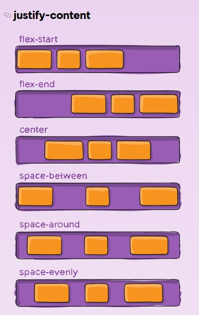
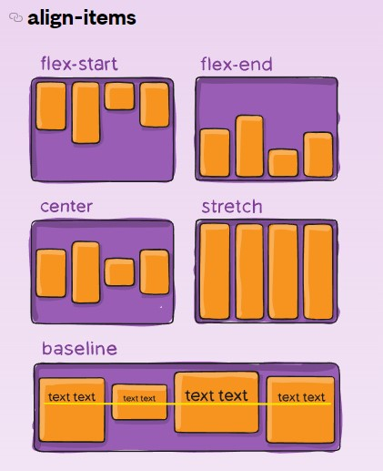

User: tailwind ile flex kullanımını bana anlatır mısın ? tailwind'da flex sınıfları nelerdir

Tailwind'da Flex kullanımı hakkında kapsamlı bir açıklama yapacağım:

## Tailwind CSS'de Flex Kullanımı

### **Temel Flex Sınıfları**

**1. Container Oluşturma**
```html
<!-- Flex container -->
<div class="flex">
  <div>Item 1</div>
  <div>Item 2</div>
  <div>Item 3</div>
</div>
```

**2. Yön Kontrolü (flex-direction)**
```html
<!-- Yatay (default) -->
<div class="flex">...</div>

<!-- Dikey -->
<div class="flex flex-col">...</div>

<!-- Ters yatay -->
<div class="flex flex-row-reverse">...</div>

<!-- Ters dikey -->
<div class="flex flex-col-reverse">...</div>
```

**3. Sarma (Wrap)**
```html
<!-- Sarılmaz (default) (no wrap) -->
<div class="flex">...</div>

<!-- Sarılır -->
<div class="flex flex-wrap">...</div>

<!-- Ters sırada sarılır -->
<div class="flex flex-wrap-reverse">...</div>
```

**4. Justify (Yatay Hizalama) (kendi ekseninde)**
```html
<div class="flex justify-start"><!-- Başlangıç --></div>
<div class="flex justify-end"><!-- Son --></div>
<div class="flex justify-center"><!-- Ortada --></div>
<div class="flex justify-between"><!-- Aralarında boşluk --></div>
<div class="flex justify-around"><!-- Etrafında boşluk --></div>
<div class="flex justify-evenly"><!-- Eşit boşluk --></div>
```



source : css-tricks.com

**5. Align Items (Dikey Hizalama) (ters eksende)**
```html
<div class="flex items-start"><!-- Üst --></div>
<div class="flex items-end"><!-- Alt --></div>
<div class="flex items-center"><!-- Merkez --></div>
<div class="flex items-baseline"><!-- Baseline --></div>
<div class="flex items-stretch"><!-- Gerilmiş (default) --></div>
```



source : css-tricks.com


**6. Grow & Shrink (Büyüme/Küçülme)**
```html
<!-- Eşit şekilde büyüyerek alanı doldur -->
<div class="flex">
  <div class="flex-1">1/3</div>
  <div class="flex-1">1/3</div>
  <div class="flex-1">1/3</div>
</div>

<!-- Farklı oranlar -->
<div class="flex">
  <div class="flex-2">2/3</div>
  <div class="flex-1">1/3</div>
</div>

<!-- Sabit genişlik -->
<div class="flex">
  <div class="flex-none">Sabit</div>
  <div class="flex-1">Dinamik</div>
</div>
```

**7. Gap (Boşluk)**
```html
<div class="flex gap-4"><!-- Aralarında 4 birim boşluk --></div>
<div class="flex gap-x-4 gap-y-2"><!-- X ve Y ayrı --></div>
```

### **Pratik Örnekler**

```html
<!-- Navbar - Yatay, Ortada Hizalanmış -->
<div class="flex justify-between items-center h-16 bg-gray-800">
  <div>Logo</div>
  <div class="flex gap-4">
    <a>Ana Sayfa</a>
    <a>Hakkında</a>
  </div>
</div>

<!-- Kartlar - Wrap ile Responsive -->
<div class="flex flex-wrap gap-4">
  <div class="flex-1 min-w-80 p-4 bg-white rounded">Kart 1</div>
  <div class="flex-1 min-w-80 p-4 bg-white rounded">Kart 2</div>
</div>

<!-- Merkeze Hizalı Content -->
<div class="flex h-screen justify-center items-center">
  <div>Ekranın tam ortasında</div>
</div>
```

### **En Önemli Tailwind Flex Sınıfları Özeti**

| Sınıf       | Işlem                          |
| ----------- | ------------------------------ |
| `flex`      | Flex container (default yatay) |
| `flex-col`  | Dikey yön                      |
| `flex-wrap` | Sarılır                        |
| `justify-*` | Yatay hizalama                 |
| `justify-*` | (flex-col)dikey hizalama       |
| `items-*`   | Dikey hizalama                 |
| `items-*`   | (flex-col)yatay hizalama       |
| `flex-1`    | Eşit büyüme                    |
| `gap-*`     | Elemanlar arası boşluk         |

User: tailwind ile flex kullanımını bana anlatır mısın ? tailwind'da flex sınıfları nelerdir

GitHub Copilot: Read [](file:///y%3A/devrepo-github/engtuncay.github.io/css/arts/art-grid-tailwind.md#1-1), lines 1 to 100

Mevcut dosya Grid hakkında olduğu için, Tailwind'da Flex kullanımı hakkında kapsamlı bir açıklama yapacağım:

## Tailwind CSS'de Flex Kullanımı

### **Temel Flex Sınıfları**

**1. Container Oluşturma**
```html
<!-- Flex container -->
<div class="flex">
  <div>İtem 1</div>
  <div>İtem 2</div>
  <div>İtem 3</div>
</div>
```

**2. Yön Kontrolü (flex-direction)**
```html
<!-- Yatay (default) -->
<div class="flex">...</div>

<!-- Dikey -->
<div class="flex flex-col">...</div>

<!-- Ters yatay -->
<div class="flex flex-row-reverse">...</div>

<!-- Ters dikey -->
<div class="flex flex-col-reverse">...</div>
```

**3. Sarma (Wrap)**
```html
<!-- Sarılmaz (default) -->
<div class="flex">...</div>

<!-- Sarılır -->
<div class="flex flex-wrap">...</div>

<!-- Ters sırada sarılır -->
<div class="flex flex-wrap-reverse">...</div>
```

**4. Justify (Yatay Hizalama)**
```html
<div class="flex justify-start"><!-- Başlangıç --></div>
<div class="flex justify-end"><!-- Son --></div>
<div class="flex justify-center"><!-- Ortada --></div>
<div class="flex justify-between"><!-- Aralarında boşluk --></div>
<div class="flex justify-around"><!-- Etrafında boşluk --></div>
<div class="flex justify-evenly"><!-- Eşit boşluk --></div>
```

**5. Align Items (Dikey Hizalama)**
```html
<div class="flex items-start"><!-- Üst --></div>
<div class="flex items-end"><!-- Alt --></div>
<div class="flex items-center"><!-- Merkez --></div>
<div class="flex items-baseline"><!-- Baseline --></div>
<div class="flex items-stretch"><!-- Gerilmiş (default) --></div>
```

**6. Grow & Shrink (Büyüme/Küçülme)**
```html
<!-- Eşit şekilde büyüyerek alanı doldur -->
<div class="flex">
  <div class="flex-1">1/3</div>
  <div class="flex-1">1/3</div>
  <div class="flex-1">1/3</div>
</div>

<!-- Farklı oranlar -->
<div class="flex">
  <div class="flex-2">2/3</div>
  <div class="flex-1">1/3</div>
</div>

<!-- Sabit genişlik -->
<div class="flex">
  <div class="flex-none">Sabit</div>
  <div class="flex-1">Dinamik</div>
</div>
```

**7. Gap (Boşluk)**
```html
<div class="flex gap-4"><!-- Aralarında 4 birim boşluk --></div>
<div class="flex gap-x-4 gap-y-2"><!-- X ve Y ayrı --></div>
```

### **Pratik Örnekler**

```html
<!-- Navbar - Yatay, Ortada Hizalanmış -->
<div class="flex justify-between items-center h-16 bg-gray-800">
  <div>Logo</div>
  <div class="flex gap-4">
    <a>Ana Sayfa</a>
    <a>Hakkında</a>
  </div>
</div>

<!-- Kartlar - Wrap ile Responsive -->
<div class="flex flex-wrap gap-4">
  <div class="flex-1 min-w-80 p-4 bg-white rounded">Kart 1</div>
  <div class="flex-1 min-w-80 p-4 bg-white rounded">Kart 2</div>
</div>

<!-- Merkeze Hizalı Content -->
<div class="flex h-screen justify-center items-center">
  <div>Ekranın tam ortasında</div>
</div>
```

### **En Önemli Tailwind Flex Sınıfları Özeti**

| Sınıf | İşlem |
|-------|--------|
| `flex` | Flex container |
| `flex-col` | Dikey yön |
| `flex-wrap` | Sarılır |
| `justify-*` | Yatay hizalama |
| `items-*` | Dikey hizalama |
| `flex-1` | Eşit büyüme |
| `gap-*` | Elemanlar arası boşluk |

İstersen bu bilgileri dosyaya ekleyebilirim! 🎯

# flex sabit col ve dinamik col

Flex'de bir flex-item belli bir rem genişliğinde, kalanı diğer item verecek şekilde dağıtma

```html
<!-- Yol 1: Sabit genişlik + Geri kalanı doldur -->
<div class="flex gap-4">
  <div class="w-32">Sabit 8rem (128px)</div>
  <div class="flex-1">Kalanı doldur</div>
</div>

<!-- Yol 2: Sabit rem genişlik ile -->
<div class="flex gap-4">
  <div class="w-40">Sabit 10rem</div>
  <div class="flex-1">Kalanı doldur</div>
  <div class="flex-1">Kalanı doldur</div>
</div>

<!-- Yol 3: Sidebar + Content örneği -->
<div class="flex gap-4">
  <aside class="w-64">Sidebar (16rem)</aside>
  <main class="flex-1">Ana içerik (kalanı doldur)</main>
</div>

<!-- Yol 4: Min-width ile responsive -->
<div class="flex gap-4">
  <div class="flex-none w-48">Sabit 12rem</div>
  <div class="flex-1 min-w-0">Kalanı doldur</div>
</div>
```

**Kullanılan Sınıflar:**
- **`w-32`** → 8rem genişlik (32 * 0.25rem = 8rem)
- **`w-40`** → 10rem genişlik
- **`w-64`** → 16rem genişlik
- **`flex-1`** → Kalan alanı eşit şekilde doldur
- **`flex-none`** → Sabit genişlik (büyümez/küçülmez)
- **`min-w-0`** → Overflow'u engellemek için

➖ Rem cinsinden özel genişlik ayarlama

`tailwind.config.js` dosyasında custom değer ekleyebilirsiniz:

```js
extend: {
  width: {
    'rem-12': '12rem',
    'rem-20': '20rem',
  }
}
```

Sonra `w-rem-12` şeklinde kullanırsınız.

