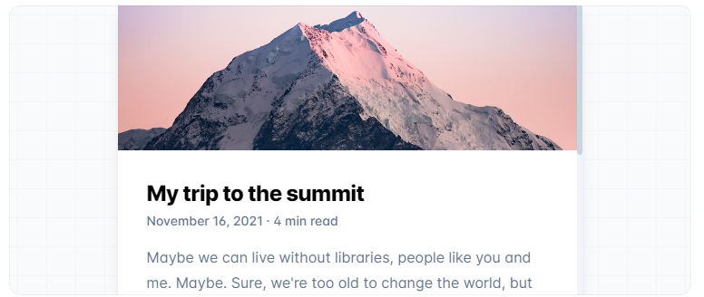
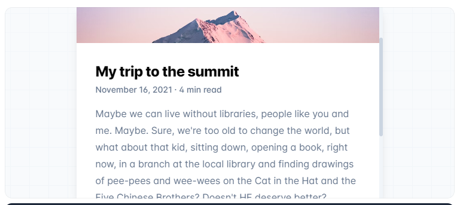
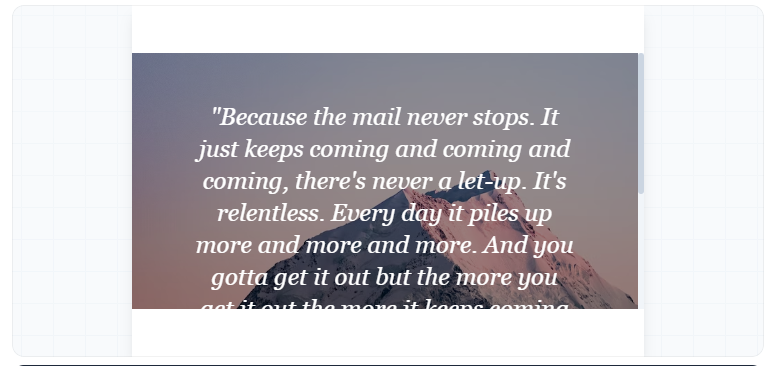
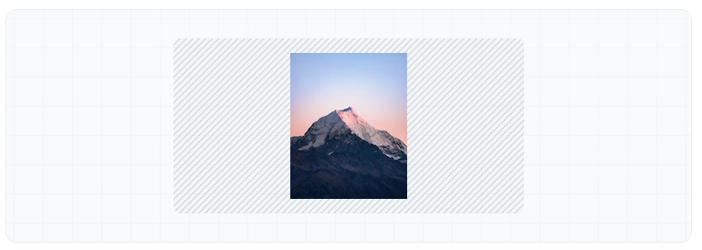

- [Backgrounds](#backgrounds)
  - [Background Attachment](#background-attachment)
  - [Background Repeat](#background-repeat)
  - [Background Size](#background-size)


# Backgrounds

## Background Attachment

Utilities for controlling how a background image behaves when scrolling.

​

Class     | Properties
----------|-------------------------------
bg-fixed  | background-attachment: fixed;
bg-local  | background-attachment: local;
bg-scroll | background-attachment: scroll;

🔔 Basic usages
​
- Fixed

Use bg-fixed to fix the background image relative to the viewport.



After scrol down a little :



```html
<div class="bg-fixed ..." style="background-image: url(...)"></div>

```

- Local

Use bg-local to scroll the background image with the container and the viewport.



After scroll a litlle :


```html
<div class="bg-local ..." style="background-image: url(...)"></div>
```

- Scroll

Use bg-scroll to scroll the background image with the viewport, but not with the container.

```html
<div class="bg-scroll ..." style="background-image: url(...)"></div>
```


## Background Repeat

Utilities for controlling the repetition of an element's background image.

​
Class           | Properties
----------------|------------------------------
bg-repeat       | background-repeat: repeat;
bg-no-repeat    | background-repeat: no-repeat;
bg-repeat-x     | background-repeat: repeat-x;
bg-repeat-y     | background-repeat: repeat-y;
bg-repeat-round | background-repeat: round;
bg-repeat-space | background-repeat: space;

🔔 Basic usages
​
- Repeat

Use bg-repeat to repeat the background image both vertically and horizontally.

## Background Size

Utilities for controlling the background size of an element's background image.
​
Class      | Properties
-----------|--------------------------
bg-auto    | background-size: auto;
bg-cover   | background-size: cover;
bg-contain | background-size: contain;

🔔 Basic usages
​
- Auto

Use bg-auto to display the background image at its default size.



```html
<div class="bg-auto bg-no-repeat bg-center ..." style="background-image: url(...)"></div>
```

- Cover


Use bg-cover to scale the background image until it fills the background layer.

```html
<div class="bg-cover bg-center ..." style="background-image: url(...)"></div>

```

- Contain

Use bg-contain to scale the background image to the outer edges without cropping or stretching.


```html
<div class="bg-contain bg-center ..." style="background-image: url(...)"></div>

```


