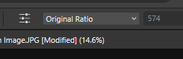

- [Affinity Notları](#affinity-notları)
- [Genel Kısayollar](#genel-kısayollar)
  - [New Document](#new-document)
- [Genel Hatlar](#genel-hatlar)
  - [Tuş-Mouse Kısayollar](#tuş-mouse-kısayollar)
- [Video Notes](#video-notes)
  - [5 The basics of cropping](#5-the-basics-of-cropping)
- [6 The basics of layers](#6-the-basics-of-layers)
- [8 Clipping mask and effect layers](#8-clipping-mask-and-effect-layers)
- [9 Masking for Beginners](#9-masking-for-beginners)
  - [Working with the shapes](#working-with-the-shapes)
  - [Marquee Selection](#marquee-selection)
- [Tools](#tools)
  - [Move tool](#move-tool)
  - [Selecting and Transforming Seperately](#selecting-and-transforming-seperately)
  - [Customizing shapes](#customizing-shapes)
  - [Moving the Nodes](#moving-the-nodes)
  - [Duplicating Objects](#duplicating-objects)
  - [Corner Tool](#corner-tool)
  - [Boolean Operations](#boolean-operations)
  - [Shape Builder Tool](#shape-builder-tool)
- [Colors](#colors)
  - [Palette](#palette)

# Affinity Notları

# Genel Kısayollar

➖ Tab shortcut

Çalışmayı tam ekran gösterir. stüdyo panel, araç kutularını gizler.

## New Document

there are preset sizes (önceden ayarlanmış boyutlar) for new documents.

- cmyk for print
- rgb for screen

# Genel Hatlar

- view / customize toolbar ile toolbar,panels,tools menüleri özelleştirilebilir.

- Bir tool seçildiğinde onunla ilgili özelliklerin olduğu toolbar'a , `context toolbar` adı verilir.

- ana pencere, üç ana kısımdan oluşur yukarı toolbar, sol tools, sağda studio kısmı bulunur.

## Tuş-Mouse Kısayollar

- shift ile basılı tutarsak mouse tekerleği yukarı giderse sola, aşağı giderse sağa ekran scroll yapar.

# Video Notes

## 5 The basics of cropping

- context toolbar'da yani ct'de overlay seçeneğinde thirds grip seçili gelir, imajın üzerindeki grid yapılanması değiştirilebilir.

- ct'de crop mode'lar vardır. unconstrained-original raito-custom ratio... gibi. mesela unconst. köşelerinde keseceğimiz alanı ayarlayıp, enter basınca crop yapar. 

- crop mode ları ile istediğimiz ratio 16:9, 1:1 gibi kesmeler de yapabiliriz.

# 6 The basics of layers

- 5 tip layer vardır.

* (1) Pixel Layer
* (2) Adjustment Layer : awesome effect vermeye yarar
* (3) (Live) Filters : like gaussion blur
  A twirl down means there is a nested layer.means it's tied to that layer. (ok işaretine basınca bir içte layerlar sıralanır)
  in photoshop, this called making it a smart object, realyy kind of grouping it.
  bu layer üste normal seviye taşınabilir, altındaki katmanlara uygular.
* (4) Text Layer 
* (5) Fill Layer 

# 8 Clipping mask and effect layers

- clippin mask , vektorel çizim (rectangle) üzerine bırakınca clipping mask yapıyor

- every layer can have an effect except filter and adjustment layers

- effect layer iconu fx yazar

# 9 Masking for Beginners

when masking, black conceals (cancels), white reveals.

- adjustment layers da maskeleme gibi parçalı işlem yaptırılabilir , siyahlar iptal eder, beyaz yerlere uygulama yapar.

## Working with the shapes

## Marquee Selection

Affinity programında (ör. Affinity Designer, Affinity Photo) "marquee" terimi, genellikle seçim (selection) araçlarıyla ilişkilidir. "Marquee tool" veya "marquee selection" ifadesi, dikdörtgen veya eliptik bir alanı seçmek için kullanılan aracı belirtir. Yani, Affinity programında "marquee" = seçim aracı (özellikle dikdörtgen/oval seçim).

Kısaca:  Affinity’de "marquee", seçili alan oluşturmak için kullanılan araçtır. Türkçede "seçim aracı" veya "seçili alan" olarak çevrilebilir. 

Evet, Affinity programında “drag to marquee select” ifadesi, fareyle sürükleyerek bir alanı seçmek anlamına gelir. Buradaki “marquee select”, dikdörtgen veya eliptik bir seçim kutusu oluşturmak için kullanılan seçim aracını ifade eder.

Türkçesiyle:  
“Drag to marquee select” = “Sürükleyerek seçim alanı (marquee) oluştur” veya “Sürükleyerek seçim yap”. (tıklayıp sürükleyerek bir alanı içinde seçmek - seçim alanı oluşturmak).

# Tools

## Move tool

- to move the selected object

- shift basarak boyutunu değiştirirsek orantılı değiştirir.

- shift basarak rotasyon yaparsak 15 derece artışlarla döner.

## Selecting and Transforming Seperately

- objeye seçebilmek için tümünü içine alan bir seçim yapmalıyız.

- shift basarak birden fazla obje seçebiliriz.

- feature toolbar dan transform object seperately seçeneği ile objeyi seçip ayrı ayrı dönüş yapabiliriz / küçültebiliriz.

## Customizing shapes

- köşeleri yuvarlatmak için köşe simgesine tıklayıp sürükleyebiliriz.

## Moving the Nodes

- features toolbardan `convert to curves` seçeneği ile şekli eğriye dönüştürüp node tool seçip nodları hareket ettirebiliriz.

- seçimle node'ları seçip örneğin ikisini birden hareket ettirebiliriz.

- köşeleri seçip yuvarlatabiliriz. köşelerden tutunca handles çıkar.

## Duplicating Objects

- ctrl + j basarak seçili objeyi çoğaltabiliriz. move tool ile sürükleyerek kopyalanan objeyi istediğimiz yere taşıyabiliriz.

- ctrl veya alt'a basılı tutarak sürükleyerek de kopyalayabiliriz.

## Corner Tool

- köşeleri yuvarlatmak için kullanılır. birden fazla köşe seçip hepsini aynı anda yuvarlatabiliriz.

- köşe tipini değiştirebiliriz (rounded, inverted rounded, chamfered, straight) (gpt)

## Boolean Operations

- iki veya daha fazla şekli birleştirmek, çıkarmak veya kesiştirmek için kullanılır.

- iki şekli seçip üstteki toolbar'dan boolean operation seçeneğini kullanabiliriz. birleştir, çıkar, kesiştir gibi seçenekler var.
  
- örneğin bir daire ve bir kareyi seçip "subtract" yaparsak, kareden dairenin şekli çıkarılır.

- boolean operation yaptıktan sonra şekil hala düzenlenebilir. `expand stroke` yaparsak artık düzenlenemez olur.

## Shape Builder Tool

- boolean operation'lara alternatif olarak kullanılabilir.

- shape builder tool ile şekillerin üzerine gelince artı veya eksi işareti çıkar. artı işaretine tıklarsak o alanları birleştirir, eksi işaretine tıklarsak o alanları çıkarır.

# Colors

## Palette

- kendi özel renk paletimizi oluşturabiliriz. swatches panelden yeni palet oluşturabiliriz. scope'u document yaparsak sadece o dokümanda görünür olur. scope'u application yaparsak tüm dokümanlarda görünür olur. scope'u global yaparsak tüm affinity uygulamalarında görünür olur.

 
