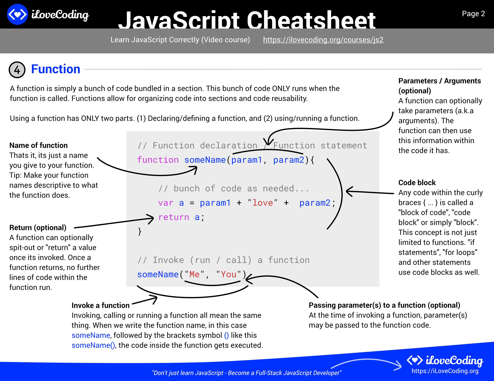
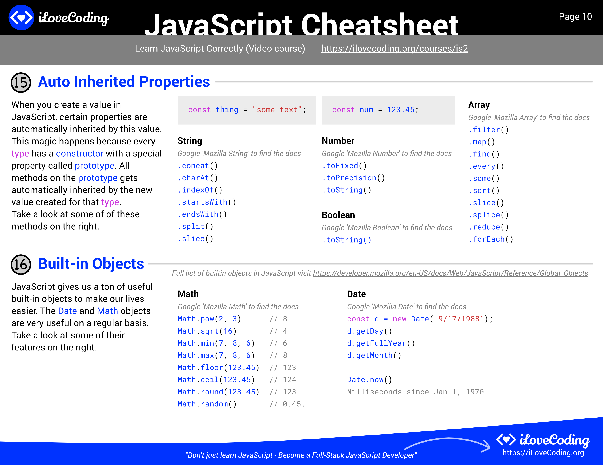
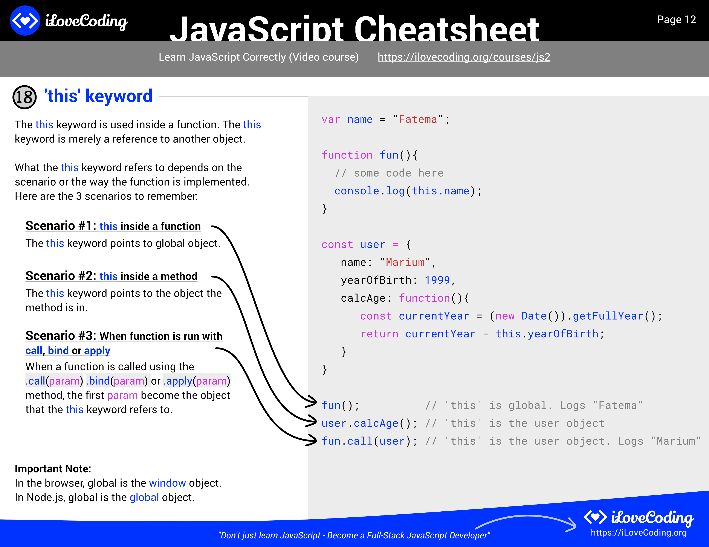
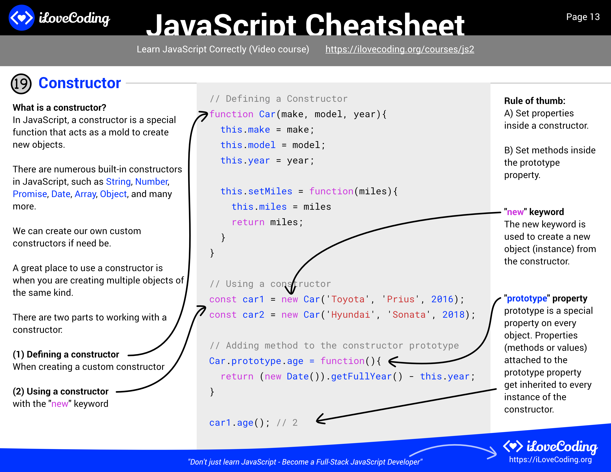

Source :

- https://github.com/iLoveCodingOrg/javascript-cheatsheet

Contents

- [Types](#types)
- [Function](#function)
- [Scope](#scope)
- [Operators](#operators)
- [Conditional Statements](#conditional-statements)
- [Loops](#loops)
- [Variable Declaration](#variable-declaration)
- [Browser](#browser)
- [Dom](#dom)
- [Auto Inherited Props](#auto-inherited-props)
- [Promise](#promise)
- [this](#this)
- [Constructor](#constructor)

# Types

# Function

# Scope

# Operators

# Conditional Statements

# Loops

# Variable Declaration

# Browser

# Dom

# Auto Inherited Props

# Promise

# this

# Constructor

