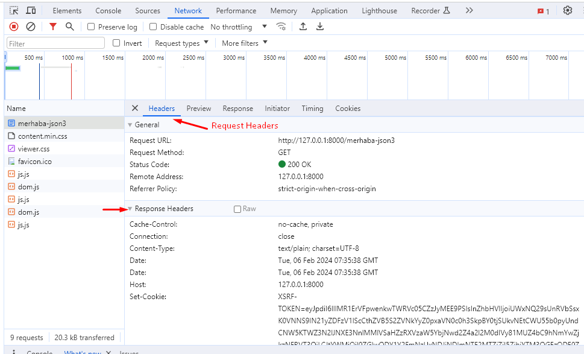
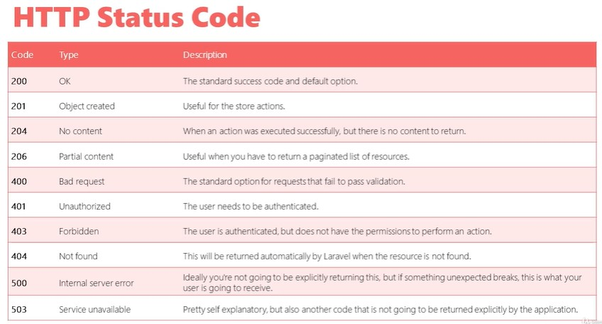

Laravel Api Kurs Notlarım

Laravel 7 ile Sıfırdan RESTful API Uygulamaları Geliştirme Kurs Notlarım

- [B1 Giriş](#b1-giriş)
  - [1.0. Giriş](#10-giriş)
  - [1.1. API Nedir?](#11-api-nedir)
  - [1.2. REST ve RESTful Nedir?](#12-rest-ve-restful-nedir)
  - [1.3. REST Yapısının Özellikleri ve SOAP Yapısı ile Kıyaslanması](#13-rest-yapısının-özellikleri-ve-soap-yapısı-ile-kıyaslanması)
  - [1.4. Örnek API İncelemeleri](#14-örnek-api-i̇ncelemeleri)
- [B2 Laravel'in Temelleri](#b2-laravelin-temelleri)
  - [2.0. Laravel'in Temelleri](#20-laravelin-temelleri)
  - [2.1. Laravel Nedir?](#21-laravel-nedir)
  - [2.2. XAMPP ve Composer Kurulumu](#22-xampp-ve-composer-kurulumu)
  - [2.3. Laravel Projesi Oluşturma](#23-laravel-projesi-oluşturma)
  - [2.4. Geliştirme Ortamı Alanadını Ayarlama](#24-geliştirme-ortamı-alanadını-ayarlama)
  - [2.5. PhpStorm ve Postman Kurulumu](#25-phpstorm-ve-postman-kurulumu)
  - [2.6. Laravel Projesi Dosya ve Klasör Yapısı](#26-laravel-projesi-dosya-ve-klasör-yapısı)
  - [2.7. Laravel'in Çalışma Yapısı](#27-laravelin-çalışma-yapısı)
  - [2.8. Web Route Yapısı](#28-web-route-yapısı)
  - [2.9. Route Yapısı Yanıt Türleri](#29-route-yapısı-yanıt-türleri)
  - [2.10. Route Yapısında Parametre Kullanımı](#210-route-yapısında-parametre-kullanımı)
  - [2.11. Route Tanımlarını İsimlendirme](#211-route-tanımlarını-i̇simlendirme)
  - [2.12. Route Tanımlarını Gruplama](#212-route-tanımlarını-gruplama)
  - [2.13. Controller Yapısı](#213-controller-yapısı)
  - [2.14. View Yapısı ve Blade Template Engine](#214-view-yapısı-ve-blade-template-engine)
  - [2.15. View Yapısı ve Blade Template Engine-2](#215-view-yapısı-ve-blade-template-engine-2)
  - [2.16. Veritabanı Bağlantısı](#216-veritabanı-bağlantısı)
  - [2.17. Migration Yapısı](#217-migration-yapısı)
  - [2.18. Raw SQL Query](#218-raw-sql-query)
  - [2.19. Query Builder Yapısı](#219-query-builder-yapısı)
  - [2.20. Eloquent ORM ve Model Yapısı](#220-eloquent-orm-ve-model-yapısı)
  - [2.21. Eloquent ORM - Kayıt Ekleme](#221-eloquent-orm---kayıt-ekleme)
  - [2.22. Eloquent ORM - Kayıt Çekme](#222-eloquent-orm---kayıt-çekme)
  - [2.23. Eloquent ORM - Güncelleme ve Silme](#223-eloquent-orm---güncelleme-ve-silme)
  - [2.24. Factory Yapısı](#224-factory-yapısı)
  - [2.25. Seed Yapısı](#225-seed-yapısı)
- [B3 - RESTful API Geliştirme](#b3---restful-api-geliştirme)
  - [3.0. RESTful API Geliştirme](#30-restful-api-geliştirme)
  - [3.1. API Route Dosyası](#31-api-route-dosyası)
  - [3.2. API İsteklerini Test Etme](#32-api-i̇steklerini-test-etme)
  - [3.3. HTTP Metotları](#33-http-metotları)
  - [3.4. HTTP Status Codes](#34-http-status-codes)
  - [3.5 Resource Controller ve Route Tanımları](#35-resource-controller-ve-route-tanımları)
  - [3.6. API Resource Controller ve Route Tanımları](#36-api-resource-controller-ve-route-tanımları)
  - [3.7. Product API Read (GET)](#37-product-api-read-get)
  - [3.8. Product API Insert (POST)](#38-product-api-insert-post)
  - [3.9. Product API Update (PUT)](#39-product-api-update-put)
  - [3.10. Product API Delete (DELETE)](#310-product-api-delete-delete)
  - [3.11. Sayfalandırma](#311-sayfalandırma)
  - [3.12. Filtreleme ve Sıralama](#312-filtreleme-ve-sıralama)
  - [3.13. Category API İşlemleri](#313-category-api-i̇şlemleri)
  - [3.14. User API İşlemleri](#314-user-api-i̇şlemleri)
  - [3.15. İlişkili Tablo Yapısını Oluşturma](#315-i̇lişkili-tablo-yapısını-oluşturma)
  - [3.16. Product ve Category Model İlişkileri](#316-product-ve-category-model-i̇lişkileri)
  - [3.17. İlişkili Tablo Verilerini Çekme](#317-i̇lişkili-tablo-verilerini-çekme)
- [B4 Veri Dönüşümleri](#b4-veri-dönüşümleri)
  - [4.0. Veri Dönüşümleri](#40-veri-dönüşümleri)
- [Sources](#sources)

# B1 Giriş

## 1.0. Giriş

## 1.1. API Nedir?

## 1.2. REST ve RESTful Nedir?

## 1.3. REST Yapısının Özellikleri ve SOAP Yapısı ile Kıyaslanması

## 1.4. Örnek API İncelemeleri


# B2 Laravel'in Temelleri

## 2.0. Laravel'in Temelleri


## 2.1. Laravel Nedir?

## 2.2. XAMPP ve Composer Kurulumu

- composer u windows'a composer setup 'dan kurabiliriz.

- composer versiyonunu görme

```bash
composer -v
```

🔚

## 2.3. Laravel Projesi Oluşturma

- laravel komutu kurulumu :

```bash
composer global require laravel/installer
```

- laravel komutu ile proje oluşturma :

```bash
laravel new example-app

```
- composer global paket kaldırmak için

```bash
composer global remove the-package-name
```


- composer komutu ile de proje kurulabilir. bakınız web

- laravel kurulumumuzu ayağa kaldırmak için :

```bash
php artisan serve
```

🔚

## 2.4. Geliştirme Ortamı Alanadını Ayarlama

- Apache virtual host tanımı yapılması 
  
apache/conf/extra klasöründen httpd-vhosts.conf dosyasında aşağıdaki ayarları yaparız.

```xml
<VirtualHost localweb.test:80>
	ServerName localweb.test
  ServerAdmin abc@gmail.com
  DocumentRoot "Y:\xampp\htdocs"
  <Directory "Y:\xampp\htdocs">
    AllowOverride All
    Require all granted
    Options Indexes FollowSymLinks
	</Directory>
</VirtualHost>

<VirtualHost laravelapi.test:80>
ServerName laravelapi.test
ServerAdmin abc@gmail.com
DocumentRoot "Y:\dev-demo\lr-proje1\public"
<Directory "Y:\dev-demo\lr-proje1\public">
  AllowOverride All
  Require all granted
  Options Indexes FollowSymLinks
</Directory>
</VirtualHost>
```

- Windows dns yönlendirmenin yapılması : 
 
hosts dosyasının vscode ile açarsak kaydetmemize izin verir.

```bash
C:\Windows\System32\drivers\etc\hosts dosyasından ayar yaparız.

```
- laravelapi.test adresini 127.0.0.1'e yönlendirilmesi

```
127.0.0.1 laravelapi.test
```

🔚

## 2.5. PhpStorm ve Postman Kurulumu

- Webden phpstorm ve postman uygulamalar kurulur.

🔚

## 2.6. Laravel Projesi Dosya ve Klasör Yapısı

- app uygulamamızın temel kodları bulunur. controller,middleware, model klasörleri buradadır.
  
- config klasöründe konfigürasyon dosyaları bulunur.

- database klasöründe veritabanı tanımlamaları bulunur.

- public klasörü internet dogrudan erişimi olacak klasördür. bu klasör dışındaki dosyalara internet üzerinden erişilemez olmalı.

- resources da ise javascript,css tanımlamaları olur.

- route klasöründe rut tanımlamaları bulunur.

- storage klasöründe laravel oluşturulan fiziksel dosyalar burada tutulur.

- .env dosyasında projemizle ilgili konfigürasyon bilgilerini tutar. vt baglantı tipi, kullanıcı adı, şifre vs... (env fonksiyonu buradaki değişkenleri almamızı sağlar.)

- composer.json ile php proje bilgileri tutulur.

- package.json ile front-end bağımlılık yönetilir.

🔚

## 2.7. Laravel'in Çalışma Yapısı

🔔 laravel'de ilk public klasöründeki index.php'i çalışır. 

- bu dosyada autoload ve bootstrap işlemi yapılır.

- gelen istek analiz edilip uygun sayfaya route edilir.

```
index.php (autoload+bootstrap) -> middleware -> routes -> controllers -> response (string/json/html view)

```

- middleware, isteklerin filtrelenmesi için kullanılır. mesela dosyalara sadece yetkili kişiler ulaşsın istiyorsun auth middleware kullanılır. kendiniz de özel middleware tanımlaması yapabiliriz.

🔚

## 2.8. Web Route Yapısı

- default index web rutu, view template sisteminde welcome view'ni açar. (resources/views/welcome.blade.php)

```php
// get metodu isteği belirtir. view (html) dönüş yapılmış.
Route::get('/', function () {
    return view('welcome');
});

```

🔚

## 2.9. Route Yapısı Yanıt Türleri

- routes/web.php dosyasına rut eklediğimizde text olarak dönüş yapabiliriz. (http://127.0.0.1:8000/merhaba)

```php
Route::get('/merhaba', function () {
    return 'Merhaba';
});
```

- json dönüş yapabiliriz.

```php
Route::get('/merhaba-json', function () {
    return ['message' => 'Merhaba API'];
});
```

- json dönüşünü Laravel fonksiyonları ile de yapabiliriz.

```php
Route::get('/merhaba-json2', function () {
    return response(['message' => 'Merhaba API Json2'], 200);
});
```  

- laravel metodları ile response header ları dönüş yapabiliriz.

```php
Route::get('/merhaba-json2', function () {
    return response(['message' => 'Merhaba API JSON3'], 200)
        ->header('Content-Type', 'application/json'); // text/plain
});

```

- json metodu ile dönüş yapabiliriz. laravel otomatik content/type 'nı app/json yapar.

```php
Route::get('/merhaba-json3', function () {
    return response()->json((['message' => 'Merhaba API Json2'], 200));
});
```

- content-type değerini chrome'dan görebiliriz.



🔚

## 2.10. Route Yapısında Parametre Kullanımı

- parametre almak için süslü parentez kullanırız.

```php
Route::get('/product/{id}', function ($id) {
    return "Product Id:$id";
});

- parametre sırasıyla, değişken sırası aynı olmalı

Route::get('/product/{id}/{type}', function ($id, $typeParam) {
    return "Product Id:$id Type: $typeParam";
});
```

- opsiyonel parametre kullanımı : (süslü parentezden önce ? konulur ve parametreye default değer verilir.)

```php
Route::get('/product/{id}/{type?}', function ($id, $typeParam = '') {
    return "Product Id:$id Type: $typeParam";
});

```

🔚

## 2.11. Route Tanımlarını İsimlendirme

- route'ları isimlendirerek, redirect'de kullanabiliriz.

```php
Route::get('/category/{slug}', function ($slug) {
    return "Category Slug:$slug";
})->name('category.show');

```

bu isimlendirmeyi yönlendirmede belirtiriz ve parametre alıyorsa ikinci argümanda array içinde belirtiriz.

```php
Route::get('/', function () {
    return redirect()->route('category.show',['slug'=>'books']);
});

```

- view içerisinde de kullanılabilir.

```html
<a href="{{ route('category.show',['slug'=>'books']) }}">Books Category</a>
```

🔚

## 2.12. Route Tanımlarını Gruplama

- route tanımlarını gruplaya onlara belli prefix , üst dizin belirtmiş oluruz.

```php
Route::prefix('basics')->group(function(){
  // Route tanımlarını buraya ekleriz.
  Route::get('/merhaba', function () {
    return 'Merhaba';
  });
  //...

})
```

merhaba rutuna, `basics/merhaba` üzerinden ulaşabiliriz.

🔚

## 2.13. Controller Yapısı

- route tanımlarında function yerine controller'da kullanılabilir.

- artisan komutu ile oluşturabiliriz.

```bash
php artisan make:controller ProductController

```

- route tanımını yapma:

```php
// in web.php
Route::get('/product/{id}/{type}', 'ProductController@show');
});
```

```php
// in ProductController class
namespace App\Http\Controllers

class ProductController extends Controller
{
  public function show($id,$typeParam='test'){
    return "Product Id:$id Type: $typeParam";
  }

  //...
}
```

- name'de verebiliriz.

```php
// in web.php
Route::get('/product/{id}/{type}', 'ProductController@show')->name('product.show');
});
```


## 2.14. View Yapısı ve Blade Template Engine
7 dak

## 2.15. View Yapısı ve Blade Template Engine-2
7 dak

## 2.16. Veritabanı Bağlantısı
7 dak

## 2.17. Migration Yapısı
12 dak

## 2.18. Raw SQL Query
6 dak

## 2.19. Query Builder Yapısı
7 dak

## 2.20. Eloquent ORM ve Model Yapısı
6 dak

## 2.21. Eloquent ORM - Kayıt Ekleme
6 dak

## 2.22. Eloquent ORM - Kayıt Çekme
2 dak

## 2.23. Eloquent ORM - Güncelleme ve Silme
6 dak

## 2.24. Factory Yapısı
10 dak

## 2.25. Seed Yapısı
10 dak

# B3 - RESTful API Geliştirme 

## 3.0. RESTful API Geliştirme

🔔 Neler öğrenilecek

## 3.1. API Route Dosyası

- routes klasörünün altında api.php dosyasından api rutları ayarlanır.
  
- İlk ayarlamalar App\Providers klasörü içerisindeki RouteServiceProvider tarafından gerçekleştirilir.
  map metodunda iki metod çalıştırır. mapApiRoutes ve mapWebRoutes. 

- api route ları otomatik `/api` prefix ile tanımlanmış. 'myurl/api/' gibi alt dizinde belirtilir.

- api middleware kullanılmış. group metodu ile route tanımlarının nerede yapılacağı belirtilir.

```php
// in RouteServiceProvide.php
$this->routes(function () {
    Route::middleware('api')
          ->prefix('api')
          ->group(base_path('routes/api.php'));

    Route::middleware('web')
          ->group(base_path('routes/web.php'));
});
```

- Aşağıdaki satırlar api.php içerisine eklenir.

Example 1 

```php
Route::get('/merhaba', function () {
    return "Merhaba Restful API";
});
```

- return olarak factory fonksiyonunu kullanabiliriz. laravel 10 ile çalışmıyor.

```php
Route::get('/users', function () {
    return factory(User::class,10)->make();
});
```
🔚

## 3.2. API İsteklerini Test Etme

- Api isteklerini postman ile test edebiliriz.

🔚

## 3.3. HTTP Metotları

- Genel Http Metotları

Verb   | Description
-------|----------------
GET    | Read
POST   | Create
PUT    | UPDATE /Replace
DELETE | Delete
Patch  | Update / Modify

🔚

## 3.4. HTTP Status Codes

- Some Http Status Codes

Code | Type        | Desc
-----|-------------|-------------
200  | Ok          | Success Code
400  | Bad request |
404 | Not Foundd
500  | Internal Server Error |



🔚

## 3.5 Resource Controller ve Route Tanımları

- api controller oluşturma komutu

model vermezsek, metodlara argüman olarak obje yerine $id tanımlar.

```bash
php artisan make:controller ProductController --resource --model=Product
```

- controller dan otomatik metodların tanımlanması

```php
Route::resource('/products','ProductController');
```

- uygulama içindeki tüm rutların listesini almak

```bash
php artisan route:list
```

- controller içerisindeki tümünü değil bazı metodları kullanma

```php
Route::resource('/products','ProductController')->only(['index','show']);
```

- controller içerisindeki bazı metodları hariç tutma

```php
Route::resource('/products','ProductController')->except(['destroy']);
```

🔚

## 3.6. API Resource Controller ve Route Tanımları

- api argumanını, model baglamak istiyorsak da modeli belirtiriz. app/http/controllers/Api içerisine ProductController.php dosyasını oluşturur.

```bash
php artisan make:controller Api\ProductController --api --model=Product
```

- oluşturulan örnek api resource controller dosyası 

```php
namespace App\Http\Controllers\Api;

use App\Http\Controllers\Controller;
use App\Models\Product;
use Illuminate\Http\Request;

class ProductController extends Controller
{
    /**
     * Display a listing of the resource.
     */
    public function index()
    {
        //
    }

    /**
     * Store a newly created resource in storage.
     */
    public function store(Request $request)
    {
        //
    }

    /**
     * Display the specified resource.
     */
    public function show(Product $product)
    {
        //
    }

    /**
     * Update the specified resource in storage.
     */
    public function update(Request $request, Product $product)
    {
        //
    }

    /**
     * Remove the specified resource from storage.
     */
    public function destroy(Product $product)
    {
        //
    }
}

```

model bağlanmasaydı argüman olarak product yerine id alırdı. api uygulamalarında , web uygulamalarındaki create metodu yok. create metodu form gösterimi için kullanılan metoddur.

- Api.php de kayıt etmek için


```php
// api.php file
Route::apiResource('/product','Api\ProductController');
// another way
Route::apiResource('/product', ProductController::class);
```

- route listelemek için

```bash
php artisan route:list
```

- api.php de toplu olarak tanımlayabiliriz.

```php
Route::apiResources([
  'products' => 'Api\ProductController',
  'users' => 'Api\UserController'
]);
```


## 3.7. Product API Read (GET)

- Elaquent ile Product:all() veritabanındaki tüm ürünleri çekebiliriz.

- normalde laravel content type application/json çeviriyor, fakat apiResouce controller metodunda detaylı dönüş de yapabiliriz.

```php
return response()->json(Product:all(),200);
// veya
return respone(Product:all(),200);
```

- show metodunda laravel $product parametresini id sini alarak direk $product objesini dönüş yapabiliriz.

```php
public function show(Product $product)
  {
    //
    return $product;
  }
```

- ürünün id'sini url'den veririz. /api/products/1 gibi.

- response function ile de dönüş yapabiliriz.

```php
return respone($product,200);
```

- olmayan ürünün id'si istenirse laravel html çıktı gönderir, bunu önlemek için request'in header'da Accept anahtarını ve değerini `application/json` olarak belirtmek gerekir. laravel dönüşü json yapar.

- isteği model binding yapısı ile degilde, id ile gönderip gerçekleştirebiliriz.

```php
public function show($id)
  {
    //
    $product = Product::find($id); 

    if($product){
      return respone($product,200);
    }else {
      return respone(['message'=>'Product not found!'],404);   
    }
    
  }
```

🔚


## 3.8. Product API Insert (POST)


## 3.9. Product API Update (PUT)
8 dak

## 3.10. Product API Delete (DELETE)
2 dak

## 3.11. Sayfalandırma
10 dak

## 3.12. Filtreleme ve Sıralama
8 dak

## 3.13. Category API İşlemleri
7 dak

## 3.14. User API İşlemleri
5 dak

## 3.15. İlişkili Tablo Yapısını Oluşturma
12 dak

## 3.16. Product ve Category Model İlişkileri
6 dak

## 3.17. İlişkili Tablo Verilerini Çekme
4 dak

# B4 Veri Dönüşümleri

## 4.0. Veri Dönüşümleri
1 dak

1.  4.1. Dönüş Kolonlarını Özelleştirme
8 dak

1.  4.2. map Metodu ile Kolonları Özelleştirme
4 dak

1.  4.3. Gruplanmış Tablo Verileri
6 dak

1.  4.4. Kolonları Gizleme
3 dak

1.  4.5. Özelleştirilmiş Kolonlar
13 dak

1.  4.6. Tarih Biçimlendirme
4 dak

1.  4.7. API Resources
12 dak

1.  4.8. Resource collection Metodu
2 dak

1.  4.9. Resource Collection Dosyaları
9 dak

1.  4.10. Resource Paginated Data
4 dak

1.  4.11. Resource Data Wrapping
6 dak

1.  4.12. Relational Data
7 dak

1.  4.13. Conditional Column
3 dak

1.  4.14. Conditional Relationship
3 dak

1.  4.15. Custom Wrapper Response
3 dak

1.  4.16. apiResponse Metodunu Oluşturma
8 dak

1.  4.17. apiResponse Metodunu Geliştirme
7 dak

1.  5.0. Veri Doğrulama ve Hata Yakalama
1 dak

1.  5.1. Veri Doğrulama İşlemi
10 dak

1.  5.2. Özel Request Tanımı ile Veri Doğrulama
15 dak

1.  5.3. Doğrulama Hata Mesajlarını Özelleştirme
6 dak

1.  5.4. Handler ile Hata Yakalama
11 dak

1.  5.5. try-catch ile Hata Yakalama
5 dak

1.  6.0 Authentication Yapısı
1 dak

1.  6.1. Authentication Kavramı ve Konfigrasyonu
5 dak

1.  6.2. Web Arayüzünde Authentication Kontrolü Ekleme
4 dak

1.  6.3. Web Arayüzünde Auth Yapısını Oluşturma
9 dak

1.  6.4. Api Arayüzünde Authentication Kontrolü Ekleme
5 dak

1.  6.5. Token Authentication
11 dak

1.  6.6. Özel Bearer Token Authentication
17 dak

1.  6.7. Dinamik Api Token Oluşturma
14 dak

1.  6.8. Basic Authentication
3 dak

1.  7.0. Dosya Kullanımı
1 dak

1.  7.1. Client Uygulaması Üzerinde Upload Formunun Oluşturulması
13 dak

1.  7.2. API Uygulaması İçerisinde Upload İşleminin Gerçekleştirilmesi
13 dak

1.  7.3. Postman Üzerinde Upload İşleminin Test Edilmesi
2 dak

1.  7.4. Upload Verilerini Doğrulama
11 dak

1.  7.5. Ek Dosya Komutları
8 dak

1.  7.6. Laravel Storage Kullanımı
8 dak

1.  7.7. Laravel Storage Link
15 dak

1.  7.8. API ile Dosya Download
10 dak

1.  8.0 Özel Middleware Tanımları
1 dak

1.  8.1. Middleware Yapısı
2 dak

1.  8.2. Middleware Tanımlarının Kullanılması
6 dak

1.  8.3. Throttle Middleware
10 dak

1.  8.4. Dynamic Rate Limiting
7 dak

1.  8.5. Guest & Authenticated User Rate Limits
5 dak

1.  8.6. Logger Middleware
8 dak

1.  8.7. Log Dosyaları Oluşturma ve Ortam Değişkeni Kullanımı
9 dak

1.   8.8. Header Middleware
4 dak

1.   9.0. API Belgelendirme ve Test İşlemleri
1 dak

1.   9.1. Örnek API Belgeleri
8 dak

1.   9.2. Swagger Paket Kurulumu
3 dak

1.   9.3. Swagger UI İncelemesi
7 dak

1.   9.4. Annotation Yapısı
7 dak

1.   9.5. Swagger ile Belgenin Oluşturulması
16 dak

1.   9.6. Parametre Kullanımı
6 dak

1.   9.7. Farklı Durum Kodları ve Response Tanımlarının Kullanımı
6 dak

1.   9.8. Verileri Schema Tanımlarıyla İlişkilendirme
8 dak

1.   9.9. Model Özelliklerini Tanımlama
6 dak

1.   9.10. Belgelendirme Tanımlarını Ayrı Dosyada Kullanma
3 dak

1.   9.11. GetById Tanımı
10 dak

1.   9.12. Post Metot Tanımı
7 dak

1.   9.13. Update Metot Tanımı
5 dak

1.   9.14. Delete Metot Tanımı
3 dak

1.   9.15. Tag Tanımı
4 dak

1.   9.16. SecurityScheme ve Authorize Tanımı
12 dak

1.   9.17. Server, ExternalDocumentation
9 dak

1.   10.0. API Uygulamasını Yayınlama
1 dak

1.   10.1. Paylaşımlı Sunucuda Veritabanı İşlemleri
6 dak

1.   10.2. Proje Dosyalarının Sunucuya Yüklenmesi
5 dak

1.   10.3. Symbolic Link Verme İşlemi
8 dak

1.   10.4. Yayınlama Sonrası Hatalar ve Düzenlemeler
5 dak

1.   10.5. Subdomain Olarak Yayınlama
5 dak

1.   10.6. Yayınlama Sonrası İşlemler
2.   


# Sources

- Udemy Course, https://www.udemy.com/course/laravel-ile-sifirdan-restful-api-uygulamalari-gelistirme (recommended)

