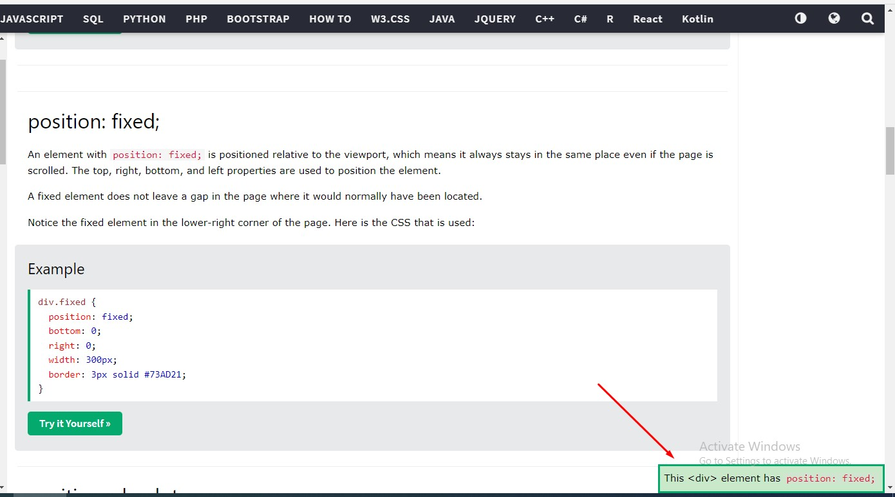
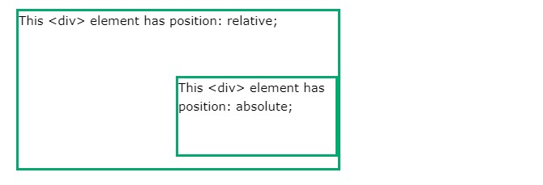

- [Display Property](#display-property)
- [Inline Block](#inline-block)
- [Position Property](#position-property)
- [Overflow Property](#overflow-property)
- [Align](#align)
- [Float and Clear](#float-and-clear)

# Display Property 

The display property is the most important CSS property for controlling layout.

**The display Property**

The display property specifies if/how an element is displayed.

Every HTML element has a default display value depending on what type of element it is. The default display value for most elements is block or inline.

**Block-level Elements**

A block-level element always starts on a new line and takes up the full width available (stretches out to the left and right as far as it can). (! Block-Level element yeni satırdan başlar, sola ve sağa genişliği max alabildiğince alır. Sonraki gelen element de yeni satırdan başlar.) 

Examples of block-level elements:

```html
<div>
<h1> - <h6>
<p>
<form>
<header>
<footer>
<section>
```

**Inline Elements**

An inline element does not start on a new line and only takes up as much width as necessary.

Examples of inline elements:

```html
<span>
<a>


```

**Display: none;**

display: none; is commonly used with JavaScript to hide and show elements without deleting and recreating them. Take a look at our last example on this page if you want to know how this can be achieved.

The `<script>` element uses display: none; as default. 

**Override The Default Display Value**

As mentioned, every element has a default display value. However, you can override this.

Changing an inline element to a block element, or vice versa, can be useful for making the page look a specific way, and still follow the web standards.

A common example is making inline `<li>` elements for horizontal menus:

Example

```css
li {
  display: inline;
}
```

Note: Setting the display property of an element only changes how the element is displayed, NOT what kind of element it is. So, an inline element with display: block; is not allowed to have other block elements inside it.

The following example displays `<span>` elements as block elements:

Example

```css
span {
  display: block;
}

```

The following example displays `<a>` elements as block elements:

Example

```css
a {
  display: block;
}

```

**Hide an Element - display:none or visibility:hidden?**

Hiding an element can be done by setting the display property to none. The element will be hidden, and the page will be displayed as if the element is not there: 

(tr:hidden element sayfada hiç yokmuş gibi davranır.:)

Example

```css
h1.hidden {
  display: none;
}
```

visibility:hidden; also hides an element.

However, the element will still take up the same space as before. The element will be hidden, but still affect the layout: 

(tr:visibility hidden olunca elementi gizler, fakat layout da sanki oradaymış gibi davranır.:) 

Example

```css
h1.hidden {
  visibility: hidden;
}

```

**CSS Display/Visibility Properties**

```
Property	Description
display	: Specifies how an element should be displayed
visibility :Specifies whether or not an element should be visible ( false olduğunda layout da varmış gibi davranır, ama gözükmez.) 

```

# Inline Block

Source : https://www.w3schools.com/css/css_inline-block.asp


# Position Property

Source : https://www.w3schools.com/css/css_positioning.asp

The position property specifies the type of positioning method used for an element (static, relative, fixed, absolute or sticky).

There are five different position values:

- static
- relative 
- fixed 
- absolute 
- sticky 

(tr: static statik,relative göreceli,fixed sabit,absolute mutlak,sticky yapışkan :)

Elements are then positioned using the top, bottom, left, and right properties. However, these properties will not work unless the position property is set first. They also work differently depending on the position value.

**position: static;**

HTML elements are positioned static by default.

Static positioned elements are not affected by the top, bottom, left, and right properties.

An element with position: static; is not positioned in any special way; it is always positioned according to the *normal flow* of the page: 

(tr:static ,default pozisyonda olan elementlere , pozisyonlanmamış elementler denir, pozisyonlanmış elementler, static dışında değer olan elementlerdir. :)

Here is the CSS that is used:

Example

```html
div.static {
  position: static;
  border: 3px solid #73AD21;
}

```

**position: relative;**

An element with position: relative; is positioned relative to its normal position.

Setting the top, right, bottom, and left properties of a relatively-positioned element will cause it to be adjusted away from its normal position. Other content will not be adjusted to fit into any gap left by the element. 

(tr: statik gibidir, sadece tblr degerleri alabilir, sonraki element tblr değerinden etkilenmez.:) 

Here is the CSS that is used:

Example

```css
div.relative {
  position: relative;
  left: 30px;
  border: 3px solid #73AD21;
}

```

**position: fixed;**

An element with position: fixed; is positioned relative to the *viewport*, which means it always stays in the same place even if the page is scrolled. The top, right, bottom, and left properties are used to position the element.

A fixed element does not leave a gap in the page where it would normally have been located.???

Notice the fixed element in the lower-right corner of the page. Here is the CSS that is used:

Example



```css
div.fixed {
  position: fixed;
  bottom: 0;
  right: 0;
  width: 300px;
  border: 3px solid #73AD21;
}
```

**position: absolute **

An element with position: absolute; is positioned according to positioned ancestor.

However; if an absolute positioned element has no positioned ancestors, it uses the document body, and moves along with page scrolling.

Note: A "positioned" element is one whose position is anything except static.

Here is a simple example:



```css
div.relative {
  position: relative;
  width: 400px;
  height: 200px;
  border: 3px solid #73AD21;
}

div.absolute {
  position: absolute;
  top: 80px;
  right: 0;
  width: 200px;
  height: 100px;
  border: 3px solid #73AD21;
}

```

**position: sticky;**

An element with position: sticky; is positioned based on the user's scroll position.

A sticky element toggles between relative (normal flow) and fixed, depending on the scroll position. It is positioned relative until a given offset position is met in the viewport - then it "sticks" in place (like position:fixed).

Note: Internet Explorer does not support sticky positioning. Safari requires a -webkit- prefix (see example below). You must also specify at least one of top, right, bottom or left for sticky positioning to work.

In this example, the sticky element sticks to the top of the page (top: 0), when you reach its scroll position.

Example

```css
div.sticky {
  position: -webkit-sticky; /* Safari */
  position: sticky;
  top: 0;
  background-color: green;
  border: 2px solid #4CAF50;
}

```

**Overlapping Elements**

When elements are positioned, they can overlap other elements.

The z-index property specifies the stack order of an element (which element should be placed in front of, or behind, the others).

An element can have a positive or negative stack order:

Example
img {
  position: absolute;
  left: 0px;
  top: 0px;
  z-index: -1;
}

An element with greater stack order is always in front of an element with a lower stack order. 

Note: If two positioned elements overlap without a z-index specified, the element positioned last in the HTML code will be shown on top.

```
All CSS Positioning Properties
Property	Description
bottom	Sets the bottom margin edge for a positioned box
clip	Clips an absolutely positioned element
left	Sets the left margin edge for a positioned box
position	Specifies the type of positioning for an element
right	Sets the right margin edge for a positioned box
top	Sets the top margin edge for a positioned box
z-index	Sets the stack order of an element

```
# Overflow Property

The CSS overflow property controls what happens to content that is too big to fit into an area.

The overflow property specifies whether to clip the content or to add scrollbars when the content of an element is too big to fit in the specified area.

The overflow property has the following values:

- visible - Default. The overflow is not clipped. The content renders outside the element's box
- hidden - The overflow is clipped, and the rest of the content will be invisible
- scroll - The overflow is clipped, and a scrollbar is added to see the rest of the content
- auto - Similar to scroll, but it adds scrollbars only when necessary

Note: The overflow property only works for *block elements with a specified height*.

Note: In OS X Lion (on Mac), scrollbars are hidden by default and only shown when being used (even though "overflow:scroll" is set).

**overflow: visible**

By default, the overflow is visible, meaning that it is not clipped and it renders outside the element's box:

Example

div {
  width: 200px;
  height: 50px;
  background-color: #eee;
  overflow: visible;
}

**overflow: hidden**

With the hidden value, the overflow is clipped, and the rest of the content is hidden:  (taşan yer kırpılır, içeriğin sonrası gizlenir.) 

Example

div {
  overflow: hidden;
}

**overflow: scroll**

Setting the value to scroll, the overflow is clipped and a scrollbar is added to scroll inside the box. Note that this will add a scrollbar both horizontally and vertically (even if you do not need it):

Example

div {
  overflow: scroll;
}

**overflow: auto**

The auto value is similar to scroll, but it adds scrollbars only when necessary:

Example

div {
  overflow: auto;
}

**overflow-x and overflow-y**

The overflow-x and overflow-y properties specifies whether to change the overflow of content just horizontally or vertically (or both):

overflow-x specifies what to do with the left/right edges of the content.

overflow-y specifies what to do with the top/bottom edges of the content.

Example

div {
  overflow-x: hidden; /* Hide horizontal scrollbar */
  overflow-y: scroll; /* Add vertical scrollbar */
}

```
All CSS Overflow Properties
Property	Description
overflow	Specifies what happens if content overflows an element's box
overflow-x	Specifies what to do with the left/right edges of the content if it overflows the element's content area
overflow-y	Specifies what to do with the top/bottom edges of the content if it overflows the element's content area

```

# Align

**Center Align Elements**

To horizontally center a block element (like `<div>`), use margin: auto;

Setting the width of the element will prevent it from stretching out to the edges of its container.

The element will then take up the specified width, and the remaining space will be split equally between the two margins:

Example

.center {
  margin: auto;
  width: 50%;
  border: 3px solid green;
  padding: 10px;
}

Note: Center aligning has no effect if the width property is not set (or set to 100%).

**Center Align Text**

To just center the text inside an element, use text-align: center;

Example

.center {
  text-align: center;
  border: 3px solid green;
}

Tip: For more examples on how to align text, see the CSS Text chapter. https://www.w3schools.com/css_text.asp

**Center an Image**

To center an image, set left and right margin to auto and make it into a block element:

Example

img {
  display: block;
  margin-left: auto;
  margin-right: auto;
  width: 40%;
}

**Left and Right Align - Using position**

One method for aligning elements is to use position: absolute;:

Example

.right {
  position: absolute;
  right: 0px;
  width: 300px;
  border: 3px solid #73AD21;
  padding: 10px;
}

Note: Absolute positioned elements are removed from the normal flow, and can overlap elements.

**Left and Right Align - Using float**

Another method for aligning elements is to use the float property:

Example

.right {
  float: right;
  width: 300px;
  border: 3px solid #73AD21;
  padding: 10px;
}

Note: If an element is taller than the element containing it, and it is floated, it will overflow outside of its container. You can use the "clearfix" hack to fix this (see example below).

**The clearfix Hack**

Then we can add overflow: auto; to the containing element to fix this problem:

Example

.clearfix {
  overflow: auto;
}

**Center Vertically - Using padding**

There are many ways to center an element vertically in CSS. A simple solution is to use top and bottom padding:

Example

.center {
  padding: 70px 0;
  border: 3px solid green;
}

To center both vertically and horizontally, use padding and text-align: center:

Example

.center {
  padding: 70px 0;
  border: 3px solid green;
  text-align: center;
}

**Center Vertically - Using line-height**

Another trick is to use the line-height property with a value that is equal to the height property:


Example

.center {
  line-height: 200px;
  height: 200px;
  border: 3px solid green;
  text-align: center;
}

/* If the text has multiple lines, add the following: */
.center p {
  line-height: 1.5;
  display: inline-block;
  vertical-align: middle;
}

**Center Vertically - Using position & transform**

If padding and line-height are not options, another solution is to use positioning and the transform property:

Example

.center {
  height: 200px;
  position: relative;
  border: 3px solid green;
}

.center p {
  margin: 0;
  position: absolute;
  top: 50%;
  left: 50%;
  transform: translate(-50%, -50%);
}

Tip: You will learn more about the transform property in our 2D Transforms Chapter.

**Center Vertically - Using Flexbox**

You can also use flexbox to center things. Just note that flexbox is not supported in IE10 and earlier versions:

Example

.center {
  display: flex;
  justify-content: center;
  align-items: center;
  height: 200px;
  border: 3px solid green;
}

Tip: You will learn more about Flexbox in our CSS Flexbox Chapter.

# Float and Clear

The CSS float property specifies how an element should float.

The CSS clear property specifies what elements can float beside the cleared element and on which side.

**The float Property**

The float property is used for positioning and formatting content e.g. let an image float left to the text in a container.

The float property can have one of the following values:

* left - The element floats to the left of its container
* right - The element floats to the right of its container
* none - The element does not float (will be displayed just where it occurs in the text). This is default
* inherit - The element inherits the float value of its parent

In its simplest use, the float property can be used to wrap text around images.

Example - float: right;

The following example specifies that an image should float to the right in a text:

Example

img {
  float: right;
}

Example - No float

In the following example the image will be displayed just where it occurs in the text (float: none;):

Example

img {
  float: none;
}

Example - Float Next To Each Other

Normally div elements will be displayed on top of each other. However, if we use float: left we can let elements float next to each other:

Example

div {
  float: left;
  padding: 15px;
}

.div1 {
  background: red;
}

.div2 {
  background: yellow;
}

.div3 {
  background: green;
}
end

