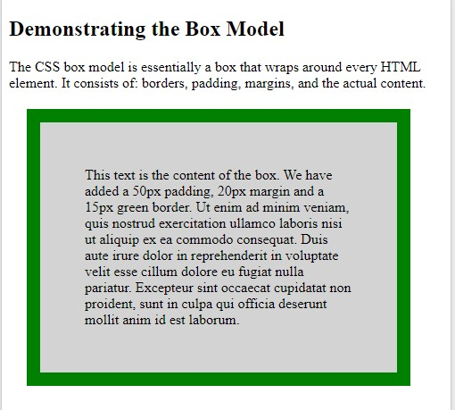

**CSS Element Size**

- [CSS Units](#css-units)
- [CSS Box Model](#css-box-model)
- [Box Sizing (border-box model)](#box-sizing-border-box-model)
- [Height , Width And Max-Width](#height--width-and-max-width)
- [Max-Width And Auto Margin](#max-width-and-auto-margin)
- [Borders](#borders)
- [Margin](#margin)
- [Padding](#padding)
- [CSS Outline](#css-outline)
- [User Interface (Resizing)](#user-interface-resizing)

# CSS Units

(tr:Birimler:)

Source : https://www.w3schools.com/css/css_units.asp

CSS has several different units for expressing a length.

Many CSS properties take "length" values, such as `width, margin, padding, font-size, etc`.

Length is a number followed by a length unit, such as 10px, 2em, etc.

*Example*

Set different length values, using px (pixels):

```css
h1 {
  font-size: 60px;
}

p {
  font-size: 25px;
  line-height: 50px;
}

```

Note: A whitespace cannot appear between the number and the unit (birim ile sayı arasına boşluk konulmaz). However, if the value is 0, the unit can be omitted.

For some CSS properties, negative lengths are allowed.

There are two types of length units: `absolute and relative`.

**Absolute Lengths**

(tr:mutlak ölçüler:)

The absolute length units are fixed and a length expressed in any of these will appear as exactly that size.

Absolute length units are not recommended for use on screen, because screen sizes vary so much. However, they can be used if the output medium is known, such as for print layout.

| Unit | Description                  |
| ---- | ---------------------------- |
| cm   | centimeters                  |
| mm   | millimeters                  |
| in   | inches (1in = 96px = 2.54cm) |
| px*  | pixels (1px = 1/96th of 1in) |
| pt   | points (1pt = 1/72 of 1in)   |
| pc   | picas (1pc = 12 pt)          |


* Pixels (px) are relative to the viewing device. For low-dpi devices, 1px is one device pixel (dot) of the display. For printers and high resolution screens 1px implies multiple device pixels.

**Relative Lengths** 

(tr:Göreceli uzunluklar:)

Relative length units specify a length relative to another length property. Relative length units scales better between different rendering mediums.

| Unit | Description                                                                               |
| ---- | ----------------------------------------------------------------------------------------- |
| em   | Relative to the font-size of the element (2em means 2 times the size of the current font) |
| ex   | Relative to the x-height of the current font (rarely used)                                |
| ch   | Relative to width of the "0" (zero)                                                       |
| rem  | Relative to font-size of the root element                                                 |
| vw   | Relative to 1% of the width of the viewport*                                              |
| vh   | Relative to 1% of the height of the viewport*                                             |
| vmin | Relative to 1% of viewport's* smaller dimension                                           |
| vmax | Relative to 1% of viewport's* larger dimension                                            |
| %    | Relative to the parent element (ebeveyn elementin %'si)                                   |

**Tips**: 
* The em and rem units are practical in creating perfectly scalable layout!
* Viewport = the browser window size. If the viewport is 50cm wide, 1vw = 0.5cm.

| Unit                              | chro-expl-fire-safa-oper |
| --------------------------------- | ------------------------ |
| em, ex, %, px, cm, mm, in, pt, pc | 1.0	3.0	1.0	1.0	3.5      |
| ch                                | 27.0	9.0	1.0	7.0	20.0    |
| rem                               | 4.0	9.0	3.6	4.1	11.6     |
| vh, vw                            | 20.0	9.0	19.0	6.0	20.0   |
| vmin                              | 20.0	12.0	19.0	6.0	20.0  |
| vmax                              | 26.0	16.0	19.0	7.0	20.0  |

# CSS Box Model 

Source : https://www.w3schools.com/css/css_boxmodel.asp

All HTML elements can be considered as boxes. In CSS, the term "box model" is used when talking about design and layout.

The CSS box model is essentially a box that wraps around every HTML element. It consists of: margins, borders, padding, and the actual content. The image below illustrates the box model:


Explanation of the different parts:

* Content - The content of the box, where text and images appear
* Padding - Clears an area around the content. The padding is transparent
* Border - A border that goes around the padding and content
* Margin - Clears an area outside the border. The margin is transparent

The box model allows us to add a border around elements, and to define space between elements. 

There are two types box model (to)  : 
* Content Box Model (default)
* Border Box Model (common)

*Content Box Model tells that width and height include only content.*

*Border Box Model tells that widht and height include content, padding and border.*


*Example*

Demonstration of the box model:

```css
div {
  width: 300px;
  border: 15px solid green;
  padding: 50px;
  margin: 20px;
}
```



**Width and Height of an Element**

In order to set the width and height of an element correctly in all browsers, you need to know how the box model works.

*Important*: By default when you set the width and height properties of an element with CSS, you just set the width and height of *the content area*. To calculate the full size of an element, you must also add padding, borders and margins. (for content-box model)

Example
This <div> element will have a total width of 350px: 

```css
div {
  width: 320px;
  padding: 10px;
  border: 5px solid gray;
  margin: 0;
}
```

Here is the calculation:

```
320px (width)
+ 20px (left + right padding)
+ 10px (left + right border)
+ 0px (left + right margin)
= 350px

```

The total width of an element should be calculated like this (content-box modal):

Total element width = width (content) + padding(l,r) + border (l,r) + margin (l,r)

The total height of an element should be calculated like this:

Total element height = height + padding (t,b) +   border (t,b) + margin (t,b)


# Box Sizing (border-box model)

Source : https://www.w3schools.com/css/css3_box-sizing.asp

The CSS box-sizing property allows us to include the padding and border in an element's total width and height. 

(tr: padding ve border uzunluğunu elementin total genişlik ve yüksekliğine dahil etmemizi sağlar.:)

**Without the CSS box-sizing Property**

By default, the width and height of an element is calculated like this:

width + padding + border = actual width of an element

height + padding + border = actual height of an element

This means: When you set the width/height of an element, the element often appears bigger than you have set (because the element's border and padding are added to the element's specified width/height).

The following illustration shows two <div> elements with the same specified width and height:

The two <div> elements above end up with different sizes in the result (because div2 has a padding specified):

Example

```css
.div1 {
  width: 300px;
  height: 100px;
  border: 1px solid blue;
}

.div2 {
  width: 300px;
  height: 100px;
  padding: 50px;
  border: 1px solid red;
}
```


The box-sizing property solves this problem.

**With the CSS box-sizing Property**

The box-sizing property allows us to include the padding and border in an element's total width and height. ( border-box model )

If you set box-sizing: border-box; on an element, padding and border are included in the width and height:

Here is the same example as above, with box-sizing: border-box; added to both `<div>` elements:

Example

```css
.div1 {
  width: 300px;
  height: 100px;
  border: 1px solid blue;
  box-sizing: border-box;
}

.div2 {
  width: 300px;
  height: 100px;
  padding: 50px;
  border: 1px solid red;
  box-sizing: border-box;
}

```


Since the result of using the box-sizing: border-box; is so much better, many developers want all elements on their pages to work this way.

The code below ensures that all elements are sized in this more intuitive way. Many browsers already use box-sizing: border-box; for many form elements (but not all - which is why inputs and text areas look different at width: 100%;).

Applying this to all elements is safe and wise:

Example

```css
* {
  box-sizing: border-box;
}
```

**CSS Box Sizing Property Ref**

| Property   | Description                                                                                                     |
| ---------- | --------------------------------------------------------------------------------------------------------------- |
| box-sizing | Defines how the width and height of an element are calculated: should they include padding and borders, or not. |

# Height , Width And Max-Width

Source : https://www.w3schools.com/css/css_dimension.asp

The CSS height and width properties are used to set the height and width of an element.

The CSS max-width property is used to set the maximum width of an element.

The height and width properties do not include padding, borders, or margins. It sets the height/width of the area inside the padding, border, and margin of the element. (content-box model)	

**CSS height and width Values**

The height and width properties may have the following values:

* auto - This is default. The browser calculates the height and width
* length - Defines the height/width in px, cm etc.
* % - Defines the height/width in percent of the containing block
* initial - Sets the height/width to its default value
* inherit - The height/width will be inherited from its parent value

*Example*

Set the height and width of a <div> element:

div {
  height: 200px;
  width: 50%;
  background-color: powderblue;
}

Example
Set the height and width of another <div> element:

div {
  height: 100px;
  width: 500px;
  background-color: powderblue;
}

Note: Remember that the height and width properties do not include padding, borders, or margins! They set the height/width of the area inside the padding, border, and margin of the element! (for the content-box model)

Setting max-width
The max-width property is used to set the maximum width of an element. (max-genişliğini belirler, ekranda pencere genişlese dahi büyütmez.

The max-width can be specified in length values, like px, cm, etc., or in percent (%) of the containing block, or set to none (this is default. Means that there is no maximum width).

The problem with the <div> above occurs when the browser window is smaller than the width of the element (500px). The browser then adds a horizontal scrollbar to the page.

Using max-width instead, in this situation, will improve the browser's handling of small windows.

Note: The value of the max-width property overrides width.

Example
This <div> element has a height of 100 pixels and a max-width of 500 pixels: 

div {
  max-width: 500px;,
  height: 100px;
  background-color: powderblue;
}

All CSS Dimension Properties
Property	Description
height	Sets the height of an element
width	Sets the width of an element 
max-height	Sets the maximum height of an element
max-width	Sets the maximum width of an element
min-height	Sets the minimum height of an element
min-width	Sets the minimum width of an element

# Max-Width And Auto Margin

Using width, max-width and margin: auto;

As mentioned in the previous chapter; a block-level element always takes up the full width available (stretches out to the left and right as far as it can).

Setting the width of a block-level element will prevent it from stretching out to the edges of its container. Then, you can set the margins to auto, to horizontally center the element within its container. The element will take up the specified width, and the remaining space will be split equally between the two margins:

Note: The problem with the <div> above occurs when the browser window is smaller than the width of the element. The browser then adds a horizontal scrollbar to the page.
(Browser tarayıcısı elementin genişliğinden küçükse problem ortaya çıkar. Böylece tarayıcı, pencerenin en altında sayfa scroll'u ekler.)

Using max-width instead, in this situation, will improve the browser's handling of small windows. This is important when making a site usable on small devices: 

Tip: Resize the browser window to less than 500px wide, to see the difference between the two divs!

Here is an example of the two divs above:

Example
div.ex1 {
  width: 500px;
  margin: auto;
  border: 3px solid #73AD21;
}

div.ex2 {
  max-width: 500px;
  margin: auto;
  border: 3px solid #73AD21;
}

// max-width and percantage usage (to)
div.ex3 { 
  max-width: 100%-10px; 
  margin: auto; 
  border: 3px solid #73AD21; 
}
Try it : https://www.w3schools.com/css/tryit.asp?filename=trycss_max-width

# Borders

The CSS border properties allow you to specify the style, width, and color of an element's border.
CSS Border Style
The border-style property specifies what kind of border to display.

The following values are allowed:

dotted - Defines a dotted border
dashed - Defines a dashed border
solid - Defines a solid border
double - Defines a double border
groove - Defines a 3D grooved border. The effect depends on the border-color value
ridge - Defines a 3D ridged border. The effect depends on the border-color value
inset - Defines a 3D inset border. The effect depends on the border-color value
outset - Defines a 3D outset border. The effect depends on the border-color value
none - Defines no border
hidden - Defines a hidden border

The border-style property can have from one to four values (for the top border, right border, bottom border, and the left border).

Example
Demonstration of the different border styles:

p.dotted {border-style: dotted;}
p.dashed {border-style: dashed;}
p.solid {border-style: solid;}
p.double {border-style: double;}
p.groove {border-style: groove;}
p.ridge {border-style: ridge;}
p.inset {border-style: inset;}
p.outset {border-style: outset;}
p.none {border-style: none;}
p.hidden {border-style: hidden;}
p.mix {border-style: dotted dashed solid double;}
Note: None of the OTHER CSS border properties (which you will learn more about in the next chapters) will have ANY effect unless the border-style property is set!

CSS Border Width

The border-width property specifies the width of the four borders.

The width can be set as a specific size (in px, pt, cm, em, etc) or by using one of the three pre-defined values: thin, medium, or thick:

Example
Demonstration of the different border widths:

p.one {
  border-style: solid;
  border-width: 5px;
}

p.two {
  border-style: solid;
  border-width: medium;
}

p.three {
  border-style: dotted;
  border-width: 2px;
}

p.four {
  border-style: dotted;
  border-width: thick;
}
Specific Side Widths

The border-width property can have from one to four values (for the top border, right border, bottom border, and the left border):

Example
p.one {
  border-style: solid;
  border-width: 5px 20px; /* 5px top and bottom, 20px on the sides */
}

p.two {
  border-style: solid;
  border-width: 20px 5px; /* 20px top and bottom, 5px on the sides */
}

p.three {
  border-style: solid;
  border-width: 25px 10px 4px 35px; /* 25px top, 10px right, 4px bottom and 35px left */
}

**CSS Border Color**

The border-color property is used to set the color of the four borders.

The color can be set by:

name - specify a color name, like "red"
HEX - specify a HEX value, like "#ff0000"
RGB - specify a RGB value, like "rgb(255,0,0)"
HSL - specify a HSL value, like "hsl(0, 100%, 50%)"
transparent
Note: If border-color is not set, it inherits the color of the element.

Example
Demonstration of the different border colors:

p.one {
  border-style: solid;
  border-color: red;
}

p.two {
  border-style: solid;
  border-color: green;
}

p.three {
  border-style: dotted;
  border-color: blue;
}
Specific Side Colors
The border-color property can have from one to four values (for the top border, right border, bottom border, and the left border). 

Example
p.one {
  border-style: solid;
  border-color: red green blue yellow; /* red top, green right, blue bottom and yellow left */
}

HEX Values
The color of the border can also be specified using a hexadecimal value (HEX):

Example
p.one {
  border-style: solid;
  border-color: #ff0000; /* red */
}

RGB Values
Or by using RGB values:

Example

p.one {
  border-style: solid;
  border-color: rgb(255, 0, 0); /* red */
}

HSL Values
You can also use HSL values:

Example
p.one {
  border-style: solid;
  border-color: hsl(0, 100%, 50%); /* red */
}

You can learn more about HEX, RGB and HSL values in our CSS Colors chapters.

CSS Border - Individual Sides

From the examples on the previous pages, you have seen that it is possible to specify a different border for each side.

In CSS, there are also properties for specifying each of the borders (top, right, bottom, and left):

Example
p {
  border-top-style: dotted;
  border-right-style: solid;
  border-bottom-style: dotted;
  border-left-style: solid;
}
The example above gives the same result as this:

Example
p {
  border-style: dotted solid;
}

So, here is how it works:

If the border-style property has four values:

border-style: dotted solid double dashed;
top border is dotted
right border is solid
bottom border is double
left border is dashed
If the border-style property has three values:

border-style: dotted solid double;
top border is dotted
right and left borders are solid
bottom border is double
If the border-style property has two values:

border-style: dotted solid;
top and bottom borders are dotted
right and left borders are solid
If the border-style property has one value:

border-style: dotted;
all four borders are dotted

Example
/* Four values */
p {
  border-style: dotted solid double dashed;
}

/* Three values */
p {
  border-style: dotted solid double;
}

/* Two values */
p {
  border-style: dotted solid;
}

/* One value */
p {
  border-style: dotted;
}

The border-style property is used in the example above. However, it also works with border-width and border-color.

CSS Border - Shorthand Property

Like you saw in the previous page, there are many properties to consider when dealing with borders.

To shorten the code, it is also possible to specify all the individual border properties in one property.

The border property is a shorthand property for the following individual border properties:

border-width
border-style (required)
border-color

Example
p {
  border: 5px solid red;
}
You can also specify all the individual border properties for just one side:

Left Border
p {
  border-left: 6px solid red;
  background-color: lightgrey;
}
Bottom Border
p {
  border-bottom: 6px solid red;
  background-color: lightgrey;
}

CSS Rounded Borders

The border-radius property is used to add rounded borders to an element:
Example
p {
  border: 2px solid red;
  border-radius: 5px;
}

More Examples
All the top border properties in one declaration
This example demonstrates a shorthand property for setting all of the properties for the top border in one declaration.

Set the style of the bottom border
This example demonstrates how to set the style of the bottom border.

Set the width of the left border
This example demonstrates how to set the width of the left border.

Set the color of the four borders
This example demonstrates how to set the color of the four borders. It can have from one to four colors.

Set the color of the right border
This example demonstrates how to set the color of the right border.

All CSS Border Properties
Property	Description
border	Sets all the border properties in one declaration
border-bottom	Sets all the bottom border properties in one declaration
border-bottom-color	Sets the color of the bottom border
border-bottom-style	Sets the style of the bottom border
border-bottom-width	Sets the width of the bottom border
border-color	Sets the color of the four borders
border-left	Sets all the left border properties in one declaration
border-left-color	Sets the color of the left border
border-left-style	Sets the style of the left border
border-left-width	Sets the width of the left border
border-radius	Sets all the four border-*-radius properties for rounded corners
border-right	Sets all the right border properties in one declaration
border-right-color	Sets the color of the right border
border-right-style	Sets the style of the right border
border-right-width	Sets the width of the right border
border-style	Sets the style of the four borders
border-top	Sets all the top border properties in one declaration
border-top-color	Sets the color of the top border
border-top-style	Sets the style of the top border
border-top-width	Sets the width of the top border
border-width	Sets the width of the four borders
end

# Margin

The CSS margin properties are used to create space around elements, outside of any defined borders

Margin - Individual Sides
CSS has properties for specifying the margin for each side of an element:

margin-top
margin-right
margin-bottom
margin-left

All the margin properties can have the following values:

auto - the browser calculates the margin
length - specifies a margin in px, pt, cm, etc.
% - specifies a margin in % of the width of the containing element
inherit - specifies that the margin should be inherited from the parent element
Tip: Negative values are allowed.

Example
Set different margins for all four sides of a <p> element:

p {
  margin-top: 100px;
  margin-bottom: 100px;
  margin-right: 150px;
  margin-left: 80px;
}

Margin - Shorthand Property

To shorten the code, it is possible to specify all the margin properties in one property.

The margin property is a shorthand property for the following individual margin properties:

margin-top
margin-right
margin-bottom
margin-left
So, here is how it works:

If the margin property has four values:

margin: 25px 50px 75px 100px;
top margin is 25px
right margin is 50px
bottom margin is 75px
left margin is 100px

If the margin property has three values:

margin: 25px 50px 75px;
top margin is 25px
right and left margins are 50px
bottom margin is 75px

If the margin property has two values:

margin: 25px 50px;
top and bottom margins are 25px
right and left margins are 50px

If the margin property has one value:

margin: 25px;
all four margins are 25px

The auto Value
You can set the margin property to auto to horizontally center the element within its container.

The element will then take up the specified width, and the remaining space will be split equally between the left and right margins.

Example
Use margin: auto:

div {
  width: 300px;
  margin: auto;
  border: 1px solid red;
}

The inherit Value
This example lets the left margin of the <p class="ex1"> element be inherited from the parent element (<div>):

Example
Use of the inherit value:

div {
  border: 1px solid red;
  margin-left: 100px;
}

p.ex1 {
  margin-left: inherit;
}

Margin Collapse

Top and bottom margins of elements are sometimes collapsed into a single margin that is equal to the largest of the two margins.

This does not happen on left and right margins! Only top and bottom margins!

Look at the following example:

Example
Demonstration of margin collapse:

h1 {
  margin: 0 0 50px 0;
}

h2 {
  margin: 20px 0 0 0;
}

In the example above, the <h1> element has a bottom margin of 50px and the <h2> element has a top margin set to 20px.

Common sense would seem to suggest that the vertical margin between the <h1> and the <h2> would be a total of 70px (50px + 20px). But due to margin collapse, the actual margin ends up being 50px.


# Padding

Padding is used to create space around an element's content, inside of any defined borders.
CSS Padding
The CSS padding properties are used to generate space around an element's content, inside of any defined borders.

With CSS, you have full control over the padding. There are properties for setting the padding for each side of an element (top, right, bottom, and left).

Padding - Individual Sides
CSS has properties for specifying the padding for each side of an element:

padding-top
padding-right
padding-bottom
padding-left
All the padding properties can have the following values:

length - specifies a padding in px, pt, cm, etc.
% - specifies a padding in % of the width of the containing element
inherit - specifies that the padding should be inherited from the parent element
Note: Negative values are not allowed.

Example
Set different padding for all four sides of a <div> element:  

div {
  padding-top: 50px;
  padding-right: 30px;
  padding-bottom: 50px;
  padding-left: 80px;
}

Padding - Shorthand Property
To shorten the code, it is possible to specify all the padding properties in one property.

The padding property is a shorthand property for the following individual padding properties:

padding-top
padding-right
padding-bottom
padding-left
So, here is how it works:

If the padding property has four values:

padding: 25px 50px 75px 100px;
top padding is 25px
right padding is 50px
bottom padding is 75px
left padding is 100px
Example
Use the padding shorthand property with four values:

div {
  padding: 25px 50px 75px 100px;
}

If the padding property has three values:

padding: 25px 50px 75px;
top padding is 25px
right and left paddings are 50px
bottom padding is 75px
Example

Use the padding shorthand property with three values: 

div {
  padding: 25px 50px 75px;
}

If the padding property has two values:

padding: 25px 50px;
top and bottom paddings are 25px
right and left paddings are 50px

Example
Use the padding shorthand property with two values: 

div {
  padding: 25px 50px;
}

If the padding property has one value:

padding: 25px;
all four paddings are 25px

Example
Use the padding shorthand property with one value: 

div {
  padding: 25px;
}

Padding and Element Width
The CSS width property specifies the width of the element's content area. The content area is the portion inside the padding, border, and margin of an element (the box model).

So, if an element has a specified width, the padding added to that element will be added to the total width of the element. This is often an undesirable result.

Example
Here, the <div> element is given a width of 300px. However, the actual width of the <div> element will be 350px (300px + 25px of left padding + 25px of right padding):

div {
  width: 300px;
  padding: 25px;
}

To keep the width at 300px, no matter the amount of padding, you can use the box-sizing property. This causes the element to maintain its width; if you increase the padding, the available content space will decrease.

Example
Use the box-sizing property to keep the width at 300px, no matter the amount of padding:

div {
  width: 300px;
  padding: 25px;
  box-sizing: border-box;
}

All CSS Padding Properties
Property	Description
padding	A shorthand property for setting all the padding properties in one declaration
padding-bottom	Sets the bottom padding of an element
padding-left	Sets the left padding of an element
padding-right	Sets the right padding of an element
padding-top	Sets the top padding of an element

# CSS Outline

An outline is a line drawn outside the element's border.
CSS Outline
An outline is a line that is drawn around elements, OUTSIDE the borders, to make the element "stand out".
CSS has the following outline properties:

outline-style
outline-color
outline-width
outline-offset
outline
Note: Outline di

Note: Outline differs from borders! Unlike border, the outline is drawn outside the element's border, and may overlap other content. Also, the outline is NOT a part of the element's dimensions; the element's total width and height is not affected by the width of the outline.

CSS Outline Style
The outline-style property specifies the style of the outline, and can have one of the following values:

```css
dotted - Defines a dotted outline
dashed - Defines a dashed outline
solid - Defines a solid outline
double - Defines a double outline
groove - Defines a 3D grooved outline
ridge - Defines a 3D ridged outline
inset - Defines a 3D inset outline
outset - Defines a 3D outset outline
none - Defines no outline
hidden - Defines a hidden outline
The following example shows the different outline-style values:
```

Example

Demonstration of the different outline styles:

```css
p.dotted {outline-style: dotted;}
p.dashed {outline-style: dashed;}
p.solid {outline-style: solid;}
p.double {outline-style: double;}
p.groove {outline-style: groove;}
p.ridge {outline-style: ridge;}
p.inset {outline-style: inset;}
p.outset {outline-style: outset;}
```

Note: None of the other outline properties (which you will learn more about in the next chapters) will have ANY effect unless the outline-style property is set!

CSS Outline Width

The outline-width property specifies the width of the outline, and can have one of the following values:

thin (typically 1px)
medium (typically 3px)
thick (typically 5px)
A specific size (in px, pt, cm, em, etc)
The following example shows some outlines with different widths:
Example
p.ex1 {
  border: 1px solid black;
  outline-style: solid;
  outline-color: red;
  outline-width: thin;
}

p.ex2 {
  border: 1px solid black;
  outline-style: solid;
  outline-color: red;
  outline-width: medium;
}

p.ex3 {
  border: 1px solid black;
  outline-style: solid;
  outline-color: red;
  outline-width: thick;
}

p.ex4 {
  border: 1px solid black;
  outline-style: solid;
  outline-color: red;
  outline-width: 4px;
}

CSS Outline Width

The outline-width property specifies the width of the outline, and can have one of the following values:

thin (typically 1px)
medium (typically 3px)
thick (typically 5px)
A specific size (in px, pt, cm, em, etc)
The following example shows some outlines with different widths:
Example
p.ex1 {
  border: 1px solid black;
  outline-style: solid;
  outline-color: red;
  outline-width: thin;
}

p.ex2 {
  border: 1px solid black;
  outline-style: solid;
  outline-color: red;
  outline-width: medium;
}

p.ex3 {
  border: 1px solid black;
  outline-style: solid;
  outline-color: red;
  outline-width: thick;
}

p.ex4 {
  border: 1px solid black;
  outline-style: solid;
  outline-color: red;
  outline-width: 4px;
}

CSS Outline - Shorthand property
The outline property is a shorthand property for setting the following individual outline properties:

outline-width
outline-style (required)
outline-color
The outline property is specified as one, two, or three values from the list above. The order of the values does not matter.

The following example shows some outlines specified with the shorthand outline property:
Example
p.ex1 {outline: dashed;}
p.ex2 {outline: dotted red;}
p.ex3 {outline: 5px solid yellow;}
p.ex4 {outline: thick ridge pink;}

CSS Outline Offset

The outline-offset property adds space between an outline and the edge/border of an element. The space between an element and its outline is transparent.

The following example specifies an outline 15px outside the border edge:
Example
p {
  margin: 30px;
  border: 1px solid black;
  outline: 1px solid red;
  outline-offset: 15px;
}

The following example shows that the space between an element and its outline is transparent:
Example
p {
  margin: 30px;
  background: yellow;
  border: 1px solid black;
  outline: 1px solid red;
  outline-offset: 15px;
}

All CSS Outline Properties

Property	Description
outline	A shorthand property for setting outline-width, outline-style, and outline-color in one declaration
outline-color	Sets the color of an outline
outline-offset	Specifies the space between an outline and the edge or border of an element
outline-style	Sets the style of an outline
outline-width	Sets the width of an outline


# User Interface (Resizing)

CSS User Interface
In this chapter you will learn about the following CSS user interface properties:

resize
outline-offset

CSS Resizing
The resize property specifies if (and how) an element should be resizable by the user.
The following example lets the user resize only the width of a <div> element:

Example
div {
  resize: horizontal;
  overflow: auto;
}

The following example lets the user resize only the height of a <div> element:

Example
div {
  resize: vertical;
  overflow: auto;
}

The following example lets the user resize both the height and width of a <div> element:

Example
div {
  resize: both;
  overflow: auto;
}

In many browsers, <textarea> is resizable by default. Here, we have used the resize property to disable the resizability:

Example
textarea {
  resize: none;
}

CSS Outline Offset
The outline-offset property adds space between an outline and the edge or border of an element.
Note: Outline differs from borders! Unlike border, the outline is drawn outside the element's border, and may overlap other content. Also, the outline is NOT a part of the element's dimensions; the element's total width and height is not affected by the width of the outline.

The following example uses the outline-offset property to add space between the border and the outline:

Example
div.ex1 {
  margin: 20px;
  border: 1px solid black;
  outline: 4px solid red;
  outline-offset: 15px;
}

div.ex2 {
  margin: 10px;
  border: 1px solid black;
  outline: 5px dashed blue;
  outline-offset: 5px;
}

CSS User Interface Properties
The following table lists all the user interface properties:

Property	Description
outline-offset	Adds space between an outline and the edge or border of an element
resize	Specifies whether or not an element is resizable by the user

 


