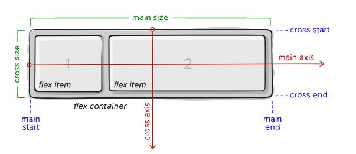
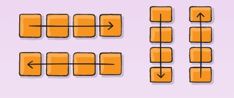
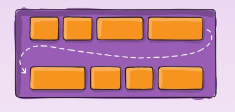
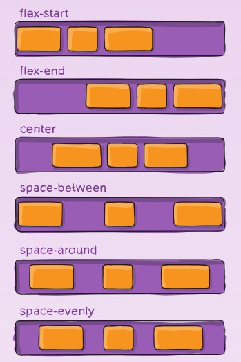
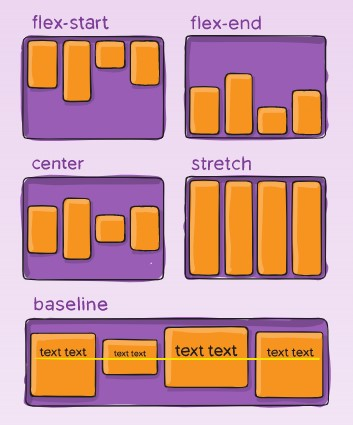
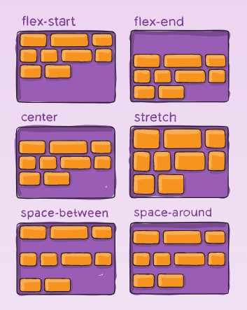
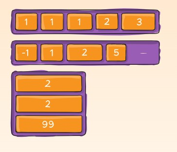
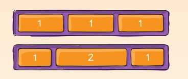

- [FLEXBOX](#flexbox)
  - [BACKGROUND](#background)
  - [BASICS AND TERMINOLOGY](#basics-and-terminology)
  - [FLEXBOX PROPERTIES](#flexbox-properties)
    - [PROPERTIES FOR THE PARENT (FLEX CONTAINER)](#properties-for-the-parent-flex-container)
      - [DISPLAY](#display)
      - [FLEX-DIRECTION](#flex-direction)
      - [FLEX-WRAP](#flex-wrap)
      - [FLEX-FLOW (HP)](#flex-flow-hp)
      - [JUSTIFY-CONTENT](#justify-content)
      - [ALIGN-ITEMS](#align-items)
      - [ALIGN-CONTENT](#align-content)
    - [PROPERTIES FOR THE CHILDREN (FLEX ITEMS)](#properties-for-the-children-flex-items)
      - [ORDER](#order)
      - [FLEX-GROW](#flex-grow)
      - [FLEX-SHRINK](#flex-shrink)
      - [FLEX-BASIS](#flex-basis)
      - [FLEX (HP)](#flex-hp)
      - [ALIGN-SELF](#align-self)
  - [Examples](#examples)
  - [Flexbox Tricks - Articles](#flexbox-tricks---articles)
  - [More Information](#more-information)
 
# FLEXBOX

Source : https://css-tricks.com/snippets/css/a-guide-to-flexbox

This complete guide explains everything about flexbox, focusing on all the different possible properties for the parent element (the flex container) and the child elements (the flex items). It also includes history, demos, patterns, and a browser support chart.

hp -> helper property

## BACKGROUND

The Flexbox Layout (Flexible Box) module (a W3C Candidate Recommendation as of October 2017) aims at providing a more efficient way to lay out, align and distribute space among items in a container, even when their size is unknown and/or dynamic (thus the word “flex”).

The main idea behind the flex layout is to give the container the ability to alter its items’ width/height (and order) to best fill the available space (mostly to accommodate to all kind of display devices and screen sizes). A flex container expands items to fill available free space or shrinks them to prevent overflow.

Most importantly, the flexbox layout is direction-agnostic as opposed to the regular layouts (block which is vertically-based and inline which is horizontally-based). While those work well for pages, they lack flexibility (no pun intended) to support large or complex applications (especially when it comes to orientation changing, resizing, stretching, shrinking, etc.).

Note: Flexbox layout is most appropriate to the components of an application, and *small-scale layouts*, while the Grid layout is intended for *larger scale layouts*.

## BASICS AND TERMINOLOGY

Since flexbox is a whole module and not a single property, it involves a lot of things including its whole set of properties. Some of them are meant to be set on the container (parent element, known as “flex container”) whereas the others are meant to be set on the children (said “flex items”).

If “regular” layout is based on both block and inline flow directions, the flex layout is based on “flex-flow directions”. Please have a look at this figure from the specification, explaining the main idea behind the flex layout.



main axis – The main axis of a flex container is the primary axis along which flex items are laid out. Beware, it is not necessarily horizontal; it depends on the flex-direction property (see below).

(tr:ana kesen ve karşıt eksen diyebiliriz:)

- main-start | main-end – The flex items are placed within the container starting from main-start and going to main-end.

- main size – A flex item’s width or height, whichever is in the main dimension, is the item’s main size. The flex item’s main size property is either the ‘width’ or ‘height’ property, whichever is in the main dimension.

- cross axis – The axis perpendicular to the main axis is called the cross axis. Its direction depends on the main axis direction.

- cross-start | cross-end – Flex lines are filled with items and placed into the container starting on the cross-start side of the flex container and going toward the cross-end side.

- cross size – The width or height of a flex item, whichever is in the cross dimension, is the item’s cross size. The cross size property is whichever of ‘width’ or ‘height’ that is in the cross dimension.

## FLEXBOX PROPERTIES

### PROPERTIES FOR THE PARENT (FLEX CONTAINER)

#### DISPLAY
  
This defines a flex container; inline or block depending on the given value. It enables a flex context for all its direct children.

```css
.container {
  display: flex; /* or inline-flex */
}
```

Note that CSS columns have no effect on a flex container. (??) 

---

#### FLEX-DIRECTION

This establishes the main-axis, thus defining the direction flex items are placed in the flex container. Flexbox is (aside from optional wrapping) a single-direction layout concept. Think of flex items as primarily laying out either in horizontal rows or vertical columns.



(tr:ana ekseni tanımlar, satır olunca yatay, sütun olunca dikey. Tek yönlü yerleşim kavramı... Flex elemanlarını, tek sütun yatay satırlar veya tek satır dikey sütunlar olarak düşünün (nowrap).:)

```css
.container {
  flex-direction: row | row-reverse | column | column-reverse;
}
```

- row (default): left to right in ltr; right to left in rtl
- row-reverse: right to left in ltr; left to right in rtl
- column: same as row but top to bottom
- column-reverse: same as row-reverse but bottom to top

---

#### FLEX-WRAP



By default, flex items will all try to fit onto one line. You can change that and allow the items to wrap as needed with this property.

```css
.container {
  flex-wrap: nowrap | wrap | wrap-reverse;
}
```

- nowrap (default): all flex items will be on one line
- wrap: flex items will wrap onto multiple lines, from top to bottom.
- wrap-reverse: flex items will wrap onto multiple lines from bottom to top.

There are some visual demos of flex-wrap here : 
https://css-tricks.com/almanac/properties/f/flex-wrap/

---

#### FLEX-FLOW (HP)

This is a shorthand for the flex-direction and flex-wrap properties, which together define the flex container’s main and cross axes. The default value is row nowrap.

```css
.container {
  flex-flow: column wrap;
}
```

---
#### JUSTIFY-CONTENT



This defines the alignment along the main axis. It helps distribute extra free space leftover when either all the flex items on a line are inflexible, or are flexible but have reached their maximum size. It also exerts some control over the alignment of items when they overflow the line. Justifying on main axis...

(tr:ana eksende nasıl yaslanacağını belirler. :)

```css
.container {
  justify-content: flex-start | flex-end | center | space-between | space-around | space-evenly | start | end | left | right ... + safe | unsafe;
}
```

- flex-start (default): items are packed toward the start of the flex-direction.
- flex-end: items are packed toward the end of the flex-direction.
- start: items are packed toward the start of the writing-mode direction.
- end: items are packed toward the end of the writing-mode direction.
- left: items are packed toward left edge of the container, unless that doesn’t make sense with the flex-direction, then it behaves like start.
- right: items are packed toward right edge of the container, unless that doesn’t make sense with the flex-direction, then it behaves like end.

- center: items are centered along the line

- space-between: items are evenly distributed in the line; first item is on the start line, last item on the end line

- space-around: items are evenly distributed in the line with equal space around them. Note that visually the spaces aren’t equal, since all the items have equal space on both sides. The first item will have one unit of space against the container edge, but two units of space between the next item because that next item has its own spacing that applies.

- space-evenly: items are distributed so that the spacing between any two items (and the space to the edges) is equal.

Note that that browser support for these values is nuanced. For example, space-between never got support from some versions of Edge, and start/end/left/right aren’t in Chrome yet. MDN has detailed charts. (https://developer.mozilla.org/en-US/docs/Web/CSS/justify-content) The safest values are flex-start, flex-end, and center.

(??) 
There are also two additional keywords you can pair with these values: safe and unsafe. Using safe ensures that however you do this type of positioning, you can’t push an element such that it renders off-screen (e.g. off the top) in such a way the content can’t be scrolled too (called “data loss”). 

#### ALIGN-ITEMS



This defines the default behavior for how flex items are laid out along **the cross axis** on the current line. Think of it as the justify-content version for the cross-axis (perpendicular to the main-axis). Aligning on the cross axis. 

(tr:cross axis - flex parçaları karşıt eksende hizalama :)

```css
.container {
  align-items: stretch | flex-start | flex-end | center | baseline | first baseline | last baseline | start | end | self-start | self-end + ... safe | unsafe;
}

```
**align-item values**

- stretch (default): stretch to fill the container (still respect min-width/max-width)
- flex-start / start / self-start: items are placed at the start of the cross axis. The difference between these is subtle, and is about respecting the flex-direction rules or the writing-mode rules.
- flex-end / end / self-end: items are placed at the end of the cross axis. The difference again is subtle and is about respecting - flex-direction rules vs. writing-mode rules.
- center: items are centered in the cross-axis
baseline: items are aligned such as their baselines align

The safe and unsafe modifier keywords can be used in conjunction with all the rest of these keywords (although note browser support), and deal with helping you prevent aligning elements such that the content becomes inaccessible.

---

#### ALIGN-CONTENT



This aligns a flex container’s lines within when there is extra space in the cross-axis, similar to how justify-content aligns individual items within the main-axis.

Note: This property only takes effect on multi-line flexible containers (!!!), where flex-flow is set to either *wrap* or *wrap-reverse*). A single-line flexible container (i.e. where flex-flow is set to its default value, no-wrap) will not reflect align-content !!!.

```css
.container {
  align-content: flex-start | flex-end | center | space-between | space-around | space-evenly | stretch | start | end | baseline | first baseline | last baseline + ... safe | unsafe;
}

```
- normal (default): items are packed in their default position as if no value was set.
- flex-start / start: items packed to the start of the container. The (more supported) flex-start honors the flex-direction while start honors the writing-mode direction.
- flex-end / end: items packed to the end of the container. The (more support) flex-end honors the flex-direction while end honors the writing-mode direction.
- center: items centered in the container
- space-between: items evenly distributed; the first line is at the start of the container while the last one is at the end
- space-around: items evenly distributed with equal space around each line
- space-evenly: items are evenly distributed with equal space around them
- stretch: lines stretch to take up the remaining space

The safe and unsafe modifier keywords can be used in conjunction with all the rest of these keywords (although note browser support), and deal with helping you prevent aligning elements such that the content becomes inaccessible.

### PROPERTIES FOR THE CHILDREN (FLEX ITEMS) 

#### ORDER



By default, flex items are laid out in the source order. However, the order property controls the order in which they appear in the flex container.

```css
.item {
  order: 5; /* default is 0 */
}
```

#### FLEX-GROW



This defines the ability for a flex item to grow if necessary. It accepts a unitless value that serves as a proportion. It dictates what amount of the available space inside the flex container the item should take up.

If all items have flex-grow set to 1, the remaining space in the container will be distributed equally to all children. If one of the children has a value of 2, the remaining space would take up twice as much space as the others (or it will try to, at least).

```css
.item {
  flex-grow: 4; /* default 0 */
}
```

Negative numbers are invalid.

#### FLEX-SHRINK

This defines the ability for a flex item to shrink if necessary.

```css
.item {
  flex-shrink: 3; /* default 1 */
}

```

Negative numbers are invalid.

---
#### FLEX-BASIS

This defines the default size of an element before the remaining space is distributed. It can be a length (e.g. 20%, 5rem, etc.) or a keyword. The auto keyword means “look at my width or height property” (which was temporarily done by the main-size keyword until deprecated). The content keyword means “size it based on the item’s content” – this keyword isn’t well supported yet, so it’s hard to test and harder to know what its brethren max-content, min-content, and fit-content do.

```css
.item {
  flex-basis:  | auto; /* default auto */
}
```

If set to 0, the extra space around content isn’t factored in. If set to auto, the extra space is distributed based on its flex-grow value. See this graphic.

---
#### FLEX (HP)

This is the shorthand for flex-grow, flex-shrink and flex-basis combined. The second and third parameters (flex-shrink and flex-basis) are optional. The default is 0 1 auto, but if you set it with a single number value, it’s like 1 0.

```css
.item {
  flex: none | [ <'flex-grow'> <'flex-shrink'>? || <'flex-basis'> ]
}

```

It is recommended that you use this shorthand property rather than set the individual properties. The shorthand sets the other values intelligently.

#### ALIGN-SELF

This allows the default alignment (or the one specified by align-items) to be overridden for individual flex items.

Please see the align-items explanation to understand the available values.

```css
.item {
  align-self: auto | flex-start | flex-end | center | baseline | stretch;
}

```

Note that float, clear and vertical-align have no effect on a flex item.

## Examples

Let’s start with a very very simple example, solving an almost daily problem: perfect centering. It couldn’t be any simpler if you use flexbox.

```css
.parent {
  display: flex;
  height: 300px; /* Or whatever */
}

.child {
  width: 100px;  /* Or whatever */
  height: 100px; /* Or whatever */
  margin: auto;  /* Magic! */
}
```

This relies on the fact a margin set to auto in a flex container absorb extra space. So setting a margin of auto will make the item perfectly centered in both axes.

**Ex-2**

Now let’s use some more properties. Consider a list of 6 items, all with fixed dimensions, but can be auto-sized. We want them to be evenly distributed on the horizontal axis so that when we resize the browser, everything scales nicely, and without media queries.

```css
.flex-container {
  /* We first create a flex layout context */
  display: flex;

  /* Then we define the flow direction 
     and if we allow the items to wrap 
   * Remember this is the same as:
   * flex-direction: row;
   * flex-wrap: wrap;
   */
  flex-flow: row wrap;

  /* Then we define how is distributed the remaining space */
  justify-content: space-around;
}
```

Done. Everything else is just some styling concern. Below is a pen featuring this example. Be sure to go to CodePen and try resizing your windows to see what happens.

**Ex 3**

Let’s try something else. Imagine we have a right-aligned navigation element on the very top of our website, but we want it to be centered on medium-sized screens and single-columned on small devices. Easy enough.

```css
/* Large */
.navigation {
  display: flex;
  flex-flow: row wrap;
  /* This aligns items to the end line on main-axis */
  justify-content: flex-end;
}

/* Medium screens */
@media all and (max-width: 800px) {
  .navigation {
    /* When on medium sized screens, we center it by evenly distributing empty space around items */
    justify-content: space-around;
  }
}

/* Small screens */
@media all and (max-width: 500px) {
  .navigation {
    /* On small screens, we are no longer using row direction but column */
    flex-direction: column;
  }
}
```

**Ex 4**

Let’s try something even better by playing with flex items flexibility! What about a mobile-first 3-columns layout with full-width header and footer. And independent from source order.

```css
.wrapper {
  display: flex;
  flex-flow: row wrap;
}

/* We tell all items to be 100% width, via flex-basis */
.wrapper > * {
  flex: 1 100%;
}

/* We rely on source order for mobile-first approach
 * in this case:
 * 1. header
 * 2. article
 * 3. aside 1
 * 4. aside 2
 * 5. footer
 */

/* Medium screens */
@media all and (min-width: 600px) {
  /* We tell both sidebars to share a row */
  .aside { flex: 1 auto; }
}

/* Large screens */
@media all and (min-width: 800px) {
  /* We invert order of first sidebar and main
   * And tell the main element to take twice as much width as the other two sidebars 
   */
  .main { flex: 2 0px; }
  .aside-1 { order: 1; }
  .main    { order: 2; }
  .aside-2 { order: 3; }
  .footer  { order: 4; }
}
```

## Flexbox Tricks - Articles

- Adaptive Photo Layout with Flexbox, Tim Van Damme, Article on Oct 3, 201


- Balancing on a Pivot with Flexbox, Julian Merkenich, 
Article on Oct 9, 2020


- Using Flexbox and text ellipsis together
Chris Coyier, Article on Jul 21, 2020

https://css-tricks.com/using-flexbox-and-text-ellipsis-together/

- Useful Flexbox Technique: Alignment Shifting Wrapping
Chris Coyier, Article on Feb 19, 2016

https://css-tricks.com/useful-flexbox-technique-alignment-shifting-wrapping/


- Designing A Product Page Layout with Flexbox, Levin Mejia,  Article on Feb 23, 2017

https://css-tricks.com/designing-a-product-page-layout-with-flexbox/

- Flexbox and Truncated Text, Chris Coyier, Article on Feb 8, 2017

https://css-tricks.com/flexbox-truncated-text/

- Flexbox and absolute positioning, Chris Coyier, Article on Mar 18, 2020

https://css-tricks.com/flexbox-and-absolute-positioning/

- Filling the Space in the Last Row with Flexbox
Chris Coyier, Article on Mar 10, 2014

https://css-tricks.com/filling-space-last-row-flexbox/


## More Information

Article on Sep 26, 2013
Solved by Flexbox
FLEXBOX LAYOUT
Chris Coyier

- Flexbox Cheat Sheet, Chris Coyier, Article on Nov 25, 2013

https://css-tricks.com/flexbox-cheat-sheet/


Article on Dec 23, 2012
Dive Into Flexbox
FLEXBOX LAYOUT

Chris Coyier
Article on Oct 23, 2018
Use Cases for Flexbox
FLEXBOX LAYOUT

Chris Coyier
Article on Feb 14, 2019
Quick! What’s the Difference Between Flexbox and Grid?
FLEXBOX LAYOUT

Chris Coyier
Article on Feb 23, 2022
Does CSS Grid Replace Flexbox?
FLEXBOX LAYOUT

Robin Rendle
Article on Jun 25, 2020
Grid for layout, flexbox for components
FLEXBOX LAYOUT

Robin Rendle
Article on Apr 13, 2016
Should I use Grid or Flexbox?
FLEXBOX LAYOUT

Robin Rendle
Article on Aug 13, 2016
Don’t Overthink It (Flexbox) Grids
FLEXBOX LAYOUT

Chris Coyier
Article on Nov 24, 2021
Building Multi-Directional Layouts
FLEXBOX LAYOUT

Ahmad El-Alfy
Article on Jan 6, 2020
How Auto Margins Work in Flexbox
FLEXBOX LAYOUT

Chris Coyier
Article on Apr 10, 2017
`flex-grow` is weird. Or is it?
FLEXBOX LAYOUT

Manuel Matuzovic
Article on Nov 12, 2020
Understanding flex-grow, flex-shrink, and flex-basis
FLEXBOX LAYOUT

Robin Rendle
Article on Feb 18, 2019
IE10-Compatible Grid Auto-Placement with Flexbox
FLEXBOX LAYOUT

Brian Holt
Article on Aug 13, 2013
“Old” Flexbox and “New” Flexbox
FLEXBOX LAYOUT

Chris Coyier
Article on Jun 15, 2013
Using Flexbox: Mixing Old and New for the Best Browser Support
FLEXBOX LAYOUT

Chris Coyier


