- [Colors](#colors)
  - [Color Names](#color-names)
  - [Background Color](#background-color)
  - [Text Color](#text-color)
  - [Border Color](#border-color)
  - [Color Values](#color-values)
    - [Color Names](#color-names-1)
    - [RGB Colors](#rgb-colors)
    - [RGBA Value](#rgba-value)
    - [Hex Colors](#hex-colors)
    - [HSL Colors (hue,saturation,lightness)](#hsl-colors-huesaturationlightness)
    - [HSLA Value](#hsla-value)
- [Backgrounds](#backgrounds)
  - [background-color](#background-color-1)
    - [Opacity / Transparency of an Element](#opacity--transparency-of-an-element)
  - [background-image](#background-image)
  - [background-repeat](#background-repeat)
  - [background-position](#background-position)
  - [background-attachment](#background-attachment)
  - [background property (sh)](#background-property-sh)
  - [All Background Properties](#all-background-properties)


# Colors

Source : https://www.w3schools.com/css/css_colors.asp

Colors are specified using <span style="color:red">predefined color names, or RGB, HEX, HSL, RGBA, HSLA values</span>.

## Color Names

In CSS, a color can be specified by using a predefined color name:

```
Tomato
Orange
DodgerBlue
MediumSeaGreen
Gray
SlateBlue
Violet
LightGray

```

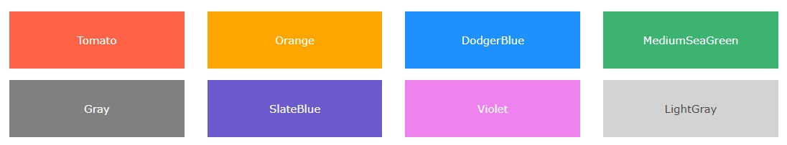


## Background Color

You can set the background color for HTML elements:

Example

```html
<h1 style="background-color:DodgerBlue;">Hello World</h1>
<p style="background-color:Tomato;">Lorem ipsum...</p>

```


## Text Color

You can set the color of *text*:

Example

```html
<h1 style="color:Tomato;">Hello World</h1>
<p style="color:DodgerBlue;">Lorem ipsum...</p>
<p style="color:MediumSeaGreen;">Ut wisi enim...</p>

```

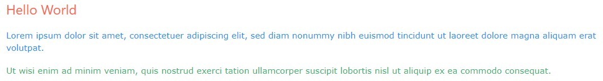

## Border Color

You can set the color of borders:

Example

```html
<h1 style="border:2px solid Tomato;">Hello World</h1>
<h1 style="border:2px solid DodgerBlue;">Hello World</h1>
<h1 style="border:2px solid Violet;">Hello World</h1>

```

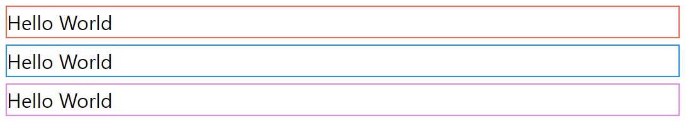

## Color Values

In CSS, colors can also be specified using RGB values, HEX values, HSL values, RGBA values, and HSLA values:

Same as color name "Tomato":

```css
rgb(255, 99, 71)
#ff6347
hsl(9, 100%, 64%)
```

Same as color name "Tomato", but 50% transparent:

```css
rgba(255, 99, 71, 0.5)
hsla(9, 100%, 64%, 0.5)
```

Example

```html
<p>Same as color name "Tomato":</p>
<h1 style="background-color:rgb(255, 99, 71);">...</h1>
<h1 style="background-color:#ff6347;">...</h1>
<h1 style="background-color:hsl(9, 100%, 64%);">...</h1>
<p>Same as color name "Tomato", but 50% transparent:</p>
<h1 style="background-color:rgba(255, 99, 71, 0.5);">...</h1>
<h1 style="background-color:hsla(9, 100%, 64%, 0.5);">...</h1>

```


### Color Names

In CSS, a color can be specified by using a predefined color name. For example : Tomato,Orange,DodgerBlue etc...

CSS/HTML support 140 standard color names : https://www.w3schools.com/colors/colors_names.asp

### RGB Colors

An RGB color value represents RED, GREEN, and BLUE light sources.

**RGB Value**

In CSS, a color can be specified as an RGB value, using this formula:

```css
rgb(red, green, blue)

```

Each parameter (red, green, and blue) defines the *intensity* of the color between 0 and 255.

For example, rgb(255, 0, 0) is displayed as red, because red is set to its highest value (255) and the others are set to 0.

To display black, set all color parameters to 0, like this: rgb(0, 0, 0).

To display white, set all color parameters to 255, like this: rgb(255, 255, 255).

You can experiment rgb from https://www.w3schools.com/css/css_colors_rgb.asp

Shades of gray are often defined using equal values for all the 3 light sources: 

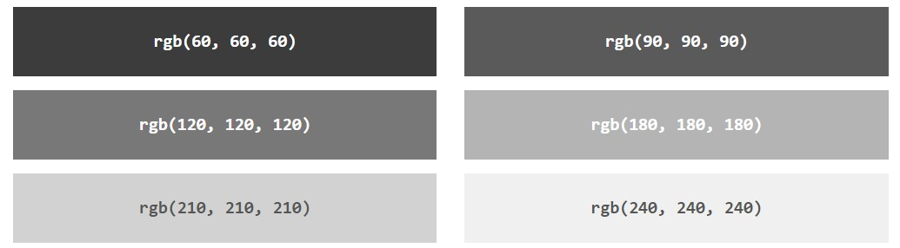

### RGBA Value

RGBA color values are an extension of RGB color values with an alpha channel - which specifies the opacity for a color.

An RGBA color value is specified with:

rgba(red, green, blue, alpha)

The *alpha* parameter is <span style="color:red">a number between 0.0 (fully transparent) and 1.0 (fully opaque)</span>:

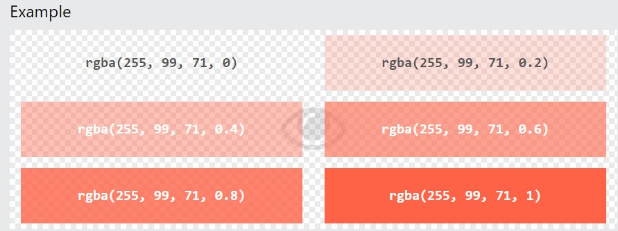

### Hex Colors

A hexadecimal color is specified with: #RRGGBB, where the RR (red), GG (green) and BB (blue) hexadecimal integers specify the components of the color.

*HEX Value*

In CSS, a color can be specified using a hexadecimal value in the form:

```css
#rrggbb

```

Where rr (red), gg (green) and bb (blue) are hexadecimal values between 00 and ff (same as decimal 0-255).

For example, #ff0000 is displayed as red, because red is set to its highest value (ff) and the others are set to the lowest value (00).

To display black, set all values to 00, like this: `#000000`.

To display white, set all values to ff, like this: `#ffffff`.  

Experiment by mixing the HEX values from https://www.w3schools.com/css/css_colors_hex.asp.

*Examples*

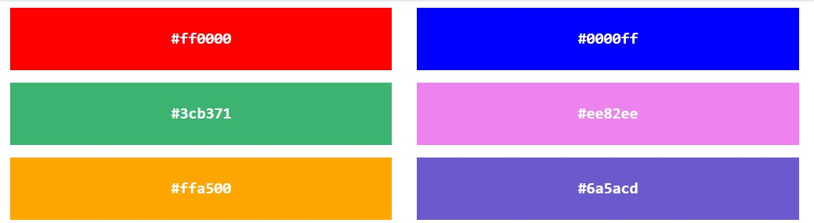

Shades of gray are often defined using equal values for all the 3 light sources:


**3 Digit HEX Value**

Sometimes you will see a 3-digit hex code in the CSS source.

The 3-digit hex code is a shorthand for some 6-digit hex codes.

The 3-digit hex code has the following form:

```css
#rgb

```

Where r, g, and b represents the red, green, and blue components with values between 0 and f.

The 3-digit hex code can only be used when both the values (RR, GG, and BB) are the same for each components. So, if we have `#ff00cc`, it can be written like this: `#f0c`.

Example

```css
body {
  background-color: #fc9; /* same as #ffcc99 */
}

h1 {
  color: #f0f; /* same as #ff00ff */
}

p {
  color: #b58; /* same as #bb5588 */
}
```

### HSL Colors (hue,saturation,lightness)

HSL stands for hue, saturation, and lightness.

*HSL Value*

In CSS, a color can be specified using hue, saturation, and lightness (HSL) in the form:

```css
hsl(hue, saturation, lightness)

```

Hue is a degree on the color wheel from 0 to 360. 0 is red, 120 is green, and 240 is blue.

Saturation is a percentage value. 0% means a shade of gray, and 100% is the full color.

Lightness is also a percentage. 0% is black, 50% is neither light or dark, 100% is white

Experiment by mixing the HSL values below:

HUE 0, SATURATION 100%, LIGHTNESS 50%

Example

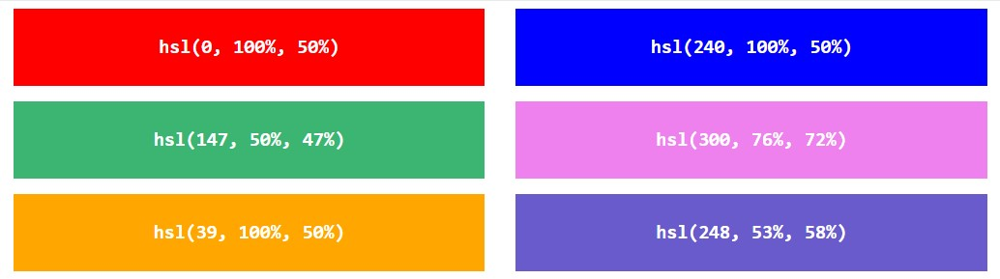


*Saturation*

Saturation can be described as the *intensity* of a color.

100% is pure color, no shades of gray.

50% is 50% gray, but you can still see the color.

0% is completely gray; you can no longer see the color.


*Lightness*

The lightness of a color can be described as how much light you want to give the color, where 0% means no light (black), 50% means 50% light (neither dark nor light) and 100% means full lightness (white).

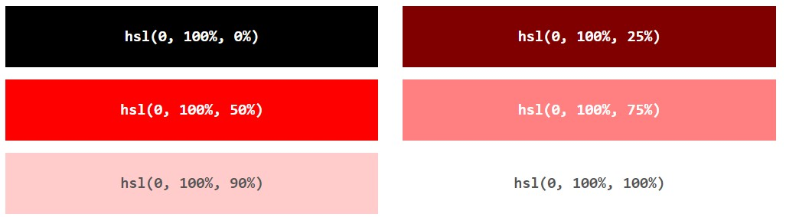


*Shades of Gray*

Shades of gray are often defined by setting the hue and saturation to 0, and adjust the lightness from 0% to 100% to get darker/lighter shades:

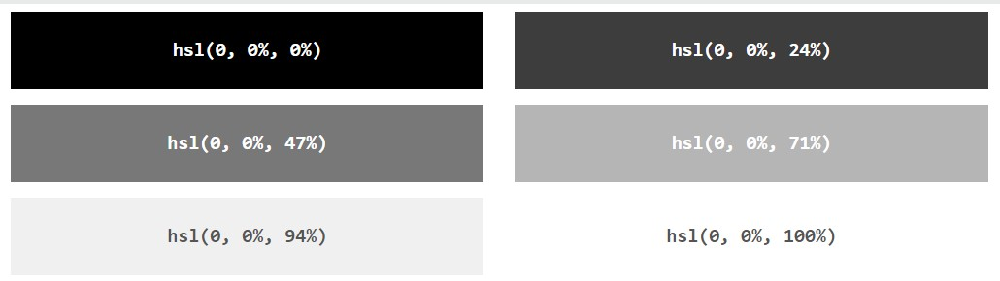

### HSLA Value

HSLA color values are an extension of HSL color values with an alpha channel - which specifies the opacity for a color.

An HSLA color value is specified with:

hsla(hue, saturation, lightness, alpha)

The alpha parameter is a number between 0.0 (fully transparent) and 1.0 (not transparent at all):

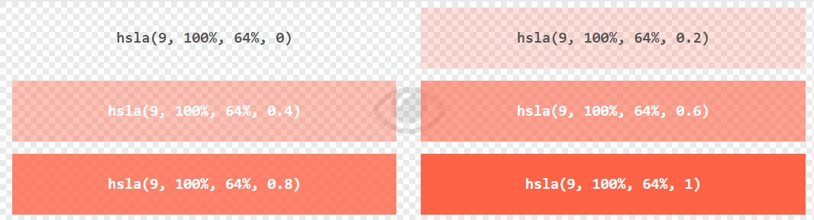

Experiment by mixing the HSLA values from https://www.w3schools.com/css/css_colors_hsl.asp


# Backgrounds

The CSS background properties are used to define the background effects for elements.

In these chapters, you will learn about the following CSS background properties:

- background-color
- background-image
- background-repeat
- background-attachment
- background-position

## background-color

The background-color property specifies the background color of an element.

Example

The background color of a page is set like this:

```css
body {
  background-color: lightblue;
}
```

Look at CSS Color Values for a complete list of possible color values : https://www.w3schools.com/cssref/css_colors_legal.asp

*Other Html Elements*

You can set the background color for any HTML elements:

Example

Here, the `<h1>`, `<p>`, and `<div>` elements will have different background colors: 

```css
h1 {
  background-color: green;
}

div {
  background-color: lightblue;
}

p {
  background-color: yellow;
}

```


### Opacity / Transparency of an Element

The opacity property specifies the opacity/transparency of an element. It can take a value from 0.0 - 1.0. The lower value, the more transparent:

(tor: Opaklık = şeffaf olmayan; şeffaflık = transparanlık )

Example

```css
div {
  background-color: green;
  opacity: 0.3;
}
```


🔨 Warning: When using the opacity property to add transparency to the background of an element, <span style="color:red">all of its child elements inherit the same transparency</span>. This can make the text inside a fully transparent element hard to read.

**Transparency using RGBA**

If you do not want to apply opacity to child elements, like in our example above, use RGBA color values. The following example sets the opacity for the background color and not the text:

You learned from our CSS Colors Chapter, that you can use RGB as a color value. In addition to RGB, you can use an RGB color value with an alpha channel (RGBA) - which specifies the opacity for a color.

An RGBA color value is specified with: rgba(red, green, blue, alpha). The alpha parameter is a number between 0.0 (fully transparent) and 1.0 (fully opaque).

*Example*

```css
div {
  background: rgba(0, 128, 0, 0.3) /* Green background with 30% opacity */
}

```

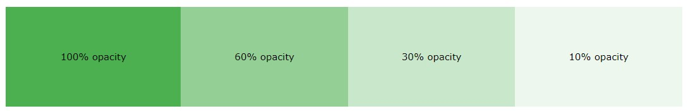

Example using Opacity with Div


## background-image

The background-image property specifies *an image* to use as the *background of an element*.

By default, the image is repeated so it covers the entire element.

*Example*

Set the background image for a page: 

```css
body {
  background-image: url("bgdesert.jpg");
}

```


(!!!) Note: When using a background image, use an image that does not disturb the text.

The background image can also be set for specific elements, like the `<p>` element:

*Example*

```css
p {
  background-image: url("paper.gif");
}

```

## background-repeat

 The background-image property repeats an image <span style="color:red">both horizontally and vertically by default</span>.

Syntax

 ```css
   background-repeat: [repeat-x|repeat-y|no-repeat];
 ```

Some images should be repeated only horizontally or vertically, or they will look strange, like this:

Example

```css
body {
  background-image: url("gradient_bg.png");
}

```


If the image above is repeated only horizontally, the background will look better:

Example

```css
body {
  background-image: url("gradient_bg.png");
  background-repeat: repeat-x;
}

```

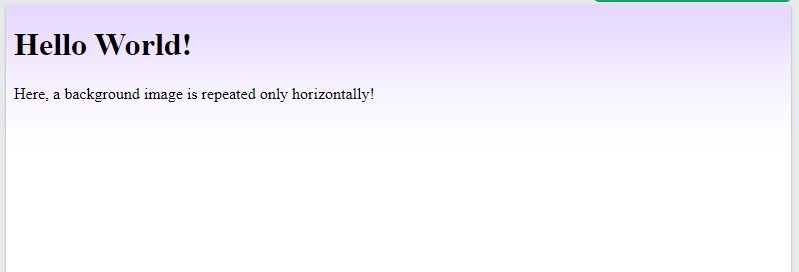

(!) Tip: To repeat an image vertically, set background-repeat: repeat-y;

*CSS background-repeat: no-repeat*

Showing the background image only once is also specified by the background-repeat property:

Example

```css
body {
  background-image: url("img_tree.png");
  background-repeat: no-repeat;
}

```


In the example above, the background image is placed in the same place as the text. We want to change the position of the image, so that it does not disturb the text too much.

## background-position

The background-position property is used to specify the position of <span style="color:red">the background image</span>.

*Example*

Position the background image in the top-right corner: 


```css
body {
  background-image: url("img_tree.png");
  background-repeat: no-repeat;
  background-position: right top;
  margin-right: 200px;
}

```

## background-attachment

The background-attachment property specifies whether the background image should *scroll* or be *fixed* (will not scroll with the rest of the page):

Example

Specify that the background image should be fixed:

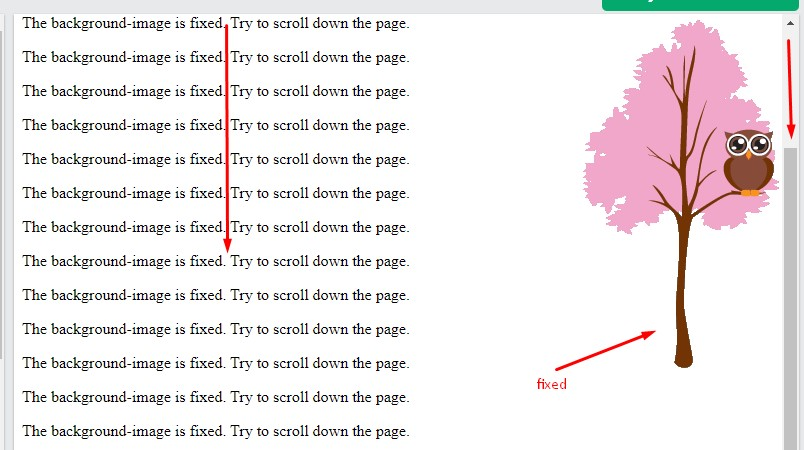

```css
body {
  background-image: url("img_tree.png");
  background-repeat: no-repeat;
  background-position: right top;
  background-attachment: fixed;
  margin-right: 200px;
}

```

*Example*

Specify that the background image should scroll with the rest of the page:


```css
body {
  background-image: url("img_tree.png");
  background-repeat: no-repeat;
  background-position: right top;
  background-attachment: scroll;
  margin-right: 200px;
}

```

## background property (sh)

To shorten the code, it is also possible to specify all the background properties in one single property. This is called a shorthand property.

Instead of writing:

```css
body {
  background-color: #ffffff;
  background-image: url("img_tree.png");
  background-repeat: no-repeat;
  background-position: right top;
}

```

You can use the shorthand property background:

```css
body {
  background: #ffffff url("img_tree.png") no-repeat right top;
}

```

When using the shorthand property the order of the property values is:

- background-color
- background-image
- background-repeat
- background-attachment
- background-position

It does not matter if one of the property values is missing, as long as the other ones are in this order.  (!!) Note that we do not use the background-attachment property in the examples above, as it does not have a value.


## All Background Properties

Property              | Description
----------------------|------------------------------------------------------------------------------
background (sh)       | Sets all the background properties in one declaration
background-attachment | Sets whether a background image is fixed or scrolls with the rest of the page
background-clip       | Specifies the painting area of the background
background-color      | Sets the background color of an element
background-image      | Sets the background image for an element
background-origin     | Specifies where the background image(s) is/are positioned
background-position   | Sets the starting position of a background image
background-repeat     | Sets how a background image will be repeated
background-size       | Specifies the size of the background image(s)

