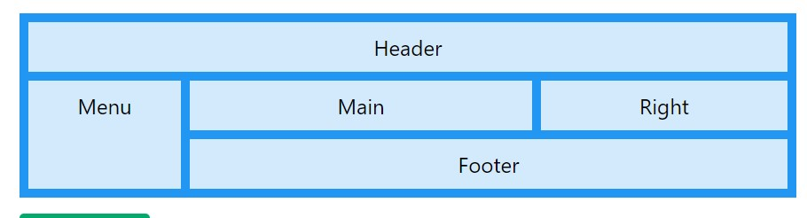
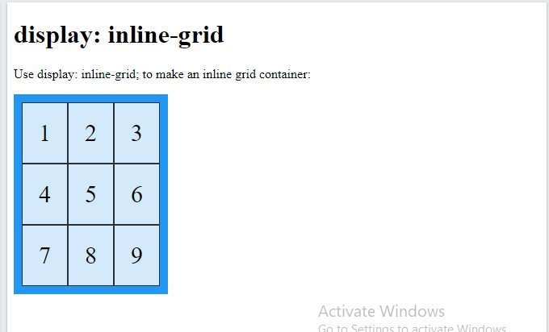
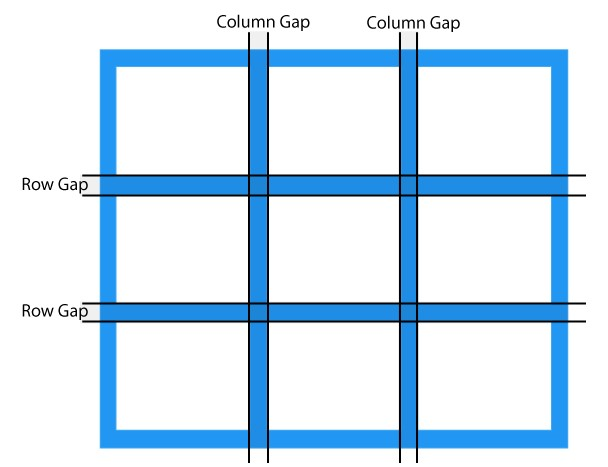
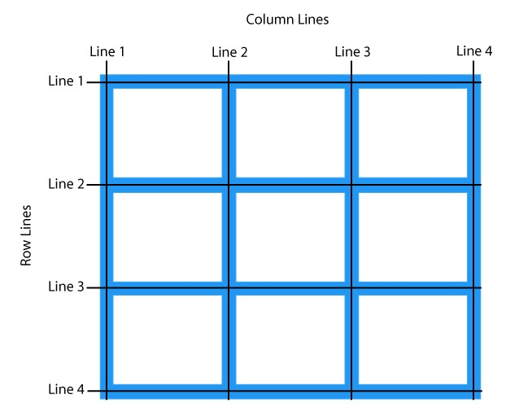
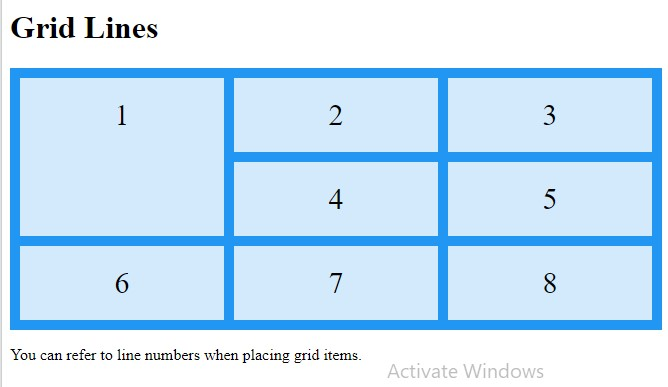
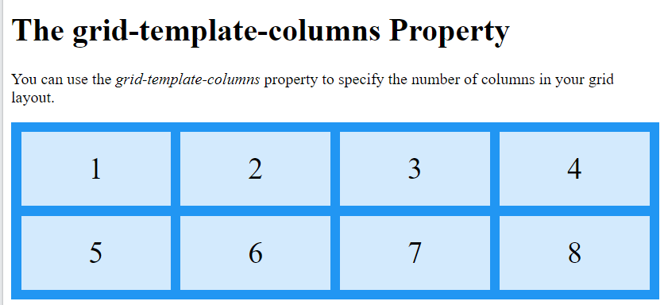
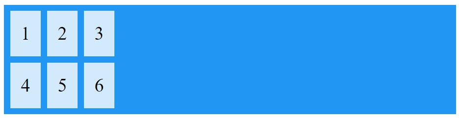

- [CSS Grid Layout Module](#css-grid-layout-module)
  - [Display Property](#display-property)
  - [Grid Lines (grid-column-start and end)](#grid-lines-grid-column-start-and-end)
  - [All CSS Grid Properties](#all-css-grid-properties)
- [Grid Container](#grid-container)
  - [The grid-template-columns Property](#the-grid-template-columns-property)
  - [The grid-template-rows Property](#the-grid-template-rows-property)
  - [The justify-content Property](#the-justify-content-property)
  - [The align-content Property](#the-align-content-property)


Source : https://www.w3schools.com/css/css_grid.asp

# CSS Grid Layout Module

*Example grid layout*



*Grid Layout*

The CSS Grid Layout Module offers a grid-based layout system, with rows and columns, making it easier to design web pages without having to use *floats* and *positioning*.

*Grid Elements*

A grid layout consists of a parent element, with one or more child elements.

Example

```html
<div class="grid-container">
  <div class="grid-item">1</div>
  <div class="grid-item">2</div>
  <div class="grid-item">3</div>
  <div class="grid-item">4</div>
  <div class="grid-item">5</div>
  <div class="grid-item">6</div>
  <div class="grid-item">7</div>
  <div class="grid-item">8</div>
  <div class="grid-item">9</div>
</div>

```


## Display Property

An HTML element becomes a grid container when its display property is set to grid or inline-grid.

- Use display: grid; to make a block-level grid container
- Use display: inline-grid; to make a inline grid container

*Syntax*

```css
display: [grid | inline-grid];

```

*Full example*

```html
<!DOCTYPE html>
<html>
<head>
<style>
.grid-container {
  display: grid;
  grid-template-columns: auto auto auto;
  background-color: #2196F3;
  padding: 10px;
}

.grid-item {
  background-color: rgba(255, 255, 255, 0.8);
  border: 1px solid rgba(0, 0, 0, 0.8);
  padding: 20px;
  font-size: 30px;
  text-align: center;
}
</style>
</head>
<body>

<div class="grid-container">
  <div class="grid-item">1</div><div class="grid-item">2</div>
  <div class="grid-item">3</div><div class="grid-item">4</div>
  <div class="grid-item">5</div><div class="grid-item">6</div>  
  <div class="grid-item">7</div><div class="grid-item">8</div>
  <div class="grid-item">9</div>  
</div>

</body>
</html>
```

*output*


*inline grid example*

```html
<style>
.grid-container {
  display: inline-grid;
  grid-template-columns: auto auto auto;
  background-color: #2196F3;
  padding: 10px;
}

.grid-item {
  background-color: rgba(255, 255, 255, 0.8);
  border: 1px solid rgba(0, 0, 0, 0.8);
  padding: 20px;
  font-size: 30px;
  text-align: center;
}
</style>
```



All *direct children * elements of the grid container automatically become grid items.

*Grid Columns*

The vertical lines of grid items are called columns.


*Grid Rows*

The horizontal lines of grid items are called rows.


*Grid Gaps*

The spaces between each column/row are called gaps.



You can adjust the gap size by using one of the following properties:

- column-gap
- row-gap
- gap

*Example*

The column-gap property sets the gap between the columns:

```css
.grid-container {
  display: grid;
  column-gap: 50px;
}

```


*Example*

The row-gap property sets the gap between the rows:

```css
.grid-container {
  display: grid;
  row-gap: 50px;
}

```


*Example*

The gap property is a *shorthand* property for the row-gap and the column-gap properties:

```css
.grid-container {
  display: grid;
  gap: 50px 100px;
}

```

*Example*

The gap property can also be used to set both the row gap and the column gap in one value:

```css
.grid-container {
  display: grid;
  gap: 50px;
}

```

## Grid Lines (grid-column-start and end)

The lines between columns are called column lines.

The lines between rows are called row lines.



Refer to line numbers when placing a grid item in a grid container:

*Example*

Place a grid item at column line 1, and let it end on column line 3 (span cells):

```css
.item1 {
  grid-column-start: 1;
  grid-column-end: 3;
}

```


```html
<!DOCTYPE html><head>
<style>
.grid-container {
  display: grid;
  grid-template-columns: auto auto auto;
  gap: 10px;
  background-color: #2196F3;
  padding: 10px;
}

.grid-container > div {
  background-color: rgba(255, 255, 255, 0.8);
  text-align: center;
  padding: 20px 0;
  font-size: 30px;
}

.item1 {
  grid-column-start: 1;
  grid-column-end: 3;
}
</style>
</head>
<body>
<h1>Grid Lines</h1>
<div class="grid-container">
  <div class="item1">1</div><div class="item2">2</div>
  <div class="item3">3</div><div class="item4">4</div>
  <div class="item5">5</div><div class="item6">6</div>
  <div class="item7">7</div><div class="item8">8</div>
</div>

<p>You can refer to line numbers when placing grid items.</p>

</body>
</html>
```

*Example*

Place a grid item at row line 1, and let it end on row line 3:

```css
.item1 {
  grid-row-start: 1;
  grid-row-end: 3;
}

```



## All CSS Grid Properties


Property              | Description
----------------------|----------------------------------------------------------------------------------------------------------------------------------------------------------------------------
column-gap            | Specifies the gap between the columns
gap                   | A shorthand property for the row-gap and the column-gap properties
grid                  | A shorthand property for the grid-template-rows, grid-template-columns, grid-template-areas, grid-auto-rows, grid-auto-columns, and the grid-auto-flow properties
grid-area             | Either specifies a name for the grid item, or this property is a shorthand property for the grid-row-start, grid-column-start, grid-row-end, and grid-column-end properties
grid-auto-columns     | Specifies a default column size
grid-auto-flow        | Specifies how auto-placed items are inserted in the grid
grid-auto-rows        | Specifies a default row size
grid-column           | A shorthand property for the grid-column-start and the grid-column-end properties
grid-column-end       | Specifies where to end the grid item
grid-column-gap       | Specifies the size of the gap between columns
grid-column-start     | Specifies where to start the grid item
grid-gap              | A shorthand property for the grid-row-gap and grid-column-gap properties
grid-row              | A shorthand property for the grid-row-start and the grid-row-end properties
grid-row-end          | Specifies where to end the grid item
grid-row-gap          | Specifies the size of the gap between rows
grid-row-start        | Specifies where to start the grid item
grid-template         | A shorthand property for the grid-template-rows, grid-template-columns and grid-areas properties
grid-template-areas   | Specifies how to display columns and rows, using named grid items
grid-template-columns | Specifies the size of the columns, and how many columns in a grid layout
grid-template-rows    | Specifies the size of the rows in a grid layout
row-gap               | Specifies the gap between the grid rows

# Grid Container

To make an HTML element behave as a grid container, you have to set the display property to grid or inline-grid.

Grid containers consist of grid items, placed inside columns and rows.

## The grid-template-columns Property

The grid-template-columns property defines *the number of columns* in your grid layout, and it can define *the width of each column*.

The value is a *space-separated-list*, where each value defines the width of the respective column.

If you want your grid layout to contain 4 columns, specify the width of the 4 columns, or "auto" if all columns should have the same width.

Example : Make a grid with 4 columns

```css
.grid-container {
  display: grid;
  grid-template-columns: auto auto auto auto;
}

```
*Output*



✏ Note: If you have more than 4 items in a 4 columns grid, the grid will automatically add a new row to put the items in.

The grid-template-columns property can also be used to specify the size (width) of the columns.

Example : Set a size for the 4 columns

```css
.grid-container {
  display: grid;
  grid-template-columns: 80px 200px auto 40px;
}

```

*Output*


## The grid-template-rows Property

The grid-template-rows property defines the height of each row.

The value is a space-separated-list, where each value defines the height of the respective row:

Example

```css
.grid-container {
  display: grid;
  grid-template-rows: 80px 200px;
}

```

*Output*


## The justify-content Property

The justify-content property is used to align the whole grid inside the container.

✏ Note: The grid's total width has to be less than the container's width for the justify-content property to have any effect.

*Syntax*

```css
justify-content: [space-evenly|space-around|space-between|center|start|end]

```

- The value "space-evenly" will give the columns equal amount of space between, and around them.


- The value "space-around" will give the columns equal amount of space around them:


- The value "space-between" will give the columns equal amount of space between them:


- The value "center" will align the grid in the middle of the container:




## The align-content Property

The align-content property is used to vertically align the whole grid inside the container.

✏ Note: The grid's total height has to be less than the container's height for the align-content property to have any effect.

*Syntax*

```css
align-content: [center|space-evenly|space-around|space-between|start|end]
```

