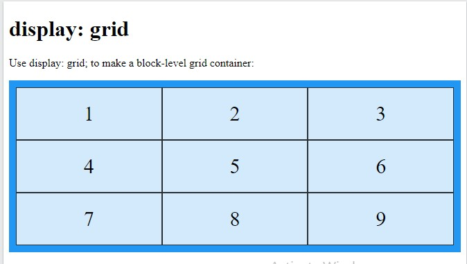
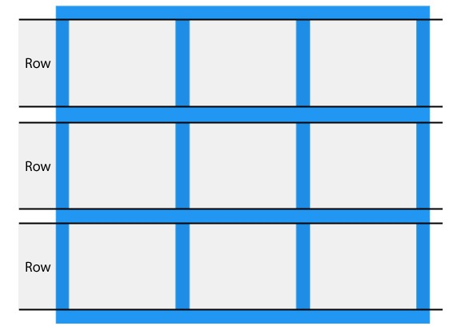
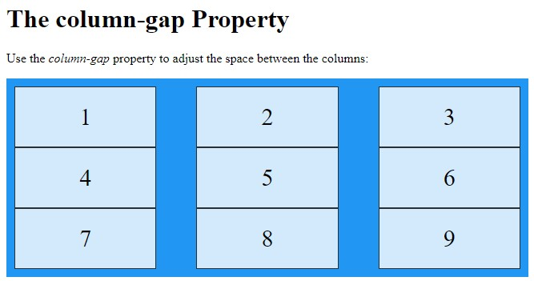

- [CSS Grid Layout Module](#css-grid-layout-module)
- [All CSS Grid Properties](#all-css-grid-properties)


Source : https://www.w3schools.com/css/css_grid.asp

# CSS Grid Layout Module

*Example grid layout*


*Grid Layout*

The CSS Grid Layout Module offers a grid-based layout system, with rows and columns, making it easier to design web pages without having to use *floats* and *positioning*.

*Grid Elements*

A grid layout consists of a parent element, with one or more child elements.

Example

```html
<div class="grid-container">
  <div class="grid-item">1</div>
  <div class="grid-item">2</div>
  <div class="grid-item">3</div>
  <div class="grid-item">4</div>
  <div class="grid-item">5</div>
  <div class="grid-item">6</div>
  <div class="grid-item">7</div>
  <div class="grid-item">8</div>
  <div class="grid-item">9</div>
</div>

```


*Display Property*

An HTML element becomes a grid container when its display property is set to grid or inline-grid.

Example

```css
.grid-container {
  display: grid;
}

```

Example

```css
.grid-container {
  display: inline-grid;
}

```

full example

```html
<!DOCTYPE html>
<html>
<head>
<style>
.grid-container {
  display: grid;
  grid-template-columns: auto auto auto;
  background-color: #2196F3;
  padding: 10px;
}

.grid-item {
  background-color: rgba(255, 255, 255, 0.8);
  border: 1px solid rgba(0, 0, 0, 0.8);
  padding: 20px;
  font-size: 30px;
  text-align: center;
}
</style>
</head>
<body>

<h1>display: grid</h1>

<p>Use display: grid; to make a block-level grid container:</p>

<div class="grid-container">
  <div class="grid-item">1</div>
  <div class="grid-item">2</div>
  <div class="grid-item">3</div>  
  <div class="grid-item">4</div>
  <div class="grid-item">5</div>
  <div class="grid-item">6</div>  
  <div class="grid-item">7</div>
  <div class="grid-item">8</div>
  <div class="grid-item">9</div>  
</div>

</body>
</html>
```

*output*



*inline grid example*

```html
<style>
.grid-container {
  display: inline-grid;
  grid-template-columns: auto auto auto;
  background-color: #2196F3;
  padding: 10px;
}

.grid-item {
  background-color: rgba(255, 255, 255, 0.8);
  border: 1px solid rgba(0, 0, 0, 0.8);
  padding: 20px;
  font-size: 30px;
  text-align: center;
}
</style>
```


All direct children of the grid container automatically become grid items.

*Grid Columns*

The vertical lines of grid items are called columns.


*Grid Rows*

The horizontal lines of grid items are called rows.



*Grid Gaps*

The spaces between each column/row are called gaps.


You can adjust the gap size by using one of the following properties:

- column-gap
- row-gap
- gap

Example

The column-gap property sets the gap between the columns:

```css
.grid-container {
  display: grid;
  column-gap: 50px;
}

```



*Example*

The row-gap property sets the gap between the rows:

```css
.grid-container {
  display: grid;
  row-gap: 50px;
}

```


*Example*

The gap property is a *shorthand* property for the row-gap and the column-gap properties:

```css
.grid-container {
  display: grid;
  gap: 50px 100px;
}

```

*Example*

The gap property can also be used to set both the row gap and the column gap in one value:

```css
.grid-container {
  display: grid;
  gap: 50px;
}

```

*Grid Lines*

The lines between columns are called column lines.

The lines between rows are called row lines.


Refer to line numbers when placing a grid item in a grid container:

Example

Place a grid item at column line 1, and let it end on column line 3:

```css
.item1 {
  grid-column-start: 1;
  grid-column-end: 3;
}

```


```html
<!DOCTYPE html>
<html>
<head>
<style>
.grid-container {
  display: grid;
  grid-template-columns: auto auto auto;
  gap: 10px;
  background-color: #2196F3;
  padding: 10px;
}

.grid-container > div {
  background-color: rgba(255, 255, 255, 0.8);
  text-align: center;
  padding: 20px 0;
  font-size: 30px;
}

.item1 {
  grid-column-start: 1;
  grid-column-end: 3;
}
</style>
</head>
<body>

<h1>Grid Lines</h1>

<div class="grid-container">
  <div class="item1">1</div>
  <div class="item2">2</div>
  <div class="item3">3</div>  
  <div class="item4">4</div>
  <div class="item5">5</div>
  <div class="item6">6</div>
  <div class="item7">7</div>
  <div class="item8">8</div>  
</div>

<p>You can refer to line numbers when placing grid items.</p>

</body>
</html>
```

*Example*

Place a grid item at row line 1, and let it end on row line 3:

```css
.item1 {
  grid-row-start: 1;
  grid-row-end: 3;
}

```


# All CSS Grid Properties


Property              | Description
----------------------|----------------------------------------------------------------------------------------------------------------------------------------------------------------------------
column-gap            | Specifies the gap between the columns
gap                   | A shorthand property for the row-gap and the column-gap properties
grid                  | A shorthand property for the grid-template-rows, grid-template-columns, grid-template-areas, grid-auto-rows, grid-auto-columns, and the grid-auto-flow properties
grid-area             | Either specifies a name for the grid item, or this property is a shorthand property for the grid-row-start, grid-column-start, grid-row-end, and grid-column-end properties
grid-auto-columns     | Specifies a default column size
grid-auto-flow        | Specifies how auto-placed items are inserted in the grid
grid-auto-rows        | Specifies a default row size
grid-column           | A shorthand property for the grid-column-start and the grid-column-end properties
grid-column-end       | Specifies where to end the grid item
grid-column-gap       | Specifies the size of the gap between columns
grid-column-start     | Specifies where to start the grid item
grid-gap              | A shorthand property for the grid-row-gap and grid-column-gap properties
grid-row              | A shorthand property for the grid-row-start and the grid-row-end properties
grid-row-end          | Specifies where to end the grid item
grid-row-gap          | Specifies the size of the gap between rows
grid-row-start        | Specifies where to start the grid item
grid-template         | A shorthand property for the grid-template-rows, grid-template-columns and grid-areas properties
grid-template-areas   | Specifies how to display columns and rows, using named grid items
grid-template-columns | Specifies the size of the columns, and how many columns in a grid layout
grid-template-rows    | Specifies the size of the rows in a grid layout
row-gap               | Specifies the gap between the grid rows