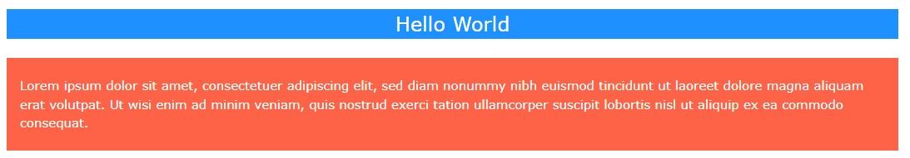
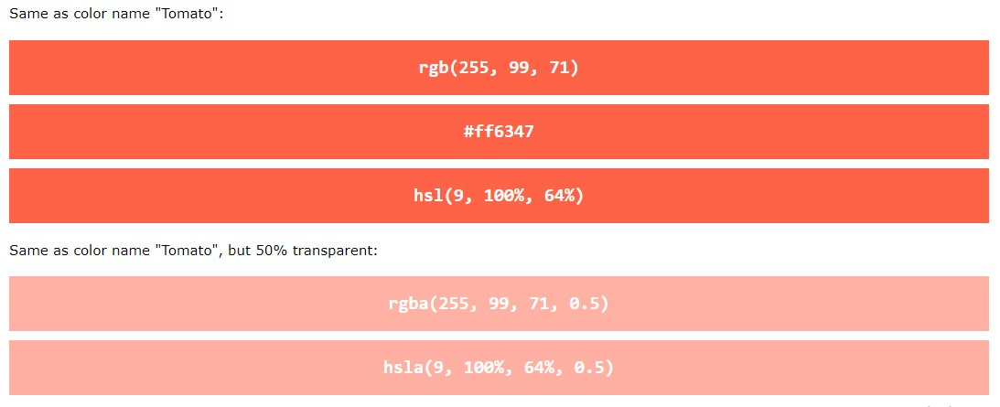
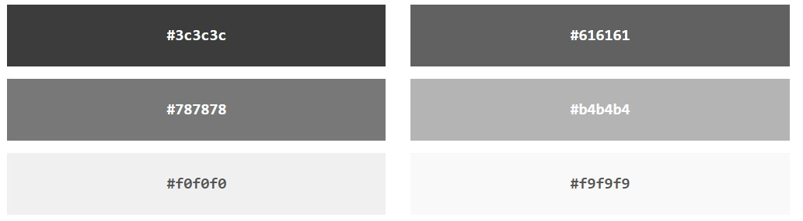
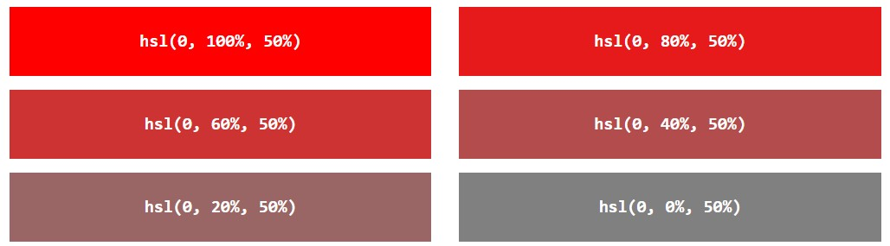

- [Colors](#colors)
  - [Color Names](#color-names)
  - [Background Color](#background-color)
  - [Text Color](#text-color)
  - [Border Color](#border-color)
  - [Color Values](#color-values)
    - [Color Names](#color-names-1)
    - [RGB Colors](#rgb-colors)
    - [RGBA Value](#rgba-value)
    - [Hex Colors](#hex-colors)
    - [HSL Colors](#hsl-colors)
    - [HSLA Value](#hsla-value)


# Colors

Source : https://www.w3schools.com/css/css_colors.asp

Colors are specified using <span style="color:red">predefined color names, or RGB, HEX, HSL, RGBA, HSLA values</span>.

## Color Names

In CSS, a color can be specified by using a predefined color name:

```
Tomato
Orange
DodgerBlue
MediumSeaGreen
Gray
SlateBlue
Violet
LightGray

```


## Background Color

You can set the background color for HTML elements:

Example

```html
<h1 style="background-color:DodgerBlue;">Hello World</h1>
<p style="background-color:Tomato;">Lorem ipsum...</p>

```




## Text Color

You can set the color of *text*:

Example

```html
<h1 style="color:Tomato;">Hello World</h1>
<p style="color:DodgerBlue;">Lorem ipsum...</p>
<p style="color:MediumSeaGreen;">Ut wisi enim...</p>

```


## Border Color

You can set the color of borders:

Example

```html
<h1 style="border:2px solid Tomato;">Hello World</h1>
<h1 style="border:2px solid DodgerBlue;">Hello World</h1>
<h1 style="border:2px solid Violet;">Hello World</h1>

```


## Color Values

In CSS, colors can also be specified using RGB values, HEX values, HSL values, RGBA values, and HSLA values:

Same as color name "Tomato":

```css
rgb(255, 99, 71)
#ff6347
hsl(9, 100%, 64%)
```

Same as color name "Tomato", but 50% transparent:

```css
rgba(255, 99, 71, 0.5)
hsla(9, 100%, 64%, 0.5)
```

Example

```html
<p>Same as color name "Tomato":</p>
<h1 style="background-color:rgb(255, 99, 71);">...</h1>
<h1 style="background-color:#ff6347;">...</h1>
<h1 style="background-color:hsl(9, 100%, 64%);">...</h1>
<p>Same as color name "Tomato", but 50% transparent:</p>
<h1 style="background-color:rgba(255, 99, 71, 0.5);">...</h1>
<h1 style="background-color:hsla(9, 100%, 64%, 0.5);">...</h1>

```



### Color Names

In CSS, a color can be specified by using a predefined color name. For example : Tomato,Orange,DodgerBlue etc...

CSS/HTML support 140 standard color names : https://www.w3schools.com/colors/colors_names.asp

### RGB Colors

An RGB color value represents RED, GREEN, and BLUE light sources.

**RGB Value**

In CSS, a color can be specified as an RGB value, using this formula:

```css
rgb(red, green, blue)

```

Each parameter (red, green, and blue) defines the *intensity* of the color between 0 and 255.

For example, rgb(255, 0, 0) is displayed as red, because red is set to its highest value (255) and the others are set to 0.

To display black, set all color parameters to 0, like this: rgb(0, 0, 0).

To display white, set all color parameters to 255, like this: rgb(255, 255, 255).

You can experiment rgb from https://www.w3schools.com/css/css_colors_rgb.asp

Shades of gray are often defined using equal values for all the 3 light sources: 


### RGBA Value

RGBA color values are an extension of RGB color values with an alpha channel - which specifies the opacity for a color.

An RGBA color value is specified with:

rgba(red, green, blue, alpha)

The *alpha* parameter is <span style="color:red">a number between 0.0 (fully transparent) and 1.0 (fully opaque)</span>:


### Hex Colors

A hexadecimal color is specified with: #RRGGBB, where the RR (red), GG (green) and BB (blue) hexadecimal integers specify the components of the color.

*HEX Value*

In CSS, a color can be specified using a hexadecimal value in the form:

```css
#rrggbb

```

Where rr (red), gg (green) and bb (blue) are hexadecimal values between 00 and ff (same as decimal 0-255).

For example, #ff0000 is displayed as red, because red is set to its highest value (ff) and the others are set to the lowest value (00).

To display black, set all values to 00, like this: `#000000`.

To display white, set all values to ff, like this: `#ffffff`.  

Experiment by mixing the HEX values from https://www.w3schools.com/css/css_colors_hex.asp.

*Examples*


Shades of gray are often defined using equal values for all the 3 light sources:




**3 Digit HEX Value**

Sometimes you will see a 3-digit hex code in the CSS source.

The 3-digit hex code is a shorthand for some 6-digit hex codes.

The 3-digit hex code has the following form:

```css
#rgb

```

Where r, g, and b represents the red, green, and blue components with values between 0 and f.

The 3-digit hex code can only be used when both the values (RR, GG, and BB) are the same for each components. So, if we have `#ff00cc`, it can be written like this: `#f0c`.

Example

```css
body {
  background-color: #fc9; /* same as #ffcc99 */
}

h1 {
  color: #f0f; /* same as #ff00ff */
}

p {
  color: #b58; /* same as #bb5588 */
}
```

### HSL Colors

HSL stands for hue, saturation, and lightness.

*HSL Value*

In CSS, a color can be specified using hue, saturation, and lightness (HSL) in the form:

```css
hsl(hue, saturation, lightness)

```

Hue is a degree on the color wheel from 0 to 360. 0 is red, 120 is green, and 240 is blue.

Saturation is a percentage value. 0% means a shade of gray, and 100% is the full color.

Lightness is also a percentage. 0% is black, 50% is neither light or dark, 100% is white

Experiment by mixing the HSL values below:

HUE 0, SATURATION 100%, LIGHTNESS 50%

Example


*Saturation*

Saturation can be described as the *intensity* of a color.

100% is pure color, no shades of gray.

50% is 50% gray, but you can still see the color.

0% is completely gray; you can no longer see the color.




*Lightness*

The lightness of a color can be described as how much light you want to give the color, where 0% means no light (black), 50% means 50% light (neither dark nor light) and 100% means full lightness (white).


*Shades of Gray*

Shades of gray are often defined by setting the hue and saturation to 0, and adjust the lightness from 0% to 100% to get darker/lighter shades:


### HSLA Value

HSLA color values are an extension of HSL color values with an alpha channel - which specifies the opacity for a color.

An HSLA color value is specified with:

hsla(hue, saturation, lightness, alpha)

The alpha parameter is a number between 0.0 (fully transparent) and 1.0 (not transparent at all):


Experiment by mixing the HSLA values from https://www.w3schools.com/css/css_colors_hsl.asp


