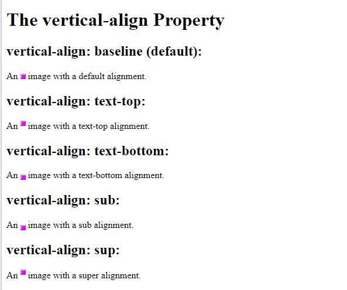
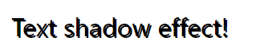
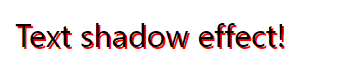
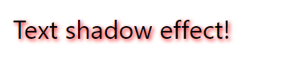
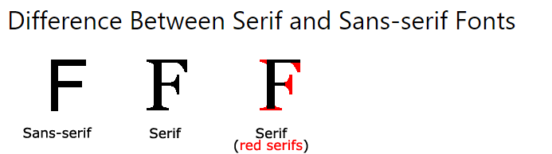
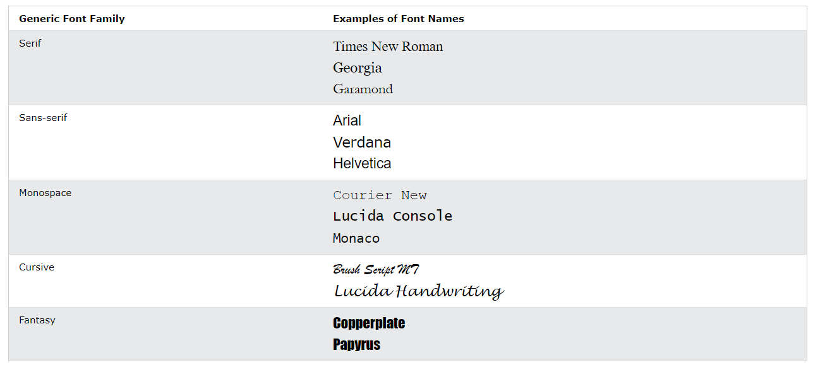
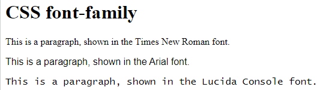

- [Text](#text)
  - [Text Color](#text-color)
  - [Text Alignment](#text-alignment)
  - [Text Direction](#text-direction)
  - [Vertical Alignment](#vertical-alignment)
  - [Text Transformation (case transformation)](#text-transformation-case-transformation)
  - [Text Indentation](#text-indentation)
  - [Letter Spacing](#letter-spacing)
  - [Line Height](#line-height)
  - [Word Spacing](#word-spacing)
  - [White Space](#white-space)
  - [Text Shadow](#text-shadow)
  - [All CSS Text Properties](#all-css-text-properties)
- [Fonts](#fonts)
  - [Fonts](#fonts-1)
  - [Generic Font Families](#generic-font-families)
  - [Difference Between Serif and Sans-serif Fonts](#difference-between-serif-and-sans-serif-fonts)
  - [Generic Font Family	Examples of Font Names](#generic-font-familyexamples-of-font-names)
  - [The CSS font-family Property](#the-css-font-family-property)
  - [CSS Web Safe Fonts](#css-web-safe-fonts)
  - [Fallback Fonts](#fallback-fonts)
  - [Best Web Safe Fonts for HTML and CSS](#best-web-safe-fonts-for-html-and-css)
    - [Arial (sans-serif)](#arial-sans-serif)
    - [Verdana (sans-serif)](#verdana-sans-serif)
    - [Helvetica (sans-serif)](#helvetica-sans-serif)
    - [Tahoma (sans-serif)](#tahoma-sans-serif)
    - [Trebuchet MS (sans-serif)](#trebuchet-ms-sans-serif)
    - [Times New Roman (serif)](#times-new-roman-serif)
    - [Georgia (serif)](#georgia-serif)
    - [Garamond (serif)](#garamond-serif)
    - [Courier New (monospace)](#courier-new-monospace)
    - [Brush Script MT (cursive)](#brush-script-mt-cursive)
  - [Font Fallbacks](#font-fallbacks)
  - [Font Style](#font-style)
  - [Font Size](#font-size)
  - [Google Fonts](#google-fonts)
    - [Use Multiple Google Fonts](#use-multiple-google-fonts)
    - [Styling Google Fonts](#styling-google-fonts)
  - [Great Font Pairings](#great-font-pairings)
    - [Font Pairing Rules](#font-pairing-rules)
  - [Font Property](#font-property)
  - [All CSS Font Properties](#all-css-font-properties)
- [Icons](#icons)
  - [Css Icons](#css-icons)
  - [Font Awesome 5 (draft)](#font-awesome-5-draft)
  - [Google Icons](#google-icons)


# Text

Source : 

## Text Color

The *color* property is used to set the color of the text.

The default text color for a page is defined in the body selector.

Example

```css
body {
  color: blue;
}

h1 {
  color: green;
}

```

✏ Note: For W3C compliant CSS: If you define the color property, you must also define the background-color. 

(tor:color özelliğine değer verilirse, taban rengi de tanımlanmalı. Okunmyacak bir taban renginde olmaması amacıyladır.)

*Example 2*

In this example, we define both the background-color property and the color property:

```css
body {
  background-color: lightgrey;
  color: blue;
}

h1 {
  background-color: black;
  color: white;
}

```

## Text Alignment

The *text-align* property is used to set the <span style="color:red">horizontal alignment of a text</span>.

A text can be left or right aligned, centered, or justified.

Syntax

```css
text-align : [center|left|right|justified]
```

The following example shows center aligned, and left and right aligned text (left alignment is default if text direction is left-to-right, and right alignment is default if text direction is right-to-left):

Example

```css
h1 {
  text-align: center;
}

```

When the text-align property is set to "justify", each line is stretched so that every line has equal width, and the left and right margins are straight (like in magazines and newspapers):

Example

```css
div {
  text-align: justify;
}

```

## Text Direction

The direction and unicode-bidi(???) properties can be used to change the text direction of an element:

Example

```css
p {
  direction: rtl;
  unicode-bidi: bidi-override;
}

```

## Vertical Alignment

The vertical-align property sets the vertical alignment of <span style="color:red">an element</span>.

This example demonstrates how to set the vertical alignment of an image in a text:

✏ Note : img tag is an inline tag.

Example

```css
img.top {
  vertical-align: top;
}

img.middle {
  vertical-align: middle;
}

img.bottom {
  vertical-align: bottom;
}
```



## Text Transformation (case transformation)

The text-transform property is used to specify uppercase and lowercase letters in a text.

It can be used to turn everything into uppercase or lowercase letters, or capitalize the first letter of each word:

Example

```css
p.uppercase {
  text-transform: uppercase;
}

p.lowercase {
  text-transform: lowercase;
}

p.capitalize {
  text-transform: capitalize;
}

```

## Text Indentation

The text-indent property is used to specify the indentation of <span style="color:red">the first line</span> of a text:

Example

```css
p {
  text-indent: 50px;
}

```

## Letter Spacing

The letter-spacing property is used to specify the space between the characters in a text.

The following example demonstrates how to increase or decrease the space between characters:

Example

```css
h1 {
  letter-spacing: 3px;
}

h2 {
  letter-spacing: -3px;
}

```

--*FIXME - ss


## Line Height

The line-height property is used to specify <span style="color:red">the space between lines</span>: (???space bw or height of line)

Example

```css
p.small {
  line-height: 0.8;
}

p.big {
  line-height: 1.8;
}

```

--*FIXME - ss

## Word Spacing

The word-spacing property is used to specify the space between the words in a text.

The following example demonstrates how to increase or decrease the space between words:

Example

```css
h1 {
  word-spacing: 10px;
}

h2 {
  word-spacing: -5px;
}

```

--*FIXME - ss

## White Space

The white-space property specifies <span style="color:red">how white-space inside an element is handled</span>.

This example demonstrates how to disable text wrapping inside an element:

Example

```css
p {
  white-space: nowrap;
}

```

--*FIXME - ss

white space default value

## Text Shadow

The text-shadow property adds shadow to text.

In its simplest use, you only specify the horizontal shadow (2px) and the vertical shadow (2px):

Example

```css
h1 {
  text-shadow: 2px 2px;
}

```



Next, add a color (red) to the shadow:

Example

```css
h1 {
  text-shadow: 2px 2px red;
}

```



Then, add a blur effect (5px) to the shadow:

(tor:blur : bulanıklaştırma)

Example

```css
h1 {
  text-shadow: 2px 2px 5px red;
}

```




**More Text Shadow Examples**

--*FIXME - ss

Example 1

Text-shadow on a white text:

```css
h1 {
  color: white;
  text-shadow: 2px 2px 4px #000000;
}

```

Example 2

Text-shadow with red neon glow:

```css
h1 {
  text-shadow: 0 0 3px #ff0000;
}

```

Example 3

Text-shadow with red and blue neon glow:

```css
h1 {
  text-shadow: 0 0 3px #ff0000, 0 0 5px #0000ff;
}

```

Example 4

```css
h1 {
  color: white;
  text-shadow: 1px 1px 2px black, 0 0 25px blue, 0 0 5px darkblue;
}

```

✏ Tip: Go to our CSS Text Effects chapter to learn about different text effects. https://www.w3schools.com/css3_text_effects.asp


## All CSS Text Properties

Property        | Description
----------------|----------------------------------------------------------------------------------------------------------------------------------------------------
color           | Sets the color of text
direction       | Specifies the text direction/writing direction
letter-spacing  | Increases or decreases the space between characters in a text
line-height     | Sets the line height
text-align      | Specifies the horizontal alignment of text
text-decoration | Specifies the decoration added to text
text-indent     | Specifies the indentation of the first line in a text-block
text-shadow     | Specifies the shadow effect added to text
text-transform  | Controls the capitalization of text
text-overflow   | Specifies how overflowed content that is not displayed should be signaled to the user
unicode-bidi    | Used together with the direction property to set or return whether the text should be overridden to support multiple languages in the same document
vertical-align  | Sets the vertical alignment of an element
white-space     | Specifies how white-space inside an element is handled
word-spacing    | Increases or decreases the space between *words* in a text

# Fonts

## Fonts

Choosing the right font for your website is important!

🤝 Font Selection is Important

Choosing the right font has a huge impact on how the readers experience a website.

The right font can create a strong identity for your brand.

Using a font that is easy to read is important. The font adds value to your text. It is also important to choose the correct color and text size for the font.

## Generic Font Families

In CSS there are five generic font families:

1. Serif fonts have a small stroke at the edges of each letter. They create a sense of formality and elegance.
2. Sans-serif fonts have clean lines (no small strokes attached). They create a modern and minimalistic look.
3. Monospace fonts - here all the letters have the same fixed width. They create a mechanical look. 
4. Cursive fonts imitate human handwriting.
5. Fantasy fonts are decorative/playful fonts.

All the different font names belong to one of the generic font families. 

## Difference Between Serif and Sans-serif Fonts

✏ Note: On computer screens, sans-serif fonts are considered easier to read than serif fonts.



## Generic Font Family	Examples of Font Names

- Serif :	Times New Roman, Georgia, Garamond
- Sans-serif : Arial, Verdana, Helvetica
- Monospace	: Courier New, Lucida Console,Monaco 
- Cursive	: Brush Script MT,Lucida Handwriting
- Fantasy :	Copperplate,Papyrus



## The CSS font-family Property

In CSS, we use <span style="color:red">the font-family property</span> to specify the font of a text.

The font-family property should hold <span style="color:red">several font names</span> as a "fallback" system, to ensure maximum compatibility between browsers/operating systems. Start with the font you want, and <span style="color:red">end with a generic family</span> (to let the browser pick a similar font in the generic family, if no other fonts are available). The font names should be separated with comma.

✏ Note: If the font name is more than one word, it must be in quotation marks, like: "Times New Roman".

Example

Specify some different fonts for three paragraphs:

```css
.p1 {
  font-family: "Times New Roman", Times, serif;
}

.p2 {
  font-family: Arial, Helvetica, sans-serif;
}

.p3 {
  font-family: "Lucida Console", "Courier New", monospace;
}

```



## CSS Web Safe Fonts 

💡 What are <span style="color:red">Web Safe Fonts</span>?

Web safe fonts are fonts that are <span style="color:red">universally installed</span> across all browsers and devices.

## Fallback Fonts

However, there are no 100% completely web safe fonts. There is always a chance that a font is not found or is not installed properly.

Therefore, it is very important to always use fallback fonts.

This means that you should add a list of similar "backup fonts" in the font-family property. If the first font does not work, the browser will try the next one, and the next one, and so on. Always end the list with a <span style="color:red">generic font family name</span>.

Example

Here, there are three font types: Tahoma, Verdana, and sans-serif. The second and third fonts are backups, in case the first one is not found

```css
p {
font-family: Tahoma, Verdana, sans-serif;
}

```

## Best Web Safe Fonts for HTML and CSS

The following list are the best web safe fonts for HTML and CSS:

- Arial (sans-serif)
- Verdana (sans-serif)
- Helvetica (sans-serif)
- Tahoma (sans-serif)
- Trebuchet MS (sans-serif)
- Times New Roman (serif)
- Georgia (serif)
- Garamond (serif)
- Courier New (monospace)
- Brush Script MT (cursive)

Note: Before you publish your website, always check how your fonts appear on different browsers and devices, and always use fallback fonts! (https://www.w3schools.com/css/css_font_fallbacks.asp )

### Arial (sans-serif)

Arial is the most widely used font for both online and printed media. Arial is also the default font in Google Docs.

Arial is one of the safest web fonts, and it is available on all major operating systems.

Example

### Verdana (sans-serif)

Verdana is a very popular font. Verdana is easily readable even for small font sizes.

Example

### Helvetica (sans-serif)

The Helvetica font is loved by designers. It is suitable for many types of business.

Example

### Tahoma (sans-serif)

The Tahoma font has less space between the characters.

Example

### Trebuchet MS (sans-serif)

Trebuchet MS was designed by Microsoft in 1996. Use this font carefully. Not supported by all mobile operating systems.

Example


### Times New Roman (serif)

Times New Roman is one of the most recognizable fonts in the world. It looks professional and is used in many newspapers and "news" websites. It is also the primary font for Windows devices and applications.

Example

### Georgia (serif)

Georgia is an elegant serif font. It is very readable at different font sizes, so it is a good candidate for mobile-responsive design.

Example

### Garamond (serif)

Garamond is a classical font used for many printed books. It has a timeless look and good readability.

Example

### Courier New (monospace)

Courier New is the most widely used monospace serif font. Courier New is often used with coding displays, and many email providers use it as their default font. Courier New is also the standard font for movie screenplays.

### Brush Script MT (cursive)

The Brush Script MT font was designed to mimic handwriting. It is elegant and sophisticated, but can be hard to read. Use it carefully.

Example

Tip: Also check out all available Google Fonts and how to use them. 

https://www.w3schools.com/css_font_google.asp

--*LINK - TBC

## Font Fallbacks

You can see the font fallback options from the url below

https://www.w3schools.com/css/css_font_fallbacks.asp

## Font Style

The font-style property is mostly used to specify italic text.

This property has three values:

- normal - The text is shown normally
- italic - The text is shown in italics
- oblique - The text is "leaning" (oblique is very similar to italic, but less supported)

Example

```css
p.normal {
  font-style: normal;
}

p.italic {
  font-style: italic;
}

p.oblique {
  font-style: oblique;
}

```

🔔 Font Weight

The font-weight property specifies the weight of a font:

Example

```css
p.normal {
  font-weight: normal;
}

p.thick {
  font-weight: bold;
}

```

🔔 Font Variant

The font-variant property specifies whether or not a text should be displayed in a small-caps font.

In a small-caps font, all lowercase letters are converted to uppercase letters. However, the converted uppercase letters appears in a smaller font size than the original uppercase letters in the text.

Example

```css
p.normal {
  font-variant: normal;
}

p.small {
  font-variant: small-caps;
}

```

## Font Size

The font-size property sets the size of the text.

Being able to manage the text size is important in web design. However, you should not use font size adjustments to make paragraphs look like headings, or headings look like paragraphs.

Always use the proper HTML tags, like `<h1> - <h6>` for headings and `<p>` for paragraphs.

The font-size value can be an absolute, or relative size.

Absolute size:

- Sets the text to a specified size
- Does not allow a user to change the text size in all browsers (bad for accessibility reasons)
- Absolute size is useful when the physical size of the output is known

Relative size:

- Sets the size relative to surrounding elements
- Allows a user to change the text size in browsers

 ✏ ❗ Note: If you do not specify a font size, the default size for normal text, like paragraphs, is 16px (16px=1em).

🔔 **Set Font Size With Pixels**

Setting the text size with pixels gives you full control over the text size:

Example

```css
h1 {
  font-size: 40px;
}

h2 {
  font-size: 30px;
}

p {
  font-size: 14px;
}

```
Tip: If you use pixels, you can still use the zoom tool to resize the entire page.

🔔 **Set Font Size With Em**

To allow users to resize the text (in the browser menu), many developers use em instead of pixels.

1em is equal to the current font size. The default text size in browsers is 16px. So, the default size of 1em is 16px.

The size can be calculated from pixels to em using this formula: pixels/16=em

Example

```css
h1 {
  font-size: 2.5em; /* 40px/16=2.5em */
}

h2 {
  font-size: 1.875em; /* 30px/16=1.875em */
}

p {
  font-size: 0.875em; /* 14px/16=0.875em */
}

```

In the example above, the text size in em is the same as the previous example in pixels. However, with the em size, it is possible to adjust the text size in all browsers.

Unfortunately, there is still a problem with older versions of Internet Explorer. The text becomes larger than it should when made larger, and smaller than it should when made smaller.

🔔 **Use a Combination of Percent and Em**

The solution that works in all browsers, is to set a default font-size in percent for the `<body>` element:

Example

```css
body {
  font-size: 100%;
}

h1 {
  font-size: 2.5em;
}

h2 {
  font-size: 1.875em;
}

p {
  font-size: 0.875em;
}

```

Our code now works great! It shows the same text size in all browsers, and allows all browsers to zoom or resize the text!

🔔 **Responsive Font Size**

The text size can be set with a vw unit, which means the "viewport width".

That way the text size will follow the size of the browser window:

Try https://www.w3schools.com/css/css_font_size.asp

Example

```css
<h1 style="font-size:10vw">Hello World</h1>

```

✏ Viewport is the browser window size. 1vw = 1% of viewport width. If the viewport is 50cm wide, 1vw is 0.5cm.

## Google Fonts

If you do not want to use any of the standard fonts in HTML, you can use Google Fonts.

Google Fonts are free to use, and have more than 1000 fonts to choose from.

💡 *How To Use Google Fonts*

Just add a special style sheet link in the <head> section and then refer to the font in the CSS.

Example
Here, we want to use a font named "Sofia" from Google Fonts:

```html
<head>
<link rel="stylesheet" href="https://fonts.googleapis.com/css?family=Sofia">
<style>
body {
  font-family: "Sofia", sans-serif;
}
</style>
</head>

```

Result:

Sofia Font
Lorem ipsum dolor sit amet.

123456790

Example
Here, we want to use a font named "Trirong" from Google Fonts:

```html
<head>
<link rel="stylesheet" href="https://fonts.googleapis.com/css?family=Trirong">
<style>
body {
  font-family: "Trirong", serif;
}
</style>
</head>

```

Result:

Trirong Font

Lorem ipsum dolor sit amet.

123456790

Example

Here, we want to use a font named "Audiowide" from Google Fonts:

```html
<head>
<link rel="stylesheet" href="https://fonts.googleapis.com/css?family=Audiowide">
<style>
body {
  font-family: "Audiowide", sans-serif;
}
</style>
</head>

```

Result:

Audiowide Font

Lorem ipsum dolor sit amet.

123456790

Note: When specifying a font in CSS, always list at minimum one fallback font (to avoid unexpected behaviors). So, also here you should add a generic font family (like serif or sans-serif) to the end of the list.

For a list of all available Google Fonts, visit our How To - Google Fonts Tutorial.

### Use Multiple Google Fonts

To use multiple Google fonts, just separate the font names with a pipe character (|), like this:

Example

Request multiple fonts:

```html
<head>
<link rel="stylesheet" href="https://fonts.googleapis.com/css?family=Audiowide|Sofia|Trirong">
<style>
h1.a {font-family: "Audiowide", sans-serif;}
h1.b {font-family: "Sofia", sans-serif;}
h1.c {font-family: "Trirong", serif;}
</style>
</head>

```

Result:

Audiowide Font
Sofia Font
Trirong Font

Note: Requesting multiple fonts may slow down your web pages! So be careful about that.

### Styling Google Fonts

Of course you can style Google Fonts as you like, with CSS!

Example
Style the "Sofia" font:

```html
<head>
<link rel="stylesheet" href="https://fonts.googleapis.com/css?family=Sofia">
<style>
body {
  font-family: "Sofia", sans-serif;
  font-size: 30px;
  text-shadow: 3px 3px 3px #ababab;
}
</style>
</head>

```

Result:

Sofia Font
Lorem ipsum dolor sit amet.

123456790

Enabling Font Effects
Google has also enabled different font effects that you can use.

First add effect=effectname to the Google API, then add a special class name to the element that is going to use the special effect. The class name always starts with font-effect- and ends with the effectname.

Example
Add the fire effect to the "Sofia" font:

```html
<head>
<link rel="stylesheet" href="https://fonts.googleapis.com/css?family=Sofia&effect=fire">
<style>
body {
  font-family: "Sofia", sans-serif;
  font-size: 30px;
}
</style>
</head>
<body>

<h1 class="font-effect-fire">Sofia on Fire</h1>

</body>

```
Result:

Sofia on Fire

To request multiple font effects, just separate the effect names with a pipe character (|), like this:

Example

Add multiple effects to the "Sofia" font:

```html
<head>
<link rel="stylesheet" href="https://fonts.googleapis.com/css?family=Sofia&effect=neon|outline|emboss|shadow-multiple">
<style>
body {
  font-family: "Sofia", sans-serif;
  font-size: 30px;
}
</style>
</head>
<body>

<h1 class="font-effect-neon">Neon Effect</h1>
<h1 class="font-effect-outline">Outline Effect</h1>
<h1 class="font-effect-emboss">Emboss Effect</h1>
<h1 class="font-effect-shadow-multiple">Multiple Shadow Effect</h1>

</body>
```

Result:

## Great Font Pairings

Great font pairings are essential to great design.

### Font Pairing Rules

Here are some basic rules to create great font pairings:

1. Complement

It is always safe to find font pairings that complement one another.

A great font combination should harmonize, without being too similar or too different.

2. Use Font Superfamilies

A font superfamily is a set of fonts designed to work well together. So, using different fonts within the same superfamily is safe.

For example, the Lucida superfamily contains the following fonts: Lucida Sans, Lucida Serif, Lucida Typewriter Sans, Lucida Typewriter Serif and Lucida Math.

3. Contrast is King

Two fonts that are too similar will often conflict. However, contrasts, done the right way, brings out the best in each font.

Example: Combining serif with sans serif is a well known combination.

A strong superfamily includes both serif and sans serif variations of the same font (e.g. Lucida and Lucida Sans).

4. Choose Only One Boss

One font should be the boss. This establishes a hierarchy for the fonts on your page. This can be achieved by varying the size, weight and color.

Example

No doubt "Georgia" is the boss here:

```css
body {
  background-color: black;
  font-family: Verdana, sans-serif;
  font-size: 16px;
  color: gray;
}

h1 {
  font-family: Georgia, serif;
  font-size: 60px;
  color: white;
}

```

Below, we have shown some popular font pairings that will suit many brands and contexts.

Georgia and Verdana

Georgia and Verdana is a classic combination. It also sticks to the web safe font standards:

Example
Use the "Georgia" font for headings, and "Verdana" for text:

Beautiful Norway

Norway has a total area of 385,252 square kilometers and a population of 5,438,657 (December 2020). Norway is bordered by Sweden, Finland and Russia to the north-east, and the Skagerrak to the south, with Denmark on the other side.

Norway has beautiful mountains, glaciers and stunning fjords. Oslo, the capital, is a city of green spaces and museums. Bergen, with colorful wooden houses, is the starting point for cruises to the dramatic Sognefjord. Norway is also known for fishing, hiking and skiing.

Helvetica and Garamond

Helvetica and Garamond is another classic combination that uses web safe fonts:

Example

Use the "Helvetica" font for headings, and "Garamond" for text:

Beautiful Norway

Norway has a total area of 385,252 square kilometers and a population of 5,438,657 (December 2020). Norway is bordered by Sweden, Finland and Russia to the north-east, and the Skagerrak to the south, with Denmark on the other side.

Norway has beautiful mountains, glaciers and stunning fjords. Oslo, the capital, is a city of green spaces and museums. Bergen, with colorful wooden houses, is the starting point for cruises to the dramatic Sognefjord. Norway is also known for fishing, hiking and skiing.

Popular Google Font Pairings
If you do not want to use standard fonts in HTML, you can use Google Fonts.

Google Fonts are free to use, and have more than 1000 fonts to choose from.

Below are some popular Google Web Font Pairings.

Merriweather and Open Sans
Example
Use the "Merriweather" font for headings, and "Open Sans" for text:

Beautiful Norway
Norway has a total area of 385,252 square kilometers and a population of 5,438,657 (December 2020). Norway is bordered by Sweden, Finland and Russia to the north-east, and the Skagerrak to the south, with Denmark on the other side.

Norway has beautiful mountains, glaciers and stunning fjords. Oslo, the capital, is a city of green spaces and museums. Bergen, with colorful wooden houses, is the starting point for cruises to the dramatic Sognefjord. Norway is also known for fishing, hiking and skiing.

Ubuntu and Lora
Example
Use the "Ubuntu" font for headings, and "Lora" for text:

Beautiful Norway
Norway has a total area of 385,252 square kilometers and a population of 5,438,657 (December 2020). Norway is bordered by Sweden, Finland and Russia to the north-east, and the Skagerrak to the south, with Denmark on the other side.

Norway has beautiful mountains, glaciers and stunning fjords. Oslo, the capital, is a city of green spaces and museums. Bergen, with colorful wooden houses, is the starting point for cruises to the dramatic Sognefjord. Norway is also known for fishing, hiking and skiing.

Abril Fatface and Poppins
Example
Use the "Abril Fatface" font for headings, and "Poppins" for text:

Beautiful Norway
Norway has a total area of 385,252 square kilometers and a population of 5,438,657 (December 2020). Norway is bordered by Sweden, Finland and Russia to the north-east, and the Skagerrak to the south, with Denmark on the other side.

Norway has beautiful mountains, glaciers and stunning fjords. Oslo, the capital, is a city of green spaces and museums. Bergen, with colorful wooden houses, is the starting point for cruises to the dramatic Sognefjord. Norway is also known for fishing, hiking and skiing.

Cinzel and Fauna One
Example
Use the "Cinzel" font for headings, and "Fauna One" for text:

Beautiful Norway
Norway has a total area of 385,252 square kilometers and a population of 5,438,657 (December 2020). Norway is bordered by Sweden, Finland and Russia to the north-east, and the Skagerrak to the south, with Denmark on the other side.

Norway has beautiful mountains, glaciers and stunning fjords. Oslo, the capital, is a city of green spaces and museums. Bergen, with colorful wooden houses, is the starting point for cruises to the dramatic Sognefjord. Norway is also known for fishing, hiking and skiing.

Fjalla One and Libre Baskerville
Example
Use the "Fjalla One" font for headings, and "Libre Baskerville" for text:

Beautiful Norway
Norway has a total area of 385,252 square kilometers and a population of 5,438,657 (December 2020). Norway is bordered by Sweden, Finland and Russia to the north-east, and the Skagerrak to the south, with Denmark on the other side.

Norway has beautiful mountains, glaciers and stunning fjords. Oslo, the capital, is a city of green spaces and museums. Bergen, with colorful wooden houses, is the starting point for cruises to the dramatic Sognefjord. Norway is also known for fishing, hiking and skiing.

Space Mono and Muli
Example
Use the "Space Mono" font for headings, and "Muli" for text:

Beautiful Norway
Norway has a total area of 385,252 square kilometers and a population of 5,438,657 (December 2020). Norway is bordered by Sweden, Finland and Russia to the north-east, and the Skagerrak to the south, with Denmark on the other side.

Norway has beautiful mountains, glaciers and stunning fjords. Oslo, the capital, is a city of green spaces and museums. Bergen, with colorful wooden houses, is the starting point for cruises to the dramatic Sognefjord. Norway is also known for fishing, hiking and skiing.

Spectral and Rubik
Example
Use the "Spectral" font for headings, and "Rubik" for text:

Beautiful Norway
Norway has a total area of 385,252 square kilometers and a population of 5,438,657 (December 2020). Norway is bordered by Sweden, Finland and Russia to the north-east, and the Skagerrak to the south, with Denmark on the other side.

Norway has beautiful mountains, glaciers and stunning fjords. Oslo, the capital, is a city of green spaces and museums. Bergen, with colorful wooden houses, is the starting point for cruises to the dramatic Sognefjord. Norway is also known for fishing, hiking and skiing.

Oswald and Noto Sans
Example
Use the "Oswald" font for headings, and "Noto Sans" for text:

Beautiful Norway
Norway has a total area of 385,252 square kilometers and a population of 5,438,657 (December 2020). Norway is bordered by Sweden, Finland and Russia to the north-east, and the Skagerrak to the south, with Denmark on the other side.

Norway has beautiful mountains, glaciers and stunning fjords. Oslo, the capital, is a city of green spaces and museums. Bergen, with colorful wooden houses, is the starting point for cruises to the dramatic Sognefjord. Norway is also known for fishing, hiking and skiing.

For a list of all free Google Fonts, visit our How To - Google Fonts Tutorial.

https://www.w3schools.com/howto/howto_google_fonts.asp

## Font Property

To shorten the code, it is also possible to specify all the individual font properties in one property.

The font property is a shorthand property for:

- font-style
- font-variant
- font-weight
- font-size/line-height
- font-family

Note: The font-size and font-family values are required. If one of the other values is missing, their default value are used.

Example

Use font to set several font properties in one declaration:

```css
p.a {
  font: 20px Arial, sans-serif;
}

p.b {
  font: italic small-caps bold 12px/30px Georgia, serif;
}

```

## All CSS Font Properties

Property	Description
font	Sets all the font properties in one declaration
font-family	Specifies the font family for text
font-size	Specifies the font size of text
font-style	Specifies the font style for text
font-variant	Specifies whether or not a text should be displayed in a small-caps font
font-weight	Specifies the weight of a font

# Icons

Extra Source : https://www.tutorialspoint.com/web_icons/web_icons_introduction.htm


## Css Icons

How To Add Icons

The simplest way to add an icon to your HTML page, is with an icon library, such as Font Awesome.

Add the name of the specified icon class to any inline HTML element (like <i> or <span>).

All the icons in the icon libraries below, are scalable vectors that can be customized with CSS (size, color, shadow, etc.)

Font Awesome Icons

To use the Font Awesome icons, go to fontawesome.com, sign in, and get a code to add in the <head> section of your HTML page:

<script src="https://kit.fontawesome.com/yourcode.js"></script>

Read more about how to get started with Font Awesome in our Font Awesome 5 tutorial.
https://www.w3schools.com/icons/fontawesome5_intro.asp

Note: No downloading or installation is required!

Example
<!DOCTYPE html>
<html>
<head>
<script src="https://kit.fontawesome.com/a076d05399.js"></script>
</head>
<body>

<i class="fas fa-cloud"></i>
<i class="fas fa-heart"></i>
<i class="fas fa-car"></i>
<i class="fas fa-file"></i>
<i class="fas fa-bars"></i>

</body>
</html>

For a complete reference of all Font Awesome icons, visit our Icon Reference.

## Font Awesome 5 (draft)


## Google Icons

🔔 *Basic Icons*

To use the Google icons, add the following line inside the <head> section of your HTML page:

```html
<link rel="stylesheet" href="https://fonts.googleapis.com/icon?family=Material+Icons">

```

Note: No downloading or installation is required!

Add the material-icons class to an inline element and insert the icon's name:

Example

The following code:

```html
<!DOCTYPE html>
<html>
<head>
<link rel="stylesheet" href="https://fonts.googleapis.com/icon?family=Material+Icons">
</head>
<body>

<i class="material-icons">cloud</i>
<i class="material-icons" style="font-size:48px;">cloud</i>
<i class="material-icons" style="font-size:60px;color:red;">cloud</i>

</body>
</html>

```
Results in:

cloud cloud cloud

Google icons are designed to be used with inline elements. The `<i>` and `<span>` elements are widely used for icons.

Note: Material icons are 24px by default.

Also note that if you change the color of the icon's container, the color of the icon changes too. Same things goes for shadow, and anything else that gets inherited using CSS. The exception is the CSS font-size property, which is always 24px, unless something else is specified.

🔔 Sizable Icons

Although the material icons can be scaled to any size, the recommended font-size is either 18, 24, 36 or 48px:

Example

The following code:

```html
<style>
/* Rules for icon sizes: */
.material-icons.md-18 { font-size: 18px; }
.material-icons.md-24 { font-size: 24px; } /* Default */
.material-icons.md-36 { font-size: 36px; }
.material-icons.md-48 { font-size: 48px; }
</style>

<i class="material-icons md-18">cloud</i>
<i class="material-icons md-24">cloud</i>
<i class="material-icons md-36">cloud</i>
<i class="material-icons md-48">cloud</i>

```

Results in:

cloud cloud cloud cloud