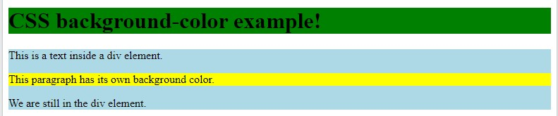
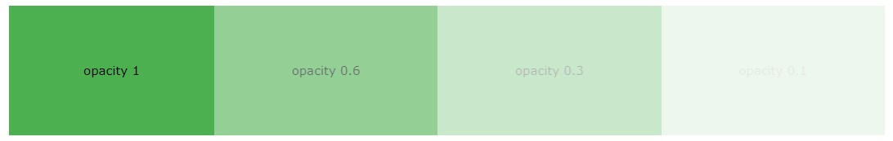
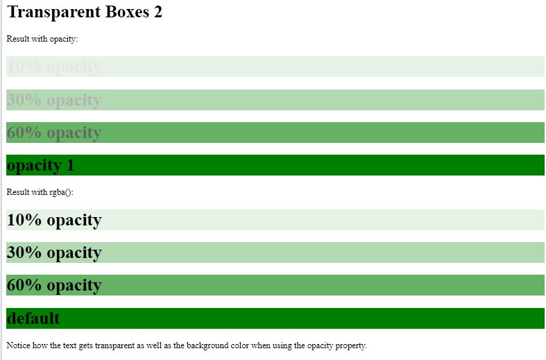
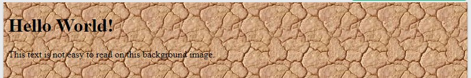
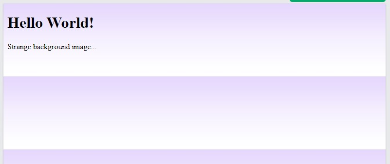
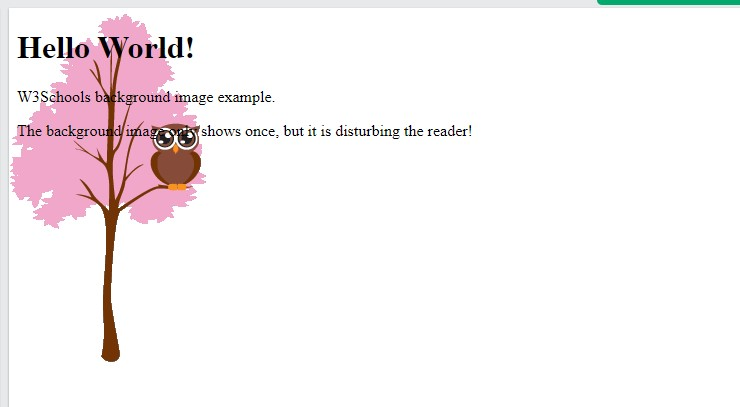
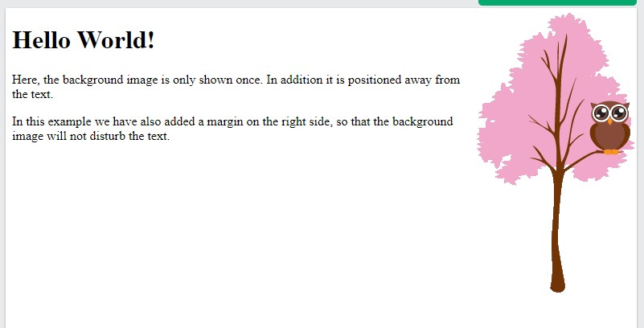
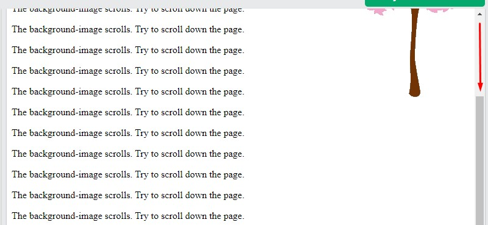
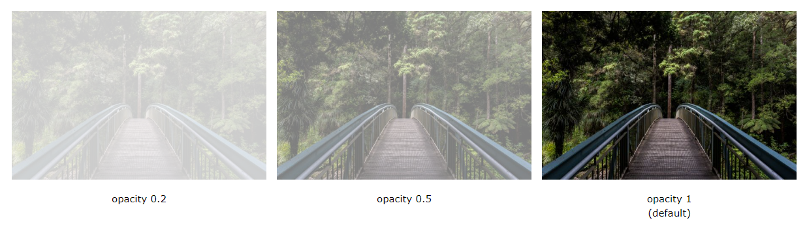

- [Backgrounds](#backgrounds)
  - [background-color](#background-color)
    - [Opacity / Transparency of an Element](#opacity--transparency-of-an-element)
  - [background-image](#background-image)
  - [background-repeat](#background-repeat)
  - [background-position](#background-position)
  - [background-attachment (scroll behavior)](#background-attachment-scroll-behavior)
  - [background property (sh)](#background-property-sh)
  - [All Background Properties](#all-background-properties)
- [Opacity - Transparency](#opacity---transparency)

# Backgrounds

Source : 

The CSS background properties are used to define the background effects for elements.

In this chapter, you will learn about the following CSS background properties:

- background-color
- background-image
- background-repeat
- background-attachment
- background-position

## background-color

The background-color property specifies the background color of an element.

Example

The background color of a page is set like this:

```css
body {
  background-color: lightblue;
}
```

Look at CSS Color Values for a complete list of possible color values : https://www.w3schools.com/cssref/css_colors_legal.asp

*Other Html Elements*

You can set the background color for any HTML elements:

Example

Here, the `<h1>`, `<p>`, and `<div>` elements will have different background colors: 

```css
h1 {
  background-color: green;
}

div {
  background-color: lightblue;
}

p {
  background-color: yellow;
}

```



### Opacity / Transparency of an Element

The opacity property specifies the opacity/transparency of an element. It can take a value from 0.0 - 1.0. The lower value, the more transparent:

(tor: Opaklık = şeffaf olmayan; şeffaflık = transparanlık )

Example

```css
div {
  background-color: green;
  opacity: 0.3;
}
```



🔨 Warning: When using the opacity property to add transparency to the background of an element, <span style="color:red">all of its child elements inherit the same transparency</span>. This can make the text inside a fully transparent element hard to read.

**Transparency using RGBA**

If you do not want to apply opacity to child elements, like in our example above, use RGBA color values. The following example sets the opacity for the background color and not the text:

You learned from our CSS Colors Chapter, that you can use RGB as a color value. In addition to RGB, you can use an RGB color value with an alpha channel (RGBA) - which specifies the opacity for a color.

An RGBA color value is specified with: rgba(red, green, blue, alpha). The alpha parameter is a number between 0.0 (fully transparent) and 1.0 (fully opaque).

*Example*

```css
div {
  background: rgba(0, 128, 0, 0.3) /* Green background with 30% opacity */
}

```


Example using Opacity with Div



## background-image

The background-image property specifies *an image* to use as the *background of an element*.

By default, the image is repeated so it covers the entire element.

*Example*

Set the background image for a page: 

```css
body {
  background-image: url("bgdesert.jpg");
}

```




(!!!) Note: When using a background image, use an image that does not disturb the text.

The background image can also be set for specific elements, like the `<p>` element:

*Example*

```css
p {
  background-image: url("paper.gif");
}

```

## background-repeat

 The background-image property repeats an image <span style="color:red">both horizontally and vertically by default</span>.

Syntax

 ```css
   background-repeat: [repeat-x|repeat-y|no-repeat];
 ```

Some images should be repeated only horizontally or vertically, or they will look strange, like this:

Example

```css
body {
  background-image: url("gradient_bg.png");
}

```



If the image above is repeated only horizontally, the background will look better:

Example

```css
body {
  background-image: url("gradient_bg.png");
  background-repeat: repeat-x;
}

```


(!) Tip: To repeat an image vertically, set background-repeat: repeat-y;

*CSS background-repeat: no-repeat*

Showing the background image only once is also specified by the background-repeat property:

Example

```css
body {
  background-image: url("img_tree.png");
  background-repeat: no-repeat;
}

```



In the example above, the background image is placed in the same place as the text. We want to change the position of the image, so that it does not disturb the text too much.

## background-position

The background-position property is used to specify the position of <span style="color:red">the background image</span>.

*Example*

Position the background image in the top-right corner: 



```css
body {
  background-image: url("img_tree.png");
  background-repeat: no-repeat;
  background-position: right top;
  margin-right: 200px;
}

```

## background-attachment (scroll behavior)

The background-attachment property specifies whether the background image should *scroll* or be *fixed* (will not scroll with the rest of the page):

Example

Specify that the background image should be fixed:


```css
body {
  background-image: url("img_tree.png");
  background-repeat: no-repeat;
  background-position: right top;
  background-attachment: fixed;
  margin-right: 200px;
}

```

*Example*

Specify that the background image should scroll with the rest of the page:



```css
body {
  background-image: url("img_tree.png");
  background-repeat: no-repeat;
  background-position: right top;
  background-attachment: scroll;
  margin-right: 200px;
}

```

## background property (sh)

To shorten the code, it is also possible to specify all the background properties in one single property. This is called a shorthand property.

Instead of writing:

```css
body {
  background-color: #ffffff;
  background-image: url("img_tree.png");
  background-repeat: no-repeat;
  background-position: right top;
}

```

You can use the shorthand property background:

```css
body {
  background: #ffffff url("img_tree.png") no-repeat right top;
}

```

When using the shorthand property the order of the property values is:

- background-color
- background-image
- background-repeat
- background-attachment
- background-position

It does not matter if one of the property values is missing, as long as the other ones are in this order.  (!!) Note that we do not use the background-attachment property in the examples above, as it does not have a value.


## All Background Properties

Property              | Description
----------------------|------------------------------------------------------------------------------
background (sh)       | Sets all the background properties in one declaration
background-attachment | Sets whether a background image is fixed or scrolls with the rest of the page
background-clip       | Specifies the painting area of the background
background-color      | Sets the background color of an element
background-image      | Sets the background image for an element
background-origin     | Specifies where the background image(s) is/are positioned
background-position   | Sets the starting position of a background image
background-repeat     | Sets how a background image will be repeated
background-size       | Specifies the size of the background image(s)


# Opacity - Transparency 

(tor:Opaklık - Şeffaflık)

Source : https://www.w3schools.com/css/css_image_transparency.asp

The opacity property specifies the opacity/transparency of an element.

🔔 Transparent Image

The opacity property can take a value from 0.0 - 1.0. The lower value, the more transparent:

Example

```css
img {
  opacity: 0.5;
}

```



🔔 Transparent Hover Effect

The opacity property is often used together with the :hover selector to change the opacity on mouse-over:

Example

```css
img {
  opacity: 0.5;
}

img:hover {
  opacity: 1.0;
}

```


Example explained

The first CSS block is similar to the code in Example 1. In addition, we have added what should happen when a user hovers over one of the images. In this case we want the image to NOT be transparent when the user hovers over it. The CSS for this is opacity:1;.

When the mouse pointer moves away from the image, the image will be transparent again.

An example of reversed hover effect:

🔔 Transparent Box

When using the opacity property to add transparency to the background of an element, all of its child elements inherit the same transparency. This can make the text inside a fully transparent element hard to read:

Example

```css
div {
  opacity: 0.3;
}

```

🔔 Transparency using RGBA

If you do not want to apply opacity to child elements, like in our example above, use RGBA color values. The following example sets the opacity for the background color and not the text:
You learned from our CSS Colors Chapter, that you can use RGB as a color value. In addition to RGB, you can use an RGB color value with an alpha channel (RGBA) - which specifies the opacity for a color.

An RGBA color value is specified with: rgba(red, green, blue, alpha). The alpha parameter is a number between 0.0 (fully transparent) and 1.0 (fully opaque).

Tip: You will learn more about RGBA Colors in our CSS Colors Chapter. 
https://www.w3schools.com/css3_colors.asp

Example

```css
div {
  background: rgba(76, 175, 80, 0.3) /* Green background with 30% opacity */
}

```

🔔 Text in Transparent Box

Example

```html
<html>
<head>

<style>

div.background {
  background: url(klematis.jpg) repeat;
  border: 2px solid black;
}

div.transbox {
  margin: 30px;
  background-color: #ffffff;
  border: 1px solid black;
  opacity: 0.6;
}

div.transbox p {
  margin: 5%;
  font-weight: bold;
  color: #000000;
}

</style>
</head>
<body>

<div class="background">
  <div class="transbox">
    <p>This is some text that is placed in the transparent box.</p>
  </div>
</div>

</body>
</html>

```

Example explained

First, we create a `<div>` element (class="background") with a background image, and a border.

Then we create another `<div>` (class="transbox") inside the first `<div>`.

The `<div class="transbox">` have a background color, and a border - the div is transparent.

Inside the transparent `<div>`, we add some text inside a `<p>` element.

