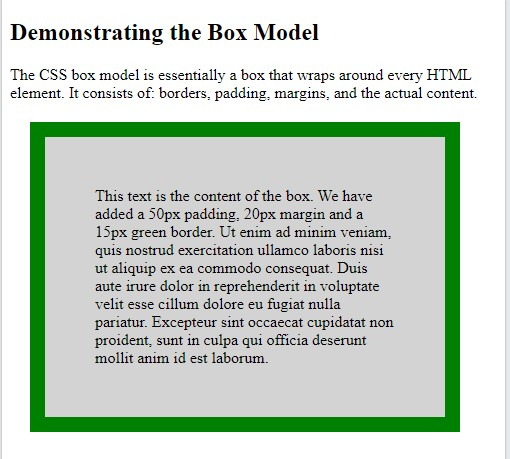

**CSS Element Size**

- [Units](#units)
- [CSS Box Model](#css-box-model)
- [Box Sizing (border-box model)](#box-sizing-border-box-model)
- [Height , Width And Max-Width](#height--width-and-max-width)
  - [Setting max-width](#setting-max-width)
- [All CSS Dimension Properties](#all-css-dimension-properties)
- [Max-Width And Auto Margin](#max-width-and-auto-margin)

# Units

Source : https://www.w3schools.com/css/css_units.asp

CSS has several different units for expressing a length.

Many CSS properties take "length" values, such as width, margin, padding, font-size, etc.

Length is a number followed by a length unit, such as 10px, 2em, etc.

*Example*

Set different length values, using px (pixels):

```css
h1 {
  font-size: 60px;
}

p {
  font-size: 25px;
  line-height: 50px;
}

```

Note: A whitespace cannot appear between the number and the unit. However, if the value is 0, the unit can be omitted.

For some CSS properties, negative lengths are allowed.

There are two types of length units: absolute and relative.

*Absolute Lengths*

The absolute length units are fixed and a length expressed in any of these will appear as exactly that size. ((mutlak ölçüler))

Absolute length units are not recommended for use on screen, because screen sizes vary so much. However, they can be used if the output medium is known, such as for print layout.

| Unit | Description                  |
|------|------------------------------|
| cm   | centimeters                  |
| mm   | millimeters                  |
| in   | inches (1in = 96px = 2.54cm) |
| px*  | pixels (1px = 1/96th of 1in) |
| pt   | points (1pt = 1/72 of 1in)   |
| pc   | picas (1pc = 12 pt)          |


--- Pixels (px) are relative to the viewing device. For low-dpi devices, 1px is one device pixel (dot) of the display. For printers and high resolution screens 1px implies multiple device pixels.

*Relative Lengths*

Relative length units specify a length relative to another length property. Relative length units scales better between different rendering mediums. ((Göreceli uzunluklar))

| Unit | Description                                                                               |
|------|-------------------------------------------------------------------------------------------|
| em   | Relative to the font-size of the element (2em means 2 times the size of the current font) |
| ex   | Relative to the x-height of the current font (rarely used)                                |
| ch   | Relative to width of the "0" (zero)                                                       |
| rem  | Relative to font-size of the root element                                                 |
| vw   | Relative to 1% of the width of the viewport*                                              |
| vh   | Relative to 1% of the height of the viewport*                                             |
| vmin | Relative to 1% of viewport's* smaller dimension                                           |
| vmax | Relative to 1% of viewport's* larger dimension                                            |
| %    | Relative to the parent element (ebeveyn elementin %'si)                                   |

**Tips**: 

* The em and rem units are practical in creating perfectly scalable layout !

* Viewport = the browser window size. If the viewport is 50cm wide, 1vw = 0.5cm.

see the source for browser compability.

# CSS Box Model 

Source : https://www.w3schools.com/css/css_boxmodel.asp

All HTML elements can be considered as boxes. In CSS, the term "box model" is used when talking about design and layout.

The CSS box model is essentially a box that wraps around every HTML element. It consists of : margins, borders, padding, and the actual content. The image below illustrates the box model:


Explanation of the different parts:

* Content - The content of the box, where text and images appear
* Padding - Clears an area around the content. The padding is transparent
* Border - A border that goes around the padding and content
* Margin - Clears an area outside the border. The margin is transparent

The box model allows us to add a border around elements, and to define space between elements. 

There are two types box model (to)  :

* Content Box Model (default)
* Border Box Model (common) (recommended)

Content Box Model tells that *width and height include only content*.

Border Box Model tells that *widht and height include content, padding and border*.

(tor:border-box modelinde bir elementin genişliğinde veya yüksekliğinde border ve padding de dahil olur.)

*Example*

Demonstration of the box model:

```css
div {
  width: 300px;
  border: 15px solid green;
  padding: 50px;
  margin: 20px;
}
```



**Width and Height of an Element**

In order to set the width and height of an element correctly in all browsers, you need to know how the box model works.

*Important*: By default when you set the width and height properties of an element with CSS, you just set the width and height of *the content area*. To calculate the full size of an element, you must also add padding, borders and margins. (for content-box model)

Example
This `<div>` element will have a total width of 350px: 

```css
div {
  width: 320px;
  padding: 10px;
  border: 5px solid gray;
  margin: 0;
}

```

Here is the calculation (total width according to content box model):

```text
320px (width)
+ 20px (left + right padding)
+ 10px (left + right border)
+ 0px (left + right margin)
= 350px

```

# Box Sizing (border-box model)

Source : https://www.w3schools.com/css/css3_box-sizing.asp

The CSS box-sizing property allows us to include the padding and border in an element's total width and height. 

(tor: padding ve border uzunluğunu elementin genişlik ve yüksekliğine dahil etmemizi sağlar.:)

**Without the CSS box-sizing Property**

By default, the width and height of an element is calculated like this:

width + padding + border = actual width of an element

height + padding + border = actual height of an element

This means: When you set the width/height of an element, the element often appears bigger than you have set (because the element's border and padding are added to the element's specified width/height).

The following illustration shows two `<div>` elements with the same specified width and height:

The two `<div>` elements above end up with different sizes in the result (because div2 has a padding specified):

Example

```css
.div1 {
  width: 300px;
  height: 100px;
  border: 1px solid blue;
}

.div2 {
  width: 300px;
  height: 100px;
  padding: 50px;
  border: 1px solid red;
}
```


The box-sizing property solves this problem.

**With the CSS box-sizing Property**

The box-sizing property allows us to include the padding and border in an element's total width and height. ( border-box model )

If you set box-sizing: border-box; on an element, padding and border are included in the width and height:

Here is the same example as above, with box-sizing: border-box; added to both `<div>` elements:

Example

```css
.div1 {
  width: 300px;
  height: 100px;
  border: 1px solid blue;
  box-sizing: border-box;
}

.div2 {
  width: 300px;
  height: 100px;
  padding: 50px;
  border: 1px solid red;
  box-sizing: border-box;
}

```


Since the result of using the box-sizing: border-box; is so much better, many developers want all elements on their pages to work this way.

The code below ensures that all elements are sized in this more intuitive way. Many browsers already use box-sizing: border-box; for many form elements (but not all - which is why inputs and text areas look different at width: 100%;).

Applying this to all elements is safe and wise:

Example

```css
* {
  box-sizing: border-box;
}
```

**CSS Box Sizing Property Ref**

| Property   | Description                                                                                                     |
|------------|-----------------------------------------------------------------------------------------------------------------|
| box-sizing | Defines how the width and height of an element are calculated: should they include padding and borders, or not. |

# Height , Width And Max-Width

Source : https://www.w3schools.com/css/css_dimension.asp

The CSS height and width properties are used to set the height and width of an element.

The CSS max-width property is used to set the maximum width of an element.

The height and width properties do not include padding, borders, or margins. It sets the height/width of the area inside the padding, border, and margin of the element. (content-box model)	

**CSS height and width Values**

The height and width properties may have the following values:

* auto - This is default. The browser calculates the height and width
* length - Defines the height/width in px, cm etc.
* % - Defines the height/width in percent of the containing block
* initial - Sets the height/width to its default value
* inherit - The height/width will be inherited from its parent value

*Example*

Set the height and width of a `<div>` element:

```css
div {
  height: 200px;
  width: 50%;
  background-color: powderblue;
}
```

*Example*

Set the height and width of another `<div>` element:

```css
div {
  height: 100px;
  width: 500px;
  background-color: powderblue;
}
```

Note: Remember that the height and width properties do not include padding, borders, or margins! They set the height/width of the area inside the padding, border, and margin of the element! (for the content-box model)

## Setting max-width

The max-width property is used to set the maximum width of an element. (max-genişliğini belirler, ekranda pencere genişlese dahi büyütmez. marjin alanı büyür.)

The max-width can be specified in length values, like px, cm, etc., or in percent (%) of the containing block, or set to none (this is default. Means that there is no maximum width).

The problem with the `<div>` above occurs when the browser window is smaller than the width of the element (500px). The browser then adds a horizontal scrollbar to the page.

Using max-width instead, in this situation, will improve the browser's handling of small windows.

Note: The value of the max-width property overrides width.

Example
This `<div>` element has a height of 100 pixels and a max-width of 500 pixels: 

```css
div {
  max-width: 500px;,
  height: 100px;
  background-color: powderblue;
}

```

# All CSS Dimension Properties

Property   | Description
-----------|--------------------------------------
height     | Sets the height of an element
width      | Sets the width of an element
max-height | Sets the maximum height of an element
max-width  | Sets the maximum width of an element
min-height | Sets the minimum height of an element
min-width  | Sets the minimum width of an element

# Max-Width And Auto Margin

Using width, max-width and margin: auto;

As mentioned in the previous chapter; a block-level element always takes up the full width available (stretches out to the left and right as far as it can).

Setting the width of a block-level element will prevent it from stretching out to the edges of its container. Then, you can set the margins to auto, to horizontally center the element within its container. The element will take up the specified width, and the remaining space will be split equally between the two margins:

Note: The problem with the `<div>` above occurs when the browser window is smaller than the width of the element. The browser then adds a horizontal scrollbar to the page.

(Browser tarayıcısı elementin genişliğinden küçükse problem ortaya çıkar. Böylece tarayıcı, pencerenin en altında sayfa scroll'u ekler.)

Using max-width instead, in this situation, will improve the browser's handling of small windows. This is important when making a site usable on small devices: 

Tip: Resize the browser window to less than 500px wide, to see the difference between the two divs!

Here is an example of the two divs above:

Example
```css
div.ex1 {
  width: 500px;
  margin: auto;
  border: 3px solid #73AD21;
}

div.ex2 {
  max-width: 500px;
  margin: auto;
  border: 3px solid #73AD21;
}

// max-width and percantage usage (to)
div.ex3 { 
  max-width: 100%-10px; 
  margin: auto; 
  border: 3px solid #73AD21; 
}

```

Try it : https://www.w3schools.com/css/tryit.asp?filename=trycss_max-width

