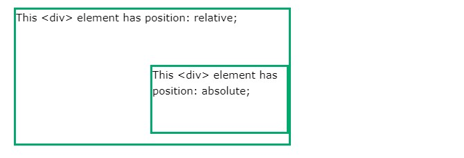

- [Layout](#layout)
  - [Display Property](#display-property)
    - [Block-level Elements](#block-level-elements)
    - [Inline Elements](#inline-elements)
    - [None](#none)
    - [Override The Default Display Value](#override-the-default-display-value)
    - [Inline Block](#inline-block)
    - [All Display - Visibility Properties](#all-display---visibility-properties)
  - [Position Property](#position-property)
    - [static position](#static-position)
    - [relative position](#relative-position)
    - [fixed position](#fixed-position)
    - [absolute position](#absolute-position)
    - [sticky position](#sticky-position)
  - [Overlapping Elements (z-index)](#overlapping-elements-z-index)
  - [All CSS Positioning Properties](#all-css-positioning-properties)

# Layout

## Display Property 

The display property is the most important CSS property for controlling layout.

The display property specifies if/how an element is displayed.

Every HTML element has a default display value depending on what type of element it is. The default display value for most elements is block or inline.

### Block-level Elements

A block-level element always starts on a new line and takes up the full width available (stretches out to the left and right as far as it can). (! Block-Level element yeni satırdan başlar, sola ve sağa genişliği max alabildiğince alır. Sonraki gelen element de yeni satırdan başlar.) 

Important block-level elements:

```html
<div>
<h1> - <h6>
<p>
<form>
<ol> - <ul> - <li>
<hr>
<table>  
<header> - <footer> - <section>
```

All block level elements :

```html
<address>
Contact information.

<article>
Article content.

<aside>
Aside content.

<blockquote>
Long ("block") quotation.

<details>
Disclosure widget.

<dialog>
Dialog box.

<dd>
Describes a term in a description list.

<div>
Document division.

<dl>
Description list.

<dt>
Description list term.

<fieldset>
Field set label.

<figcaption>
Figure caption.

<figure>
Groups media content with a caption (see <figcaption>).

<footer>
Section or page footer.

<form>
Input form.

h1, h2, h3, h4, h5, h6
Heading levels 1-6.

<header>
Section or page header.

<hgroup>
Groups header information.

<hr>
Horizontal rule (dividing line).

<li>
List item.

<main>
Contains the central content unique to this document.

<nav>
Contains navigation links.

<ol>
Ordered list.

<p>
Paragraph.

<pre>
Preformatted text.

<section>
Section of a web page.

<table>
Table.

<ul>
Unordered list.
```

Source : https://developer.mozilla.org/en-US/docs/Web/HTML/Block-level_elements


### Inline Elements

An inline element does not start on a new line and only takes up as much width as necessary.

Importan inline elements:

```html
<span>
<a>

<input>
<button>
<label>
<br>
```

All inline elements :

```html
<a>
<abbr>
<acronym>
<audio> (if it has visible controls)
<b>
<bdi>
<bdo>
<big>
<br>
<button>
<canvas>
<cite>
<code>
<data>
<del>
<dfn>
<em>
<embed>
<i>
<iframe>

<input>
<ins>
<kbd>
<label>
<map>
<mark>
<meter>
<noscript>
<object>
<output>
<picture>
<progress>
<q>
<ruby>
<s>
<samp>
<script>
<select>
<slot>
<small>
<span>
<strong>
<sub>
<sup>
<svg>
<template>
<textarea>
<time>
<u>
<tt>
<var>
<video>
<wbr>

```

Source : https://developer.mozilla.org/en-US/docs/Web/HTML/Inline_elements

### None

`display: none;` is commonly used with JavaScript to hide and show elements without deleting and recreating them. Take a look at our last example on this page if you want to know how this can be achieved.

The `<script>` element uses `display: none;` as default. 

**Hide an Element - display:none or visibility:hidden**

Hiding an element can be done by setting the display property to none. The element will be hidden, and the page will be displayed as if the element is not there: 

(tr: display özelliği none olan element sayfada hiç yokmuş gibi davranır.:)

*Example*

```css
h1.hidden {
  display: none;
}
```

`visibility:hidden`; also hides an element. However, the element will still *take up the same space as before*. The element will be hidden, but still *affect the layout*. 

(tr:visibility özelliği hidden olan element, gizlenir, fakat layout da sanki oradaymış gibi davranır.:) 

*Example*

```css
h1.hidden {
  visibility: hidden;
}

```

### Override The Default Display Value

As mentioned, every element has a default display value. However, you can override this.

Changing an inline element to a block element, or vice versa, can be useful for making the page look a specific way, and still follow the web standards.

A common example is making inline `<li>` elements for horizontal menus:

*Example*

```css
li {
  display: inline;
}
```

**Note**

Setting the display property of an element only changes how the element is displayed, NOT what kind of element it is. So, an inline element with display: block; is not allowed to have other block elements inside it.

The following example displays `<span>` elements as block elements:

*Example*

```css
span {
  display: block;
}

```

### Inline Block

Compared to 'display: inline', the major difference is that display: 'inline-block' allows to set a *width and height* on the element.

Also, with display: inline-block, the top and bottom margins/paddings are respected, but with display: inline they are not.

Compared to display: block, the major difference is that display: inline-block *does not add a line-break* after the element, so the element can sit next to other elements.

The following example shows the different behavior of display: inline, display: inline-block and display: block:

```css
span.a {
  display: inline; /* the default for span */
  width: 100px;
  height: 100px;
  padding: 5px;
  border: 1px solid blue;
  background-color: yellow;
}

span.b {
  display: inline-block;
  width: 100px;
  height: 100px;
  padding: 5px;
  border: 1px solid blue;
  background-color: yellow;
}

span.c {
  display: block;
  width: 100px;
  height: 100px;
  padding: 5px;
  border: 1px solid blue;
  background-color: yellow;
}
```


```html
<h1>The display Property</h1>

<h2>display: inline</h2>
<div>Lorem ipsum dolor sit amet, consectetur adipiscing elit. Vestibulum consequat scelerisque elit sit amet consequat. Aliquam erat volutpat. <span class="a">Aliquam</span> <span class="a">venenatis</span> gravida nisl sit amet facilisis. Nullam cursus fermentum velit sed laoreet. </div>

<h2>display: inline-block</h2>
<div>Lorem ipsum dolor sit amet, consectetur adipiscing elit. Vestibulum consequat scelerisque elit sit amet consequat. Aliquam erat volutpat. <span class="b">Aliquam</span> <span class="b">venenatis</span> gravida nisl sit amet facilisis. Nullam cursus fermentum velit sed laoreet. </div>

<h2>display: block</h2>
<div>Lorem ipsum dolor sit amet, consectetur adipiscing elit. Vestibulum consequat scelerisque elit sit amet consequat. Aliquam erat volutpat. <span class="c">Aliquam</span> <span class="c">venenatis</span> gravida nisl sit amet facilisis. Nullam cursus fermentum velit sed laoreet. </div>
```


**Using inline-block to Create Navigation Links**

One common use for display: inline-block is to display list items horizontally instead of vertically. The following example creates horizontal navigation links:

```css
.nav {
  background-color: yellow;
  list-style-type: none;
  text-align: center; 
  padding: 0;
  margin: 0;
}

.nav li {
  display: inline-block;
  font-size: 20px;
  padding: 20px;
}
```

```html
<h1>Horizontal Navigation Links</h1>
<p>By default, list items are displayed **vertically**. In this example we use display: inline-block to display them horizontally (side by side).</p>
<p>Note: If you resize the browser window, the links will automatically break when it becomes too crowded.</p>

<ul class="nav">
  <li><a href="#home">Home</a></li>
  <li><a href="#about">About Us</a></li>
  <li><a href="#clients">Our Clients</a></li>  
  <li><a href="#contact">Contact Us</a></li>
</ul>
```


Source : https://www.w3schools.com/css/css_inline-block.asp

### All Display - Visibility Properties

Property   | Description
-----------|----------------------------------------------------------------------------------------------------------------------------
display    | Specifies how an element should be displayed
visibility | Specifies whether or not an element should be visible <br/> (false olduğunda layout da varmış gibi davranır, ama gözükmez.)

## Position Property

Source : https://www.w3schools.com/css/css_positioning.asp

The position property specifies the type of positioning method used for an element (static, relative, fixed, absolute or sticky).

There are five different position values:

- static
- relative 
- fixed 
- absolute 
- sticky 

((statik,göreceli,sabit,mutlak,yapışkan))

Elements are then positioned using the top, bottom, left, and right properties. However, these properties will not work unless the position property is set first. They also work differently depending on the position value.

### static position

HTML elements are positioned static by default.

Static positioned elements are not affected by the top, bottom, left, and right properties.

An element with position: static; is not positioned in any special way; it is always positioned according to the *normal flow* of the page: 

((static ,default pozisyonda olan elementlere , pozisyonlanmamış elementler denir, pozisyonlanmış elementler, static dışında değer olan elementlerdir.))

Here is the CSS that is used:

Example

```css
div.static {
  position: static;
  border: 3px solid #73AD21;
}
```

### relative position

An element with position: relative; is positioned relative to its normal position.

Setting the top, right, bottom, and left properties of a relatively-positioned element will cause it to be adjusted away from its normal position. Other content will not be adjusted to fit into any gap left by the element. 

(tr: statik gibidir, sadece tblr degerleri alabilir, sonraki element tblr değerinden etkilenmez.:) 

Here is the CSS that is used:

Example

```css
div.relative {
  position: relative;
  left: 30px;
  border: 3px solid #73AD21;
}

```

### fixed position

An element with position: fixed; is positioned relative to the *viewport*, which means it always stays in the same place even if the page is scrolled. The top, right, bottom, and left properties are used to position the element.

A fixed element does not leave a gap in the page where it would normally have been located.???

Notice the fixed element in the lower-right corner of the page. Here is the CSS that is used:

Example


```css
div.fixed {
  position: fixed;
  bottom: 0;
  right: 0;
  width: 300px;
  border: 3px solid #73AD21;
}
```

### absolute position

An element with position: absolute; is positioned according to positioned ancestor.

However; if an absolute positioned element has no positioned ancestors, it uses the document body, and moves along with page scrolling.

Note: A "positioned" element is one whose position is anything except static.

Here is a simple example:



```css
div.relative {
  position: relative;
  width: 400px;
  height: 200px;
  border: 3px solid #73AD21;
}

div.absolute {
  position: absolute;
  top: 80px;
  right: 0;
  width: 200px;
  height: 100px;
  border: 3px solid #73AD21;
}

```

### sticky position

An element with 'position: sticky;' is positioned based on the user's scroll position.

A sticky element toggles between relative (normal flow) and fixed, depending on the scroll position. It is positioned relative until a given offset position is met in the viewport - then it "sticks" in place (like position:fixed).

Note: Internet Explorer does not support sticky positioning. Safari requires a -webkit- prefix (see example below). You must also specify at least one of top, right, bottom or left for sticky positioning to work.

In this example, the sticky element sticks to the top of the page (top: 0), when you reach its scroll position.

Example

```css
div.sticky {
  position: -webkit-sticky; /* Safari */
  position: sticky;
  top: 0;
  background-color: green;
  border: 2px solid #4CAF50;
}

```

## Overlapping Elements (z-index)

When elements are positioned, they can overlap other elements. The z-index property specifies the stack order of an element (which element should be placed in front of, or behind, the others). An element can have a positive or negative stack order:

*Example*

```css
img {
  position: absolute;
  left: 0px;
  top: 0px;
  z-index: -1;
}

```

An element with greater stack order is always in front of an element with a lower stack order. 

**Note !!!** 

If two positioned elements overlap without a z-index specified, the element positioned last in the HTML code will be shown on top.

## All CSS Positioning Properties

Property              | Description
----------------------|----------------------------------------------------------------
position              | Specifies the type of positioning for an element
top/bottom/left/right | Sets the top/bottom/left/right margin edge for a positioned box
clip                  | Clips an absolutely positioned element
z-index               | Sets the stack order of an element

