Source : https://www.w3schools.com/css/css_grid.asp

- [Grid Layout Module](#grid-layout-module)
  - [Display Property](#display-property)
  - [Grid Columns](#grid-columns)
  - [Grid Rows](#grid-rows)
  - [Grid Gaps](#grid-gaps)
  - [Gap property (shorthand)](#gap-property-shorthand)
  - [Grid Lines (grid-column-start and end) (Span Cells)](#grid-lines-grid-column-start-and-end-span-cells)
  - [All CSS Grid Properties](#all-css-grid-properties)
- [Grid Container](#grid-container)
  - [The grid-template-columns property](#the-grid-template-columns-property)
  - [The grid-template-rows Property](#the-grid-template-rows-property)
  - [The justify-content Property](#the-justify-content-property)
  - [The align-content Property](#the-align-content-property)
- [CSS Grid Item](#css-grid-item)
  - [Child Elements (Items)](#child-elements-items)
  - [The grid-column Property:](#the-grid-column-property)
  - [The grid-row Property:](#the-grid-row-property)
  - [The grid-area Property](#the-grid-area-property)
  - [The Order of the Items](#the-order-of-the-items)

---

# Grid Layout Module

*Example grid layout*

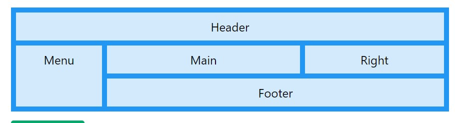

*Grid Layout*

The CSS Grid Layout Module offers a grid-based layout system, with rows and columns, making it easier to design web pages without having to use *floats* and *positioning*.

*Grid Elements*

A grid layout consists of a parent element, with one or more child elements.

Example

```html
<div class="grid-container">
  <div class="grid-item">1</div>
  <div class="grid-item">2</div>
  <div class="grid-item">3</div>
  <div class="grid-item">4</div>
</div>

```

## Display Property

An HTML element becomes a grid container when its display property is set to grid or inline-grid.

- Use display: grid; to make a block-level grid container
- Use display: inline-grid; to make a inline grid container

*Syntax*

```css
display: [grid | inline-grid];

```

*Full example*

```html
<!DOCTYPE html>
<html>
<head>
<style>
.grid-container {
  display: grid;
  grid-template-columns: auto auto auto;
  background-color: #2196F3;
  padding: 10px;
}

.grid-item {
  background-color: rgba(255, 255, 255, 0.8);
  border: 1px solid rgba(0, 0, 0, 0.8);
  padding: 20px;
  font-size: 30px;
  text-align: center;
}
</style>
</head>
<body>

<div class="grid-container">
  <div class="grid-item">1</div><div class="grid-item">2</div>
  <div class="grid-item">3</div><div class="grid-item">4</div>
  <div class="grid-item">5</div><div class="grid-item">6</div>  
  <div class="grid-item">7</div><div class="grid-item">8</div>
  <div class="grid-item">9</div>  
</div>

</body>
</html>
```

*output*


🔨 Pay Attention : `grid-template-columns: auto auto auto;` here three columns are defined. 

*inline grid example*

```html
<style>
.grid-container {
  display: inline-grid;
  grid-template-columns: auto auto auto;
  background-color: #2196F3;
  padding: 10px;
}

.grid-item {
  background-color: rgba(255, 255, 255, 0.8);
  border: 1px solid rgba(0, 0, 0, 0.8);
  padding: 20px;
  font-size: 30px;
  text-align: center;
}
</style>
```

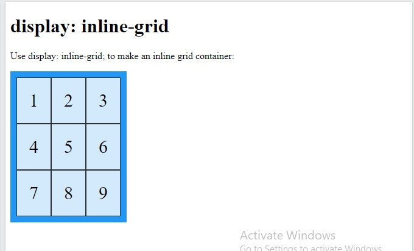

All *direct children * elements of the grid container automatically become grid items.

## Grid Columns

The vertical lines of grid items are called columns.

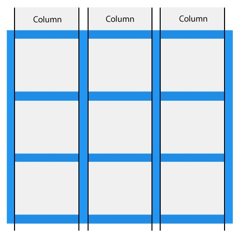

## Grid Rows

The horizontal lines of grid items are called rows.

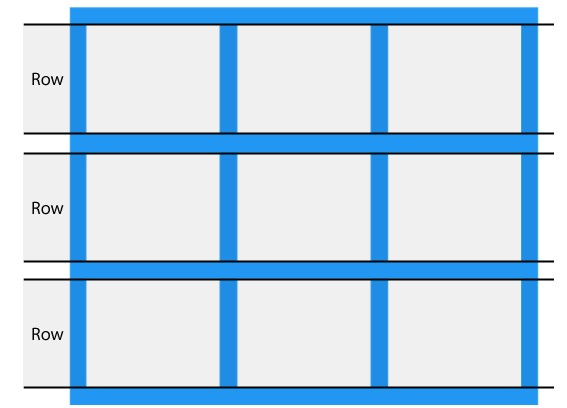

## Grid Gaps

The spaces between each column/row are called gaps.

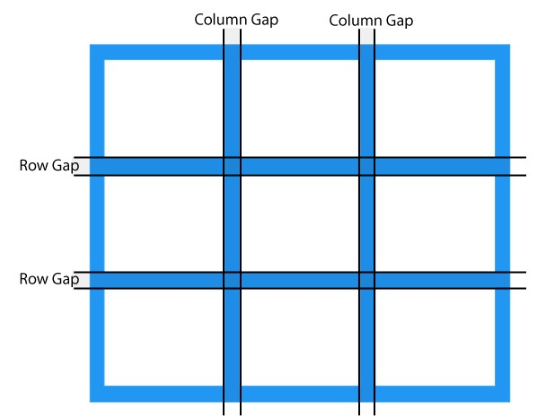

You can adjust the gap size by using one of the following properties:

- column-gap
- row-gap
- gap

*Example*

The column-gap property sets the gap between the columns:

```css
.grid-container {
  display: grid;
  column-gap: 50px;
}

```

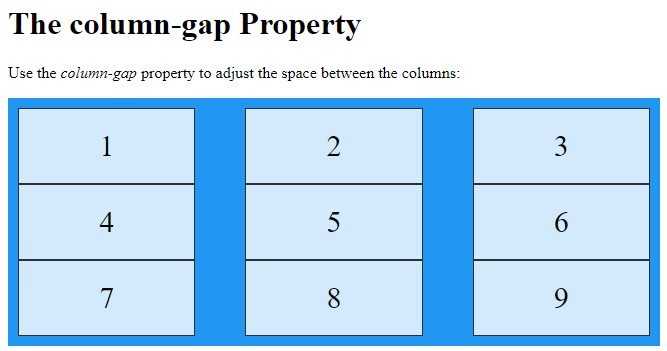

*Example*

The row-gap property sets the gap between the rows:

```css
.grid-container {
  display: grid;
  row-gap: 50px;
}

```

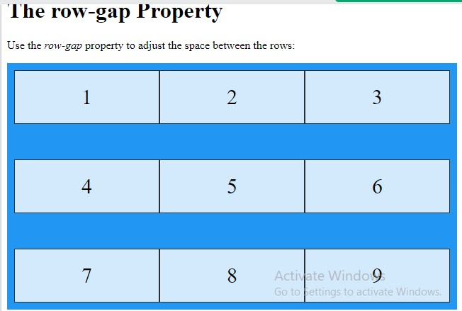

## Gap property (shorthand)

The gap property is a *shorthand* property for the row-gap and the column-gap properties:

```css
.grid-container {
  display: grid;
  gap: 50px 100px;
}

```

*Example*

The gap property can also be used to set both the row gap and the column gap in one value:

```css
.grid-container {
  display: grid;
  gap: 50px;
}

```

## Grid Lines (grid-column-start and end) (Span Cells)

The lines between columns are called column lines.

The lines between rows are called row lines.

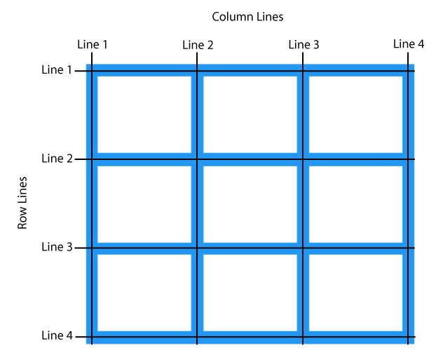

Refer to line numbers when placing a grid item in a grid container:

*Example*

Place a grid item at column line 1, and let it end on column line 3 (span cells):

```css
.item1 {
  grid-column-start: 1;
  grid-column-end: 3;
}

```
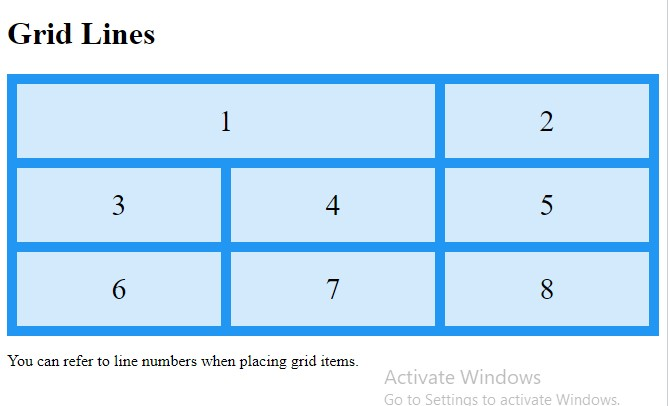

*Full Example*

```html
<!DOCTYPE html><head>
<style>
.grid-container {
  display: grid;
  grid-template-columns: auto auto auto;
  gap: 10px;
  background-color: #2196F3;
  padding: 10px;
}

.grid-container > div {
  background-color: rgba(255, 255, 255, 0.8);
  text-align: center;
  padding: 20px 0;
  font-size: 30px;
}

.item1 {
  grid-column-start: 1;
  grid-column-end: 3;
}
</style>
</head>
<body>
<h1>Grid Lines</h1>
<div class="grid-container">
  <div class="item1">1</div><div class="item2">2</div>
  <div class="item3">3</div><div class="item4">4</div>
  <div class="item5">5</div><div class="item6">6</div>
  <div class="item7">7</div><div class="item8">8</div>
</div>

<p>You can refer to line numbers when placing grid items.</p>

</body>
</html>
```

*Example*

Place a grid item at row line 1, and let it end on row line 3:

```css
.item1 {
  grid-row-start: 1;
  grid-row-end: 3;
}

```

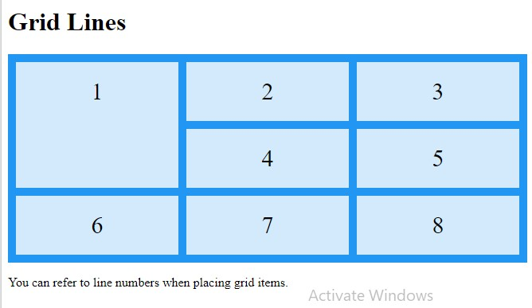

## All CSS Grid Properties

Property              | Description
----------------------|-------------------------------------------------------------------------
row-gap               | Specifies the gap between the grid rows
column-gap            | Specifies the gap between the columns
grid-auto-columns     | Specifies a default column size
grid-auto-flow        | Specifies how auto-placed items are inserted in the grid
grid-auto-rows        | Specifies a default row size
grid-row-gap          | Specifies the size of the gap between rows
grid-column-gap       | Specifies the size of the gap between columns
grid-column-start     | Specifies where to start the grid item
grid-column-end       | Specifies where to end the grid item
grid-row-start        | Specifies where to start the grid item
grid-row-end          | Specifies where to end the grid item
grid-template-areas   | Specifies how to display columns and rows, using named grid items
grid-template-columns | Specifies the size of the columns, and how many columns in a grid layout
grid-template-rows    | Specifies the size of the rows in a grid layout

🔔 Shorthand Properties

Property      | Description
--------------|----------------------------------------------------------------------------------------------------------------------------------------------------------------------------
gap           | A shorthand property for the row-gap and the column-gap properties
grid          | A shorthand property for the grid-template-rows, grid-template-columns,grid-template-areas, grid-auto-rows, grid-auto-columns, and the grid-auto-flow properties
grid-column   | A shorthand property for the grid-column-start and the grid-column-end properties
grid-gap      | A shorthand property for the grid-row-gap and grid-column-gap properties
grid-row      | A shorthand property for the grid-row-start and the grid-row-end properties
grid-template | A shorthand property for the grid-template-rows, grid-template-columns and grid-areas properties
grid-area     | Either specifies a name for the grid item, or this property is a shorthand property for the grid-row-start, grid-column-start, grid-row-end, and grid-column-end properties

🔔 Section 2

# Grid Container

To make an HTML element behave as a grid container, you have to set the display property to `grid or inline-grid`.

Grid containers consist of `grid items`, placed inside columns and rows.

## The grid-template-columns property

The grid-template-columns property defines *the number of columns* in your grid layout, and it can define *the width of each column*.

The value is a *space-separated-list*, where each value defines the width of the respective column.

If you want your grid layout to contain 4 columns, specify the width of the 4 columns, or "auto" if all columns should have the same width.

Example : Make a grid with 4 columns

```css
.grid-container {
  display: grid;
  grid-template-columns: auto auto auto auto;
}

```
*Output*

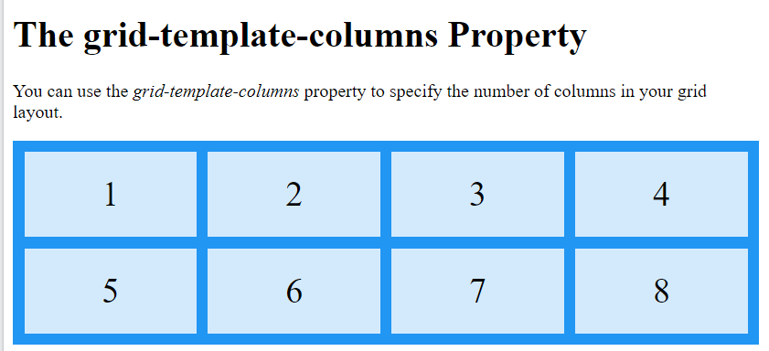

✏ Note: If you have more than 4 items in a 4 columns grid, the grid will automatically add a new row to put the items in.

The grid-template-columns property can also be used to specify the size (width) of the columns.

Example : Set a size for the 4 columns

```css
.grid-container {
  display: grid;
  grid-template-columns: 80px 200px auto 40px;
}

```

*Output*

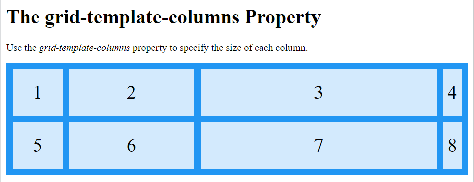

## The grid-template-rows Property

The grid-template-rows property defines the height of each row.

The value is a space-separated-list, where each value defines the height of the respective row:

Example

```css
.grid-container {
  display: grid;
  grid-template-rows: 80px 200px;
}

```

*Output*

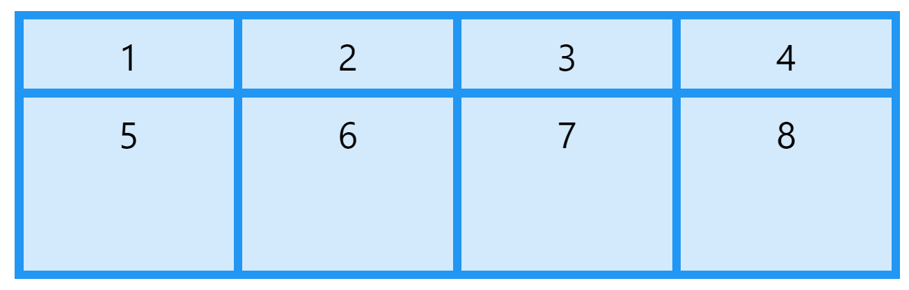


## The justify-content Property

The justify-content property is used to align the whole grid inside the container.

✏ Note: The grid's total width has to be less than the container's width for the justify-content property to have any effect.

*Syntax*

```css
justify-content: [space-evenly|space-around|space-between|center|start|end]

```

- The value "space-evenly" will give the columns equal amount of space between, and around them.


- The value "space-around" will give the columns equal amount of space around them:

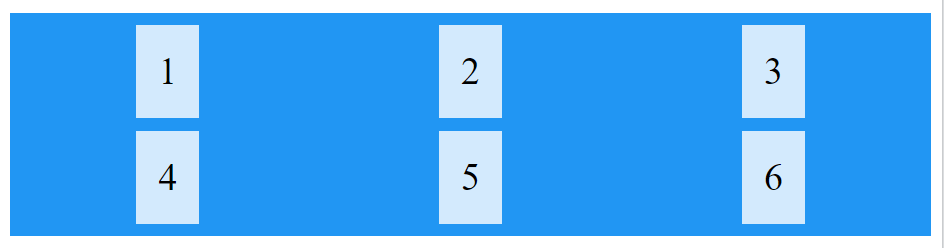

- The value "space-between" will give the columns equal amount of space between them:

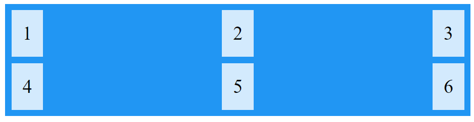

- The value "center" will align the grid in the middle of the container:


- The value "start" will align the grid at the beginning of the container:

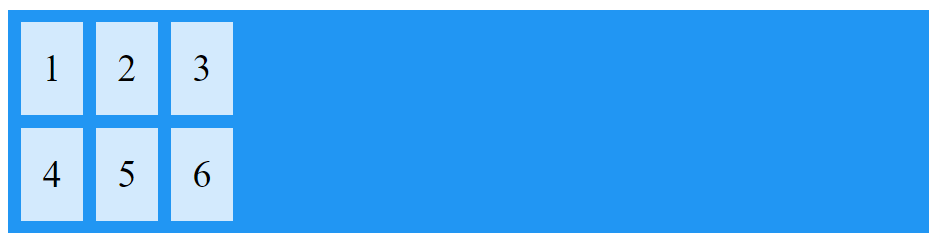

- The value "end" will align the grid at the end of the container:

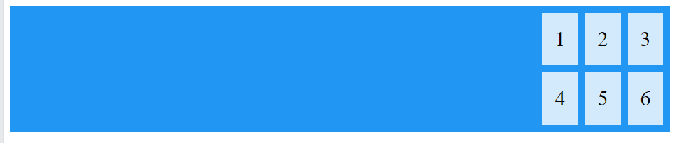

## The align-content Property

The align-content property is used to vertically align the whole grid inside the container.

✏ Note: The grid's total height has to be less than the container's height for the align-content property to have any effect.

*Syntax*

```css
align-content: [center|space-evenly|space-around|space-between|start|end]
```

- The value "center" will align the rows in the middle of the container:

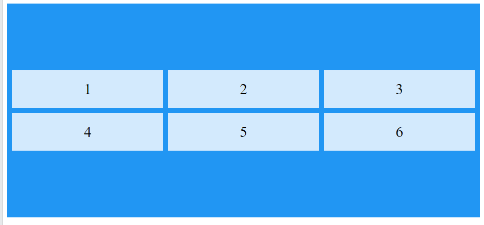

- The value "space-evenly" will give the rows equal amount of space between, and around them:

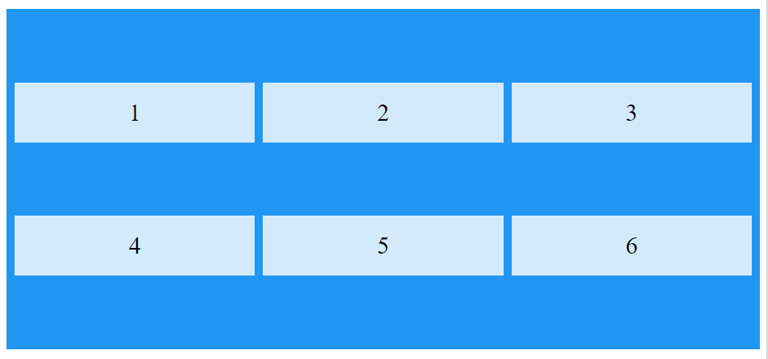

- The value "space-around" will give the rows equal amount of space around them:

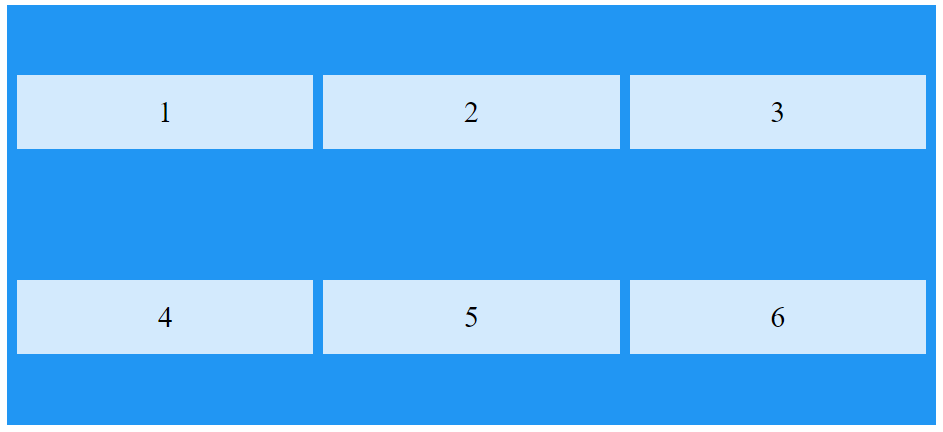

- The value "space-between" will give the rows equal amount of space between them:

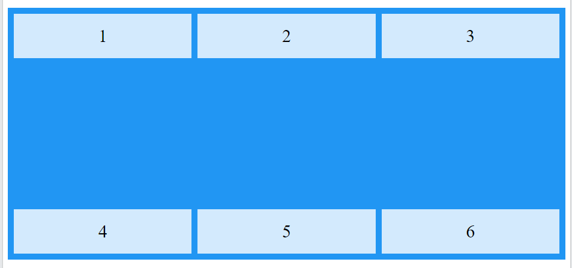

- The value "start" will align the rows at the beginning of the container:

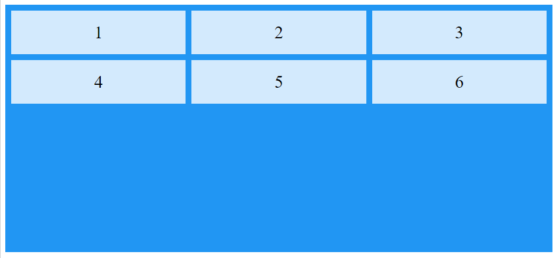

- The value "end" will align the rows at the end of the container:

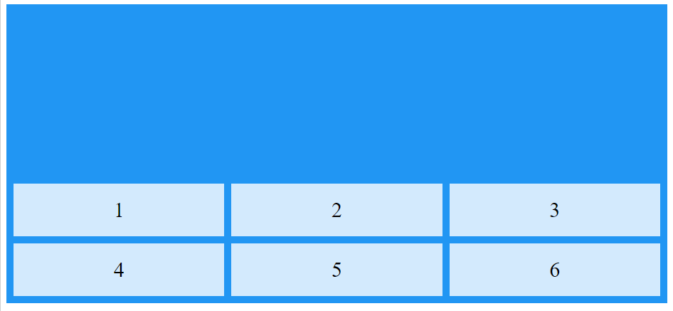


# CSS Grid Item

## Child Elements (Items)

A grid container contains grid items.

By default, a container has one grid item for each column, in each row, but you can style the grid items so that they will *span* multiple columns and/or rows.

## The grid-column Property:

The grid-column property defines on which column(s) to place an item.

You define where the item will start, and where the item will end.

💡 Note: The grid-column property is a shorthand property for the *grid-column-start and the grid-column-end* properties.

To place an item, you can refer to line numbers, or use the keyword "span" to define how many columns the item will span.

Example

Make "item1" start on column 1 and end before column 5:

```css
.item1 {
  grid-column: 1 / 5;
}

```

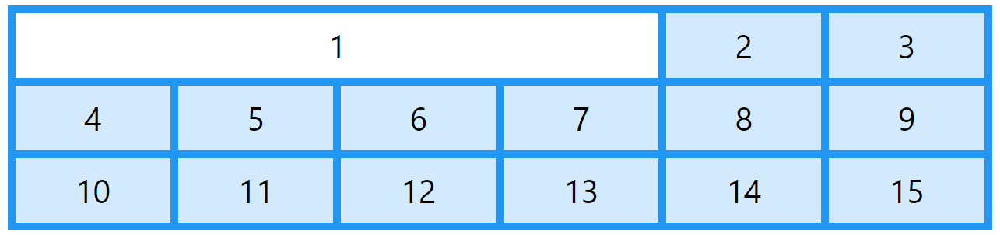

Example

Make "item1" start on column 1 and span 3 columns:

```css
.item1 {
  grid-column: 1 / span 3;
}

```

Example

Make "item2" start on column 2 and span 3 columns:

```css
.item2 {
  grid-column: 2 / span 3;
}

```

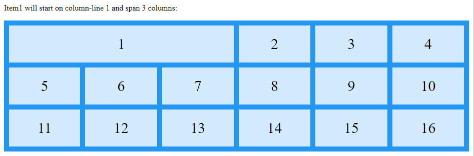


## The grid-row Property:

The grid-row property defines on which row to place an item.

You define where the item will start, and where the item will end.

💡 Note: The grid-row property is a shorthand property for the grid-row-start and the grid-row-end properties.

To place an item, you can refer to line numbers, or use the keyword "span" to define how many rows the item will span:

Example

Make "item1" start on row-line 1 and end on row-line 4:

```css
.item1 {
  grid-row: 1 / 4;
}

```

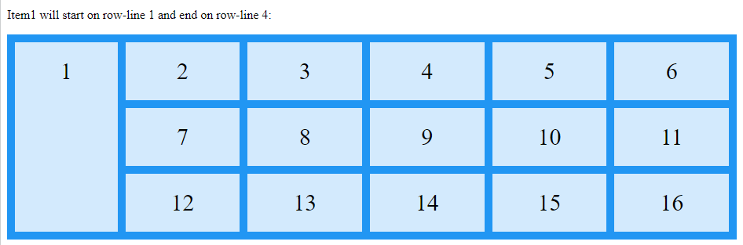

Example

Make "item1" start on row 1 and span 2 rows:

```css
.item1 {
  grid-row: 1 / span 2;
}

```

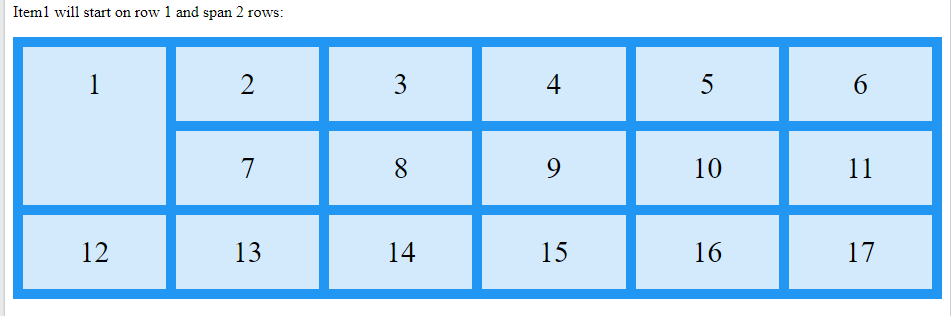

--*LINK - tbc

## The grid-area Property

The grid-area property can be used as a *shorthand* property for the *grid-row-start, grid-column-start, grid-row-end and the grid-column-end* properties.

Example

Make "item8" start on row-line 1 and column-line 2, and end on row-line 5 and column line 6:

```css
.item8 {
  grid-area: 1 / 2 / 5 / 6;
}

```

Example

Make "item8" start on row-line 2 and column-line 1, and span 2 rows and 3 columns:

```css
.item8 {
  grid-area: 2 / 1 / span 2 / span 3;
}

```

Naming Grid Items

The grid-area property can also be used to assign names to grid items.

Header
Menu
Main
Right
Footer

Named grid items can be referred to by the grid-template-areas property of the grid container.

Example

Item1 gets the name "myArea" and spans all five columns in a five columns grid layout:

```css
.item1 {
  grid-area: myArea;
}
.grid-container {
  grid-template-areas: 'myArea myArea myArea myArea myArea';
}

```

Each row is defined by apostrophes (' ')

The columns in each row is defined inside the apostrophes, separated by a space.

Note: A period sign represents a grid item with no name.

Example

Let "myArea" span two columns in a five columns grid layout (period signs represent items with no name):

```css
.item1 {
  grid-area: myArea;
}
.grid-container {
  grid-template-areas: 'myArea myArea . . .';
}

```

To define two rows, define the column of the second row inside another set of apostrophes:

Example

Make "item1" span two columns and two rows:

```css
.grid-container {
  grid-template-areas: 'myArea myArea . . .' 'myArea myArea . . .';
}

```

Example

Name all items, and make a ready-to-use webpage template:

```css
.item1 { grid-area: header; }
.item2 { grid-area: menu; }
.item3 { grid-area: main; }
.item4 { grid-area: right; }
.item5 { grid-area: footer; }

.grid-container {
  grid-template-areas:
    'header header header header header header'
    'menu main main main right right'
    'menu footer footer footer footer footer';
}

```

## The Order of the Items

The Grid Layout allows us to position the items anywhere we like.

The first item in the HTML code does not have to appear as the first item in the grid.

1
2
3
4
5
6

Example

```css
.item1 { grid-area: 1 / 3 / 2 / 4; }
.item2 { grid-area: 2 / 3 / 3 / 4; }
.item3 { grid-area: 1 / 1 / 2 / 2; }
.item4 { grid-area: 1 / 2 / 2 / 3; }
.item5 { grid-area: 2 / 1 / 3 / 2; }
.item6 { grid-area: 2 / 2 / 3 / 3; }

```

You can re-arrange the order for certain screen sizes, by using media queries:

Example

```css
@media only screen and (max-width: 500px) {
  .item1 { grid-area: 1 / span 3 / 2 / 4; }
  .item2 { grid-area: 3 / 3 / 4 / 4; }
  .item3 { grid-area: 2 / 1 / 3 / 2; }
  .item4 { grid-area: 2 / 2 / span 2 / 3; }
  .item5 { grid-area: 3 / 1 / 4 / 2; }
  .item6 { grid-area: 2 / 3 / 3 / 4; }
}

```

