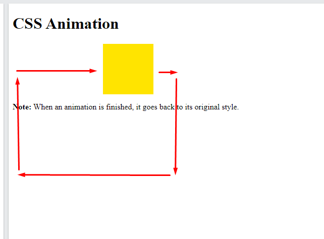

- [Section - Animations](#section---animations)
  - [CSS Animations](#css-animations)
    - [What are CSS Animations?](#what-are-css-animations)
    - [The `@keyframes` Rule](#the-keyframes-rule)
    - [Delay an Animation](#delay-an-animation)
    - [animation-iteration-count (Set How Many Times an Animation Should Run)](#animation-iteration-count-set-how-many-times-an-animation-should-run)
    - [Run Animation in Reverse Direction or Alternate Cycles](#run-animation-in-reverse-direction-or-alternate-cycles)
    - [Specify the Speed Curve of the Animation](#specify-the-speed-curve-of-the-animation)
    - [Specify the fill-mode For an Animation](#specify-the-fill-mode-for-an-animation)
    - [Animation Shorthand Property](#animation-shorthand-property)
    - [CSS Animation Properties](#css-animation-properties)

Source : https://www.w3schools.com/css/css3_animations.asp

# Section - Animations

## CSS Animations

CSS allows animation of HTML elements without using JavaScript or Flash!

In this chapter you will learn about the following properties:

- @keyframes
- animation-name
- animation-duration
- animation-delay
- animation-iteration-count
- animation-direction
- animation-timing-function
- animation-fill-mode
- animation

### What are CSS Animations?

An animation lets an element gradually change from one style to another.

You can change as many CSS properties you want, as many times as you want.

To use CSS animation, you must first specify some keyframes for the animation.

<span style="color:red">Keyframes</span> hold what styles the element will have at certain times.

### The `@keyframes` Rule

When you specify CSS styles inside the `@keyframes` rule, the animation will gradually change `from the current style to the new style at certain times`.

To get an animation to work, you must bind the animation to an element.

The following example binds the "example" animation to the `<div>` element. The animation will last for 4 seconds, and it will gradually change the background-color of the `<div>` element from "red" to "yellow":

Example

```css
/* The animation code */
@keyframes example {
  from {background-color: red;}
  to {background-color: yellow;}
}

/* The element to apply the animation to */
div {
  width: 100px;
  height: 100px;
  background-color: red;
  animation-name: example;
  animation-duration: 4s;
}

```

✏ Note: The animation-duration property defines how long an animation should take to complete. If the animation-duration property is not specified, no animation will occur, because the default value is 0s (0 seconds). 

In the example above we have specified when the style will change by using the keywords "from" and "to" (which represents 0% (start) and 100% (complete)).

It is also `possible to use percent`. By using percent, you can add as many style changes as you like.

The following example will change the background-color of the `<div>` element when the animation is 25% complete, 50% complete, and again when the animation is 100% complete:

Example

```css
/* The animation code */
@keyframes example {
  0%   {background-color: red;}
  25%  {background-color: yellow;}
  50%  {background-color: blue;}
  100% {background-color: green;}
}

/* The element to apply the animation to */
div {
  width: 100px;
  height: 100px;
  background-color: red;
  animation-name: example;
  animation-duration: 4s;
}

```

The following example will change both the background-color and the position of the `<div>` element when the animation is 25% complete, 50% complete, and again when the animation is 100% complete:

Example



```css
/* The animation code */
@keyframes example {
  0%   {background-color:red; left:0px; top:0px;}
  25%  {background-color:yellow; left:200px; top:0px;}
  50%  {background-color:blue; left:200px; top:200px;}
  75%  {background-color:green; left:0px; top:200px;}
  100% {background-color:red; left:0px; top:0px;}
}

/* The element to apply the animation to */
div {
  width: 100px;
  height: 100px;
  position: relative;
  background-color: red;
  animation-name: example;
  animation-duration: 4s;
}

```

### Delay an Animation

The animation-delay property specifies `a delay for the start` of an animation.

The following example has a 2 seconds delay before starting the animation:

Example

```css
div {
  width: 100px;
  height: 100px;
  position: relative;
  background-color: red;
  animation-name: example;
  animation-duration: 4s;
  animation-delay: 2s;
}

```

Negative values are also allowed. If using negative values, the animation will start as if it had already been playing for N seconds. (that is animation time starts from N seconds to the end )

In the following example, the animation will start as if it had already been playing for 2 seconds:

Example

```css
div {
  width: 100px;
  height: 100px;
  position: relative;
  background-color: red;
  animation-name: example;
  animation-duration: 4s;
  animation-delay: -2s;
}

```

### animation-iteration-count (Set How Many Times an Animation Should Run)

The animation-iteration-count property specifies the number of times an animation should run.

The following example will run the animation 3 times before it stops:

Example

```css
div {
  width: 100px;
  height: 100px;
  position: relative;
  background-color: red;
  animation-name: example;
  animation-duration: 4s;
  animation-iteration-count: 3;
}

```

The following example uses the value "infinite" to make the animation continue for ever:

Example

```css
div {
  width: 100px;
  height: 100px;
  position: relative;
  background-color: red;
  animation-name: example;
  animation-duration: 4s;
  animation-iteration-count: infinite;
}

```

--*LINK - tbc

### Run Animation in Reverse Direction or Alternate Cycles

The animation-direction property specifies whether an animation should be played forwards, backwards or in alternate cycles.

The animation-direction property can have the following values:

- normal - The animation is played as normal (forwards). This is default
- reverse - The animation is played in reverse direction (backwards)
- alternate - The animation is played forwards first, then backwards
- alternate-reverse - The animation is played backwards first, then forwards

The following example will run the animation in reverse direction (backwards):

Example

```css
div {
  width: 100px;
  height: 100px;
  position: relative;
  background-color: red;
  animation-name: example;
  animation-duration: 4s;
  animation-direction: reverse;
}

```

The following example uses the value "alternate" to make the animation run forwards first, then backwards:

Example

```css
div {
  width: 100px;
  height: 100px;
  position: relative;
  background-color: red;
  animation-name: example;
  animation-duration: 4s;
  animation-iteration-count: 2;
  animation-direction: alternate;
}

```

The following example uses the value "alternate-reverse" to make the animation run backwards first, then forwards:

Example

```css
div {
  width: 100px;
  height: 100px;
  position: relative;
  background-color: red;
  animation-name: example;
  animation-duration: 4s;
  animation-iteration-count: 2;
  animation-direction: alternate-reverse;
}

```

### Specify the Speed Curve of the Animation

The animation-timing-function property specifies the speed curve of the animation.

The animation-timing-function property can have the following values:

- ease - Specifies an animation with a slow start, then fast, then end slowly (this is default)
- linear - Specifies an animation with the same speed from start to end
- ease-in - Specifies an animation with a slow start
- ease-out - Specifies an animation with a slow end
- ease-in-out - Specifies an animation with a slow start and end
- cubic-bezier(n,n,n,n) - Lets you define your own values in a cubic-bezier function

The following example shows some of the different speed curves that can be used:

Example

```css
#div1 {animation-timing-function: linear;}
#div2 {animation-timing-function: ease;}
#div3 {animation-timing-function: ease-in;}
#div4 {animation-timing-function: ease-out;}
#div5 {animation-timing-function: ease-in-out;}

```
### Specify the fill-mode For an Animation

CSS animations do not affect an element before the first keyframe is played or after the last keyframe is played. The animation-fill-mode property can override this behavior.

The animation-fill-mode property specifies a style for the target element when the animation is not playing (before it starts, after it ends, or both).

The animation-fill-mode property can have the following values:

- none - Default value. Animation will not apply any styles to the element before or after it is executing
- forwards - The element will retain the style values that is set by the last keyframe (depends on animation-direction and animation-iteration-count)
- backwards - The element will get the style values that is set by the first keyframe (depends on animation-direction), and retain this during the animation-delay period
- both - The animation will follow the rules for both forwards and backwards, extending the animation properties in both directions

The following example lets the `<div>` element retain the style values from the last keyframe when the animation ends:

Example

```css
div {
  width: 100px;
  height: 100px;
  background: red;
  position: relative;
  animation-name: example;
  animation-duration: 3s;
  animation-fill-mode: forwards;
}

```

The following example lets the `<div>` element get the style values set by the first keyframe before the animation starts (during the animation-delay period):

Example

```css
div {
  width: 100px;
  height: 100px;
  background: red;
  position: relative;
  animation-name: example;
  animation-duration: 3s;
  animation-delay: 2s;
  animation-fill-mode: backwards;
}

```

The following example lets the `<div>` element get the style values set by the first keyframe before the animation starts, and retain the style values from the last keyframe when the animation ends:

Example

```css
div {
  width: 100px;
  height: 100px;
  background: red;
  position: relative;
  animation-name: example;
  animation-duration: 3s;
  animation-delay: 2s;
  animation-fill-mode: both;
}

```

### Animation Shorthand Property

The example below uses six of the animation properties:

Example

```css
div {
  animation-name: example;
  animation-duration: 5s;
  animation-timing-function: linear;
  animation-delay: 2s;
  animation-iteration-count: infinite;
  animation-direction: alternate;
}

```

The same animation effect as above can be achieved by using the shorthand animation property:

Example

```css
div {
  animation: example 5s linear 2s infinite alternate;
}

```

Test Yourself With Exercises

Exercise:

Add a 2 second animation for the `<div>` element, which changes the color from red to blue. Call the animation "example".


```html
<style>
div {
  width: 100px;
  height: 100px;
  background-color: red;
  animation-name: 
;
  
: 2s;
}

@keyframes example {
  from {
: red;}
  to {
: blue;}
}
</style>

<body>
  <div>This is a div</div>
</body>

```

### CSS Animation Properties

The following table lists the `@keyframes` rule and all the CSS animation properties:

Property                  | Description
--------------------------|---------------------------------------------------------------------------------------------------------------
@keyframes                | Specifies the animation code
animation                 | A shorthand property for setting all the animation properties
animation-delay           | Specifies a delay for the start of an animation
animation-direction       | Specifies whether an animation should be played forwards, backwards or in alternate cycles
animation-duration        | Specifies how long time an animation should take to complete one cycle
animation-fill-mode       | Specifies a style for the element when the animation is not playing (before it starts, after it ends, or both)
animation-iteration-count | Specifies the number of times an animation should be played
animation-name            | Specifies the name of the `@keyframes` animation
animation-play-state      | Specifies whether the animation is running or paused
animation-timing-function | Specifies the speed curve of the animation-