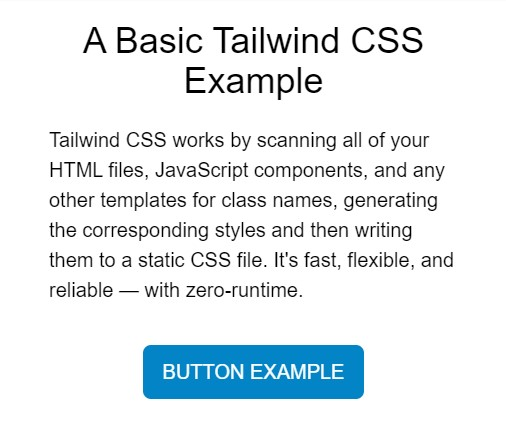

<h1>Tailwind CSS Tutorial for Beginners: A Guide to Get Started in 2023</h1>

Source : https://www.codeinwp.com/blog/tailwind-css-tutorial

by Louis Lazaris - January 1, 2023

One of the hottest and admittedly controversial CSS frameworks to land on the front-end scene in recent years is Tailwind CSS, and this Tailwind CSS tutorial for beginners will try to get you up to speed with what it’s all about.

I’ll cover the basics, along with why you might want to use a tool like Tailwind CSS to build your web pages, and how Tailwind changes your whole view of HTML and CSS.

I’ll also show you how to automatically optimize your Tailwind builds to ensure you’re not using CSS you don’t need.

Tailwind CSS Tutorial

📚 Table of contents:

- Getting started in Tailwind developer mode #
- Using Tailwind’s utility classes #
- Learning Tailwind’s “language” #
- Grouping repeated styles with Tailwind #
- Installing Tailwind’s full toolset #
- Configuring Tailwind projects #
- Generating a Tailwind build #

- [Background: Atomic CSS](#background-atomic-css)
- [Why Atomic CSS?](#why-atomic-css)
- [What is Tailwind CSS?](#what-is-tailwind-css)


# Background: Atomic CSS

In order to understand Tailwind a little better, let’s back up a bit to ensure this Tailwind CSS tutorial makes sense to you.

Tailwind’s concepts are rooted in what’s commonly referred to as *Atomic CSS*, sometimes referred to as *CSS utility classes*. This is a CSS concept where a single HTML class applies a single CSS property/value pair to an element. Here’s a few examples:

```css
.font-weight-bold {
  font-weight: bold;
}

.color-hotpink {
  color: hotpink;
}
```

Then in your HTML you’d use the classes:

```html
<p class="font-weight-bold color-hotpink">Some example text.</p>

```

If you’ve never coded HTML and CSS like this before, then I don’t blame you for being disgusted by the code above. It seems counterproductiv (tr:verimsiz) to isolate each possible property/value pair into a single class name. But in this Tailwind CSS tutorial, you’ll understand why this can be a beneficial approach.

# Why Atomic CSS?

When you have access to every possible property/value pair by means of single-purpose utility classes, like those shown in the previous example, you have a few benefits:

You don’t have to worry about CSS specificity. Every “utility” is a class name, so they’re all at the same level of specificity.

No need to write any CSS at all; you only build elements with class names in the HTML.

You can build just about anything with nothing but HTML.
On the surface, it can seem as though atomic CSS and libraries like Tailwind CSS make your HTML large and somewhat unwieldy (tr:hantal). But that’s a minor hindrance (tr:engel) in comparison to the benefits I mentioned above.

That should be enough of an introduction to atomic CSS. For a little more history, you can check out this [article](https://https://css-tricks.com/lets-define-exactly-atomic-css/) or even the one that started the atomic CSS movement [the atomic CSS movement](https://www.smashingmagazine.com/2013/10/challenging-css-best-practices-atomic-approach/). For the rest of this Tailwind CSS tutorial for beginners, I’ll cover what exactly Tailwind is along with getting up and running with the library.

# What is Tailwind CSS?

Tailwind is a library of atomic CSS rules (i.e., single-purpose utility classes) that helps you build HTML pages without touching your CSS. But Tailwind isn’t just the CSS. In addition to the framework itself, Tailwind includes a [CLI](https://www.codeinwp.com/blog/wp-cli/) and various configuration and theming options. These allow you to automate and scale your builds, thus making the most of Tailwind’s features without sacrificing performance and maintainability.

Before I get to an explanation of the CLI and build options in this Tailwind CSS tutorial for beginners, let’s first consider features of the library itself (i.e. the atomic classes). This will demonstrate how easy it is to build stuff with Tailwind.

## Getting started in Tailwind developer mode

Since Tailwind is designed to allow you to build pages without touching your CSS, this naturally makes the full Tailwind library a large file that you would never want to include in a real website build.

For the purposes of this Tailwind CSS tutorial, in order to learn and experiment with the library, you can use the following code in the <head> of your HTML to include all of Tailwind’s utility classes:

```html
<head>
  <meta charset="UTF-8">
  <meta name="viewport" content="width=device-width, initial-scale=1.0">
  <script src="https://cdn.tailwindcss.com"></script>
</head>

```

The above code includes a script referred to as the  [Tailwind Play CDN](https://tailwindcss.com/docs/installation/play-cdn). This script is only to be used for learning and experimenting, never for a live site. I’ll discuss later how to properly include Tailwind in your projects via the build process. For now, this will do for trying Tailwind out and starting to add classes to style HTML elements.

Using Tailwind’s utility classes

Once you have Tailwind’s library of utilities accessible to a particular page, you can start adding classes to whatever element you want to style.

Here’s a CodePen example with a few page elements, including a button, styled with some Tailwind classes:


The HTML looks like this (text removed for brevity):

```html
<main class="my-0 mx-auto max-w-3xl text-center">
  <h2 class="p-6 text-4xl">...</h2>
  
  <p class="px-10 pb-10 text-left">...</p>

  <button class="bg-sky-600 hover:bg-sky-700 px-5 py-3 text-white rounded-lg">...</button>
</main>
```



As you can see, Tailwind’s utility classes more or less have their own language, based on each of the property/value pairs they represent in natural CSS.

This can be a little intimidating at first, and it’s certainly not for everyone. But many developers have found that this, along with Tailwind’s tooling, is a scalable and efficient way to build large projects that are easier to maintain.

Go to top
Learning Tailwind’s “language”
There’s no way that a Tailwind CSS tutorial for beginners like this could possibly cover all the different nuances of how the utility classes are named. That’s something you’ll have to learn over time, but I’ll do my best to give you some resources to help out.

The Tailwind docs provide lots of info on the class names. You can start in the Layout section and work your way through. Any time you want to add a specific CSS property to an element and aren’t sure of the value, you can use the interactive on-page search feature. It’s available at the top of the left navigation or by using CTRL-K (CMD-K) on your keyboard.

Searching the Tailwind Docs
Type the keyword you want (e.g., the CSS property you want to use) and the search modal will show you relevant results from the docs.

Some examples of common patterns found in the Tailwind utility class syntax include:

Abbreviations, like w, h, sm, md, and lg, for sizing
Near-literal CSS equivalents, like float-left, clear-both, overflow-auto, and so forth
Vertical and horizontal indicators using x and y
Min/max sizing indicators, like min-w and max-h
Font stack abbreviations, like font-sans and font-mono
That’s just a small sampling. Tailwind covers everything in CSS including utilities for all features related to Flexbox and CSS Grid. As mentioned, there’s no way to cover it all here but this should be enough to give you an idea of the kinds of classes you’ll be adding to your elements. If you’ve used a more traditional CSS framework, like Bootstrap, then you’ve already done this sort of thing on a less-granular level. Tailwind takes this to a more atomic level, for more fine-grained control over your styles, almost as if you’re writing CSS directly.

Of course, you’ll never remember all the class names, so here are a few tools that might help:

Tailwind Cheat Sheet on the Tailwind Components website.
Tailwind CSS Cheatsheet, a printable cheat sheet of Tailwind’s classes
Tailwindcss-cheatsheet by Umesh Kadam
Go to top
Grouping repeated styles with Tailwind
Earlier, I showed you an example of HTML with Tailwind utility classes littered throughout. You may have been disturbed by how inefficient it would be to have to style every single element that way – even if the same styles are repeated!

For example, what if I had five buttons on the same page that all looked like this:

<button class="bg-sky-600 hover:bg-sky-700 px-5 py-3 text-white rounded-lg">...</button>
Code language: HTML, XML (xml)
If the buttons appeared one after the other, then I could take advantage of multi-cursor editing in my text editor if I needed to make any changes. I could alternatively use a templating language (either on the front-end or back-end) to dynamically include the repeated elements, which means I would only have to change them in one spot. But what if the elements aren’t that close together or are on separate pages and the above solutions don’t help?

For repeating sections across projects, Tailwind’s docs strongly recommend building your pages by taking advantage of components in libraries like React or template partials in libraries like Twig. This means your styles will be 100% built with utility classes alone, which is ideal.

That being said, Tailwind has directives called @tailwind, @layer, and @apply that allow you to create smaller, reusable collections of utility classes. These would be components (often a single element) that are too small for a full-blown library-level abstraction, but too unwieldy to have to repeat elsewhere (similar to the button example above).

Using the aforementioned directives, I can convert the button example to the following simple HTML:

<button class="btn-main">...</button>
Code language: HTML, XML (xml)
This single HTML class represents all the utility classes I had previously included on my button. This is accomplished using the following in my CSS:

@tailwind base;
@tailwind components;
@tailwind utilities;

@layer components {
  .btn-main {
    @apply bg-sky-600 hover:bg-sky-700 px-5 py-3 text-white rounded-lg;
  }
}
Notice how I’ve moved all the utility classes to the line that starts with @apply. The code above does the following:

Inserts Tailwind’s base, components, and utilities styles into the CSS
Includes the btn-main class in the components “bucket” using @layer
Assigns the selected utility classes to the btn-main class name
With that, I can use .btn-main anywhere I want and all buttons will inherit the same styles. You can see this in action on this demo which I created using Tailwind’s official playground. Click the CSS tab to view the code that encapsulates all the button classes into .btn-main.

Tailwind Playground


## Installing Tailwind’s full toolset

As mentioned, the examples I’ve shown you up to this point are not ideal. The CodePen, for instance, uses the Tailwind Play CDN, which means all of Tailwind’s classes are included in the page, even though I’m only using a few.

To use Tailwind properly, let’s install it and configure it to build only the CSS that I need. In my project folder I’m going to run the following two commands in my terminal:

```bash
npm install -D tailwindcss
```

This installs Tailwind along with all its dependencies in my project folder. Next, I want to initiate Tailwind to create my config file:

```bash
npx tailwindcss init

```

This generates a file called tailwind.config.js in the root of my project folder with the following content inside:

```js
module.exports = {
  content: [],
  theme: {
    extend: {},
  },
  plugins: [],
}

```

Adding anything to this file is optional. If you leave any parts blank, Tailwind will use its default configuration options, which you can view here (https://github.com/tailwindlabs/tailwindcss/blob/master/stubs/defaultConfig.stub.js). The Tailwind docs recommend filling in only the options you want changed, rather than including the full default config file (which you can do by using npx tailwindcss init --full when initiating the project).


## Configuring Tailwind projects

Going into advanced customizations is beyond the scope of this Tailwind CSS tutorial for beginners, but here’s a basic outline of some of the things you can do in the config file:

content – Define paths to your HTML templates, JavaScript components, and other files that use Tailwind class names.
theme – Define default theming options (colors, fonts, etc.) related to the design of your pages and components.
plugins – Include plugins that extend Tailwind.
presets – Define your own base configuration, instead of using Tailwind’s default.
prefix – Define a custom prefix that will appear in front of every Tailwind utility class. This can be useful to overcome class naming conflicts.
important – Forces all of Tailwind’s utility classes to be marked with !important, which might help if you’re adding Tailwind to a legacy project that uses a lot of high-specificity selectors.
For full info on the available configuration options, see the Tailwind docs.

For demonstration purposes, let’s assume a simple configuration file that defines the location of my content:

module.exports = {
  content: [
    './pages/**/*.{html,js}',
    './components/**/*.{html,js}'
  ],
  theme: {
    extend: {},
  },
  plugins: [],
}
Code language: JavaScript (javascript)
This tells Tailwind that I’m including Tailwind classes inside .html and .js files within two folders: pages and components. I’m including JavaScript files because Tailwind recognizes classes added and removed dynamically via JavaScript, some of which will be present only in the .js files and not in the HTML.

In some cases, I might use a src folder, common in many projects, with a public HTML entry point. That would look like this:

module.exports = {
  content: [
    './public/index.html',
    './src/**/*.{html,js}',
  ],
  theme: {
    extend: {},
  },
  plugins: [],
}
Code language: JavaScript (javascript)
It all depends on how you’ve structured your project and the associated content files. You also might be using a processor, like PostCSS, which you can read about here.

As a warning: Make sure you aren’t overly general when identifying content pages in your configuration. For example, you don’t want to use wildcards everywhere, thus making Tailwind look inside node_modules or other folders it shouldn’t be traversing.

Go to top
Generating a Tailwind build
Once you’ve added all your classes to your HTML and JavaScript pages and you’ve identified the location of the pages in Tailwind’s configuration options, you want to build your project to only include the CSS that you’ve specified.

For my example, I’m going to run the following command in my project’s root folder:

npx tailwindcss -o ./css/styles.min.css --minify
This uses the -o command to tell Tailwind to output my CSS in a minified format in the specified folder. This ensures that no unused CSS will exist in my project. If I’ve only used 30 Tailwind classes in my HTML, then only those utilities will be generated in my CSS. From there, I just have to make sure that any HTML pages that use Tailwind classes include a reference to my stylesheet.

Of course, this is just one example of a build and folder structure. Depending on whether you’re using a library like React or Vue, or if you’re scaffolding a particular custom setup each time, you’ll make the necessary adjustments in your configuration file and any associated npm commands during your build step.

Go to top
Tailwind CSS tutorial conclusion
That should be enough to get you up and running with Tailwind before getting into more complex builds. You have the option to use the developer-only Play CDN to experiment and learn the Tailwind utility class language. When it’s time for your build step, you can configure Tailwind to read your HTML and JavaScript files to build only the CSS you’re using.

Once you have these basic concepts in place, you can start incorporating different Tailwind tools, taking advantage of Tailwind’s responsive design features, using various component libraries, plugins, and more. Is Tailwind for everyone? No, and it’s probably somewhat of an overkill for smaller projects. I wouldn’t recommend using Tailwind unless you first learn CSS. But what I’ve presented here should be enough to get you up and running with a Tailwind project today.

If you’ve enjoyed this Tailwind CSS tutorial for beginners, you might also like these:

👉 Beginner’s Guide to CSS Variables
👉 Webpack Tutorial for Beginners