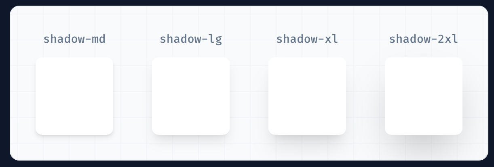

# Section

## Effects

### Box Shadow

Utilities for controlling the box shadow of an element.

​
Class        | Properties
-------------|---------------------------------------------------------------------------------
shadow-sm    | box-shadow: 0 1px 2px 0 rgb(0 0 0 / 0.05);
shadow       | box-shadow: 0 1px 3px 0 rgb(0 0 0 / 0.1), 0 1px 2px -1px rgb(0 0 0 / 0.1);
shadow-md    | box-shadow: 0 4px 6px -1px rgb(0 0 0 / 0.1), 0 2px 4px -2px rgb(0 0 0 / 0.1);
shadow-lg    | box-shadow: 0 10px 15px -3px rgb(0 0 0 / 0.1), 0 4px 6px -4px rgb(0 0 0 / 0.1);
shadow-xl    | box-shadow: 0 20px 25px -5px rgb(0 0 0 / 0.1), 0 8px 10px -6px rgb(0 0 0 / 0.1);
shadow-2xl   | box-shadow: 0 25px 50px -12px rgb(0 0 0 / 0.25);
shadow-inner | box-shadow: inset 0 2px 4px 0 rgb(0 0 0 / 0.05);
shadow-none  | box-shadow: 0 0 #0000;​

🔔 Basic usage - Adding an outer shadow

Use the shadow-sm, shadow, shadow-md, shadow-lg, shadow-xl, or shadow-2xl utilities to apply different sized outer box shadows to an element.



```html
<div class="shadow-md ..."></div>
<div class="shadow-lg ..."></div>
<div class="shadow-xl ..."></div>
<div class="shadow-2xl ..."></div>

```
​
- Adding an inner shadow

Use the shadow-inner utility to apply a subtle inset box shadow to an element. This can be useful for things like form controls or wells.

shadow-inner

```html
<div class="shadow-inner ..."></div>

```
​
Removing the shadow
Use shadow-none to remove an existing box shadow from an element. This is most commonly used to remove a shadow that was applied at a smaller breakpoint.

shadow-none

```html
<div class="shadow-none ..."></div>

```
