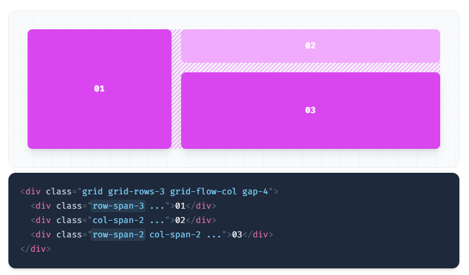

- [Sources](#sources)
- [Cheats](#cheats)
  - [Flex Cheat](#flex-cheat)
  - [Grid Cheat](#grid-cheat)
- [Flexbox](#flexbox)
  - [Flex Container](#flex-container)
  - [Flex Direction](#flex-direction)
  - [Flex Wrap](#flex-wrap)
  - [Flex](#flex)
  - [Flex Grow](#flex-grow)
  - [Flex Shrink](#flex-shrink)
  - [Order](#order)
- [Grid Layout](#grid-layout)
  - [Grid Template Columns](#grid-template-columns)
  - [Grid Column Start / End](#grid-column-start--end)
  - [Grid Template Rows](#grid-template-rows)
  - [Grid Row Start / End](#grid-row-start--end)
  - [Grid Auto Flow tbc](#grid-auto-flow-tbc)
  - [Grid Auto Columns](#grid-auto-columns)
  - [Grid Auto Rows](#grid-auto-rows)
- [Flex/Grid Properties](#flexgrid-properties)
  - [Gap](#gap)
  - [Justify Content](#justify-content)
  - [Justify Items](#justify-items)
  - [Justify Self](#justify-self)
  - [Align Content](#align-content)
  - [Align Items](#align-items)
  - [Align Self](#align-self)
  - [Place Content](#place-content)
  - [Place Items](#place-items)
  - [Place Self](#place-self)
- [Responive Notes](#responive-notes)
- [Options](#options)


# Sources 

- https://tailwindcss.com/docs/flex-basis

- Umeshmk Cheatsheet, 

# Cheats

## Flex Cheat

```css

/* flex basis */
basis-[$spacing]
basis-auto
basis-full
basis-1/2
basis-[1-2]/3
basis-[1-3]/4
basis-[1-4]/5
basis-[1-5]/6
basis-[1-11]/12

/* direction */
flex-row
flex-col
flex-row-reverse
flex-col-reverse

/* wrap */
flex-wrap
flex-wrap-reverse
flex-nowrap

/* flex */
flex-initial
flex-1
flex-auto
flex-none
flex-grow

/* grow */
grow-0
flex-shrink

/* shrink */
shrink-0

/* flex-order */
order-first
order-last
order-none
order-[1-12]

```

## Grid Cheat

```css

/* grid-template-rows */
grid-rows-[1-6]
grid-rows-none

/* grid-template-columns */
grid-cols-[1-12]
grid-cols-none

/* grid-column-[start|end] */
col-auto
col-span-[1-12]
col-span-full
col-start-[1-13]
col-start-auto
col-end-[1-13]
col-end-auto

/* grid-row-[start|end] */
row-auto
row-span-[1-6]
row-span-full
row-start-[1-7]
row-start-auto
row-end-[1-7]
row-end-auto

/* grid-auto-flow */
grid-flow-row
grid-flow-col
grid-flow-dense
grid-flow-row-dense
grid-flow-col-dense

/* grid-auto-columns */
auto-cols-auto
auto-cols-min
auto-cols-max
auto-cols-fr

/* grid-auto-rows */
auto-rows-auto
auto-rows-min
auto-rows-max
auto-rows-fr

```

# Flexbox

## Flex Container

Class | Properties
------|----------------
flex  | display : flex;

## Flex Direction

Utilities for controlling the direction of flex items.


Class            | Properties
-----------------|--------------------------------
flex-row         | flex-direction: row;
flex-row-reverse | flex-direction: row-reverse;
flex-col         | flex-direction: column;
flex-col-reverse | flex-direction: column-reverse;


- Row

Use flex-row to position flex items horizontally in the same direction as text:


```html
<div class="flex flex-row ...">
  <div>1</div>
  <div>2</div>
  <div>3</div>
</div>
```

- Row reversed

Use flex-row-reverse to position flex items horizontally in the opposite direction:


```html
<div class="flex flex-row-reverse ...">
  <div>1</div>
  <div>2</div>
  <div>3</div>
</div>
```

- Column

Use flex-col to position flex items vertically:


```html
<div class="flex flex-col ...">
  <div>1</div>
  <div>2</div>
  <div>3</div>
</div>
```

- Column reversed

Use flex-col-reverse to position flex items vertically in the opposite direction:


```html
<div class="flex flex-col-reverse ...">
  <div>1</div>
  <div>2</div>
  <div>3</div>
</div>
```

## Flex Wrap

Utilities for controlling how flex items wrap.


Class             | Properties
------------------|-------------------------
flex-wrap         | flex-wrap: wrap;
flex-wrap-reverse | flex-wrap: wrap-reverse;
flex-nowrap       | flex-wrap: nowrap;


- Don't wrap
  
Use flex-nowrap to prevent flex items from wrapping, causing inflexible items to overflow the container if necessary:

```html
<div class="flex flex-nowrap">
  <div>1</div>
  <div>2</div>
  <div>3</div>
</div>

```

- Wrap Normally

Use flex-wrap to allow flex items to wrap:

```html
<div class="flex flex-wrap ...">
  <div class="w-1/2 bg-red-200">1</div>
  <div class="w-1/2 bg-yellow-50">2</div>
  <div class="w-1/2 bg-yellow-300">3</div>
</div>
```

- Wrap reversed

Use flex-wrap-reverse to wrap flex items in the reverse direction:

```html
<div class="flex flex-wrap-reverse">
  <div>1</div>
  <div>2</div>
  <div>3</div>
</div>
```

Burada alttan devam etmesi yerine,satır atlamayı yukarı doğru yapar.

- Responsive

```html
<div class="flex flex-wrap md:flex-wrap-reverse ...">
  <!-- ... -->
</div>
```

## Flex

Utilities for controlling how flex items both grow and shrink.

Class        | Properties
-------------|----------------
flex-1       | flex: 1 1 0%;
flex-auto    | flex: 1 1 auto;
flex-initial | flex: 0 1 auto;
flex-none    | flex: none;


- Note : "flex" 
 
This is the shorthand for <span style="color:red">flex-grow, flex-shrink and flex-basis</span> combined. The second and third parameters (flex-shrink and flex-basis) are optional. The default is 0 1 auto, but if you set it with a single number value, it’s like 1 0.

```css
.item {
  flex: none | [ <'flex-grow'> <'flex-shrink'>? || <'flex-basis'> ]
}
```

- Note : "flex-basis"
  
This defines the default size of an element before the remaining space is distributed. It can be a length (e.g. 20%, 5rem, etc.) or a keyword. 

The auto keyword means “look at my width or height property” (which was temporarily done by the main-size keyword until deprecated). 

The content keyword means “size it based on the item’s content” – this keyword isn’t well supported yet, so it’s hard to test and harder to know what its brethren max-content, min-content, and fit-content do.

```css
.item {
  flex-basis:  | auto; /* default auto */
}
```

If set to 0, the extra space around content isn’t factored in. If set to auto, the extra space is distributed based on its flex-grow value.

- Initial

Use flex-initial to allow a flex item to shrink but not grow, taking into account its initial size:

```html
<div class="flex">
  <div class="flex-initial ...">
    <!-- Won't grow, but will shrink if needed -->
  </div>
  <div class="flex-initial ...">
    <!-- Won't grow, but will shrink if needed -->
  </div>
  <div class="flex-initial ...">
    <!-- Won't grow, but will shrink if needed -->
  </div>
</div>
```

- Flex 1

Use flex-1 to allow a flex item to grow and shrink as needed, ignoring its initial size:

```html
<div class="flex">
  <div class="flex-1 ...">
    <!-- Will grow and shrink as needed without taking initial size into account -->
  </div>
  <div class="flex-1 ...">
    <!-- Will grow and shrink as needed without taking initial size into account -->
  </div>
  <div class="flex-1 ...">
    <!-- Will grow and shrink as needed without taking initial size into account -->
  </div>
</div>
```

- Auto

Use flex-auto to allow a flex item to grow and shrink, taking into account its initial size:


```html
<div class="flex ...">
  <div class="flex-auto ...">
    <!-- Will grow and shrink as needed taking initial size into account -->
  </div>
  <div class="flex-auto ...">
    <!-- Will grow and shrink as needed taking initial size into account -->
  </div>
  <div class="flex-auto ...">
    <!-- Will grow and shrink as needed taking initial size into account -->
  </div>
</div>
```

- None

Use flex-none to prevent a flex item from growing or shrinking:

```html
<div class="flex ...">
  <div class="flex-1 ...">
    <!-- Will grow and shrink as needed -->
  </div>
  <div class="flex-none ...">
    <!-- Will not grow or shrink -->
  </div>
  <div class="flex-1 ...">
    <!-- Will grow and shrink as needed -->
  </div>
</div>
```

- Responsive
 
To control how a flex item both grows and shrinks at a specific breakpoint, add a {screen}: prefix to any existing utility class. For example, use md:flex-1 to apply the flex-1 utility at only medium screen sizes and above.

```html
<div class="flex ...">
  <!-- ... -->
  <div class="flex-none md:flex-1 ...">
    Responsive flex item
  </div>
  <!-- ... -->
</div>
```

- Source

https://tailwindcss.com/docs/flex

## Flex Grow

Utilities for controlling how flex items grow.

```
Class           Properties
flex-grow-0	    flex-grow: 0;
flex-grow       flex-grow: 1;
```

- Grow

Use flex-grow to allow a flex item to grow to fill any available space:

```html
<div class="flex ...">
  <div class="flex-none w-16 h-16 ...">
    <!-- This item will not grow -->
  </div>
  <div class="flex-grow h-16 ...">
    <!-- This item will grow -->
  </div>
  <div class="flex-none w-16 h-16 ...">
    <!-- This item will not grow -->
  </div>
</div>
```
- Don't grow

Use flex-grow-0 to prevent a flex item from growing:

```html
<div class="flex ...">
  <div class="flex-grow h-16 ...">
    <!-- This item will grow -->
  </div>
  <div class="flex-grow-0 h-16 ...">
    <!-- This item will not grow -->
  </div>
  <div class="flex-grow h-16 ...">
    <!-- This item will grow -->
  </div>
</div>
```

- Responsive

To control how a flex item grows at a specific breakpoint, add a {screen}: prefix to any existing utility class. For example, use md:flex-grow-0 to apply the flex-grow-0 utility at only medium screen sizes and above.

```html
<div class="flex ...">
  <!-- ... -->
  <div class="flex-grow md:flex-grow-0 ...">
    Responsive flex item
  </div>
  <!-- ... -->
</div>
```

- Source

https://tailwindcss.com/docs/flex-grow

## Flex Shrink

Utilities for controlling how flex items shrink.

```
Class           Properties
flex-shrink-0   flex-shrink: 0;
flex-shrink     flex-shrink: 1;

```

- Shrink

Use flex-shrink to allow a flex item to shrink if needed:

```html
<div class="flex ...">
  <div class="flex-grow w-16 h-16 ...">
    <!-- This item will grow or shrink as needed -->
  </div>
  <div class="flex-shrink w-64 h-16 ...">
    <!-- This item will shrink -->
  </div>
  <div class="flex-grow w-16 h-16 ...">
    <!-- This item will grow or shrink as needed -->
  </div>
</div>
```

Ortadaki blok küçülebilir ve de tekrar w-64 kadar büyüyebilir, fakat ondan sonra sabit kalır.

- Don't shrink

Use flex-shrink-0 to prevent a flex item from shrinking:


```html
<div class="flex ...">
  <div class="flex-1 h-16 ...">
    <!-- This item will grow or shrink as needed -->
  </div>
  <div class="flex-shrink-0 h-16 w-32 ...">
    <!-- This item will not shrink below its initial size-->
  </div>
  <div class="flex-1 h-16 ...">
    <!-- This item will grow or shrink as needed -->
  </div>
</div>
```

- Responsive

To control how a flex item shrinks at a specific breakpoint, add a {screen}: prefix to any existing utility class. For example, use md:flex-shrink-0 to apply the flex-shrink-0 utility at only medium screen sizes and above.

```html
<div class="flex ...">
  <!-- ... -->
  <div class="flex-shrink md:flex-shrink-0 ...">
    Responsive flex item
  </div>
  <!-- ... -->
</div>
```

## Order

Utilities for controlling the order of flex and grid items.

```
Class     Properties
order-1	    order: 1;
order-2	    order: 2;
order-3	    order: 3;
order-4	    order: 4;
order-5	    order: 5;
order-6	    order: 6;
order-7	    order: 7;
order-8	    order: 8;
order-9	    order: 9;
order-10	  order: 10;
order-11	  order: 11;
order-12	  order: 12;
order-first	order: -9999;
order-last	order: 9999;
order-none	order: 0;
```

- Usage

Use order-{order} to render flex and grid items in a different order than they appear in the DOM.

```html
<div class="flex justify-between ...">
  <div class="order-last">1</div>
  <div>2</div>
  <div>3</div>
</div>
```

- Responsive

To apply an order utility only at a specific breakpoint, add a {screen}: prefix to the existing class name. For example, adding the class md:order-last to an element would apply the order-last utility at medium screen sizes and above.

```html
<div class="flex">
  <div>1</div>
  <div class="order-first md:order-last">2</div>
  <div>3</div>
</div>
```

- Source
  
https://tailwindcss.com/docs/order


# Grid Layout

## Grid Template Columns

Utilities for specifying the columns in a grid layout.

Class            | Properties
-----------------|-------------------------------------------------------
grid-cols-[1-12] | grid-template-columns: repeat([1-12], minmax(0, 1fr));
grid-cols-none   | grid-template-columns: none;

🔔 Basic usage : Specifying the columns in a grid

Use the grid-cols-{n} utilities to create grids with n equally sized columns.


```html
<div class="grid grid-cols-4 gap-4">
  <div>01</div>
  <!-- ... -->
  <div>09</div>
</div>

```

- Source: https://tailwindcss.com/docs/grid-template-columns

## Grid Column Start / End

Utilities for controlling how elements are sized and placed across grid columns.


Class            | Properties
-----------------|----------------------------------------
col-auto         | grid-column: auto;
col-span-[1-12]  | grid-column: span [1-12] / span [1-12];
col-span-full    | grid-column: 1 / -1;
col-start-[1-13] | grid-column-start: [1-13];
col-start-auto   | grid-column-start: auto;
col-end-[1-13]   | grid-column-end: [1-13];
col-end-auto     | grid-column-end: auto;

🔔 Basic usage : Spanning columns

Use the col-span-{n} utilities to make an element span n columns.


```html
<div class="grid grid-cols-3 gap-4">
  <div class="...">01</div>
  <div class="...">02</div>
  <div class="...">03</div>
  <div class="col-span-2 ...">04</div>
  <div class="...">05</div>
  <div class="...">06</div>
  <div class="col-span-2 ...">07</div>
</div>
```

🔔 Starting and ending lines

Use the col-start-{n} and col-end-{n} utilities to make an element start or end at the nth grid line. These can also be combined with the col-span-{n} utilities to span a specific number of columns.

Note that CSS grid lines start at 1, not 0, so a full-width element in a 6-column grid would start at line 1 and end at line 7.


```html
<div class="grid grid-cols-6 gap-4">
  <div class="col-start-2 col-span-4 ...">01</div>
  <div class="col-start-1 col-end-3 ...">02</div>
  <div class="col-end-7 col-span-2 ...">03</div>
  <div class="col-start-1 col-end-7 ...">04</div>
</div>
```

## Grid Template Rows

Utilities for specifying the rows in a grid layout.

Class           | Properties
----------------|---------------------------------------------------
grid-rows-[1-6] | grid-template-rows: repeat([1-6], minmax(0, 1fr));
grid-rows-none  | grid-template-rows: none;

🔔 Basic usage :Specifying the rows in a grid

Use the grid-rows-{n} utilities to create grids with n equally sized rows.


## Grid Row Start / End

Utilities for controlling how elements are sized and placed across grid rows.

Class           | Properties
----------------|-----------------------------------
row-auto        | grid-row: auto;
row-span-[1-6]  | grid-row: span [1-6] / span [1-6];
row-span-full   | grid-row: 1 / -1;
row-start-[1-7] | grid-row-start: [1-7];
row-start-auto  | grid-row-start: auto;
row-end-[1-7]   | grid-row-end: [1-7];
row-end-auto    | grid-row-end: auto;

🔔 Basic usage : Spanning rows

Use the row-span-{n} utilities to make an element span n rows.



```html
<div class="grid grid-rows-3 grid-flow-col gap-4">
  <div class="row-span-3 ...">01</div>
  <div class="col-span-2 ...">02</div>
  <div class="row-span-2 col-span-2 ...">03</div>
</div>
```

🔔 Starting and ending lines

Use the row-start-{n} and row-end-{n} utilities to make an element start or end at the nth grid line. These can also be combined with the row-span-{n} utilities to span a specific number of rows.

Note that CSS grid lines start at 1, not 0, so a full-height element in a 3-row grid would start at line 1 and end at line 4.


```html
<div class="grid grid-rows-3 grid-flow-col gap-4">
  <div class="row-start-2 row-span-2 ...">01</div>
  <div class="row-end-3 row-span-2 ...">02</div>
  <div class="row-start-1 row-end-4 ...">03</div>
</div>
```

--*LINK - tbc

## Grid Auto Flow tbc

Utilities for controlling how elements in a grid are auto-placed.

Class               | Properties
--------------------|------------------------------
grid-flow-row       | grid-auto-flow: row;
grid-flow-col       | grid-auto-flow: column;
grid-flow-dense     | grid-auto-flow: dense;
grid-flow-row-dense | grid-auto-flow: row dense;
grid-flow-col-dense | grid-auto-flow: column dense;

🔔 Basic usage : Controlling grid element placement

Use the grid-flow-{keyword} utilities to control how the auto-placement algorithm works for a grid layout.


## Grid Auto Columns

Utilities for controlling the size of implicitly-created grid columns.

Class          | Properties
---------------|-----------------------------------
auto-cols-auto | grid-auto-columns: auto;
auto-cols-min  | grid-auto-columns: min-content;
auto-cols-max  | grid-auto-columns: max-content;
auto-cols-fr   | grid-auto-columns: minmax(0, 1fr);

🔔 Basic usage - Sizing implicitly-created grid rows

Use the auto-rows-{size} utilities to control the size of implicitly-created grid rows.

--*NOTE - görüntü eklenebilir

## Grid Auto Rows

Utilities for controlling the size of implicitly-created grid rows.

Class          | Properties
---------------|--------------------------------
auto-rows-auto | grid-auto-rows: auto;
auto-rows-min  | grid-auto-rows: min-content;
auto-rows-max  | grid-auto-rows: max-content;
auto-rows-fr   | grid-auto-rows: minmax(0, 1fr);

```html
<div class="grid grid-flow-row auto-rows-max">
  <div>01</div>
  <div>02</div>
  <div>03</div>
</div>
```

--*NOTE - görüntü eklenebilir

# Flex/Grid Properties

## Gap

Utilities for controlling *gutters* between *grid and flexbox items*.

Class         | Properties
--------------|--------------------------
gap-[$size]   | gap: [size_value];
gap-x-[$size] | column-gap: [size_value];
gap-y-[$size] | row-gap: [size_value];

- Basic Usage : Use gap-{size} to change the gap between both rows and columns in grid and flexbox layouts.


```html
<div class="grid gap-12 grid-cols-2">
  <div class="bg-yellow-300" >1</div>
  <div class="bg-yellow-300">2</div>
  <div class="bg-yellow-300">3</div>
  <div class="bg-yellow-300">4</div>
</div>
```

- Basic Usage : Changing row and column gaps independently

Use gap-x-{size} and gap-y-{size} to change the gap between rows and columns independently.


```html
<div class="grid gap-x-8 gap-y-4 grid-cols-3">
  <div>1</div>
  <div>2</div>
  <div>3</div>
  <div>4</div>
  <div>5</div>
  <div>6</div>
</div>
```

- Source : https://tailwindcss.com/docs/gap

## Justify Content

Utilities for controlling how flex and grid items are positioned along a container's main axis. 


Class           | Properties
----------------|--------------------------------
justify-start   | justify-content: flex-start;
justify-end     | justify-content: flex-end;
justify-center  | justify-content: center;
justify-between | justify-content: space-between;
justify-around  | justify-content: space-around;
justify-evenly  | justify-content: space-evenly;


✏ Note : main axis , for flex-row, main axis is x axis (horizontal). For flex-column, main axis is y axis (vertical). Then for flex-row, alignment on x axis is controlled, items can move left and right.

(tor: Flex-row da ana eksen x koordinatıdır (yatayda hizalama - yatayda sağa,sola,ortaya vs...), flex-column da y koordinatıdır (dikey, yukarı aşağı hizalama).)

- Start

Use justify-start to justify items against the start of the container’s main axis:


```html
<div class="flex justify-start ...">
  <div>1</div>
  <div>2</div>
  <div>3</div>
</div>
```

- Center

Use justify-center to justify items along the center of the container’s main axis:


```html
<div class="flex justify-center ...">
  <div>1</div>
  <div>2</div>
  <div>3</div>
</div>
```

- End

Use justify-end to justify items against the end of the container’s main axis:


```html
<div class="flex justify-end ...">
  <div>1</div>
  <div>2</div>
  <div>3</div>
</div>
```

- Space between


Use justify-between to justify items along the container’s main axis such that there is an equal amount of space between each item:

```html
<div class="flex justify-between ...">
  <div>1</div>
  <div>2</div>
  <div>3</div>
</div>
```

- Space around

Use justify-around to justify items along the container’s main axis such that there is an equal amount of space on each side of each item:


```html
<div class="flex justify-around ...">
  <div>1</div>
  <div>2</div>
  <div>3</div>
</div>
```

- Space evenly

Use justify-evenly to justify items along the container’s main axis such that there is an equal amount of space around each item, but also accounting for the doubling of space you would normally see between each item when using justify-around:


```html
<div class="flex justify-evenly ...">
  <div>1</div>
  <div>2</div>
  <div>3</div>
</div>
```

- Responsive variants can be used.

## Justify Items

Utilities for controlling how grid items are aligned along <span style="color:red">their inline axis</span>.


Class                 | Properties
----------------------|------------------------
justify-items-start   | justify-items: start;
justify-items-end     | justify-items: end;
justify-items-center  | justify-items: center;
justify-items-stretch | justify-items: stretch;

- Start

Use justify-items-start to justify grid items against the start of their inline axis:


```html
<div class="grid justify-items-start ...">
  <div>1</div>
  <div>2</div>
  <div>3</div>
  <div>4</div>
  <div>5</div>
  <div>6</div>
</div>
```

- End

Use justify-items-end to justify grid items against the end of their inline axis:


```html
<div class="grid justify-items-end ...">
  <div>1</div>
  <div>2</div>
  <div>3</div>
  <div>4</div>
  <div>5</div>
  <div>6</div>
</div>
```

- Center

Use justify-items-center to justify grid items along their inline axis:


```html
<div class="grid justify-items-center ...">
  <div>01</div>
  <div>02</div>
  <div>03</div>
  <div>04</div>
  <div>05</div>
  <div>06</div>
</div>
```

- Stretch
Use justify-items-stretch to stretch items along their inline axis:


```html
<div class="grid justify-items-stretch ...">
  <div>01</div>
  <div>02</div>
  <div>03</div>
  <div>04</div>
  <div>05</div>
  <div>06</div>
</div>
```

- Source : https://tailwindcss.com/docs/justify-items

## Justify Self

Utilities for controlling how an individual grid item is aligned along its inline axis.

Class                | Properties
---------------------|-----------------------
justify-self-auto    | justify-self: auto;
justify-self-start   | justify-self: start;
justify-self-end     | justify-self: end;
justify-self-center  | justify-self: center;
justify-self-stretch | justify-self: stretch;


- Auto

Use justify-self-auto to align an item based on the value of the grid’s justify-items property:

```html
<div class="grid justify-items-stretch ...">
  <!-- ... -->
  <div class="justify-self-auto ...">1</div>
  <!-- ... -->
  <!-- ... -->
  <!-- ... -->
  <!-- ... -->
</div>
```

- Start

Use justify-self-start to align a grid item to the start its inline axis:


- Center

Use justify-self-center to align a grid item along the center its inline axis:

- End

Use justify-self-end to align a grid item to the end its inline axis:

- Stretch

Use justify-self-stretch to stretch a grid item to fill the grid area on its inline axis:

- Source : https://tailwindcss.com/docs/justify-self

## Align Content

Utilities for controlling how rows are positioned in multi-row flex and grid containers.


Class           | Properties
----------------|------------------------------
content-center  | align-content: center;
content-start   | align-content: flex-start;
content-end	a   | lign-content: flex-end;
content-between | align-content: space-between;
content-around  | align-content: space-around;
content-evenly  | align-content: space-evenly;

- Start

Use content-start to pack rows in a container against the start of the cross axis:

```html
<div class="h-48 flex flex-wrap content-start ...">
  <div>1</div>
  <div>2</div>
  <div>3</div>
  <div>4</div>
  <div>5</div>
</div>
```

- Center

Use content-center to pack rows in a container in the center of the cross axis:


- End

Use content-end to pack rows in a container against the end of the cross axis:

- Space between

Use content-between to distribute rows in a container such that there is an equal amount of space between each line:

- Space around

Use content-around to distribute rows in a container such that there is an equal amount of space around each line:

- Space evenly

Use content-evenly to distribute rows in a container such that there is an equal amount of space around each item, but also accounting for the doubling of space you would normally see between each item when using content-around:

- Source : https://tailwindcss.com/docs/align-content

## Align Items

Utilities for controlling how flex and grid items are positioned along a container's cross axis.


Class          | Properties
---------------|-------------------------
items-start    | align-items: flex-start;
items-end      | align-items: flex-end;
items-center   | align-items: center;
items-baseline | align-items: baseline;
items-stretch  | align-items: stretch;

- Stretch

Use items-stretch to stretch items to fill the container’s cross axis:


```html
<div class="flex items-stretch ...">
  <div class="py-4">1</div>
  <div class="py-12">2</div>
  <div class="py-8">3</div>
</div>
```

- Start

Use items-start to align items to the start of the container’s cross axis:


```html
<div class="flex items-start ...">
  <div class="py-4">01</div>
  <div class="py-12">02</div>
  <div class="py-8">03</div>
</div>

```

- Center

Use items-center to align items along the center of the container’s cross axis:


```html
<div class="flex items-center ...">
  <div class="py-4">01</div>
  <div class="py-12">02</div>
  <div class="py-8">03</div>
</div>
```

- End

Use items-end to align items to the end of the container’s cross axis:


```html
<div class="flex items-end ...">
  <div class="py-4">01</div>
  <div class="py-12">02</div>
  <div class="py-8">03</div>
</div>
```

- Baseline

Use items-baseline to align items along the container’s cross axis such that all of their baselines align:


```html
<div class="flex items-baseline ...">
  <div class="pt-2 pb-6">01</div>
  <div class="pt-8 pb-12">02</div>
  <div class="pt-12 pb-4">03</div>
</div>

```

- Source : https://tailwindcss.com/docs/align-items

## Align Self

Utilities for controlling how an individual flex or grid item is positioned along its container's cross axis.

Class        | Properties
-------------|------------------------
self-auto    | align-self: auto;
self-start   | align-self: flex-start;
self-end     | align-self: flex-end;
self-center  | align-self: center;
self-stretch | align-self: stretch;


- Auto

Use self-auto to align an item based on the value of the container’s align-items property:

```html
<div class="flex items-stretch ...">
  <div>1</div>
  <div class="self-auto ...">2</div>
  <div>3</div>
</div>
```

## Place Content

Utilities for controlling how content is justified and aligned at the same time.


## Place Items

Utilities for controlling how items are justified and aligned at the same time.

## Place Self

Utilities for controlling how an individual item is justified and aligned at the same time.


# Responive Notes

You can also use variant modifiers to target media queries like responsive breakpoints, dark mode, prefers-reduced-motion, and more. For example, use md:grid-cols-6 to apply the grid-cols-6 utility at only medium screen sizes and <span style="color:red">above</span>.

# Options

- Applying conditionally : Hover, focus, and other states
- Breakpoints and media queries
- Using Custom values
- Arbitrary values 

Refer doc.

