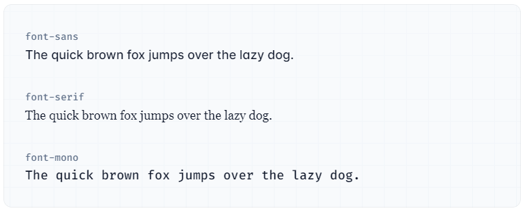
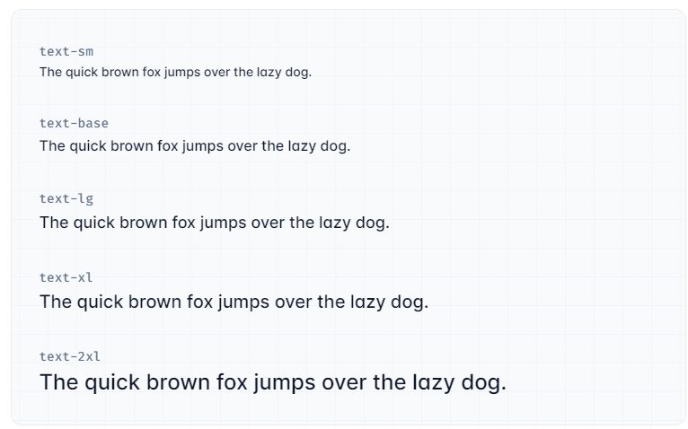
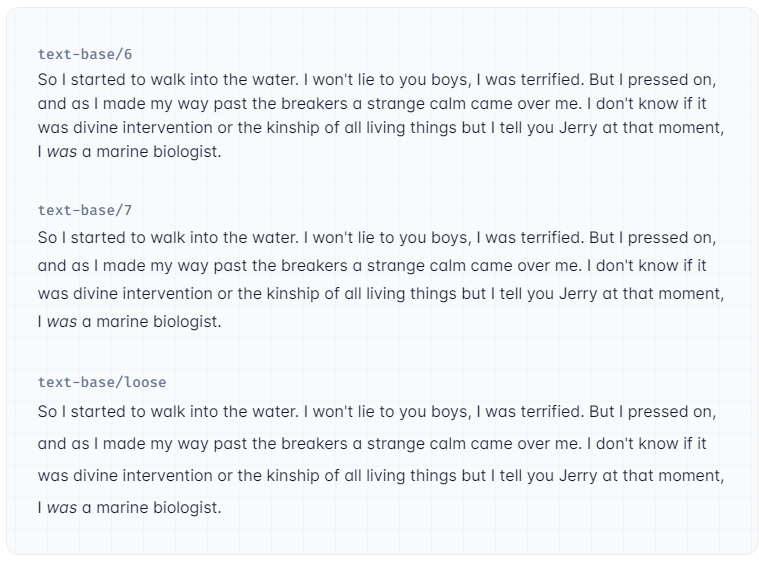
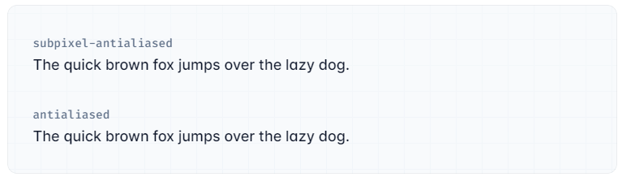

- [Section : Typography](#section--typography)
  - [Typography](#typography)
    - [Font Family](#font-family)
    - [Font Size](#font-size)
    - [Font Smoothing](#font-smoothing)


# Section : Typography

Source : https://tailwindcss.com/docs/font-family

## Typography

### Font Family

Utilities for controlling the font family of an element.

​Class     | Properties
-----------|------------------------------------------------------------------------------------------------------------------------------------------------------------------------------------------------------------------------------
font-sans  | font-family: ui-sans-serif, system-ui, -apple-system, BlinkMacSystemFont, "Segoe UI", Roboto, "Helvetica Neue", Arial, "Noto Sans", sans-serif, "Apple Color Emoji", "Segoe UI Emoji", "Segoe UI Symbol", "Noto Color Emoji";
font-serif | font-family: ui-serif, Georgia, Cambria, "Times New Roman", Times, serif;
font-mono  | font-family: ui-monospace, SFMono-Regular, Menlo, Monaco, Consolas, "Liberation Mono", "Courier New", monospace;

🔔 Basic usage : Setting the font family

You can control the typeface of text using the font family utilities.



```html
<p class="font-sans ...">The quick brown fox ...</p>
<p class="font-serif ...">The quick brown fox ...</p>
<p class="font-mono ...">The quick brown fox ...</p>

```

### Font Size

Utilities for controlling the font size of an element.

​
Class     | Properties
----------|----------------------------------------------------------------------
text-xs   | font-size: 0.75rem; /*12px*/ <br/> line-height: 1rem; /*16px*/
text-sm   | font-size: 0.875rem; /*14px*/ <br/>line-height: 1.25rem; /*20px*/
text-base | font-size: 1rem; /*16px*/ <br/>line-height: 1.5rem; /*24px*/
text-lg   | font-size: 1.125rem; /* 18px */ <br/>line-height: 1.75rem; /* 28px */
text-xl   | font-size: 1.25rem; /* 20px */ <br/>line-height: 1.75rem; /* 28px */
text-2xl  | font-size: 1.5rem; /* 24px */ <br/>line-height: 2rem; /* 32px */
text-3xl  | font-size: 1.875rem; /* 30px */ <br/>line-height: 2.25rem; /* 36px */
text-4xl  | font-size: 2.25rem; /* 36px */ <br/>line-height: 2.5rem; /* 40px */
text-5xl  | font-size: 3rem; /* 48px */ <br/>line-height: 1;
text-6xl  | font-size: 3.75rem; /* 60px */ <br/>line-height: 1;
text-7xl  | font-size: 4.5rem; /* 72px */ <br/>line-height: 1;
text-8xl  | font-size: 6rem; /* 96px */ <br/>line-height: 1;
text-9xl  | font-size: 8rem; /* 128px */ <br/>line-height: 1;


🔔 Basic usage : Setting the font size

Control the font size of an element using the text-{size} utilities.



```html
<p class="text-sm ...">The quick brown fox ...</p>
<p class="text-base ...">The quick brown fox ...</p>
<p class="text-lg ...">The quick brown fox ...</p>
<p class="text-xl ...">The quick brown fox ...</p>
<p class="text-2xl ...">The quick brown fox ...</p>

```
​
- Setting the line-height

Set an element’s line-height at the same time you set the font size by adding a line-height modifier to any font size utility. For example, use text-xl/8 to set a font size of 1.25rem with a line-height of 2rem.



```html
<p class="text-base/6 ...">So I started to walk into the water...</p>
<p class="text-base/7 ...">So I started to walk into the water...</p>
<p class="text-base/loose ...">So I started to walk into the water...</p>

```

You can use any value defined in your line-height scale, or use arbitrary values if you need to deviate from your design tokens.

```html
<p class="text-sm/[17px] ..."></p>

```

### Font Smoothing

Utilities for controlling the font smoothing of an element.

​
Class                | Properties
---------------------|-------------------------------------------------------------------------------
antialiased          | -webkit-font-smoothing: antialiased; <br/> -moz-osx-font-smoothing: grayscale;
subpixel-antialiased | -webkit-font-smoothing: auto; <br/> -moz-osx-font-smoothing: auto;
​
🔔 Basic usage 
​
- Applying font smoothing

Use the subpixel-antialiased utility to render text using subpixel antialiasing and the antialiased utility to render text using grayscale antialiasing.



```html
<p class="subpixel-antialiased ...">The quick brown fox ...</p>
<p class="antialiased ...">The quick brown fox ...</p>

```


