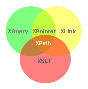

<h2>XPATH TUTOR</h2>

- [XPath Intro](#xpath-intro)
  - [What is XPath?](#what-is-xpath)
  - [Path Expressions](#path-expressions)
  - [Standard Functions](#standard-functions)
  - [XPath is Used in XSLT](#xpath-is-used-in-xslt)
  - [XPath is a W3C Recommendation](#xpath-is-a-w3c-recommendation)
- [XPath Nodes](#xpath-nodes)
  - [XPath Terminology](#xpath-terminology)
    - [Nodes](#nodes)
    - [Atomic values](#atomic-values)
    - [Items](#items)
  - [Relationship of Nodes](#relationship-of-nodes)
    - [Parent](#parent)
    - [Children](#children)
    - [Siblings](#siblings)
    - [Ancestors](#ancestors)
    - [Descendants](#descendants)
- [XPath Syntax](#xpath-syntax)
  - [Selecting Nodes](#selecting-nodes)
  - [Predicates](#predicates)
  - [Selecting Unknown Nodes](#selecting-unknown-nodes)


# XPath Intro

Source : https://www.w3schools.com/xml/xpath_intro.asp

## What is XPath?

XPath can be used to navigate through elements and attributes in an XML document.

XPath is a major element in the <span style="color:red">XSLT standard</span>.



XPath	

- XPath stands for XML Path Language
- XPath uses "path like" syntax to identify and navigate nodes in an XML document
- XPath contains over 200 built-in functions
- XPath is a major element in the XSLT standard
- XPath is a W3C recommendation

## Path Expressions

XPath uses path expressions to select nodes or node-sets in an XML document.

These path expressions look very much like the path expressions you use with traditional computer file systems:


## Standard Functions

XPath includes over 200 built-in functions.

There are functions for string values, numeric values, booleans, date and time comparison, node manipulation, sequence manipulation, and much more.

Today XPath expressions can also be used in JavaScript, Java, XML Schema, PHP, Python, C and C++, and lots of other languages.

## XPath is Used in XSLT

XPath is a major element in the XSLT standard.

With XPath knowledge you will be able to take great advantage of your XSLT knowledge.

## XPath is a W3C Recommendation

XPath 1.0 became a W3C Recommendation on November 16, 1999.

XPath 2.0 became a W3C Recommendation on January 23, 2007.

XPath 3.0 became a W3C Recommendation on April 8, 2014.

# XPath Nodes

## XPath Terminology

### Nodes

In XPath, there are seven kinds of nodes: <span style="color:red">element, attribute, text, namespace, processing-instruction, comment, and root nodes</span>.

❗ Attribute are also a kind of nodes.

XML documents are treated as trees of nodes. The topmost element of the tree is called the root element.

Look at the following XML document:

```xml
<?xml version="1.0" encoding="UTF-8"?>

<bookstore>
  <book>
    <title lang="en">Harry Potter</title>
    <author>J K. Rowling</author>
    <year>2005</year>
    <price>29.99</price>
  </book>
</bookstore>

```

Example of *nodes* in the XML document above:

```xml
<bookstore> (root element node)

<author>J K. Rowling</author> (element node)

lang="en" (attribute node)

```

### Atomic values

Atomic values are nodes with no children or parent.

Example of atomic values:

```
J K. Rowling

"en"

```

### Items

Items are <span style="color:red">atomic values or nodes</span>.

## Relationship of Nodes

### Parent

Each element and attribute has one parent.

In the following example; the book element is the parent of the title, author, year, and price:

```xml
<book>
  <title>Harry Potter</title>
  <author>J K. Rowling</author>
  <year>2005</year>
  <price>29.99</price>
</book>

```

### Children

Element nodes may have zero, one or more children.

In the following example; the title, author, year, and price elements are all children of the book element:

```xml
<book>
  <title>Harry Potter</title>
  <author>J K. Rowling</author>
  <year>2005</year>
  <price>29.99</price>
</book>

```

### Siblings

Nodes that have the same parent.

In the following example; the title, author, year, and price elements are all siblings:

```xml
<book>
  <title>Harry Potter</title>
  <author>J K. Rowling</author>
  <year>2005</year>
  <price>29.99</price>
</book>

```

### Ancestors

A node's parent, parent's parent, etc.

In the following example; the ancestors of the title element are the book element and the bookstore element:

```xml
<bookstore>

<book>
  <title>Harry Potter</title>
  <author>J K. Rowling</author>
  <year>2005</year>
  <price>29.99</price>
</book>

</bookstore>

```

### Descendants

A node's children, children's children, etc.

In the following example; descendants of the bookstore element are the book, title, author, year, and price elements:

```xml
<bookstore>

<book>
  <title>Harry Potter</title>
  <author>J K. Rowling</author>
  <year>2005</year>
  <price>29.99</price>
</book>

</bookstore>

```

# XPath Syntax

XPath uses path expressions to select nodes or node-sets in an XML document. The node is selected by following a path or steps.

🔔 **The XML Example Document**

We will use the following XML document in the examples below.

```xml
<?xml version="1.0" encoding="UTF-8"?>

<bookstore>

<book>
  <title lang="en">Harry Potter</title>
  <price>29.99</price>
</book>

<book>
  <title lang="en">Learning XML</title>
  <price>39.95</price>
</book>

</bookstore>

```

## Selecting Nodes

XPath uses path expressions to select nodes in an XML document. The node is selected by following a path or steps. The most useful path expressions are listed below:


Expression | Description
-----------|------------------------------------------------------------------------------------------------------
nodename   | Selects all nodes with the name "nodename"
/          | Selects from the root node
//         | Selects nodes in the document from the current node that match the selection no matter where they are
.          | Selects the current node
..         | Selects the parent of the current node
@          | Selects attributes

*Example*

In the table below we have listed some path expressions and the result of the expressions:

Path Expression | Result
----------------|-----------------------------------------------------------------------------------------------------------------------------------------
bookstore       | Selects all nodes with the name "bookstore"
/bookstore      | Selects the root element bookstore <br/>Note: If the path starts with a slash ( / ) it always represents an absolute path to an element!
bookstore/book  | Selects *all book elements* that are children of bookstore
//book          | Selects *all book elements* no matter where they are in the document
bookstore//book | Selects all book elements that are *descendant* of the bookstore element, no matter where they are under the bookstore element
//@lang         | Selects all attributes that are named lang

## Predicates

Predicates are used to find a specific node or a node that contains a specific value.

Predicates are always embedded in square brackets.

In the table below we have listed some path expressions with predicates and the result of the expressions:

Path Expression                    | Result
-----------------------------------|-----------------------------------------------------------------------------------------------------------------------------------------------------------------------------------------------------------------------------------------------------------------------------------------------
/bookstore/book[1]                 | Selects *the first book element* that is the child of the bookstore element. <br/>Note: In IE 5,6,7,8,9 first node is[0], but according to W3C, it is [1]. To solve this problem in IE, set the SelectionLanguage to XPath: <br/> In JavaScript: xml.setProperty("SelectionLanguage","XPath");
/bookstore/book[last()]            | Selects the last book element that is the child of the bookstore element
/bookstore/book[last()-1]          | Selects the last but one book element that is the child of the bookstore element
/bookstore/book[position()<3]      | Selects the first two book elements that are children of the bookstore element
//title[@lang]                     | Selects all the title elements that have an attribute named lang
//title[@lang='en']                | Selects all the title elements that have a "lang" attribute with a value of "en"
/bookstore/book[price>35.00]       | Selects all the book elements of the bookstore element that have a price element with a value greater than 35.00
/bookstore/book[price>35.00]/title | Selects all the title elements of the book elements of the bookstore element that have a price element with a value greater than 35.00

## Selecting Unknown Nodes

XPath wildcards can be used to select unknown XML nodes.

Wildcard	Description
*	Matches any element node
@*	Matches any attribute node
node()	Matches any node of any kind
In the table below we have listed some path expressions and the result of the expressions:

Path Expression	Result
/bookstore/*	Selects all the child element nodes of the bookstore element
//*	Selects all elements in the document
//title[@*]	Selects all title elements which have at least one attribute of any kind
Selecting Several Paths
By using the | operator in an XPath expression you can select several paths.

In the table below we have listed some path expressions and the result of the expressions:

Path Expression	Result
//book/title | //book/price	Selects all the title AND price elements of all book elements
//title | //price	Selects all the title AND price elements in the document
/bookstore/book/title | //price	Selects all the title elements of the book element of the bookstore element AND all the price elements in the document