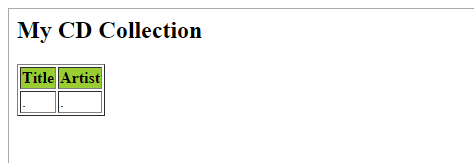
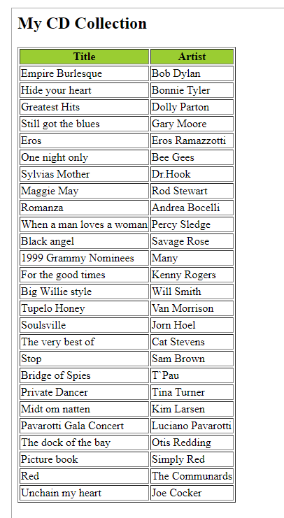
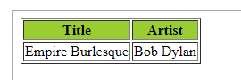

<h1>XSLT TUTORS BASED ON W3S</h1>

**Source**

- https://www.w3schools.com/xml/xsl_intro.asp

<h1>Contents</h1>

- [XSLT Introduction](#xslt-introduction)
  - [Online XSLT Editor](#online-xslt-editor)
  - [XSLT References](#xslt-references)
- [XSL(T) Languages](#xslt-languages)
- [XSLT - Transformation](#xslt---transformation)
- [XSLT `<xsl:template>` Element](#xslt-xsltemplate-element)
- [XSLT xsl:value-of Element](#xslt-xslvalue-of-element)
- [XSLT xsl:for-each Element](#xslt-xslfor-each-element)
- [XSLT xsl:sort Element](#xslt-xslsort-element)
- [XSLT xsl:if Element](#xslt-xslif-element)
- [XSLT `<xsl:choose>` Element](#xslt-xslchoose-element)
- [XSLT xsl:apply-templates Element](#xslt-xslapply-templates-element)
- [XSLT - On the Client](#xslt---on-the-client)
- [XSLT - On the Server](#xslt---on-the-server)
- [XSLT - Editing XML](#xslt---editing-xml)
- [XSLT Examples](#xslt-examples)

---

# XSLT Introduction

XSL (eXtensible Stylesheet Language) is a styling language for XML.

XSLT stands for XSL Transformations.

This tutorial will teach you how to use XSLT to transform XML documents into other formats (like transforming XML into HTML).

## Online XSLT Editor

With W3C online editor, you can edit XML and XSLT code, and click on a button to view the result.

XSLT Example

```XML
<?xml version="1.0"?>

<xsl:stylesheet version="1.0"
xmlns:xsl="http://www.w3.org/1999/XSL/Transform">

<xsl:template match="/">
  <html>
  <body>
    <h2>My CD Collection</h2>
    <table border="1">
      <tr bgcolor="#9acd32">
        <th>Title</th>
        <th>Artist</th>
      </tr>
      <xsl:for-each select="catalog/cd">
        <tr>
          <td><xsl:value-of select="title"/></td>
          <td><xsl:value-of select="artist"/></td>
        </tr>
      </xsl:for-each>
    </table>
  </body>
  </html>
</xsl:template>

</xsl:stylesheet>

```

Try Xml and Xslt To Html Transformation : https://www.w3schools.com/xml/tryxslt.asp?xmlfile=cdcatalog&xsltfile=cdcatalog

## XSLT References

XSLT Elements : https://www.w3schools.com/xml/xsl_elementref.asp

Description of all the XSLT elements from the W3C Recommendation, and information about browser support.

XSLT, XPath, and XQuery Functions : https://www.w3schools.com/xml/xsl_functions.asp

XSLT 2.0, XPath 2.0, and XQuery 1.0, share the same functions library. There are over 100 built-in functions. There are functions for string values, numeric values, date and time comparison, node and QName manipulation, sequence manipulation, and more.

# XSL(T) Languages

XSLT is a language for transforming XML documents.

XPath is a language for navigating in XML documents.

XQuery is a language for querying XML documents.

🔔 It Started with XSL

XSL stands for EXtensible Stylesheet Language.

The World Wide Web Consortium (W3C) started to develop XSL because there was a need for an XML-based Stylesheet Language.

🔔 CSS = Style Sheets for HTML

HTML uses predefined tags. The meaning of, and how to display each tag is well understood.

CSS is used to add styles to HTML elements. 

🔔 XSL = Style Sheets for XML

XML does not use predefined tags, and therefore the meaning of each tag is not well understood.

A `<table>` element could indicate an HTML table, a piece of furniture, or something else - and browsers do not know how to display it!

So, XSL describes how the XML elements should be displayed.

🔔 XSL - More Than a Style Sheet Language

XSL consists of four parts:

- XSLT - a language for transforming XML documents
- XPath - a language for navigating in XML documents
- XSL-FO - a language for formatting XML documents (discontinued in 2013)
- XQuery - a language for querying XML documents

✏ Note : With the CSS3 Paged Media Module, W3C has delivered a new standard for document formatting. So, since 2013, CSS3 is proposed as an XSL-FO replacement.

🔔 What is XSLT?

- XSLT stands for XSL Transformations
- XSLT is the most important part of XSL
- XSLT transforms an XML document into another XML document
- XSLT uses XPath to navigate in XML documents
- XSLT is a W3C Recommendation

🔔 XSLT = XSL Transformations ❗ 

XSLT is the most important part of XSL.

XSLT is used to transform an XML document into another XML document, or another type of document that is recognized by a browser, like HTML and XHTML. Normally XSLT does this by transforming each XML element into an (X)HTML element.

With XSLT you can add/remove elements and attributes to or from the output file. You can also rearrange and sort elements, perform tests and make decisions about which elements to hide and display, and a lot more.

A common way to describe the transformation process is to say that XSLT transforms an XML <span style="color:red">source-tree</span> into an XML <span style="color:red">result-tree</span>.

🔔 XSLT Uses XPath

XSLT uses *XPath* to find information in an XML document. XPath is used to navigate through elements and attributes in XML documents.

🔔 How Does it Work?

In the transformation process, XSLT uses *XPath* to define parts of the source document that should match one or more predefined templates. When a match is found, XSLT will transform the matching part of the source document into the result document.

🔔 XSLT Browser Support

All major browsers support XSLT and XPath.

🔔 XSLT is a W3C Recommendation

XSLT became a W3C Recommendation 16. November 1999. (https://www.w3.org/TR/xslt/all/)

# XSLT - Transformation

Example study: How to transform XML into XHTML using XSLT?

🔔 Correct Style Sheet Declaration

The root element that declares the document to be an XSL style sheet is `<xsl:stylesheet>` or `<xsl:transform>`.

❗ Note: `<xsl:stylesheet>` and `<xsl:transform>` are completely <span style="color:red">synonymous</span> and either can be used!

The correct way to declare an XSL style sheet according to the W3C XSLT Recommendation is:

```xml
<xsl:stylesheet version="1.0"
xmlns:xsl="http://www.w3.org/1999/XSL/Transform">

or:

<xsl:transform version="1.0"
xmlns:xsl="http://www.w3.org/1999/XSL/Transform">

```

To get access to the XSLT elements, attributes and features we must declare the XSLT namespace at the top of the document.

The `xmlns:xsl="http://www.w3.org/1999/XSL/Transform"` points to the official W3C XSLT namespace. If you use this namespace, you must also include the attribute `version="1.0"`.

🔔 Start with a Raw XML Document

We want to transform the following XML document ("cdcatalog.xml") into XHTML:

```xml
<?xml version="1.0" encoding="UTF-8"?>
<catalog>
  <cd>
    <title>Empire Burlesque</title>
    <artist>Bob Dylan</artist>
    <country>USA</country>
    <company>Columbia</company>
    <price>10.90</price>
    <year>1985</year>
  </cd>
.
.
</catalog>

```

✏ Tip: When opened xml in the browser, To view the raw XML source, right-click in XML file and select "View Page Source"!

View "cdcatalog.xml" https://www.w3schools.com/xml/cdcatalog.xml

🔔 Create an XSL Style Sheet

Then you create an XSL Style Sheet ("cdcatalog.xsl") with a <span style="color:red">transformation template</span> :

```xml
<?xml version="1.0" encoding="UTF-8"?>

<xsl:stylesheet version="1.0"
xmlns:xsl="http://www.w3.org/1999/XSL/Transform">

<xsl:template match="/">
  <html>
  <body>
  <h2>My CD Collection</h2>
  <table border="1">
    <tr bgcolor="#9acd32">
      <th>Title</th>
      <th>Artist</th>
    </tr>
    <xsl:for-each select="catalog/cd"> <!-- selecting nodes list, and then execute for-each method to iterate -->
    <tr>
      <!-- cd node  -->
      <td><xsl:value-of select="title"/></td>
      <td><xsl:value-of select="artist"/></td>
    </tr>
    </xsl:for-each>
  </table>
  </body>
  </html>
</xsl:template>

</xsl:stylesheet>

```

View "cdcatalog.xsl" https://www.w3schools.com/xml/cdcatalog.xsl

Link the XSL Style Sheet to the XML Document

Add the XSL style sheet reference to your XML document ("cdcatalog.xml"):

```xml
<?xml version="1.0" encoding="UTF-8"?>
<!-- identify xsl file, then browser do the transformation -->
<?xml-stylesheet type="text/xsl" href="cdcatalog.xsl"?>
<catalog>
  <cd>
    <title>Empire Burlesque</title>
    <artist>Bob Dylan</artist>
    <country>USA</country>
    <company>Columbia</company>
    <price>10.90</price>
    <year>1985</year>
  </cd>
.
.
</catalog>

```

If you have an XSLT compliant browser it will nicely transform your XML into XHTML.

View the result : https://www.w3schools.com/xml/cdcatalog_with_xsl.xml

The details of the example above will be explained in the next chapters.

# XSLT `<xsl:template>` Element

An XSL style sheet consists of <span style="color:red">one or more set of rules</span> that are called templates.

A template contains rules to apply when a specified node is matched.

🔔 The `<xsl:template>` Element

The `<xsl:template>` element is used to <span style="color:red">build templates</span>.

The match attribute is used to associate a template with an XML element. The match attribute can also be used to define a template for the entire XML document. The value of the match attribute is an XPath expression (i.e. match="/" defines the whole document).

Ok, let's look at a simplified version of the XSL file from the previous chapter:

Example

```xml
<?xml version="1.0" encoding="UTF-8"?>
<xsl:stylesheet version="1.0"
xmlns:xsl="http://www.w3.org/1999/XSL/Transform">

<xsl:template match="/">
  <html>
  <body>
  <h2>My CD Collection</h2>
  <table border="1">
    <tr bgcolor="#9acd32">
      <th>Title</th>
      <th>Artist</th>
    </tr>
    <tr>
      <td>.</td>
      <td>.</td>
    </tr>
  </table>
  </body>
  </html>
</xsl:template>

</xsl:stylesheet>

```

Example Explained

Since an XSL style sheet is an XML document, it always begins with the XML declaration: `<?xml version="1.0" encoding="UTF-8"?>`.

The next element, `<xsl:stylesheet>`, defines that this document is an XSLT style sheet document (along with the version number and XSLT namespace attributes).

The `<xsl:template>` element defines a *template*. The match="/" attribute associates the template with the root of the XML source document.

The content inside the `<xsl:template>` element defines some HTML to write to the output.

The last two lines define the end of the template and the end of the style sheet.

Try : https://www.w3schools.com/xml/tryxslt.asp?xmlfile=cdcatalog&xsltfile=cdcatalog_ex1

The result from this example was a little disappointing, because no data was copied from the XML document to the output. In the next chapter you will learn how to use the `<xsl:value-of>` element to select values from the XML elements.



# XSLT <xsl:value-of> Element

The `<xsl:value-of>` element can be used to extract the value of an XML element and add it to the output stream of the transformation:

Example

```xml
<?xml version="1.0" encoding="UTF-8"?>
<xsl:stylesheet version="1.0"
xmlns:xsl="http://www.w3.org/1999/XSL/Transform">

<xsl:template match="/">
  <html>
  <body>
  <h2>My CD Collection</h2>
  <table border="1">
    <tr bgcolor="#9acd32">
      <th>Title</th>
      <th>Artist</th>
    </tr>
    <tr>
      <td><xsl:value-of select="catalog/cd/title"/></td>
      <td><xsl:value-of select="catalog/cd/artist"/></td>
    </tr>
  </table>
  </body>
  </html>
</xsl:template>

</xsl:stylesheet>

```

Example Explained

✏ Note: The select attribute, in the example above, contains an XPath expression. An XPath expression works like navigating a file system; a forward slash (/) selects subdirectories.

The result from the example above was a little disappointing; only one line of data was copied from the XML document to the output. In the next chapter you will learn how to use the `<xsl:for-each>` element to loop through the XML elements, and display all of the records.

# XSLT <xsl:for-each> Element

The `<xsl:for-each>` element allows you to do looping in XSLT.

The XSL <xsl:for-each> element can be used to select every XML element of a specified node-set:

Example

```xml
<?xml version="1.0" encoding="UTF-8"?>
<xsl:stylesheet version="1.0"
xmlns:xsl="http://www.w3.org/1999/XSL/Transform">

<xsl:template match="/">
  <html>
  <body>
  <h2>My CD Collection</h2>
  <table border="1">
    <tr bgcolor="#9acd32">
      <th>Title</th>
      <th>Artist</th>
    </tr>
    <xsl:for-each select="catalog/cd">
    <tr>
      <td><xsl:value-of select="title"/></td>
      <td><xsl:value-of select="artist"/></td>
    </tr>
    </xsl:for-each>
  </table>
  </body>
  </html>
</xsl:template>

</xsl:stylesheet>

```



Filtering the Output

We can also filter the output from the XML file by adding a criterion to the select attribute in the `<xsl:for-each>` element.

```html
<xsl:for-each select="catalog/cd[artist='Bob Dylan']">

```

Legal filter operators are:

- =  (equal)
- != (not equal)
- &lt; less than
- &gt; greater than

Take a look at the adjusted XSL style sheet:

Example

```Xml
<?xml version="1.0" encoding="UTF-8"?>
<xsl:stylesheet version="1.0"
xmlns:xsl="http://www.w3.org/1999/XSL/Transform">

<xsl:template match="/">
  <html>
  <body>
  <h2>My CD Collection</h2>
  <table border="1">
    <tr bgcolor="#9acd32">
      <th>Title</th>
      <th>Artist</th>
    </tr>
    <xsl:for-each select="catalog/cd[artist='Bob Dylan']">
    <tr>
      <td><xsl:value-of select="title"/></td>
      <td><xsl:value-of select="artist"/></td>
    </tr>
    </xsl:for-each>
  </table>
  </body>
  </html>
</xsl:template>

</xsl:stylesheet>

```




# XSLT <xsl:sort> Element

The `<xsl:sort>` element is used to sort the output.

🔔 Where to put the Sort Information

To sort the output, simply add an `<xsl:sort>` element inside the `<xsl:for-each>` element in the XSL file:

Example

```xml
<?xml version="1.0" encoding="UTF-8"?>
<xsl:stylesheet version="1.0"
xmlns:xsl="http://www.w3.org/1999/XSL/Transform">

<xsl:template match="/">
  <html>
  <body>
  <h2>My CD Collection</h2>
  <table border="1">
    <tr bgcolor="#9acd32">
      <th>Title</th>
      <th>Artist</th>
    </tr>
    <xsl:for-each select="catalog/cd">
      <xsl:sort select="artist"/>
      <tr>
        <td><xsl:value-of select="title"/></td>
        <td><xsl:value-of select="artist"/></td>
      </tr>
    </xsl:for-each>
  </table>
  </body>
  </html>
</xsl:template>

</xsl:stylesheet>

```

Note: The select attribute indicates what XML element to sort on. 

# XSLT <xsl:if> Element

The `<xsl:if>` element is used to put a conditional test against the content of the XML file.

To put a conditional if test against the content of the XML file, add an `<xsl:if>` element to the XSL document.

Syntax

```xml
<xsl:if test="expression">
  ...some output if the expression is true...
</xsl:if>

```
🔔 Where to Put the `<xsl:if>` Element

To add a conditional test, add the `<xsl:if>` element inside the `<xsl:for-each>` element in the XSL file:

Example

```xml
<?xml version="1.0" encoding="UTF-8"?>
<xsl:stylesheet version="1.0"
xmlns:xsl="http://www.w3.org/1999/XSL/Transform">

<xsl:template match="/">
  <html>
  <body>
  <h2>My CD Collection</h2>
  <table border="1">
    <tr bgcolor="#9acd32">
      <th>Title</th>
      <th>Artist</th>
      <th>Price</th>
    </tr>
    <xsl:for-each select="catalog/cd">
      <xsl:if test="price &gt; 10">
        <tr>
          <td><xsl:value-of select="title"/></td>
          <td><xsl:value-of select="artist"/></td>
          <td><xsl:value-of select="price"/></td>
        </tr>
      </xsl:if>
    </xsl:for-each>
  </table>
  </body>
  </html>
</xsl:template>

</xsl:stylesheet>

```

Note: The value of the required test attribute contains the expression to be evaluated.

The code above will only output the title and artist elements of the CDs that has a price that is higher than 10.

--*LINK - tbc

# XSLT `<xsl:choose>` Element

The `<xsl:choose>` element is used in conjunction with `<xsl:when>` and `<xsl:otherwise>` to express multiple conditional tests.

The <xsl:choose> Element
Syntax
<xsl:choose>
  <xsl:when test="expression">
    ... some output ...
  </xsl:when>
  <xsl:otherwise>
    ... some output ....
  </xsl:otherwise>
</xsl:choose>
Where to put the Choose Condition
To insert a multiple conditional test against the XML file, add the <xsl:choose>, <xsl:when>, and <xsl:otherwise> elements to the XSL file:

Example
<?xml version="1.0" encoding="UTF-8"?>
<xsl:stylesheet version="1.0"
xmlns:xsl="http://www.w3.org/1999/XSL/Transform">

<xsl:template match="/">
  <html>
  <body>
  <h2>My CD Collection</h2>
  <table border="1">
    <tr bgcolor="#9acd32">
      <th>Title</th>
      <th>Artist</th>
    </tr>
    <xsl:for-each select="catalog/cd">
    <tr>
      <td><xsl:value-of select="title"/></td>
      <xsl:choose>
        <xsl:when test="price &gt; 10">
          <td bgcolor="#ff00ff">
          <xsl:value-of select="artist"/></td>
        </xsl:when>
        <xsl:otherwise>
          <td><xsl:value-of select="artist"/></td>
        </xsl:otherwise>
      </xsl:choose>
    </tr>
    </xsl:for-each>
  </table>
  </body>
  </html>
</xsl:template>

</xsl:stylesheet>

The code above will add a pink background-color to the "Artist" column WHEN the price of the CD is higher than 10.


Another Example
Here is another example that contains two <xsl:when> elements:

Example
<?xml version="1.0" encoding="UTF-8"?>
<xsl:stylesheet version="1.0"
xmlns:xsl="http://www.w3.org/1999/XSL/Transform">

<xsl:template match="/">
  <html>
  <body>
  <h2>My CD Collection</h2>
  <table border="1">
    <tr bgcolor="#9acd32">
      <th>Title</th>
      <th>Artist</th>
    </tr>
    <xsl:for-each select="catalog/cd">
    <tr>
      <td><xsl:value-of select="title"/></td>
      <xsl:choose>
        <xsl:when test="price &gt; 10">
          <td bgcolor="#ff00ff">
          <xsl:value-of select="artist"/></td>
        </xsl:when>
        <xsl:when test="price &gt; 9">
          <td bgcolor="#cccccc">
          <xsl:value-of select="artist"/></td>
        </xsl:when>
        <xsl:otherwise>
          <td><xsl:value-of select="artist"/></td>
        </xsl:otherwise>
      </xsl:choose>
    </tr>
    </xsl:for-each>
  </table>
  </body>
  </html>
</xsl:template>

</xsl:stylesheet>
The code above will add a pink background color to the "Artist" column WHEN the price of the CD is higher than 10, and a grey background-color WHEN the price of the CD is higher than 9 and lower or equal to 10.


# XSLT <xsl:apply-templates> Element
The <xsl:apply-templates> element applies a template rule to the current element or to the current element's child nodes.

The <xsl:apply-templates> Element
The <xsl:apply-templates> element applies a template to the current element or to the current element's child nodes.

If we add a "select" attribute to the <xsl:apply-templates> element, it will process only the child elements that matches the value of the attribute. We can use the "select" attribute to specify in which order the child nodes are to be processed.

Look at the following XSL style sheet:

Example
<?xml version="1.0" encoding="UTF-8"?>
<xsl:stylesheet version="1.0"
xmlns:xsl="http://www.w3.org/1999/XSL/Transform">

<xsl:template match="/">
  <html>
  <body>
  <h2>My CD Collection</h2>
  <xsl:apply-templates/>
  </body>
  </html>
</xsl:template>

<xsl:template match="cd">
  <p>
  <xsl:apply-templates select="title"/>
  <xsl:apply-templates select="artist"/>
  </p>
</xsl:template>

<xsl:template match="title">
  Title: <span style="color:#ff0000">
  <xsl:value-of select="."/></span>
  <br />
</xsl:template>

<xsl:template match="artist">
  Artist: <span style="color:#00ff00">
  <xsl:value-of select="."/></span>
  <br />
</xsl:template>

</xsl:stylesheet>


# XSLT - On the Client
XSLT can be used to transform the document to XHTML in your browser.

A JavaScript Solution
In the previous chapters we have explained how XSLT can be used to transform a document from XML to XHTML. We did this by adding an XSL style sheet to the XML file and let the browser do the transformation.
Even if this works fine, it is not always desirable to include a style sheet reference in an XML file (e.g. it will not work in a non XSLT aware browser.)

A more versatile solution would be to use a JavaScript to do the transformation.

By using a JavaScript, we can:

do browser-specific testing
use different style sheets according to browser and user needs
That is the beauty of XSLT! One of the design goals for XSLT was to make it possible to transform data from one format to another, supporting different browsers and different user needs.

The XML File and the XSL File
Look at the XML document that you have seen in the previous chapters:

<?xml version="1.0" encoding="UTF-8"?>
<catalog>
  <cd>
    <title>Empire Burlesque</title>
    <artist>Bob Dylan</artist>
    <country>USA</country>
    <company>Columbia</company>
    <price>10.90</price>
    <year>1985</year>
  </cd>
.
.
</catalog>
View the XML file.

And the accompanying XSL style sheet:

<?xml version="1.0" encoding="UTF-8"?>

<xsl:stylesheet version="1.0"
xmlns:xsl="http://www.w3.org/1999/XSL/Transform">

<xsl:template match="/">
  <h2>My CD Collection</h2>
  <table border="1">
    <tr bgcolor="#9acd32">
      <th style="text-align:left">Title</th>
      <th style="text-align:left">Artist</th>
    </tr>
    <xsl:for-each select="catalog/cd">
    <tr>
      <td><xsl:value-of select="title" /></td>
      <td><xsl:value-of select="artist" /></td>
    </tr>
    </xsl:for-each>
  </table>
</xsl:template>

</xsl:stylesheet>
View the XSL file.

Notice that the XML file does not have a reference to the XSL file.

IMPORTANT: The above sentence indicates that an XML file could be transformed using many different XSL style sheets.

ADVERTISEMENT

Transforming XML to XHTML in the Browser
Here is the source code needed to transform the XML file to XHTML on the client:

Example
<!DOCTYPE html>
<html>
<head>
<script>
function loadXMLDoc(filename)
{
if (window.ActiveXObject)
  {
  xhttp = new ActiveXObject("Msxml2.XMLHTTP");
  }
else
  {
  xhttp = new XMLHttpRequest();
  }
xhttp.open("GET", filename, false);
try {xhttp.responseType = "msxml-document"} catch(err) {} // Helping IE11
xhttp.send("");
return xhttp.responseXML;
}

function displayResult()
{
xml = loadXMLDoc("cdcatalog.xml");
xsl = loadXMLDoc("cdcatalog.xsl");
// code for IE
if (window.ActiveXObject || xhttp.responseType == "msxml-document")
  {
  ex = xml.transformNode(xsl);
  document.getElementById("example").innerHTML = ex;
  }
// code for Chrome, Firefox, Opera, etc.
else if (document.implementation && document.implementation.createDocument)
  {
  xsltProcessor = new XSLTProcessor();
  xsltProcessor.importStylesheet(xsl);
  resultDocument = xsltProcessor.transformToFragment(xml, document);
  document.getElementById("example").appendChild(resultDocument);
  }
}
</script>
</head>
<body onload="displayResult()">
<div id="example" />
</body>
</html>
Tip: If you don't know how to write JavaScript, please study our JavaScript tutorial.

Example Explained:
The loadXMLDoc() function does the following:

Create an XMLHttpRequest object
Use the open() and send() methods of the XMLHttpRequest object to send a request to a server
Get the response data as XML data
The displayResult() function is used to display the XML file styled by the XSL file:

Load XML and XSL files
Test what kind of browser the user has
If Internet Explorer:
Use the transformNode() method to apply the XSL style sheet to the xml document
Set the body of the current document (id="example") to contain the styled xml document
If other browsers:
Create a new XSLTProcessor object and import the XSL file to it
Use the transformToFragment() method to apply the XSL style sheet to the xml document
Set the body of the current document (id="example") to contain the styled xml document


# XSLT - On the Server

To make XML data available to all kind of browsers, we can transform the XML document on the SERVER and send it  back to the browser as XHTML.

A Cross Browser Solution

In the previous chapter we explained how XSLT can be used to transform a document from XML to XHTML in the browser. We used a JavaScript and an XML parser for the transformation. However, this will not work in a browser that doesn't have an XML parser.
To make XML data available to all kind of browsers, we can transform the XML document on the server and send back to the browser as XHTML.

That's another beauty of XSLT. One of the design goals for XSLT was to make it possible to transform data from one format to another on a server, returning readable data to all kinds of browsers.

The XML File and the XSLT File
Look at the XML document that you have seen in the previous chapters:

<?xml version="1.0" encoding="UTF-8"?>
<catalog>
  <cd>
    <title>Empire Burlesque</title>
    <artist>Bob Dylan</artist>
    <country>USA</country>
    <company>Columbia</company>
    <price>10.90</price>
    <year>1985</year>
  </cd>
.
.
</catalog>
View the XML file.

And the accompanying XSL style sheet:

<?xml version="1.0" encoding="UTF-8"?>
<xsl:stylesheet version="1.0"
xmlns:xsl="http://www.w3.org/1999/XSL/Transform">

<xsl:template match="/">
  <h2>My CD Collection</h2>
  <table border="1">
    <tr bgcolor="#9acd32">
      <th style="text-align:left">Title</th>
      <th style="text-align:left">Artist</th>
    </tr>
    <xsl:for-each select="catalog/cd">
    <tr>
      <td><xsl:value-of select="title" /></td>
      <td><xsl:value-of select="artist" /></td>
    </tr>
    </xsl:for-each>
  </table>
</xsl:template>

</xsl:stylesheet>
View the XSL file.

Notice that the XML file does not have a reference to the XSL file.

IMPORTANT: The above sentence indicates that an XML file could be transformed using many different XSL style sheets.

ADVERTISEMENT

PHP Code: Transform XML to XHTML on the Server
Here is the PHP source code needed to transform the XML file to XHTML on the server:

<?php
// Load XML file
$xml = new DOMDocument;
$xml->load('cdcatalog.xml');

// Load XSL file
$xsl = new DOMDocument;
$xsl->load('cdcatalog.xsl');

// Configure the transformer
$proc = new XSLTProcessor;

// Attach the xsl rules
$proc->importStyleSheet($xsl);

echo $proc->transformToXML($xml);
?>
Tip: If you don't know how to write PHP, please study our PHP tutorial.

See how it works with PHP.

ASP Code: Transform XML to XHTML on the Server
Here is the ASP source code needed to transform the XML file to XHTML on the server:

<%
'Load XML file
set xml = Server.CreateObject("Microsoft.XMLDOM")
xml.async = false
xml.load(Server.MapPath("cdcatalog.xml"))

'Load XSL file
set xsl = Server.CreateObject("Microsoft.XMLDOM")
xsl.async = false
xsl.load(Server.MapPath("cdcatalog.xsl"))

'Transform file
Response.Write(xml.transformNode(xsl))
%>
See how it works with ASP.

# XSLT - Editing XML
Data stored in XML files can be edited from an Internet browser.

Open, Edit and Save XML
Now, we will show how to open, edit, and save an XML file that is stored on the server.

We will use XSL to transform the XML document into an HTML form. The values of the XML elements will be written to HTML input fields in an HTML form. The HTML form is editable. After editing the data, the data is going to be submitted back to the server and the XML file will be updated (we will show code for both PHP and ASP).

The XML File and the XSL File
First, take a look at the XML document ("tool.xml"):

<?xml version="1.0" encoding="UTF-8"?>
<tool>
  <field id="prodName">
    <value>HAMMER HG2606</value>
  </field>
  <field id="prodNo">
    <value>32456240</value>
  </field>
  <field id="price">
    <value>$30.00</value>
  </field>
</tool>
View the XML file.

Then, take a look at the following style sheet ("tool.xsl"):

<?xml version="1.0" encoding="UTF-8"?>
<xsl:stylesheet version="1.0"
xmlns:xsl="http://www.w3.org/1999/XSL/Transform">

<xsl:template match="/">
  <html>
  <body>
  <form method="post" action="edittool.asp">
  <h2>Tool Information (edit):</h2>
  <table border="0">
    <xsl:for-each select="tool/field">
    <tr>
      <td><xsl:value-of select="@id"/></td>
      <td>
      <input type="text">
      <xsl:attribute name="id">
        <xsl:value-of select="@id" />
      </xsl:attribute>
      <xsl:attribute name="name">
        <xsl:value-of select="@id" />
      </xsl:attribute>
      <xsl:attribute name="value">
        <xsl:value-of select="value" />
      </xsl:attribute>
      </input>
      </td>
    </tr>
    </xsl:for-each>
  </table>
  <br />
  <input type="submit" id="btn_sub" name="btn_sub" value="Submit" />
  <input type="reset" id="btn_res" name="btn_res" value="Reset" />
  </form>
  </body>
  </html>
</xsl:template>

</xsl:stylesheet>
View the XSL file.

The XSL file above loops through the elements in the XML file and creates one input field for each XML "field" element. The value of the XML "field" element's "id" attribute is added to both the "id" and "name" attributes of each HTML input field. The value of each XML "value" element is added to the "value" attribute of each HTML input field. The result is an editable HTML form that contains the values from the XML file.

Then, we have a second style sheet: "tool_updated.xsl". This is the XSL file that will be used to display the updated XML data. This style sheet will not result in an editable HTML form, but a static HTML table:

<?xml version="1.0" encoding="UTF-8"?>
<xsl:stylesheet version="1.0"
xmlns:xsl="http://www.w3.org/1999/XSL/Transform">

<xsl:template match="/">
  <html>
  <body>
  <h2>Updated Tool Information:</h2>
  <table border="1">
    <xsl:for-each select="tool/field">
    <tr>
      <td><xsl:value-of select="@id" /></td>
      <td><xsl:value-of select="value" /></td>
    </tr>
    </xsl:for-each>
  </table>
  </body>
  </html>
</xsl:template>

</xsl:stylesheet>
View the XSL file.

# XSLT Examples
The <xsl:template> Element
A template contains rules to apply when a specified node is matched

Example explained

The <xsl:value-of> Element
Extract the value of a selected node

Example explained

The <xsl:for-each> Element
Select every XML element of a specified node-set with the <xsl:for-each> element

Filter the output in a node-set

Examples explained

The <xsl:sort> Element
Sort the output in a node-set

Example explained

The <xsl:if> Element
Put a conditional test against the content of an XML file

Example explained

The <xsl:choose> Element
Example 1
This example will add a pink background-color to the "Artist" column WHEN the price of the CD is higher than 10:

Example 2
This example will add a pink background color to the "Artist" column WHEN the price of the CD is higher than 10, and a grey background-color WHEN the price of the CD is higher than 9 and lower or equal to 10.

Examples explained

The <xsl:apply-templates> Element
Apply templates to elements

Examples explained


